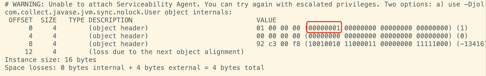
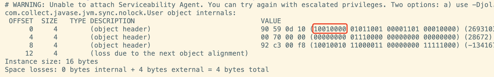
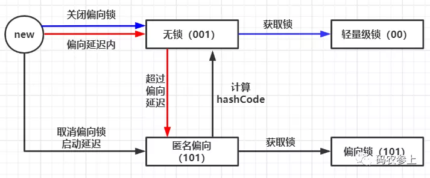
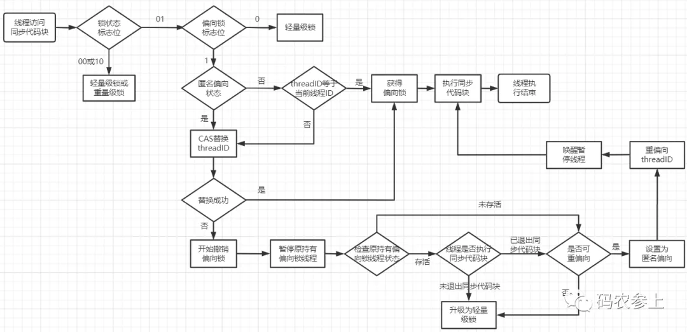
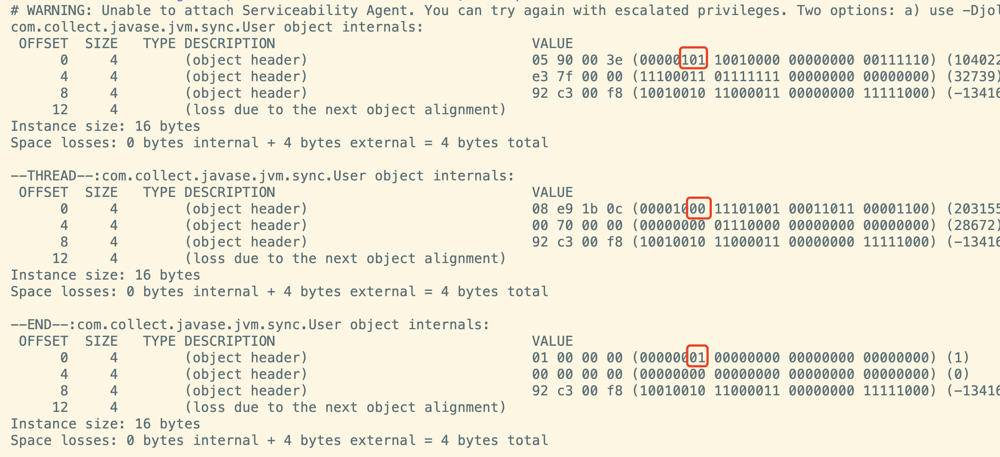
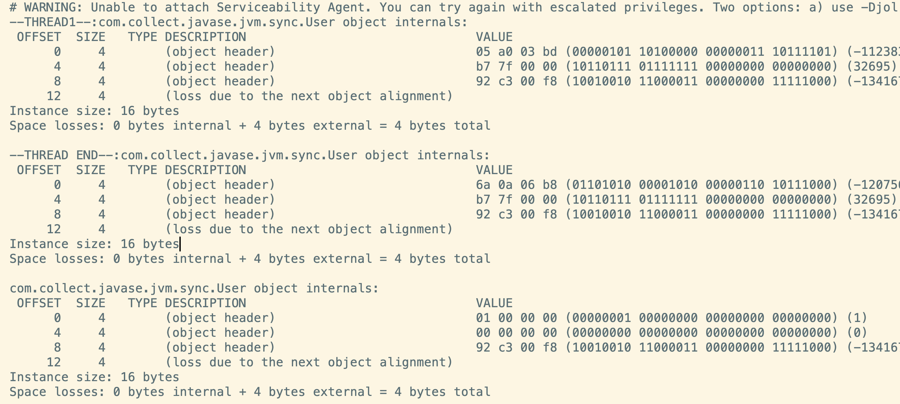
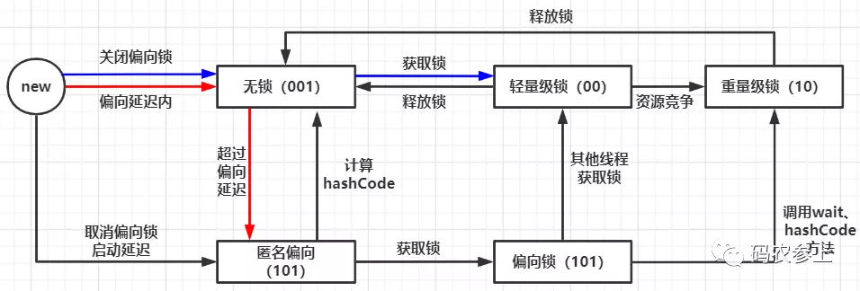

# JVM深入-Synchronized锁升级

[TOC]

## 一、无锁

 jvm会有4秒的偏向锁开启的延迟时间，在这个偏向延迟内对象处于为无锁态。如果关闭偏向锁启动延迟、或是经过4秒且没有线程竞争对象的锁，那么对象会进入**无锁可偏向**状态。

准确来说，无锁可偏向状态应该叫做**匿名偏向**(`Anonymously biased`)状态，因为这时对象的`mark word`中后三位已经是`101`，但是`threadId`指针部分仍然全部为0，它还没有向任何线程偏向。综上所述，对象在刚被创建时，根据jvm的配置对象可能会处于 **无锁** 或 **匿名偏向** 两个状态。

此外，如果在jvm的参数中关闭偏向锁，那么直到有线程获取这个锁对象之前，会一直处于无锁不可偏向状态。修改jvm启动参数：

```
-XX:-UseBiasedLocking
```

延迟5s后打印对象内存布局：

```java
public static void main(String[] args) throws InterruptedException {
    User user = new User();
    TimeUnit.SECONDS.sleep(5);
    System.out.println(ClassLayout.parseInstance(user).toPrintable());
}
```

运行结果：



可以看到，即使经过一定的启动延时，对象一直处于`001`无锁不可偏向状态。大家可能会有疑问，在无锁状态下，为什么要存在一个不可偏向状态呢？别人的解释是：

> JVM内部的代码有很多地方也用到了synchronized，明确在这些地方存在线程的竞争，如果还需要从偏向状态再逐步升级，会带来额外的性能损耗，所以JVM设置了一个偏向锁的启动延迟，来降低性能损耗

也就是说，在无锁不可偏向状态下，如果有线程试图获取锁，那么将跳过升级偏向锁的过程，直接使用轻量级锁。使用代码进行验证：

```java
public static void main(String[] args) throws InterruptedException {
    User user=new User();
    synchronized (user){
        System.out.println(ClassLayout.parseInstance(user).toPrintable());
    }
}
```

查看结果可以看到，在关闭偏向锁情况下使用`synchronized`，锁会直接升级为轻量级锁（`00`状态）:



可关闭偏向锁延迟`-XX:BiasedLockingStartupDelay=0`并开启偏向锁自行验证，会发现结果是`101`。

在目前的基础上，可以用流程图概括上面的过程：



额外注意一点就是匿名偏向状态下，如果调用系统的`hashCode()`方法，会使对象回到无锁态，并在`markword`中写入`hashCode`。并且在这个状态下，如果有线程尝试获取锁，会直接从无锁升级到轻量级锁，不会再升级为偏向锁。

## 二、**偏向锁**

### **2.1 偏向锁原理**

匿名偏向状态是偏向锁的初始状态，在这个状态下第一个试图获取该对象的锁的线程，会使用CAS操作（汇编命令`CMPXCHG`）尝试将自己的`threadID`写入对象头的`mark word`中，使匿名偏向状态升级为**已偏向**（Biased）的偏向锁状态。在已偏向状态下，线程指针`threadID`非空，且偏向锁的时间戳`epoch`为有效值。

如果之后有线程再次尝试获取锁时，需要检查`mark word`中存储的`threadID`是否与自己相同即可，如果相同那么表示当前线程已经获得了对象的锁，不需要再使用CAS操作来进行加锁。

如果`mark word`中存储的`threadID`与当前线程不同，那么将执行CAS操作，试图将当前线程的ID替换`mark word`中的`threadID`。只有当对象处于下面两种状态中时，才可以执行成功：

- 对象处于匿名偏向状态
- 对象处于**可重偏向**（Rebiasable）状态，新线程可使用CAS将`threadID`指向自己

如果对象不处于上面两个状态，说明锁存在线程竞争，在CAS替换失败后会执行**偏向锁撤销**操作。偏向锁的撤销需要等待全局安全点`Safe Point`（安全点是 jvm为了保证在垃圾回收的过程中引用关系不会发生变化设置的安全状态，在这个状态上会暂停所有线程工作），在这个安全点会挂起获得偏向锁的线程。

在暂停线程后，会通过遍历当前jvm的所有线程的方式，检查持有偏向锁的线程状态是否存活：

- 如果线程还存活，且线程正在执行同步代码块中的代码，则升级为轻量级锁

- 如果持有偏向锁的线程未存活，或者持有偏向锁的线程未在执行同步代码块中的代码，则进行校验是否允许重偏向：

- - 不允许重偏向，则撤销偏向锁，将`mark word`升级为轻量级锁，进行CAS竞争锁
  - 允许重偏向，设置为匿名偏向锁状态，CAS将偏向锁重新指向新线程

完成上面的操作后，唤醒暂停的线程，从安全点继续执行代码。可以使用流程图总结上面的过程：



### **2.2 偏向锁升级**

在上面的过程中，我们已经知道了匿名偏向状态可以变为无锁态或升级为偏向锁，接下来看一下偏向锁的其他状态的改变

- 偏向锁升级为轻量级锁

```java
public static void main(String[] args) throws InterruptedException {
    // -XX:BiasedLockingStartupDelay=0
    User user = new User();
    synchronized (user) {
      System.out.println(ClassLayout.parseInstance(user).toPrintable());
    }
    Thread thread = new Thread(() -> {
      synchronized (user) {
        System.out.println("--THREAD--:" + ClassLayout.parseInstance(user).toPrintable());
      }
    });
    thread.start();
    thread.join();
    System.out.println("--END--:" + ClassLayout.parseInstance(user).toPrintable());
}
```

查看内存布局，偏向锁升级为轻量级锁，在执行完成同步代码后释放锁，变为无锁不可偏向状态：



- 偏向锁升级为重量级锁

```java
public static void main(String[] args) throws InterruptedException {
    User user = new User();
    Thread thread = new Thread(() -> {
      synchronized (user) {
        System.out.println("--THREAD1--:" + ClassLayout.parseInstance(user).toPrintable());
        try {
          user.wait(2000);
        } catch (InterruptedException e) {
          e.printStackTrace();
        }
        System.out.println("--THREAD END--:" + ClassLayout.parseInstance(user).toPrintable());
      }
    });
    thread.start();
    thread.join();
    TimeUnit.SECONDS.sleep(3);
    System.out.println(ClassLayout.parseInstance(user).toPrintable());
}
```

查看内存布局，可以看到在调用了对象的`wait()`方法后，直接从偏向锁升级成了重量级锁，并在锁释放后变为无锁态：



这里是因为`wait()`方法调用过程中依赖于重量级锁中与对象关联的`monitor`，在调用`wait()`方法后`monitor`会把线程变为`WAITING`状态，所以才会强制升级为重量级锁。除此之外，调用`hashCode`方法时也会使偏向锁直接升级为重量级锁。

在上面分析的基础上，再加上我们上一篇中讲到的轻量级锁升级到重量级锁的知识，就可以对上面的流程图进行完善了：



