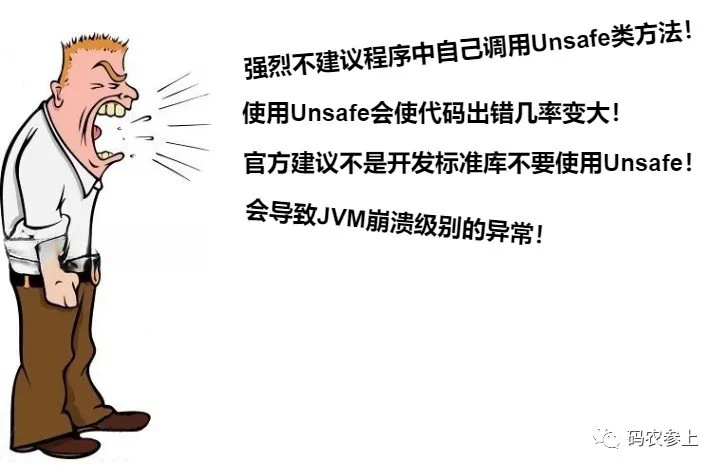
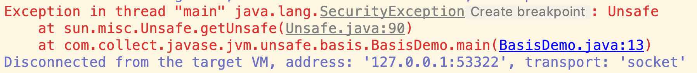
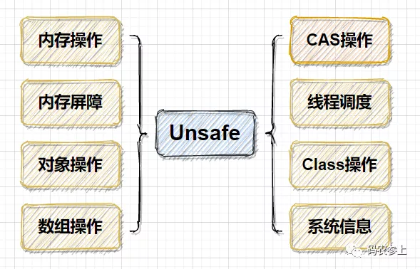
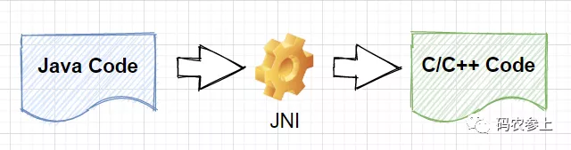
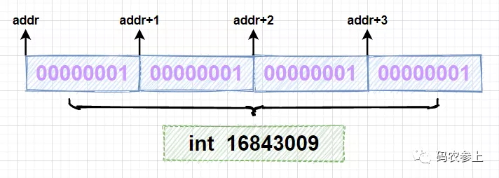
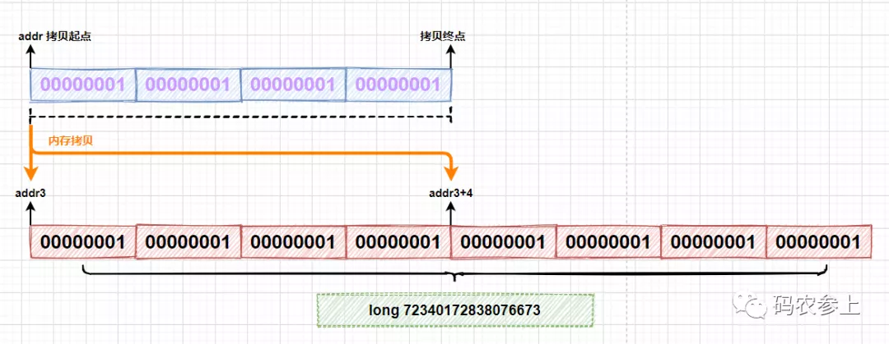
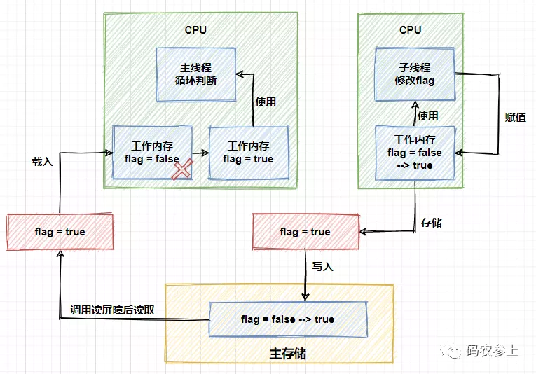

# JVM深入-Unsafe类详解

[TOC]

## 零、前言

很多资料中对Unsafe的态度都是这样的画风：



其实看到这些说法也没什么意外，毕竟Unsafe这个词直译过来就是“不安全的”，从名字里我们也大概能看来Java的开发者们对它有些不放心。

下面我们言归正传，先通过简单的介绍来对Unsafe类有一个大致的了解。Unsafe类是一个位于`sun.misc`包下的类，它提供了一些相对底层方法，能够让我们接触到一些更接近操作系统底层的资源，如系统的内存资源、cpu指令等。而通过这些方法，我们能够完成一些普通方法无法实现的功能，例如直接使用偏移地址操作对象、数组等等。但是在使用这些方法提供的便利的同时，也存在一些潜在的安全因素，例如对内存的错误操作可能会引起内存泄漏，严重时甚至可能引起jvm崩溃。因此在使用Unsafe前，我们必须要了解它的工作原理与各方法的应用场景，并且在此基础上仍需要非常谨慎的操作，下面我们正式开始对Unsafe的学习。

## 一、Unsafe 基础

首先我们来尝试获取一个Unsafe实例，如果按照`new`的方式去创建对象，不好意思，编译器会报错提示你：

```
Unsafe() has private access in 'sun.misc.Unsafe'
```

查看Unsafe类的源码，可以看到它被`final`修饰不允许被继承，并且构造函数为`private`类型，即不允许我们手动调用构造方法进行实例化，只有在`static`静态代码块中，以单例的方式初始化了一个Unsafe对象：

```
public final class Unsafe {
    private static final Unsafe theUnsafe;
    ...
    private Unsafe() {
    }
    ...
    static {
        theUnsafe = new Unsafe();
    }   
}
```

在Unsafe类中，提供了一个静态方法`getUnsafe`，看上去貌似可以用它来获取Unsafe实例：

```java
@CallerSensitive
public static Unsafe getUnsafe() {
    Class var0 = Reflection.getCallerClass();
    if (!VM.isSystemDomainLoader(var0.getClassLoader())) {
        throw new SecurityException("Unsafe");
    } else {
        return theUnsafe;
    }
}
```

但是如果我们直接调用这个静态方法，会抛出异常：



这是因为在`getUnsafe`方法中，会对调用者的`classLoader`进行检查，判断当前类是否由`Bootstrap classLoader`加载，如果不是的话那么就会抛出一个`SecurityException`异常。也就是说，只有启动类加载器加载的类才能够调用Unsafe类中的方法，来防止这些方法在不可信的代码中被调用。

那么，为什么要对Unsafe类进行这么谨慎的使用限制呢，说到底，还是因为它实现的功能过于底层，例如直接进行内存操作、绕过jvm的安全检查创建对象等等，概括的来说，Unsafe类实现功能可以被分为下面8类：



### 1. 创建实例

那么如果我们执意想要在自己的代码中调用Unsafe类的方法，应该怎么获取一个它的实例对象呢，答案是利用反射获得Unsafe类中已经实例化完成的单例对象：

```java
public static Unsafe getUnsafe() throws IllegalAccessException, NoSuchFieldException {
    Field unsafeField = Unsafe.class.getDeclaredField("theUnsafe");
    //Field unsafeField = Unsafe.class.getDeclaredFields()[0]; //也可以这样，作用相同
    unsafeField.setAccessible(true);
    Unsafe unsafe =(Unsafe) unsafeField.get(null);
    return unsafe;
}
```

在获取到Unsafe的实例对象后，我们就可以使用它为所欲为了，先来尝试使用它对一个对象的属性进行读写：

```java
public void fieldTest(Unsafe unsafe) throws NoSuchFieldException {
    // 注意，这里的user age字段必须是int，不能是Integer，否则会空指针
    User user=new User();
    long fieldOffset = unsafe.objectFieldOffset(User.class.getDeclaredField("age"));
    System.out.println("offset:"+fieldOffset);
    unsafe.putInt(user,fieldOffset,20);
    System.out.println("age:"+unsafe.getInt(user,fieldOffset));
    System.out.println("age:"+user.getAge());
}
```

运行代码输出如下：

```
offset:12
age:20
age:20
```

可以看到通过Unsafe类的`objectFieldOffset`方法获取了对象中字段的偏移地址，这个偏移地址不是内存中的绝对地址而是一个相对地址，之后再通过这个偏移地址对`int`类型字段的属性值进行了读写操作，通过结果也可以看到Unsafe的方法和类中的`get`方法获取到的值是相同的。

在上面的例子中调用了Unsafe类的`putInt`和`getInt`方法，看一下源码中的方法：

```java
public native int getInt(Object o, long offset);
public native void putInt(Object o, long offset, int x);
```

先说作用，`getInt`用于从对象的指定偏移地址处读取一个`int`，`putInt`用于在对象指定偏移地址处写入一个`int`，并且即使类中的这个属性是`private`私有类型的，也可以对它进行读写。但是有细心的小伙伴可能发现了，这两个方法相对于我们平常写的普通方法，多了一个`native`关键字修饰，并且没有具体的方法逻辑，那么它是怎么实现的呢？

### 2. native方法

在java中，这类方法被称为`native`方法（`Native Method`），简单的说就是由java调用非java代码的接口，被调用的方法是由非java语言实现的，例如它可以由C或C++语言来实现，并编译成DLL，然后直接供java进行调用。`native`方法是通过JNI（`Java Native Interface`）实现调用的，从 java1.1开始 JNI 标准就是java平台的一部分，它允许java代码和其他语言的代码进行交互。



Unsafe类中的很多基础方法都属于`native`方法，那么为什么要使用`native`方法呢？原因可以概括为以下几点：

- 需要用到 java 中不具备的依赖于操作系统的特性，java在实现跨平台的同时要实现对底层的控制，需要借助其他语言发挥作用
- 对于其他语言已经完成的一些现成功能，可以使用java直接调用
- 程序对时间敏感或对性能要求非常高时，有必要使用更加底层的语言，例如C/C++甚至是汇编

在`juc`包的很多并发工具类在实现并发机制时，都调用了`native`方法，通过它们打破了java运行时的界限，能够接触到操作系统底层的某些功能。对于同一个`native`方法，不同的操作系统可能会通过不同的方式来实现，但是对于使用者来说是透明的，最终都会得到相同的结果，至于java如何实现的通过JNI调用其他语言的代码，不是本文的重点，会在后续的文章中具体学习。

## 二、Unsafe 应用

### 1. 内存操作

如果你是一个写过`c`或者`c++`的程序员，一定对内存操作不会陌生，而在java中是不允许直接对内存进行操作的，对象内存的分配和回收都是由`jvm`自己实现的。但是在Unsafe中，提供的下列接口可以直接进行内存操作：

```java
// 分配新的本地空间
public native long allocateMemory(long bytes);
// 重新调整内存空间的大小
public native long reallocateMemory(long address, long bytes);
// 将内存设置为指定值
public native void setMemory(Object o, long offset, long bytes, byte value);
// 内存拷贝
public native void copyMemory(Object srcBase, long srcOffset,Object destBase, long destOffset,long bytes);
// 清除内存
public native void freeMemory(long address);
```

使用下面的代码进行测试：

```java
private static void memoryTest(Unsafe unsafe) {
    int size = 4;
    long addr = unsafe.allocateMemory(size);
    long addr3 = unsafe.reallocateMemory(addr, size * 2);
    System.out.println("addr: " + addr);
    System.out.println("addr3: " + addr3);
    try {
      unsafe.setMemory(null, addr, size, (byte) 1);
      for (int i = 0; i < 2; i++) {
        unsafe.copyMemory(null, addr, null, addr3 + size * i, 4);
      }
      System.out.println(unsafe.getInt(addr));
      System.out.println(unsafe.getLong(addr3));
    } finally {
      unsafe.freeMemory(addr);
      unsafe.freeMemory(addr3);
    }
}
```

先看输出结果：

```java
addr: 140615200389056
addr3: 140615200389056
16843009
72340172838076673
```

分析一下运行结果，首先使用`allocateMemory`方法申请4字节长度的内存空间，在循环中调用`setMemory`方法向每个字节写入内容为`byte`类型的1，当使用Unsafe调用`getInt`方法时，因为一个`int`型变量占4个字节，会一次性读取4个字节，组成一个`int`的值，对应的十进制结果为16843009，可以通过图示理解这个过程：



在代码中调用`reallocateMemory`方法重新分配了一块8字节长度的内存空间，通过比较`addr`和`addr3`可以看到和之前申请的内存地址是不同的。在代码中的第二个for循环里，调用`copyMemory`方法进行了两次内存的拷贝，每次拷贝内存地址`addr`开始的4个字节，分别拷贝到以`addr3`和`addr3+4`开始的内存空间上：



拷贝完成后，使用`getLong`方法一次性读取8个字节，得到`long`类型的值为72340172838076673。

需要注意，通过这种方式分配的内存属于堆外内存，是无法进行垃圾回收的，需要我们把这些内存当做一种资源去手动调用`freeMemory`方法进行释放，否则会产生内存泄漏。通用的操作内存方式是在`try`中执行对内存的操作，最终在`finally`块中进行内存的释放。

### 2. 内存屏障

在介绍内存屏障前，需要知道编译器和CPU会在保证程序输出结果一致的情况下，会对代码进行重排序，从指令优化角度提升性能。而指令重排序可能会带来一个不好的结果，导致CPU的高速缓存和内存中数据的不一致，而内存屏障（`Memory Barrier`）就是通过组织屏障两边的指令重排序从而避免编译器和硬件的不正确优化情况。

在硬件层面上，内存屏障是CPU为了防止代码进行重排序而提供的指令，不同的硬件平台上实现内存屏障的方法可能并不相同。在java8中，引入了3个内存屏障的函数，它屏蔽了操作系统底层的差异，允许在代码中定义、并统一由jvm来生成内存屏障指令，来实现内存屏障的功能。Unsafe中提供了下面三个内存屏障相关方法：

```java
// 禁止读操作重排序
public native void loadFence();
// 禁止写操作重排序
public native void storeFence();
// 禁止读、写操作重排序
public native void fullFence();
```

内存屏障可以看做对内存随机访问的操作中的一个同步点，使得此点之前的所有读写操作都执行后才可以开始执行此点之后的操作。以`loadFence`方法为例，它会禁止读操作重排序，保证在这个屏障之前的所有读操作都已经完成，并且将缓存数据设为无效，重新从主存中进行加载。

看到这估计很多小伙伴们会想到`volatile`关键字了，如果在字段上添加了`volatile`关键字，就能够实现字段在多线程下的可见性。基于读内存屏障，我们也能实现相同的功能。下面定义一个线程方法，在线程中去修改`flag`标志位，注意这里的`flag`是没有被`volatile`修饰的：

```java
@Getter
class ChangeThread implements Runnable{
    /**volatile**/ boolean flag=false;
    @Override
    public void run() {
        try {
            Thread.sleep(3000);
        } catch (InterruptedException e) {
            e.printStackTrace();
        }        
        System.out.println("subThread change flag to:" + flag);
        flag = true;
    }
}
```

在主线程的`while`循环中，加入内存屏障，测试是否能够感知到`flag`的修改变化：

```java
public static void main(String[] args){
    ChangeThread changeThread = new ChangeThread();
    new Thread(changeThread).start();
    while (true) {
        boolean flag = changeThread.isFlag();
        unsafe.loadFence(); //加入读内存屏障
        if (flag){
            System.out.println("detected flag changed");
            break;
        }
    }
    System.out.println("main thread end");
}
```

运行结果：

```
subThread change flag to:false
detected flag changed
main thread end
```

而如果删掉上面代码中的`loadFence`方法，那么主线程将无法感知到`flag`发生的变化，会一直在`while`中循环。可以用图来表示上面的过程：



了解java内存模型（`JMM`）的小伙伴们应该清楚，运行中的线程不是直接读取主内存中的变量的，只能操作自己工作内存中的变量，然后同步到主内存中，并且线程的工作内存是不能共享的。上面的图中的流程就是子线程借助于主内存，将修改后的结果同步给了主线程，进而修改主线程中的工作空间，跳出循环。

