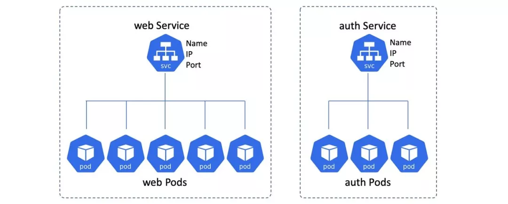
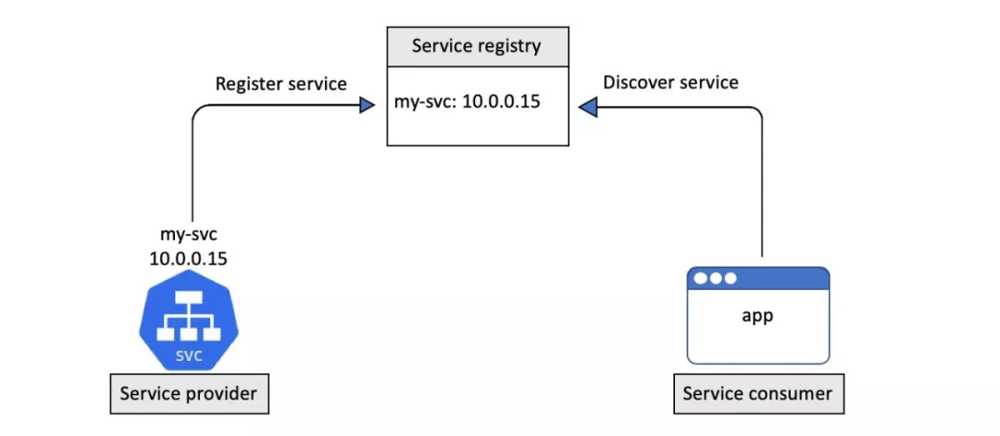
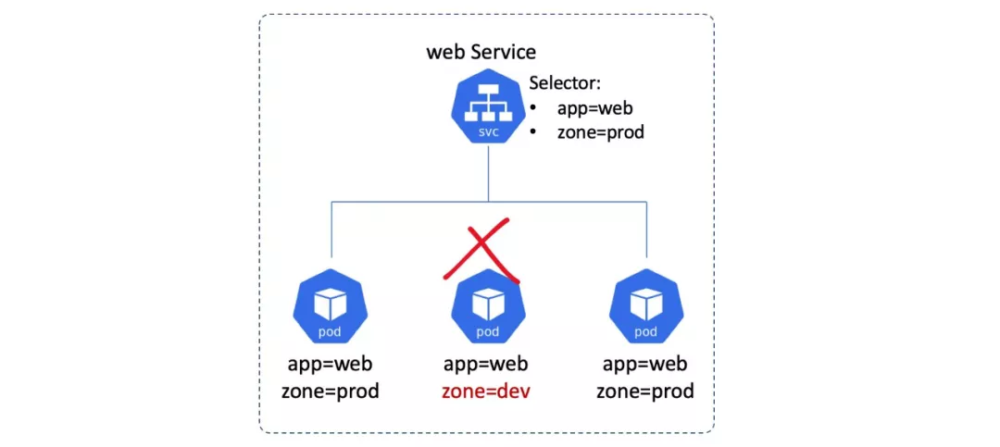
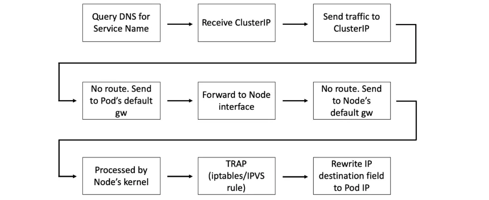

# 浅谈 Kubernetes 中的服务发现
<!-- START doctoc generated TOC please keep comment here to allow auto update -->
<!-- DON'T EDIT THIS SECTION, INSTEAD RE-RUN doctoc TO UPDATE -->

- [一、Kubernetes 网络基础](#%E4%B8%80kubernetes-%E7%BD%91%E7%BB%9C%E5%9F%BA%E7%A1%80)
    - [动态网络](#%E5%8A%A8%E6%80%81%E7%BD%91%E7%BB%9C)
    - [2. Service 带来稳定性](#2-service-%E5%B8%A6%E6%9D%A5%E7%A8%B3%E5%AE%9A%E6%80%A7)
    - [3. Kubernetes Service 解析](#3-kubernetes-service-%E8%A7%A3%E6%9E%90)
    - [小结](#%E5%B0%8F%E7%BB%93)
- [二、深入了解 Kubernetes 服务发现](#%E4%BA%8C%E6%B7%B1%E5%85%A5%E4%BA%86%E8%A7%A3-kubernetes-%E6%9C%8D%E5%8A%A1%E5%8F%91%E7%8E%B0)
    - [1. 服务注册](#1-%E6%9C%8D%E5%8A%A1%E6%B3%A8%E5%86%8C)
    - [2. Endpoint 对象](#2-endpoint-%E5%AF%B9%E8%B1%A1)
    - [3. 服务发现](#3-%E6%9C%8D%E5%8A%A1%E5%8F%91%E7%8E%B0)
    - [4. 网络](#4-%E7%BD%91%E7%BB%9C)
- [三、总结](#%E4%B8%89%E6%80%BB%E7%BB%93)

<!-- END doctoc generated TOC please keep comment here to allow auto update -->

[TOC]

## 一、Kubernetes 网络基础

要开始服务发现的探索之前，需要理解以下内容：

1. Kubernetes 应用运行在容器之中，容器处于 Pod 之内。
2. 每个 Pod 都会附着在同一个大的扁平的 IP 网络之中，被称为 Pod 网络（通常是 VXLAN 叠加网络）。
3. 每个 Pod 都有自己的唯一的 IP 地址，这个 IP 地址在 Pod 网络中是可路由的。

上述三个因素结合起来，让每个应用（应用的组件和服务）无需通过 NAT 之类的网络过程，就能够直接通信。

### 动态网络

在对应用进行横向扩容时，会在 Pod 网络中加入新的 Pod，新 Pod 自然也伴随着新的 IP 地址；如果对应用进行缩容，旧的 Pod 及其 IP 会被删除。这个过程看起来很是混乱。

应用的滚动更新和撤回也存在同样的情形——加入新版本的新 Pod，或者移除旧版本的旧 Pod。新 Pod 会加入新 IP 到 Pod 网络中，被终结的旧 Pod 会删除其现存 IP。

如果没有其它因素，每个应用服务都需要对网络进行监控，并管理一个健康 Pod 的列表。这个过程会非常痛苦，另外在每个应用中编写这个逻辑也是很低效的。幸运的是，Kubernetes 用一个对象完成了这个过程——Service。

> 把这个对象叫做 Service 是个坏主意，我们已经用这个单词来形容应用的进程或组件了。

还有一个值得注意的事情：Kubernetes 执行 IP 地址管理（IPAM）职责，对 Pod 网络上已使用和可用的 IP 地址进行跟踪。

### 2. Service 带来稳定性

Kubernetes Service 对象在一组提供服务的 Pod 之前创建一个稳定的网络端点，并为这些 Pod 进行负载分配。

一般会在一组完成同样工作的 Pod 之前放置一个 Service 对象。例如可以在你的 Web 前端 Pod 前方提供一个 Service，在认证服务 Pod 之前提供另一个。行使不同职责的 Pod 之前就不应该用单一的 Service 了。

客户端和 Service 通信，Service 负责把流量负载均衡给 Pod。

在上图中，底部的 Pod 会因为伸缩、更新、故障等情况发生变化，而 Service 会对这些变化进行跟踪。同时 Service 的名字、IP 和端口都不会发生变化。

### 3. Kubernetes Service 解析

可以把 Kubernetes Service 理解为前端和后端两部分：

- 前端：名称、IP 和端口等不变的部分。
- 后端：符合特定标签选择条件的 Pod 集合。

前端是稳定可靠的，它的名称、IP 和端口在 Service 的整个生命周期中都不会改变。前端的稳定性意味着无需担心客户端 DNS 缓存超时等问题。

后端是高度动态的，其中包括一组符合标签选择条件的 Pod，会通过负载均衡的方式进行访问。

这里的负载均衡是一个简单的 4 层轮询。它工作在连接层面，所以同一个连接里发起的所有请求都会进入同一个 Pod。因为在 4 层工作，所以对于 7 层的 HTTP 头或者 Cookie 之类的东西是无法感知的。

### 小结

应用在容器中运行，在 Kubernetes 中体现为 Pod 的形式。Kubernetes 集群中的所有 Pod 都处于同一个平面的 Pod 网络，有自己的 IP 地址。这意味着所有的 Pod 之间都能直接连接。然而 Pod 是不稳定的，可能因为各种因素创建和销毁。Kubernetes 提供了稳定的网络端点，称为 Service，这个对象处于一组相似的 Pod 前方，提供了稳定的名称、IP 和端口。客户端连接到 Service，Service 把流量负载均衡给 Pod。

## 二、深入了解 Kubernetes 服务发现

接下来聊聊服务发现。

服务发现实际上包含两个功能点：

1. 服务注册
2. 服务发现

### 1. 服务注册

服务注册过程指的是在服务注册表中登记一个服务，以便让其它服务发现。

Kubernetes 使用 DNS 作为服务注册表。

为了满足这一需要，每个 Kubernetes 集群都会在 kube-system 命名空间中用 Pod 的形式运行一个 DNS 服务，通常称之为集群 DNS。

每个 Kubernetes 服务都会自动注册到集群 DNS 之中。

注册过程大致如下：

1. 向 API Server 用 POST 方式提交一个新的 Service 定义；
2. 这个请求需要经过认证、鉴权以及其它的准入策略检查过程之后才会放行；
3. Service 得到一个 ClusterIP（虚拟 IP 地址），并保存到集群数据仓库；
4. 在集群范围内传播 Service 配置；
5. 集群 DNS 服务得知该 Service 的创建，据此创建必要的 DNS A 记录。

上面过程中，第 5 个步骤是关键环节。集群 DNS 使用的是 CoreDNS，以 Kubernetes 原生应用的形式运行。CoreDNS 实现了一个控制器，会对 API Server 进行监听，一旦发现有新建的 Service 对象，就创建一个从 Service 名称映射到 ClusterIP 的域名记录。这样 Service 就不必自行向 DNS 进行注册，CoreDNS 控制器会关注新创建的 Service 对象，并实现后续的 DNS 过程。

DNS 中注册的名称就是 metadata.name，而 ClusterIP 则由 Kubernetes 自行分配。

Service 对象注册到集群 DNS 之中后，就能够被运行在集群中的其它 Pod 发现了。

### 2. Endpoint 对象

Service 的前端创建成功并注册到服务注册表（DNS）之后，剩下的就是后端的工作了。后端包含一个 Pod 列表，Service 对象会把流量分发给这些 Pod。

毫无疑问，这个 Pod 列表需要是最新的。

Service 对象有一个 Label Selector 字段，这个字段是一个标签列表，符合列表条件的 Pod 就会被服务纳入到服务的负载均衡范围之中。参见下图：

Kubernetes 自动为每个 Service 创建 Endpoints 对象。Endpoints 对象的职责就是保存一个符合 Service 标签选择器标准的 Pod 列表，这些 Pod 将接收来自 Service 的流量。

上面的图中，Service 会选择两个 Pod，并且还展示了 Service 的 Endpoints 对象，这个对象里包含了两个符合 Service 选择标准的 Pod 的 IP。

在后面我们将解释网络如何把 ClusterIP 流量转发给 Pod IP 的过程，还会引用到 Endpoints 对象。

### 3. 服务发现

假设我们在一个 Kubernetes 集群中有两个应用，my-app 和 your-app，my-app 的 Pod 的前端是一个 名为 my-app-svc 的 Service 对象；your-app Pod 之前的 Service 就是 your-app-svc。

这两个 Service 对象对应的 DNS 记录是：

- my-app-svc：10.0.0.10
- your-app-svc：10.0.0.20

要使用服务发现功能，每个 Pod 都需要知道集群 DNS 的位置才能使用它。因此每个 Pod 中的每个容器的 /etc/resolv.conf 文件都被配置为使用集群 DNS 进行解析。

如果 my-app 中的 Pod 想要连接到 your-app 中的 Pod，就得向 DNS 服务器发起对域名 your-app-svc 的查询。假设它们本地的 DNS 解析缓存中没有这个记录，则需要把查询提交到集群 DNS 服务器。会得到 you-app-svc 的 ClusterIP（VIP）。

> 这里有个前提就是 my-app 需要知道目标服务的名称。

至此，my-app 中的 Pod 得到了一个目标 IP 地址，然而这只是个虚拟 IP，在转入目标 Pod 之前，还有些网络工作要做。

### 4. 网络

一个 Pod 得到了 Service 的 ClusterIP 之后，就尝试向这个 IP 发送流量。然而 ClusterIP 所在的网络被称为 Service Network，这个网络有点特别——没有路由指向它。

因为没有路由，所有容器把发现这种地址的流量都发送到了缺省网关（名为 CBR0 的网桥）。这些流量会被转发给 Pod 所在节点的网卡上。节点的网络栈也同样没有路由能到达 Service Network，所以只能发送到自己的缺省网关。路由到节点缺省网关的数据包会通过 Node 内核——这里有了变化。

回顾一下前面的内容。首先 Service 对象的配置是全集群范围有效的，另外还会再次说到 Endpoints 对象。我们要在回顾中发现他们各自在这一过程中的职责。

每个 Kubernetes 节点上都会运行一个叫做 kube-proxy 的系统服务。这是一个基于 Pod 运行的 Kubernetes 原生应用，它所实现的控制器会监控 API Server 上 Service 的变化，并据此创建 iptables 或者 IPVS 规则，这些规则告知节点，捕获目标为 Service 网络的报文，并转发给 Pod IP。

> 有趣的是，kube-proxy 并不是一个普遍意义上的代理。它的工作不过是创建和管理 iptables/IPVS 规则。这个命名的原因是它过去使用 unserspace 模式的代理。

每个新 Service 对象的配置，其中包含它的 ClusterIP 以及 Endpoints 对象（其中包含健康 Pod 的列表），都会被发送给 每个节点上的 kube-proxy 进程。kube-proxy 会创建 iptables 或者 IPVS 规则，告知节点捕获目标为 Service ClusterIP 的流量，并根据 Endpoints 对象的内容转发给对应的 Pod。

也就是说每次节点内核处理到目标为 Service 网络的数据包时，都会对数据包的 Header 进行改写，把目标 IP 改为 Service Endpoints 对象中的健康 Pod 的 IP。

> 原本使用的 iptables 正在被 IPVS 取代（Kubernetes 1.11 进入稳定期）。长话短说，iptables 是一个包过滤器，并非为负载均衡设计的。IPVS 是一个 4 层的负载均衡器，其性能和实现方式都比 iptables 更适合这种使用场景。

## 三、总结

需要消化的内容很多，简单回顾一下。

创建新的 Service 对象时，会得到一个虚拟 IP，被称为 ClusterIP。服务名及其 ClusterIP 被自动注册到集群 DNS 中，并且会创建相关的 Endpoints 对象用于保存符合标签条件的健康 Pod 的列表，Service 对象会向列表中的 Pod 转发流量。

与此同时集群中所有节点都会配置相应的 iptables/IPVS 规则，监听目标为 ClusterIP 的流量并转发给真实的 Pod IP。这个过程如下图所示：

一个 Pod 需要用 Service 连接其它 Pod。首先向集群 DNS 发出查询，把 Service 名称解析为 ClusterIP，然后把流量发送给位于 Service 网络的 ClusterIP 上。然而没有到 Service 网络的路由，所以 Pod 把流量发送给它的缺省网关。这一行为导致流量被转发给 Pod 所在节点的网卡，然后是节点的缺省网关。这个操作中，节点的内核修改了数据包 Header 中的目标 IP，使其转向健康的 Pod。

最终所有 Pod 都是在同一个可路由的扁平的叠加网络上，剩下的内容就很简单了。

