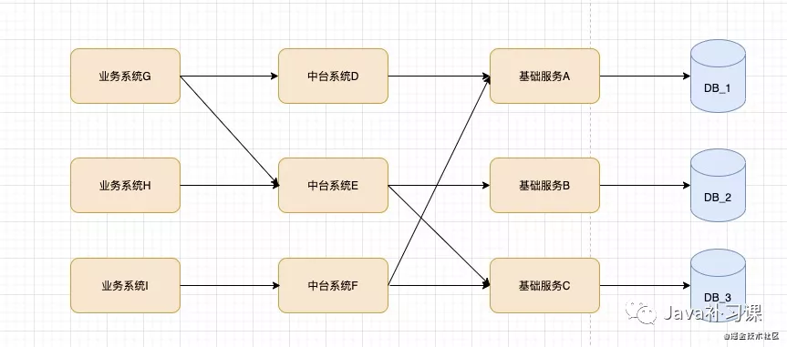
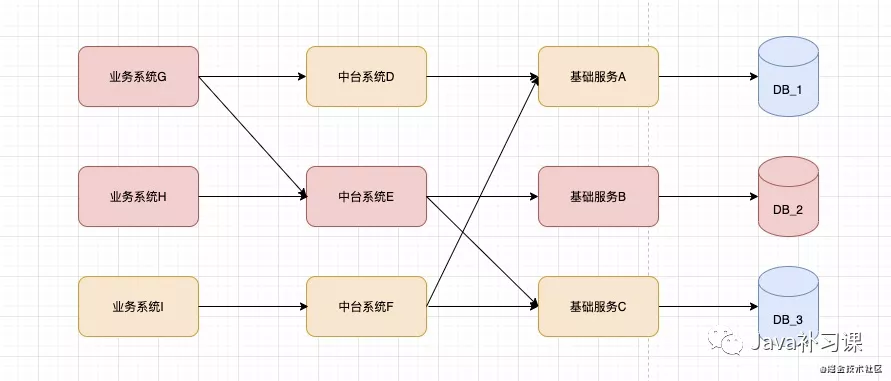
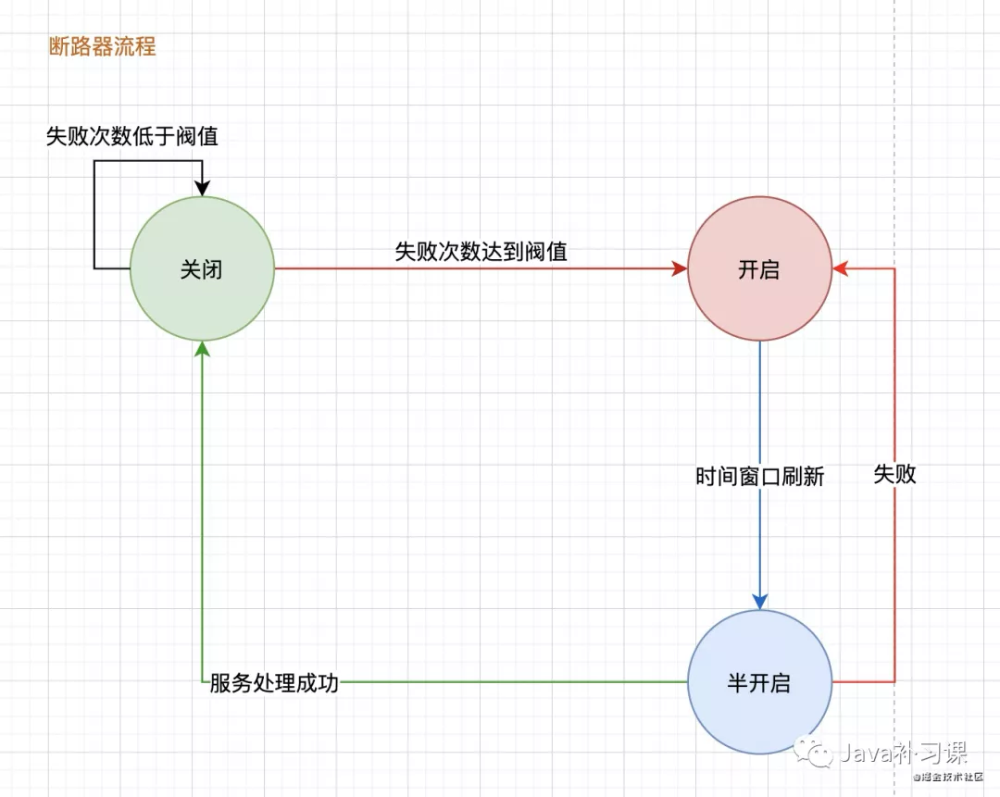
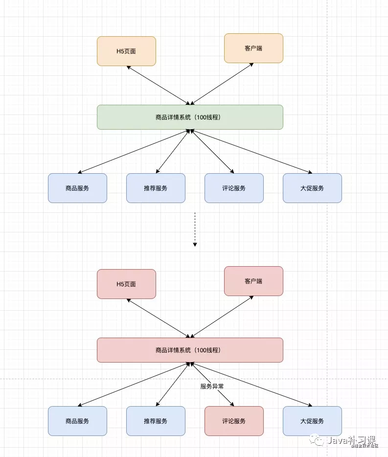
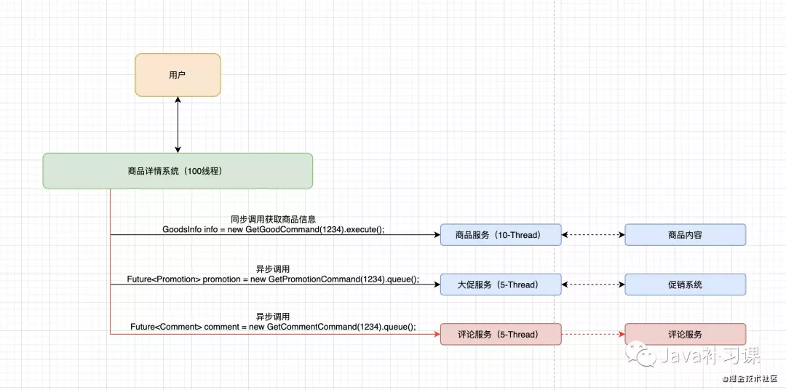
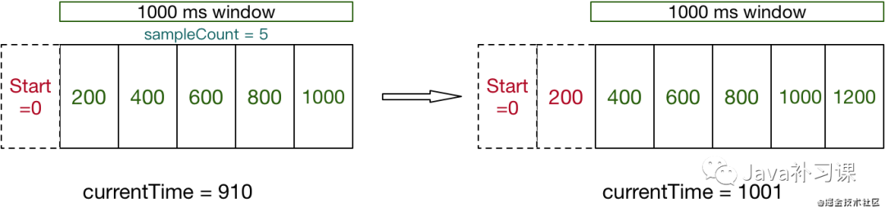
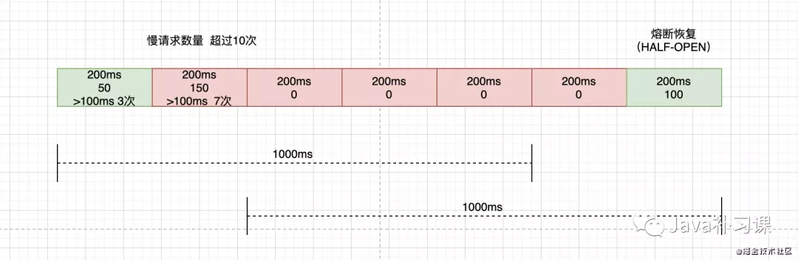
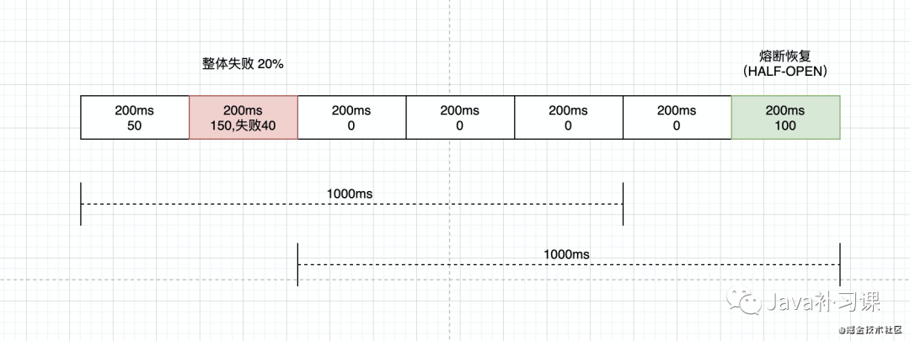
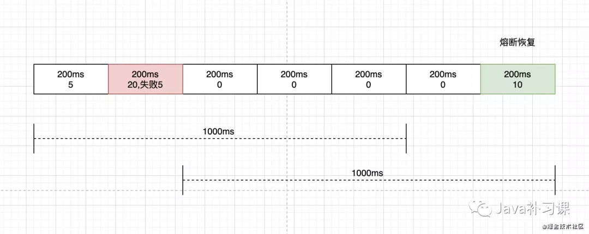

# 熔断降级原理

<!-- START doctoc generated TOC please keep comment here to allow auto update -->

- [一、什么是熔断](#%E4%B8%80%E4%BB%80%E4%B9%88%E6%98%AF%E7%86%94%E6%96%AD)
    - [1. 雪崩效应](#1-%E9%9B%AA%E5%B4%A9%E6%95%88%E5%BA%94)
    - [2. 雪崩处理策略](#2-%E9%9B%AA%E5%B4%A9%E5%A4%84%E7%90%86%E7%AD%96%E7%95%A5)
- [二、断路器模式](#%E4%BA%8C%E6%96%AD%E8%B7%AF%E5%99%A8%E6%A8%A1%E5%BC%8F)
- [三、隔离策略](#%E4%B8%89%E9%9A%94%E7%A6%BB%E7%AD%96%E7%95%A5)
    - [1. 线程隔离](#1-%E7%BA%BF%E7%A8%8B%E9%9A%94%E7%A6%BB)
    - [2. 信号量隔离](#2-%E4%BF%A1%E5%8F%B7%E9%87%8F%E9%9A%94%E7%A6%BB)
- [四、熔断降级组件对比](#%E5%9B%9B%E7%86%94%E6%96%AD%E9%99%8D%E7%BA%A7%E7%BB%84%E4%BB%B6%E5%AF%B9%E6%AF%94)
    - [1. Sentinel](#1-sentinel)
    - [2. Hystrix](#2-hystrix)
    - [3. resilience4j](#3-resilience4j)

<!-- END doctoc generated TOC please keep comment here to allow auto update -->

[TOC]

## 一、什么是熔断

初步说一下 `熔断` 适用的场景:

- 雪崩
- 股灾

来自 `wiki` 的 `熔断机制` 描述：

```
熔断机制（英语：Circuit breaker / Trading curb）指的是在股票市场的交易时间中，
当价格波动的幅度达到某一个限定的目标（熔断点）时，对其暂停交易一段时间的机制。
此机制如同保险丝在电流过大时候熔断，故而得名。

熔断机制推出的目的是为了防范系统性风险，给市场更多的冷静时间，避免恐慌情绪蔓延导致市场波动，
从而防止大规模股价下跌现象的发生。
然而熔断机制也因切断了资金的流通性，同样会造成市场情绪加大，并令市场风险在熔断期结束后继续扩大。
```

转换成`互联网语言`可以这么理解:

- 当`异常`幅度达到设定的`阀值`后触发的系统保护机制
- 保护机制会将某`部分能力关闭`，以保证`大部分能力`的`正常`
- 这种机制是有损的，但是`利大于端`

> 熔断机制的特点，在关闭一段时间后，会自动触发恢复检测，如果发现服务正常，则将服务逐渐开放。

### 1. 雪崩效应

在分布式服务部署的架构下，整体链路可以参考为：



如果在大促期间， `DB_2` 由于 `机器负载过高`，`sql执行缓慢`，`链接数打满` 或`网络抖动`等情况，导致 `DB_2` 不可用，那么整体链路的影响就会变成：



`服务雪崩`的每个阶段都可能由不同的原因造成, 比如造成 服务不可用 的原因有:

- 硬件故障
- 程序Bug
- 缓存击穿
- 用户大量请求

### 2. 雪崩处理策略

- 流量控制：`限流`和`削峰`都属于流量控制的一种策略
- 缓存优化：在上述案例中，`DB` 由于压力过大导致的雪崩，可以引入`缓存`，减轻`DB`压力
- 服务降级：通过异常`分支链路`的`快速失败`，确保`主链路`正常提供服务
- 应用扩容：针对`机器压力过大`，`负载过高`，可以通过机器扩容来解决，缓解流量压力

## 二、断路器模式

`熔断器模式（Circuit Breaker Pattern）`，是一个现代软件开发的设计模式。用以侦测错误，并避免不断地触发相同的错误（如维护时服务不可用、暂时性的系统问题或是未知的系统错误）。

状态描述：

- `关闭`：熔断器默认处于关闭状态，熔断器本身带有计数能力（如`滑动窗口实现`）当失败数量达到预设阀值后，触发状态变更，熔断器被`打开`
- `开启`：在一定时间内，所有请求都会被`拒绝`，或采用`备用链路`处理。
- `半开启`：在刷新时间窗口后，会进入`半开启`状态，熔断器`尝试接受请求，如果这阶段出现`请求失败`，直接恢复到`开启`状态。



## 三、隔离策略

### 1. 线程隔离

Hystrix 采用了 `Bulkhead Partition`舱壁隔离技术，来将外部依赖进行资源隔离，进而避免任何外部依赖的故障导致本服务崩溃。

`舱壁隔离`，是说将船体内部空间区隔划分成若干个隔舱，一旦某几个隔舱发生破损进水，水流不会在其间相互流动，如此一来船舶在受损时，依然能具有足够的浮力和稳定性，进而减低立即沉船的危险。


图片来源：《防雪崩利器：熔断器 Hystrix 的原理与使用》

`Hystrix` 在线程池隔离实现主要解决一下场景：

在商品详情系统中，如果没有对服务做`降级措施`，那么当`评论服务`出现异常时，整个`商品详情系统`都会受到影响，最终导致用户无法查看`商品详情`。

在这个例子中，商品详情服务，从请求入口分配线程处理，对每个服务使用同一个线程进行处理（`同步`），在评论服务出现异常时（`响应缓慢`，`处理超时`，`服务异常`等），导致整个线程阻塞，服务端`响应超时`，触发用户`重试刷新请求`
，最终导致服务雪崩，系统崩溃。



`Hystrix` 线程池隔离方案；

`hystrix`把每个依赖都进行隔离，对依赖的调用全部包装成`HystrixCommand`或者`HystrixObservableCommand`
在服务调用时，分配独立的线程池进行资源隔离调用，如下图中的评论服务出现不可用时，商品详情系统还是能够将`商品信息`，`大促信息`封装好返回给用户。评论服务的异常，并不会影响其他依赖的调用。



**线程隔离特点**

优点：

- 一个依赖可以给予一个线程池，这个依赖的异常不会影响其他的依赖。
- 使用线程可以完全隔离第三方代码,请求线程可以快速放回。
- 当一个失败的依赖再次变成可用时，线程池将清理，并立即恢复可用，而不是一个长时间的恢复。
- 可以完全模拟异步调用，方便异步编程。
- 使用线程池，可以有效的进行实时监控、统计和封装。

缺点：

- 使用线程池的缺点主要是增加了计算的开销。每一个依赖调用都会涉及到队列，调度，上下文切换，而这些操作都有可能在不同的线程中执行。

**线程切换的性能损耗问题**

`Netflix`在使用过程中详细评估了使用`异步线程`和`同步线程`带来的性能差异，结果表明在`99%`的情况下，异步线程带来的`几毫秒延迟`的完全可以接受的

### 2. 信号量隔离

`Hystrix` 的信号量隔离限制对`某个资源调用`的`异常比例`。

`Sentinel` 在信号量隔离的限制上提供了更多的策略选择，`基于慢调用比例`、`异常比例`和`异常数`。

**信号量隔离实现原理**

`Sentinel` 底层采用高性能的滑动窗口数据结构 `LeapArray` 来统计实时的`秒级指标数据`，在信号量隔离的底层实现中， 通过根据不同的策略，如 `异常数` 策略，统计在滑动窗口区间内，
异常请求量的比例，来决定对服务进行熔断降级处理。

滑动窗口示意图：



1. 慢调用比例 (SLOW_REQUEST_RATIO)

设置允许的慢调用 RT（即最大的响应时间），请求的响应时间大于该值则统计为慢调用。当`调用请求数量`大于阀值，触发熔断。阀值设置，`100ms响应`，`10个请求` 如下图所示：



2. 异常比例 (ERROR_RATIO)

当单位统计时长内请求数目大于设置的最小请求数目，并且`异常的比例`大于阈值，则接下来的熔断时长内请求会自动被熔断。阀值设置 `20%` 如下图所示：



3. 异常数 (ERROR_COUNT)

当单位统计时长内的异常数目超过`阈值`之后会`自动进行熔断`。阀值设置 `5` 如图所示：



## 四、熔断降级组件对比

### 1. Sentinel

`Sentinel`是阿里中间件团队开源的，面向分布式服务架构的轻量级高可用流量控制组件，主要以流量为切入点，从流量控制、熔断降级、系统负载保护等多个维度来帮助用户保护服务的稳定性。

Sentinel 的侧重点在于：

- 多样化的流量控制
- 熔断降级
- 系统负载保护
- 实时监控和控制台

### 2. Hystrix

`Hystrix`是`Netflix`开源的一款容错系统，能帮助使用者码出具备强大的容错能力和鲁棒性的程序。提供降级，熔断等功能。在`2018年`
底，Hystrix在其Github主页宣布，不再开放新功能，推荐开发者使用其他仍然活跃的开源项目。

```
官方 wiki 描述：
Hystrix is designed to do the following:

Give protection from and control over latency and failure from dependencies accessed (typically over the network) via third-party client libraries.
Stop cascading failures in a complex distributed system.
Fail fast and rapidly recover.
Fallback and gracefully degrade when possible.
Enable near real-time monitoring, alerting, and operational control.
```

1. 对通过第三方客户端库访问的依赖项（通常是通过网络）的延迟和故障进行保护和控制。
2. 在复杂的分布式系统中阻止级联故障。
3. 快速失败，快速恢复。
4. 回退，尽可能优雅地降级。
5. 启用近实时监控、警报和操作控制。

### 3. resilience4j

`resilience4j`是一个轻量、易用、可组装的高可用框架，支持熔断、高频控制、隔离、限流、限时、重试等多种高可用机制。`Netflix` 官方在停止维护`Hystrix` 后，推荐使用 `resilience4j` 作为替代方案。

与Hystrix相比，它有以下一些主要的区别：

- Hystrix调用必须被封装到HystrixCommand里，而resilience4j以装饰器的方式提供对函数式接口、lambda表达式等的嵌套装饰，因此你可以用简洁的方式组合多种高可用机制
- Hystrix的频次统计采用滑动窗口的方式，而resilience4j采用环状缓冲区的方式
- 关于熔断器在半开状态时的状态转换，Hystrix仅使用一次执行判定是否进行状态转换，而resilience4j则采用可配置的执行次数与阈值，来决定是否进行状态转换，这种方式提高了熔断机制的稳定性
- 关于隔离机制，Hystrix提供基于线程池和信号量的隔离，而resilience4j只提供基于信号量的隔离