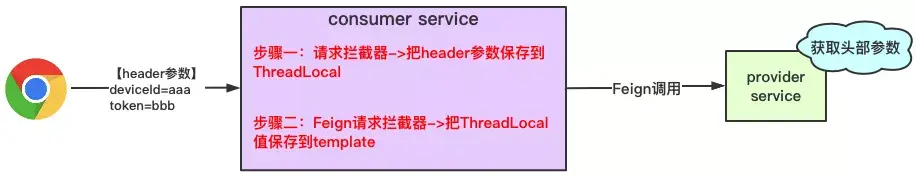

# Feign调用请求头丢失问题

[TOC]

## 1. 问题描述
feign调用请求头丢失

## 2. 解决方案
配置一个`RequestInterceptor`，对请求进行处理，这里以放行授权请求为例：

```java
/**
 * 将授权请求头给feign请求
 * @return
 */
@Bean
public RequestInterceptor feignOauth2Interceptor(){
        return new RequestInterceptor(){

private static final String AUTHORIZATION_HEADER="Authorization";

@Override
public void apply(RequestTemplate requestTemplate){
        ServletRequestAttributes servletRequestAttributes=(ServletRequestAttributes)RequestContextHolder.getRequestAttributes();
        if(servletRequestAttributes==null){
        return;
        }
        HttpServletRequest request=servletRequestAttributes.getRequest();
        String authorization=request.getHeader(AUTHORIZATION_HEADER);
        if(authorization!=null){
        requestTemplate.header(AUTHORIZATION_HEADER,authorization);
        }
        }
        };
        }
```

该拦截器要在消费端进行注入加载。

此方法在**同步调用**情况下可以解决请求头丢失的问题。

如果consumer端在调用provider的时候，需要**异步调用**，也就是开启一个子线程去调用provider方法时，使用上述方法会出现请求头丢失的情况。  
异步调试时，会发现拦截器的`ServletRequestAttributes attributes`为`null`，这是因为`RequestContextHolder`用的是`ThreadLocal<RequestAttributes>`
来保存和获取的，也就是**header参数值是保存在ThreadLocal中的**。那客户端请求过来时，**主线程对header参数保存到了主线程的ThreadLocal**；但是如果子线程调用feign时，**
子线程是没法获得主线程的ThreadLocal的，所以获得为null**。

  


`RequestContextHolder`为我们考虑到了，`RequestContextHolder`提供了`InheritableThreadLocal`。  
明确父-子线程关系的前提下，继承（拷贝）父线程的线程本地变量缓存过的变量，而这个拷贝的时机是子线程Thread实例化时候进行的，也就是子线程实例化完毕后已经完成了InheritableThreadLocal变量的拷贝，这是一个变量传递的过程。

所以我们可以在调用前加一句：  
`RequestContextHolder.setRequestAttributes(RequestContextHolder.getRequestAttributes(),true);`
解决。

这个方案应该能解决大部分情况下请求头丢失的问题了。

**补充**  
在**某些异步调用**情况下依旧会出现请求头丢失的情况：有可能出现 **主线程在子线程之前就结束了，导致取到null** 的情况。

出现该问题的原因在于： 在源码中ThreadLocal对象保存的是`RequestAttributes attributes`；这个是保存的**对象的引用**。**
一旦父线程销毁了，那RequestAttributes也会被销毁，那RequestAttributes的引用地址的值就为null**；虽然子线程也有RequestAttributes的引用，但是引用的值为null了。


问题出现在**子线程那边获取到的是对象的引用**，不是具体的值。如果我们可以**把值拷贝到子线程**，那就可以解决此问题了：  


上图的核心思想就是把header参数放到另外的ThreadLocal变量中，不采用原生的RequestAttributes。

**步骤一：自定义请求头对象**

1. 引入依赖，采用阿里巴巴的TTL组件

```xml

<dependency>
    <groupId>com.alibaba</groupId>
    <artifactId>transmittable-thread-local</artifactId>
    <version>2.11.5</version>
</dependency>
```

2. 自定义对象

```java
public class RequestHeaderHolder {

    private static final ThreadLocal<Map<String, String>> COPY_ON_INHERIT_THREAD_LOCAL;

    static {
        COPY_ON_INHERIT_THREAD_LOCAL = new TransmittableThreadLocal() {
            @Override
            protected Object initialValue() {
                return new HashMap<>(50);
            }
        };
    }

    public static Map<String, String> get() {
        return COPY_ON_INHERIT_THREAD_LOCAL.get();
    }

    public static String get(String key) {
        return COPY_ON_INHERIT_THREAD_LOCAL.get().get(key);
    }

    public static void set(String key, String value) {
        COPY_ON_INHERIT_THREAD_LOCAL.get().put(key, value);
    }

    public static void remove() {
        COPY_ON_INHERIT_THREAD_LOCAL.remove();
    }
}
```

定义RequestHeaderHolder对象，作用就是保存线程本地变量，此代码引用了阿里的TTL组件TransmittableThreadLocal，可以认为就是个增强版的InheritableThreadLocal。

**步骤二：自定义请求拦截器**  
把header参数，赋值到RequestHeaderHolder对象中

```java
public class RequestHeaderInterceptor implements HandlerInterceptor {

    @Override
    public boolean preHandle(HttpServletRequest request, HttpServletResponse response, Object handler) throws Exception {
        // 拦截请求，将header设置到ThreadLocal中
        Enumeration<String> headerNames = request.getHeaderNames();
        while (headerNames.hasMoreElements()) {
            String name = headerNames.nextElement();
            RequestHeaderHolder.set(name, request.getHeader(name));
        }
        return true;
    }

    @Override
    public void afterCompletion(HttpServletRequest request, HttpServletResponse response, Object handler, Exception ex) throws Exception {
        // 用完后移除，防止内存溢出
        RequestHeaderHolder.remove();
    }
}
```

**步骤三：注册拦截器（自行操作）**

**步骤四：修改Feign请求拦截器**  
修改内容为请求头不再是从`RequestContextHolder`获取参数，而是从我们自定义的对象中获取

```java
public class FeignOauth2Interceptor implements RequestInterceptor {

    //    private static final String AUTHORIZATION_HEADER = "Authorization";
    // 这里要将其改为小写
    private static final String AUTHORIZATION_HEADER = "authorization";

    @Override
    public void apply(RequestTemplate requestTemplate) {
        Map<String, String> headerMap = RequestHeaderHolder.get();
        if (headerMap == null || headerMap.isEmpty()) {
            return;
        }

        String authorization = headerMap.get(AUTHORIZATION_HEADER);
        if (authorization != null) {
            requestTemplate.header(AUTHORIZATION_HEADER, authorization);
        }
    }
}
```

ok，结束
