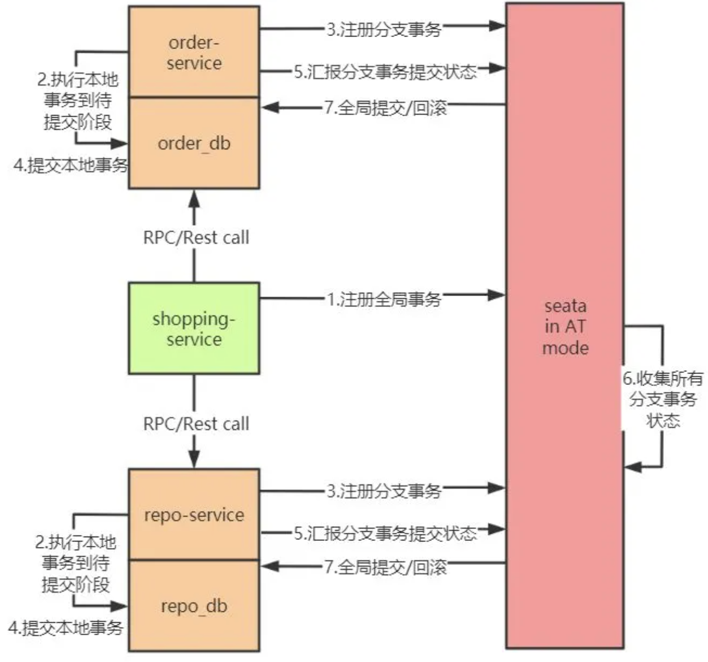

# Seata

目录
+ [AT事务模式](#AT事务模式)
  - [AT工作流程概述](#AT工作流程概述)

## AT事务模式
Seata 为用户提供了 AT、TCC、SAGA 和 XA 事务模式，其中 AT 模式是 Seata 主推的事务模式；使用 AT 有一个前提，那就是微服务使用的数据库必须是支持事务的关系型数据库。

### AT工作流程概述
Seata 的 AT 模式建立在关系型数据库的本地事务特性的基础之上，通过数据源代理类拦截并解析数据库执行的 SQL，记录自定义的回滚日志，如需回滚，则重放这些自定义的回滚日志即可。AT 模式虽然是根据 XA 事务模型（2PC）演进而来的，但是 AT 打破了 XA 协议的阻塞性制约，在一致性和性能上取得了平衡。

AT 模式的整体机制也是一个改进版本的两阶段提交协议。AT 模式的两个基本阶段是：
1. 首先获取本地锁，执行本地事务，业务数据操作和记录回滚日志在同一个本地事务中提交，最后释放本地锁；
2. 如需全局提交，异步删除回滚日志即可，这个过程很快就能完成；如需要回滚，则通过第一阶段的回滚日志进行反向补偿。

以一个简易电商模型为例：协调者 shopping-service 先调用参与者 repo-service 扣减库存，后调用参与者 order-service 生成订单  
  

这个业务流使用 Seata in AT mode 后的全局事务流程如下图所示：

上图描述的全局事务执行流程为~~（不需要解释应该也看得懂吧，不会真有人看不懂吧？）~~：
1. shopping-service 向 Seata 注册全局事务，并产生一个全局事务标识 XID；
2. 将 repo-service.repo_db、order-service.order_db 的本地事务执行到待提交阶段，事务内容包含对 repo-service.repo_db、order-service.order_db 进行的查询操作以及写每个库的 undo_log 记录；
3. repo-service.repo_db、order-service.order_db 向 Seata 注册分支事务，并将其纳入该 XID 对应的全局事务范围；
4. 提交 repo-service.repo_db、order-service.order_db 的本地事务；
5. repo-service.repo_db、order-service.order_db 向 Seata 汇报分支事务的提交状态；至此，第一阶段结束，接下来开启第二阶段；
6. Seata 汇总所有的 DB 的分支事务的提交状态，决定全局事务是该提交还是回滚；
7. Seata 通知 repo-service.repo_db、order-service.order_db 提交/回滚本地事务，若需要回滚，采取的是补偿式方法。
