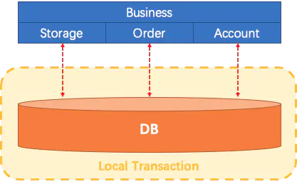
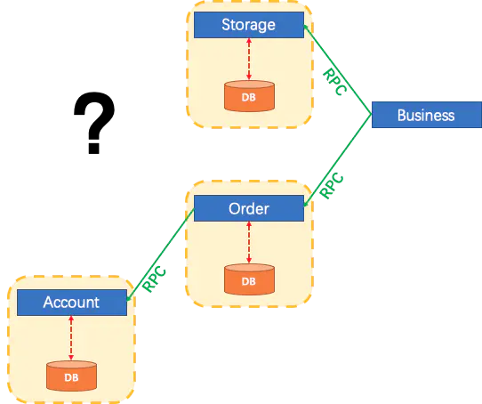
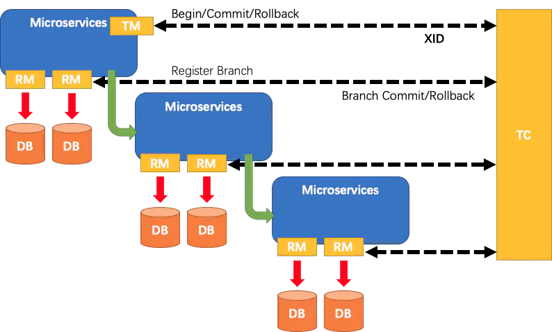

# Seata分布式事务TA模式源码解读

[TOC]

## 一、原理

首先，设想一个传统的单体应用，通过 3 个 模块，在同一个数据源上更新数据来完成一项业务。

很自然的，整个业务过程的数据一致性由本地事务来保证。



随着业务需求和架构的变化，单体应用被拆分为微服务。原来的3个模块被拆分为3个独立的服务，分别使用独立的数据。

业务过程将通过RPC的服务调用来完成。



那么这个时候，每一个服务内部的数据一致性仍由本地事务来保证。

而整个业务层面的全局数据一致性和完整性要如何保障呢？这就是微服务架构下面临的，典型的分布式事务需求。

### 1. 原理和设计

`Seata`把一个分布式事务理解成一个包含了若干 **分支事务** 的 **全局事务** 。**全局事务** 的职责是协调其下管辖的 **分支事务** 达成一致，要么一起成功提交，要么一起失败回滚。此外，通常 **分支事务** 本身就是一个满足 ACID 的 本地事务。

`Seata`定义了3个组件来协议分布式事务的处理过程。

- Transaction Coordinator (TC)： 事务协调器，维护全局事务的运行状态，负责协调并驱动全局事务的提交或回滚。
- Transaction Manager (TM)： 控制全局事务的边界，负责开启一个全局事务，并最终发起全局提交或全局回滚的决议。
- Resource Manager (RM)： 控制分支事务，负责分支注册、状态汇报，并接收事务协调器的指令，驱动分支（本地）事务的提交和回滚。

一个典型的分布式事务过程：

1. TM 向 TC 申请开启一个全局事务，全局事务创建成功并生成一个全局唯一的 XID。
2. XID 在微服务调用链路的上下文中传播。
3. RM 向 TC 注册分支事务，将其纳入 XID 对应全局事务的管辖。
4. TM 向 TC 发起针对 XID 的全局提交或回滚决议。
5. TC 调度 XID 下管辖的全部分支事务完成提交或回滚请求。



### 2. AT模式

Seata有4种分布式事务解决方案，分别是 AT 模式、TCC 模式、Saga 模式和 XA 模式。<后两种实现还在官方计划版本中>

在 AT 模式下，用户只需关注自己的“业务 SQL”，用户的 “业务 SQL” 作为一阶段，Seata 框架会自动生成事务的二阶段提交和回滚操作。

- 一阶段：

在一阶段，Seata 会拦截“业务 SQL”，首先解析 SQL 语义，找到“业务 SQL”要更新的业务数据，在业务数据被更新前，将其保存成“before image”，然后执行“业务 SQL”更新业务数据，在业务数据更新之后，再将其保存成“after image”，最后生成行锁。以上操作全部在一个数据库事务内完成，这样保证了一阶段操作的原子性。

- 二阶段提交：

二阶段如果是提交的话，因为“业务 SQL”在一阶段已经提交至数据库，所以 Seata 框架只需将一阶段保存的快照数据和行锁删掉，完成数据清理即可。

- 二阶段回滚：

二阶段如果是回滚的话，Seata 就需要回滚一阶段已经执行的“业务 SQL”，还原业务数据。回滚方式便是用“before image”还原业务数据。

下面我们从源码中来看看这整个流程是怎么串起来的。

## 二、服务端

Seata 源码：[github.com/seata/seata](https://github.com/seata/seata) 。

> 这里采用的是`1.4.2`版本，不同版本会有所不同

找到`server`模块下的`io.seata.server.Server`类，我们上面说`Seata`定义了三个组件，其中有一个叫TC的事务协调器，就是指这个服务端。

我们看看它具体干了些啥：

```java
public class Server {
    /**
     * The entry point of application.
     *
     * @param args the input arguments
     */
    public static void start(String[] args) {
        // create logger
        final Logger logger = LoggerFactory.getLogger(Server.class);
        if (ContainerHelper.isRunningInContainer()) {
            logger.info("The server is running in container.");
        }

        //initialize the parameter parser
        //Note that the parameter parser should always be the first line to execute.
        //Because, here we need to parse the parameters needed for startup.
        // 初始化参数解析器
        ParameterParser parameterParser = new ParameterParser(args);

        //initialize the metrics
        MetricsManager.get().init();

        System.setProperty(ConfigurationKeys.STORE_MODE, parameterParser.getStoreMode());

        // 初始化 NettyRemotingServer ，设置服务器参数
        ThreadPoolExecutor workingThreads = new ThreadPoolExecutor(NettyServerConfig.getMinServerPoolSize(),
                NettyServerConfig.getMaxServerPoolSize(), NettyServerConfig.getKeepAliveTime(), TimeUnit.SECONDS,
                new LinkedBlockingQueue<>(NettyServerConfig.getMaxTaskQueueSize()),
                new NamedThreadFactory("ServerHandlerThread", NettyServerConfig.getMaxServerPoolSize()), new ThreadPoolExecutor.CallerRunsPolicy());

        NettyRemotingServer nettyRemotingServer = new NettyRemotingServer(workingThreads);
        //server port
        nettyRemotingServer.setListenPort(parameterParser.getPort());
        UUIDGenerator.init(parameterParser.getServerNode());

        //log store mode : file, db, redis
        // 从文件或者数据库中加载Session
        SessionHolder.init(parameterParser.getSessionStoreMode());
        LockerManagerFactory.init(parameterParser.getLockStoreMode());

        //初始化默认的协调器
        DefaultCoordinator coordinator = new DefaultCoordinator(nettyRemotingServer);
        coordinator.init();
        nettyRemotingServer.setHandler(coordinator);

        // register ShutdownHook
        // 注册钩子程序 清理协调器相关资源
        ShutdownHook.getInstance().addDisposable(coordinator);
        ShutdownHook.getInstance().addDisposable(nettyRemotingServer);

        //127.0.0.1 and 0.0.0.0 are not valid here.
        if (NetUtil.isValidIp(parameterParser.getHost(), false)) {
            XID.setIpAddress(parameterParser.getHost());
        } else {
            XID.setIpAddress(NetUtil.getLocalIp());
        }
        XID.setPort(nettyRemotingServer.getListenPort());

        // 启动RPC服务
        nettyRemotingServer.init();
    }
}
```

这里的`NettyRemotingServer`是通过Netty实现的一个RPC服务端，用来接收并处理TM和RM的消息。本文的重点不在服务端，所以我们先有一个大致的印象即可。

## 三、客户端配置

在项目中，我们配置了`SeataConfiguration`，其中的重点是配置全局事务扫描器和数据源代理。所以，我们先来看看为啥要配置它们，它们具体又做了什么事。

### 1. 事务扫描器

有两个参数，一个是应用名称，一个是事务分组。

```java
@Bean
public GlobalTransactionScanner globalTransactionScanner() {
    return new GlobalTransactionScanner("springboot-order", "my_test_tx_group");
}
```

按照规矩，我们看一个类，先看它的结构。比如它是谁的儿子，从哪里来，欲往何处去？

```java
import org.springframework.aop.framework.autoproxy.AbstractAutoProxyCreator;
import io.seata.config.ConfigurationChangeListener;
import org.springframework.beans.factory.InitializingBean;
import org.springframework.context.ApplicationContextAware;
import org.springframework.beans.factory.DisposableBean;

public class GlobalTransactionScanner extends AbstractAutoProxyCreator
    implements ConfigurationChangeListener, InitializingBean, ApplicationContextAware, DisposableBean{}
```

这里我们看到它是`AbstractAutoProxyCreator`的子类，又实现了`InitializingBean`接口。

这俩哥们都是Spring大家族的成员，一个用于Spring AOP生成代理；一个用于调用Bean的初始化方法。 


- InitializingBean

Bean的初始化方法有三种方式，按照先后顺序是，`@PostConstruct、afterPropertiesSet、init-method`。

在这里，它的初始化方法中，主要就干了三件事：

```java
private void initClient() {
    if (LOGGER.isInfoEnabled()) {
      LOGGER.info("Initializing Global Transaction Clients ... ");
    }
    if (StringUtils.isNullOrEmpty(applicationId) || StringUtils.isNullOrEmpty(txServiceGroup)) {
      throw new IllegalArgumentException(String.format("applicationId: %s, txServiceGroup: %s", applicationId, txServiceGroup));
    }
    //init TM
    // 初始化事务管理器
    TMClient.init(applicationId, txServiceGroup, accessKey, secretKey);
    if (LOGGER.isInfoEnabled()) {
      LOGGER.info("Transaction Manager Client is initialized. applicationId[{}] txServiceGroup[{}]", applicationId, txServiceGroup);
    }
    //init RM
    // 初始化资源管理器
    RMClient.init(applicationId, txServiceGroup);
    if (LOGGER.isInfoEnabled()) {
      LOGGER.info("Resource Manager is initialized. applicationId[{}] txServiceGroup[{}]", applicationId, txServiceGroup);
    }

    if (LOGGER.isInfoEnabled()) {
      LOGGER.info("Global Transaction Clients are initialized. ");
    }
    // 注册钩子，用于TM、RM的资源清理
    registerSpringShutdownHook();
}
```

到目前为止，Seata定义的三个组件都已经浮出水面了。

`TMClient.init`主要是初始化事务管理器的客户端，建立与RPC服务端的连接，同时向事务协调器注册。

`RMClient.init`也是一样过程，初始化资源管理器，建立与RPC服务端的连接，同时向事务协调器注册。

同时，它们都是通过定时任务来完成连接的，所以断线之后可以自动重连：

```java
public abstract class AbstractNettyRemotingClient extends AbstractNettyRemoting implements RemotingClient{
  
  // 这是在父类定义的，这里摘出来只是为了好看
  protected final ScheduledExecutorService timerExecutor = 
    new ScheduledThreadPoolExecutor(1,new NamedThreadFactory("timeoutChecker", 1, true));
  
  @Override
  public void init() {
    timerExecutor.scheduleAtFixedRate(new Runnable() {
      @Override
      public void run() {
        clientChannelManager.reconnect(getTransactionServiceGroup());
      }
    }, SCHEDULE_DELAY_MILLS, SCHEDULE_INTERVAL_MILLS, TimeUnit.MILLISECONDS);
    if (NettyClientConfig.isEnableClientBatchSendRequest()) {
      mergeSendExecutorService = 
        new ThreadPoolExecutor(MAX_MERGE_SEND_THREAD, MAX_MERGE_SEND_THREAD,
                               KEEP_ALIVE_TIME, TimeUnit.MILLISECONDS,
                               new LinkedBlockingQueue<>(),
                               new NamedThreadFactory(getThreadPrefix(), MAX_MERGE_SEND_THREAD));
      mergeSendExecutorService.submit(new MergedSendRunnable());
    }
    super.init();
    clientBootstrap.start();
  }
}
```

最后，注册钩子程序，用于清理这两个组件中的资源。


- AbstractAutoProxyCreator

它实际上是一个Bean的后置处理器，在Bean初始化之后，调用`postProcessAfterInitialization`方法：

```java
public Object postProcessAfterInitialization(@Nullable Object bean, String beanName) {
    if (bean != null) {
    	Object cacheKey = this.getCacheKey(bean.getClass(), beanName);
    	if (this.earlyProxyReferences.remove(cacheKey) != bean) {
    	    return this.wrapIfNecessary(bean, beanName, cacheKey);
    	}
    }
    return bean;
}
```

然后在`GlobalTransactionScanner.wrapIfNecessary()`里它干了些什么呢？

就是检查Bean的方法上是否包含`GlobalTransactional`和`GlobalLock`注解，然后生成代理类：

```java
@Override
protected Object wrapIfNecessary(Object bean, String beanName, Object cacheKey) {
    // do checkers
    if (!doCheckers(bean, beanName)) {
      return bean;
    }

    try {
      synchronized (PROXYED_SET) {
        // 已经生成代理则返回
        if (PROXYED_SET.contains(beanName)) {
          return bean;
        }
        interceptor = null;
        //check TCC proxy 检查是不是TCC的代理
        if (TCCBeanParserUtils.isTccAutoProxy(bean, beanName, applicationContext)) {
          //TCC interceptor, proxy bean of sofa:reference/dubbo:reference, and LocalTCC
          interceptor = new TccActionInterceptor(TCCBeanParserUtils.getRemotingDesc(beanName));
          ConfigurationCache.addConfigListener(ConfigurationKeys.DISABLE_GLOBAL_TRANSACTION,
                                               (ConfigurationChangeListener)interceptor);
        } else {
          // 判断类方法上是否包含GlobalTransactional注解和GlobalLock注解
          Class<?> serviceInterface = SpringProxyUtils.findTargetClass(bean);
          Class<?>[] interfacesIfJdk = SpringProxyUtils.findInterfaces(bean);

          if (!existsAnnotation(new Class[]{serviceInterface})
              && !existsAnnotation(interfacesIfJdk)) {
            return bean;
          }

          // 创建拦截器
          if (globalTransactionalInterceptor == null) {
            globalTransactionalInterceptor = new GlobalTransactionalInterceptor(failureHandlerHook);
            ConfigurationCache.addConfigListener(
              ConfigurationKeys.DISABLE_GLOBAL_TRANSACTION,
              (ConfigurationChangeListener)globalTransactionalInterceptor);
          }
          interceptor = globalTransactionalInterceptor;
        }

        LOGGER.info("Bean[{}] with name [{}] would use interceptor [{}]", bean.getClass().getName(), beanName, interceptor.getClass().getName());

        // 如果不是AOP代理，则创建代理；如果是代理，则将拦截器加入到Advisor
        if (!AopUtils.isAopProxy(bean)) {
          bean = super.wrapIfNecessary(bean, beanName, cacheKey);
        } else {
          AdvisedSupport advised = SpringProxyUtils.getAdvisedSupport(bean);
          Advisor[] advisor = buildAdvisors(beanName, getAdvicesAndAdvisorsForBean(null, null, null));
          int pos;
          for (Advisor avr : advisor) {
            // Find the position based on the advisor's order, and add to advisors by pos
            pos = findAddSeataAdvisorPosition(advised, avr);
            advised.addAdvisor(pos, avr);
          }
        }
        PROXYED_SET.add(beanName);
        return bean;
      }
    } catch (Exception exx) {
      throw new RuntimeException(exx);
    }
}
```

至此，我们已经确定了一件事。我们`ServiceImpl`实现类上带有`GlobalTransactional`注解的方法，会生成一个代理类。

在调用方法时，实际会调用的就是代理类的拦截器方法`invoke()`：

```java
public class GlobalTransactionalInterceptor implements ConfigurationChangeListener, MethodInterceptor, SeataInterceptor {
  	@Override
    public Object invoke(final MethodInvocation methodInvocation) throws Throwable {
        // 获取目标类
        Class<?> targetClass =
            methodInvocation.getThis() != null ? AopUtils.getTargetClass(methodInvocation.getThis()) : null;
        // 获取调用的方法
        Method specificMethod = ClassUtils.getMostSpecificMethod(methodInvocation.getMethod(), targetClass);
        if (specificMethod != null && !specificMethod.getDeclaringClass().equals(Object.class)) {
            // 获取方法上的注解
            final Method method = BridgeMethodResolver.findBridgedMethod(specificMethod);
            final GlobalTransactional globalTransactionalAnnotation =
                getAnnotation(method, targetClass, GlobalTransactional.class);
            final GlobalLock globalLockAnnotation = getAnnotation(method, targetClass, GlobalLock.class);
            boolean localDisable = disable || (degradeCheck && degradeNum >= degradeCheckAllowTimes);
            if (!localDisable) {
                // 处理全局事务
                if (globalTransactionalAnnotation != null) {
                    return handleGlobalTransaction(methodInvocation, globalTransactionalAnnotation);
                } else if (globalLockAnnotation != null) {
                    return handleGlobalLock(methodInvocation, globalLockAnnotation);
                }
            }
        }
        return methodInvocation.proceed();
    }
}
```

可以看到，这里是开始处理全局事务的地方。这里我们先不深究，接着往下看。