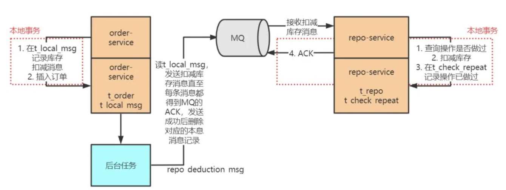

# 分布式事务基本原理

目录

+ [单数据源事务和多数据源事务](#单数据源事务和多数据源事务)
+ [常见分布式事务解决方案](#常见分布式事务解决方案)
    - [分布式事务模型](#分布式事务模型)
    - [二将军问题和幂等性](#二将军问题和幂等性)
    - [2PC和3PC方案](#2PC和3PC方案)
    - [TCC方案](#TCC方案)
    - [事务状态表方案](#事务状态表方案)
    - [基于消息中间件的最终一致性事务方案](#基于消息中间件的最终一致性事务方案)

## 单数据源事务和多数据源事务

如果一个应用程序在一次业务流中通过连接驱动和数据源接口只连接并查询（这里的查询是广义的，包括增删查改等）一个特定的数据库，该应用程序就可以利用数据库提供的事务机制（如果数据库支持事务的话）保证对库中记录所进行的操作的可靠性(ACID)
。简单来说就是**如果只操作一个库，依靠数据库本身提供的事务机制即可保证ACID**。

单数据源事务也可以叫做单机事务，或者本地事务。

在时下流行的微服务系统架构中，每一个子系统被称作一个微服务，同样每个微服务都维护自己的数据库，以保持独立性。

以下是一个简易的购物业务：
  
在用户购物的业务场景中，shopping-service 的业务涉及两个数据库：库存库（repo_db）和订单库（repo_db），也就是购物业务是调用多数据源来组合而成的。

但是一个数据库的本地事务机制仅仅对落到自己身上的查询操作（这里的查询是广义的，包括增删改查等）起作用，无法干涉对其他数据库的查询操作。所以，**数据库自身提供的本地事务机制无法确保业务对多数据源全局操作的可靠性**。

分布式事务也可以叫做全局事务。

## 常见分布式事务解决方案

### 分布式事务模型

描述分布式事务，常常会使用以下几个名词：

- 事务参与者：例如每个数据库就是一个事务参与者；
- 事务协调者：访问多个数据源的服务程序，例如 shopping-service 就是事务协调者；
- 资源管理器（Resource Manager, RM）：通常与事务参与者同义；
- 事务管理器（Transaction Manager, TM）：通常与事务协调者同义。

在分布式事务模型中，一个 TM 管理多个 RM，即一个服务程序访问多个数据源；TM 是一个全局事务管理器，协调多方本地事务的进度，使其共同提交或回滚，最终达成一种全局的 ACID 特性。

### 二将军问题和幂等性

二将军问题是网络领域的一个经典问题，用于表达计算机网络中互联协议设计的微妙性和复杂性，有兴趣的同学自行了解吧。

网络二将军问题的存在使得消息的发送者往往要重复发送消息，直到收到接收者的确认才认为发送成功，但这往往又会导致消息的重复发送。例如电商系统中订单模块调用支付模块扣款的时候，如果网络故障导致二将军问题出现，扣款请求重复发送，产生的重复扣款结果显然是不能被接受的。因此要保证一次事务中的扣款请求无论被发送多少次，接收方有且只执行一次扣款动作，这种保证机制叫做接收方的幂等性。

### 2PC和3PC方案

我一直觉得这里的 2PC 和 3PC 和 Zookeper 的很像，感觉就是同一个东西

#### 2PC

2PC 是一种实现分布式事务的简单模型，这两个阶段是：

1. **准备阶段**：事务协调者向各个事务参与者发起询问请求："我要执行全局事务了，这个事务涉及到的资源分布在你们这些数据源中，分别是……，你们准备好各自的资源（即各自执行本地事务到待提交阶段）"。各个参与者协调者回复
   yes（表示已准备好，允许提交全局事务）或 no（表示本参与者无法拿到全局事务所需的本地资源，因为它被其他本地事务锁住了）或超时。
2. **提交阶段**：如果各个参与者回复的都是 yes，则协调者向所有参与者发起事务提交操作，然后所有参与者收到后各自执行本地事务提交操作并向协调者发送 ACK；如果任何一个参与者回复 no
   或者超时，则协调者向所有参与者发起事务回滚操作，然后所有参与者收到后各自执行本地事务回滚操作并向协调者发送 ACK。

2PC 的流程如下图所示：  

从上图可以看出，要实现 2PC，所有的参与者都要实现三个接口：

- **Prepare**()：TM 调用该接口询问各个本地事务是否就绪；
- **Commit**()：TM 调用该接口要求各个本地事务提交；
- **Rollback**()：TM 调用该接口要求各个本地事务回滚。

2PC 简明易懂，但存在如下的问题：

- 性能差。在准备阶段，要等待所有的参与者返回，才能进入阶段二，在这期间，各个参与者上面的相关资源被排他地锁住，参与者上面意图使用这些资源的本地事务只能等待；因为存在这种同步阻塞问题，所以影响了各个参与者的本地事务并发度；
- 准备阶段完成后，如果协调者宕机，所有的参与者都收不到提交或回滚指令，导致所有参与者"不知所措"；
- 在提交阶段，协调者向所有的参与者发送了提交指令，如果一个参与者未返回
  ACK，那么协调者不知道这个参与者内部发生了什么（由于网络二将军问题的存在，这个参与者可能根本没收到提交指令，一直处于等待接收提交指令的状态；也可能收到了，并成功执行了本地提交，但返回的 ACK
  由于网络故障未送到协调者上），也就无法决定下一步是否进行全体参与者的回滚。

#### 3PC

3PC 把两阶段过程变成了三阶段过程，分别是：询问阶段、准备阶段、提交或回滚阶段，有兴趣自己了解，不赘述。

3PC 利用超时机制解决了 2PC 的同步阻塞问题，避免资源被永久锁定，进一步加强了整个事务过程的可靠性，但是 3PC 同样无法应对类似的宕机问题，只不过出现多数据源中数据不一致问题的概率更小。

### TCC方案

TCC 就是一种解决多个微服务之间的分布式事务问题的方案。TCC 是 Try、Confirm、Cancel 三个词的缩写，其**本质是一个应用层面上的 2PC**，同样分为两个阶段：

- **准备阶段**：协调者调用所有的每个微服务提供的 try 接口，将整个全局事务涉及到的资源锁定住，若锁定成功 try 接口向协调者返回 yes；
- **提交阶段**：若所有的服务的 try 接口在阶段一都返回 yes，则进入提交阶段，协调者调用所有服务的 confirm 接口，各个服务进行事务提交；如果有任何一个服务的 try 接口在阶段一返回 no
  或者超时，则协调者调用所有服务的 cancel 接口。

TCC 的流程如下图所示：  

既然 TCC 是一种服务层面上的 2PC。它是如何解决 2PC 无法应对宕机问题的缺陷的呢？ —— **不断重试**

由于 try 操作锁住了全局事务涉及的所有资源，保证了业务操作的所有前置条件得到满足，因此无论是 confirm 阶段失败还是 cancel 阶段失败都能通过不断重试直至 confirm 或 cancel 成功（所谓成功就是所有的服务都对
confirm 或者 cancel 返回了 ACK）。

这里还有个关键问题，在不断重试 confirm 和 cancel 的过程中（考虑到网络二将军问题的存在）有可能重复进行了 confirm 或 cancel，因此还要再保证 confirm 和 cancel
操作具有幂等性，也就是整个全局事务中，每个参与者只进行一次 confirm 或者 cancel。实现 confirm 和 cancel 操作的幂等性，有很多解决方案，例如每个参与者可以维护一个去重表（可以利用数据库表实现也可以使用内存型
KV 组件实现），记录每个全局事务（以全局事务标记 XID 区分）是否进行过 confirm 或 cancel 操作，若已经进行过，则不再重复执行。

### 事务状态表方案

另外有一种类似 TCC 的事务解决方案，借助事务状态表来实现。假设要在一个分布式事务中实现调用 repo-service 扣减库存、调用 order-service 生成订单两个过程。在这种方案中，协调者 shopping-service
维护一张如下的事务状态表：

分布式事务 ID|事务内容|事务状态
:---:|:---:|:---:
global_trx_id_1|操作 1：调用 repo-service 扣减库存  操作 2：调用 order-service 生成订单|状态1：初始  状态2：操作1成功  状态3：操作1、2成功

初始状态为 1，每成功调用一个服务则更新一次状态，最后所有的服务调用成功，状态更新到 3。

有了这张表，就可以启动一个后台任务，扫描这张表中事务的状态，如果一个分布式事务一直（设置一个事务周期阈值）未到状态 3，说明这条事务没有成功执行，于是可以重新调用 repo-service 扣减库存、调用 order-service
生成订单，直至所有的调用成功，事务状态到 3。

如果多次重试仍未使得状态到 3，可以将事务状态置为 error，通过人工介入进行干预。

由于存在服务的调用重试，因此每个服务的接口要根据全局的分布式事务 ID 做幂等，原理同 TCC 的幂等性实现。

### 基于消息中间件的最终一致性事务方案

无论是 2PC & 3PC 还是 TCC、事务状态表，基本都遵守 XA 协议的思想。**即这些方案本质上都是事务协调者协调各个事务参与者的本地事务的进度，使所有本地事务共同提交或回滚，最终达成一种全局的 ACID
特性。在协调的过程中，协调者需要收集各个本地事务的当前状态，并根据这些状态发出下一阶段的操作指令**。

但是这些全局事务方案由于操作繁琐、时间跨度大，或者在全局事务期间会排他地锁住相关资源，使得整个分布式系统的全局事务的并发度不会太高；因此互联网服务提供商探索出了很多与 XA 协议背道而驰的分布式事务解决方案。

其中利用消息中间件实现的最终一致性全局事务就是一个经典方案。

依然使用之前用过的模型来举例：  

#### 错误的实现

如果怕被错误的思维影响到，建议直接跳到[正确的实现](#正确的实现)上。

这种基于消息中间件的最终一致性事务方案常常被 **误解** 成如下的实现方式：  

这种实现方式的流程是：

1. order-service 负责向 MQ server 发送扣减库存消息（repo_deduction_msg）；repo-service 订阅 MQ server 中的扣减库存消息，负责消费消息。
2. 用户下单后，order-service 先执行插入订单记录的查询语句，后将 repo_deduction_msg 发到消息中间件中，这两个过程放在一个本地事务中进行，一旦“执行插入订单记录的查询语句”失败，导致事务回滚，“将
   repo_deduction_msg 发到消息中间件中”就不会发生；同样，一旦“将 repo_deduction_msg 发到消息中间件中”失败，抛出异常，也会导致“执行插入订单记录的查询语句”操作回滚，最终什么也没有发生。
3. repo-service 接收到 repo_deduction_msg 之后，先执行库存扣减查询语句，后向 MQ sever 反馈消息消费完成
   ACK，这两个过程放在一个本地事务中进行，一旦“执行库存扣减查询语句”失败，导致事务回滚，“向 MQ sever 反馈消息消费完成 ACK”就不会发生，MQ server 在 Confirm 机制的驱动下会继续向
   repo-service 推送该消息，直到整个事务成功提交；同样，一旦“向 MQ sever 反馈消息消费完成 ACK”失败，抛出异常，也对导致“执行库存扣减查询语句”操作回滚，MQ server 在 Confirm
   机制的驱动下会继续向 repo-service 推送该消息，直到整个事务成功提交。

这种做法看似很可靠，但没有考虑到网络二将军问题的存在，有如下的缺陷：

- **网络二将军问题**：上面第 2 步中 order-service 发送 repo_deduction_msg 消息失败，对于发送方 order-service 来说，可能是消息中间件没有收到消息；也可能是中间件收到了消息，但向发送方
  order-service 响应的 ACK 由于网络故障没有被 order-service 收到。因此 order-service 贸然进行事务回滚，撤销“执行插入订单记录的查询语句”，是不对的，因为 repo-service
  那边可能已经接收到 repo_deduction_msg 并成功进行了库存扣减，这样 order-service 和 repo-service 两方就产生了数据不一致问题；
- **数据库长事务问题**：repo-service 和 order-service 把网络调用（与 MQ server 通信）放在本地数据库事务里，可能会因为网络延迟产生数据库长事务，影响数据库本地事务的并发度。

#### 正确的实现

以上是被误解的实现方式，下面给出正确的实现方式：  

对上图的一些解释：

1. order-service 中：

- 在 t_order 表添加订单记录；
- 在 t_local_msg 添加对应的扣减库存消息；
- 这两个过程要在一个事务中完成，保证过程的原子性；

2. repo-service 中：

- 检查本次扣库存操作是否已经执行过；
- 执行扣减库存(如果本次扣减操作没有执行过)；
- 写判重表；
- 向 MQ sever 反馈消息消费完成 ACK；
- 这四个过程也要在一个事务中完成，保证过程的原子性；

3. order-service 中有一个后台程序，源源不断地把消息表中的消息传送给消息中间件，成功后则删除消息表中对应的消息，如果失败了，也会不断尝试重传；由于存在网络 2 将军问题，即当 order-service
   发送给消息中间件的消息网络超时时，这时候消息中间件可能收到了消息但响应 ACK 失败，也可能没收到，order-service 会再次发送该消息，直至消息中间件响应 ACK
   成功，这样可能发生消息的重复发送，不过没关系，只要保证消息不丢失，不乱序就行，后面 repo-service 会做去重处理；
4. 消息中间件向 repo-service 推送 repo_deduction_msg，repo-service 成功处理完成后会向中间件响应 ACK，消息中间件收到这个 ACK 才认为 repo-service
   成功处理了这条消息，否则会重复推送该消息；但是有这样的情形：repo-service 成功处理了消息，向中间件发送的 ACK 在网络传输中由于网络故障丢失了，导致中间件没有收到 ACK 重新推送了该消息，这也要靠
   repo-service 的消息去重特性来避免消息重复消费；
5. 在 3 和 4 中提到了两种导致 repo-service 重复收到消息的原因，一是生产者重复生产，二是中间件重传。为了实现业务的幂等性，repo-service 中维护了一张判重表，这张表中记录了被成功处理的消息的
   id。repo-service 每次接收到新消息都先判断消息是否被成功处理过，若是的话不再重复处理。

通过这种设计，实现了消息在发送方不丢失，消息在接收方不被重复消费，联合起来就是消息不漏不重，严格实现了 order-service 和 repo-service 的两个数据库中数据的最终一致性。

事实上这个解决方案依然存在问题，但我不说 
                                                      

问题：如果扣减库存时因网络原因扣减失败，稍后网络恢复时库存已不足，如果不加以控制则会出现超卖或呃其他问题。  
解决：可以考虑使用分布式缓存存储库存信息。