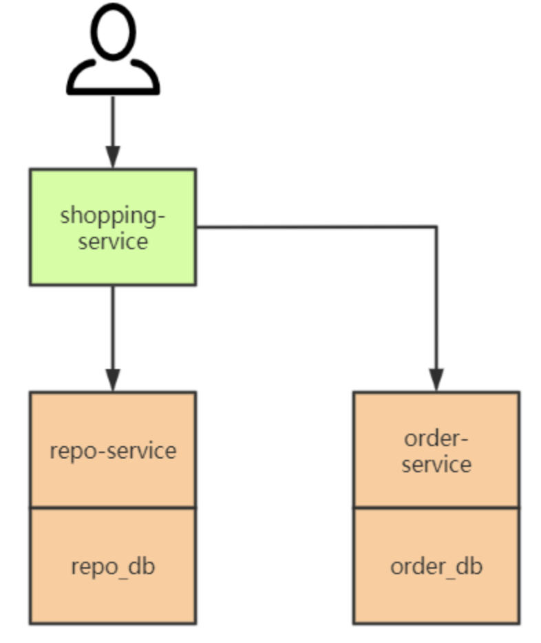

# 分布式事务知识点

目录
+ [单数据源事务&多数据源事务](#单数据源事务&多数据源事务)
+ [常见分布式事务解决方案](#常见分布式事务解决方案)
  - [分布式事务模型](#分布式事务模型)

## 单数据源事务&多数据源事务
如果一个应用程序在一次业务流中通过连接驱动和数据源接口只连接并查询（这里的查询是广义的，包括增删查改等）一个特定的数据库，该应用程序就可以利用数据库提供的事务机制（如果数据库支持事务的话）保证对库中记录所进行的操作的可靠性(ACID)。简单来说就是**如果只操作一个库，依靠数据库本身提供的事务机制即可保证ACID**。

单数据源事务也可以叫做单机事务，或者本地事务。

在时下流行的微服务系统架构中，每一个子系统被称作一个微服务，同样每个微服务都维护自己的数据库，以保持独立性。

以下是一个简易的购物业务：
  
在用户购物的业务场景中，shopping-service 的业务涉及两个数据库：库存库（repo_db）和订单库（repo_db），也就是购物业务是调用多数据源来组合而成的。

但是一个数据库的本地事务机制仅仅对落到自己身上的查询操作（这里的查询是广义的，包括增删改查等）起作用，无法干涉对其他数据库的查询操作。所以，**数据库自身提供的本地事务机制无法确保业务对多数据源全局操作的可靠性**。

分布式事务也可以叫做全局事务。

## 常见分布式事务解决方案

### 分布式事务模型
  

描述分布式事务，常常会使用以下几个名词：
- 事务参与者：例如每个数据库就是一个事务参与者；
- 事务协调者：访问多个数据源的服务程序，例如 shopping-service 就是事务协调者；
- 资源管理器（Resource Manager, RM）：通常与事务参与者同义；
- 事务管理器（Transaction Manager, TM）：通常与事务协调者同义。

在分布式事务模型中，一个 TM 管理多个 RM，即一个服务程序访问多个数据源；TM 是一个全局事务管理器，协调多方本地事务的进度，使其共同提交或回滚，最终达成一种全局的 ACID 特性。
