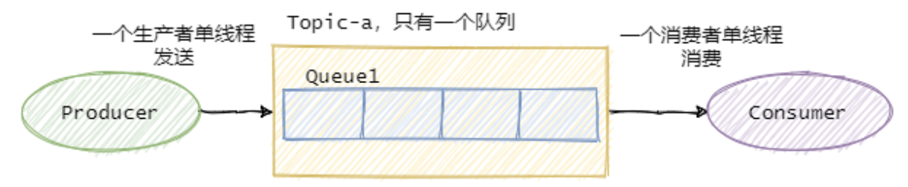
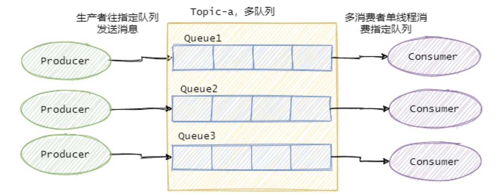

# MQ消息丢失、重复消费、有序性、堆积

目录

+ [消息队列如何保证消息不丢失](#消息队列如何保证消息不丢失)
+ [消息队列如何保证消息不重复消费](#消息队列如何保证消息不重复消费)
+ [消息队列如何保证消息的有序性](#消息队列如何保证消息的有序性)
+ [消息队列如何处理消息堆积](#消息队列如何处理消息堆积)

## 消息队列如何保证消息不丢失

就我们市面上常见的消息队列而言，只要配置得当，我们的消息就不会丢。  
先来看看个图：  

可以看到一共有三个阶段，分别是生产消息、存储消息和消费消息。从这三个阶段分别入手来看看如何确保消息不会丢失。

### 生产消息

生产者发送消息至Broker，需要处理Broker的响应，不论是同步还是异步发送消息，同步和异步回调都需要做好try-catch，妥善的处理响应，如果Broker返回写入失败等错误消息，需要重试发送。当多次发送失败需要作报警，日志记录等。

这样就能保证在生产消息阶段消息不会丢失。

### 存储消息

存储消息阶段需要在消息刷盘之后再给生产者响应，假设消息写入缓存中就返回响应，那么机器突然断电这消息就没了，而生产者以为已经发送成功了。

如果Broker是集群部署，有多副本机制，即消息不仅仅要写入当前Broker，还需要写入副本机中。那配置成至少写入两台机子后再给生产者响应。这样基本上就能保证存储的可靠了。一台挂了还有一台还在呢（假如怕两台都挂了..那就再多些，没有什么是加机器解决不了的）

### 消费消息

在这一层需要考虑的是拿到消息放在内存之后消费者就宕机了怎么办。所以我们应该在消费者真正执行完业务逻辑之后，再发送给Broker消费成功，这才是真正的消费了，而不是当消费者拿到消息之后直接存入内存队列中就直接返回给Broker消费成功，这是不对的。

所以只要我们在消息业务逻辑处理完成之后再给Broker响应，那么消费阶段消息就不会丢失。

### 小结

可以看出，保证消息的可靠性需要三方配合。

- 生产者需要处理好Broker的响应，出错情况下利用重试、报警等手段；
- Broker需要控制响应的时机，单机情况下是消息刷盘后返回响应，集群多副本情况下，即发送至两个副本及以上的情况下再返回响应；
- 消费者需要在执行完真正的业务逻辑之后再返回响应给Broker。

但是要注意消息可靠性增强了，性能就下降了，等待消息刷盘、多副本同步后返回都会影响性能。因此还是看业务，例如日志的传输可能丢那么一两条关系不大，因此没必要等消息刷盘再响应。

## 消息队列如何保证消息不重复消费

正常业务而言**消息重复是不可避免的**。

假设我们发送消息，就管发，不管Broker的响应，那么我们发往Broker是不会重复的，但是一般情况我们是不允许这样的，这样消息就完全不可靠了，我们的基本需求是消息至少得发到Broker上，那就得等Broker的响应，那么就可能存在Broker已经写入了，当时响应由于网络原因生产者没有收到，然后生产者又重发了一次，此时消息就重复了。

再看消费者消费的时候，假设我们消费者拿到消息消费了，业务逻辑已经走完了，事务提交了，此时需要更新Consumer offset了，然后这个消费者挂了，另一个消费者顶上，此时Consumer
offset还没更新，于是又拿到刚才那条消息，业务又被执行了一遍，于是消息又重复了。

可以看到正常业务而言消息重复是不可避免的，因此我们只能从另一个角度来解决重复消息的问题 —— 幂等。既然我们不能防止重复消息的产生，那么我们只能在业务上处理重复消息所带来的影响。

### 幂等处理重复消息

幂等简单来说就是：同样的参数多次调用同一个接口和调用一次产生的结果是一致的。

实现幂等的方式很多，比如：

- 前置条件判断：类似token机制；
- 数据库的约束例如唯一键；
- 记录关键的key：比如处理订单这种，记录订单ID，假如有重复的消息过来，先判断下这个ID是否已经被处理过了，如果没处理再进行下一步。

基本上就这么几个套路，真正应用到实际中还是得看具体业务细节。。

## 消息队列如何保证消息的有序性

有序性分：全局有序和部分有序。

### 全局有序

如果要保证消息的全局有序，首先只能由一个生产者往Topic发送消息，并且一个Topic内部只能有一个队列（分区）。消费者也必须是单线程消费这个队列。这样的消息就是全局有序的！

不过一般情况下我们都不需要全局有序，即使是同步MySQL Binlog也只需要保证单表消息有序即可。  

### 部分有序

绝大部分的有序需求是部分有序，部分有序我们就可以将Topic内部划分成我们需要的队列数，把消息通过特定的策略发往固定的队列中，然后每个队列对应一个单线程处理的消费者。这样即完成了部分有序的需求，又可以通过队列数量的并发来提高消息处理效率。

图中画了多个生产者，一个生产者也可以，只要同类消息发往指定的队列即可。

## 消息队列如何处理消息堆积

消息的堆积往往是因为生产者的生产速度与消费者的消费速度不匹配。有可能是因为消息消费失败反复重试造成的，也有可能就是消费者消费能力弱，渐渐地消息就积压了。

因此我们需要先定位消费慢的原因，如果是bug则处理bug ，如果是因为本身消费能力较弱，我们可以优化下消费逻辑，比如之前是一条一条消息消费处理的，这次我们批量处理，比如数据库的插入，一条一条插和批量插效率是不一样的。

假如逻辑我们已经都优化了，但还是慢，那就得考虑水平扩容了，增加Topic的队列数和消费者数量，注意队列数一定要增加，不然新增加的消费者是没东西消费的。一个Topic中，一个队列只会分配给一个消费者。

当然你消费者内部是单线程还是多线程消费那看具体场景。不过要注意上面提高的消息丢失的问题，如果你是将接受到的消息写入内存队列之后，然后就返回响应给Broker，然后多线程向内存队列消费消息，假设此时消费者宕机了，内存队列里面还未消费的消息也就丢了。

