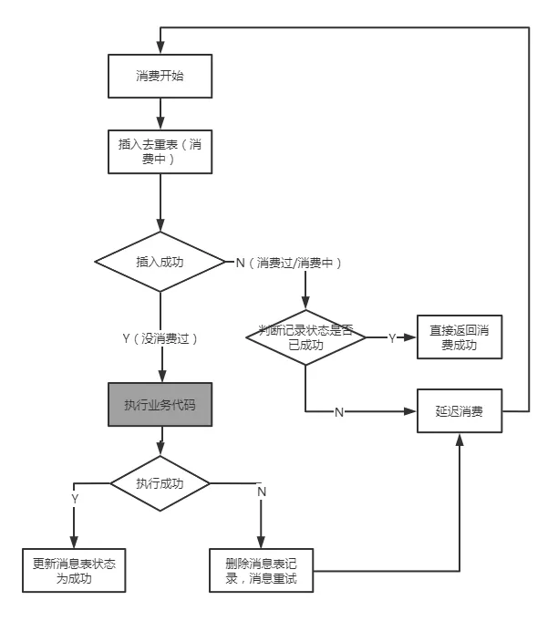

# 避免消息重复消费

## 零、开篇

消息中间件是分布式系统常用的组件，无论是异步化、解耦、削峰等都有广泛的应用价值。  

我们通常会认为，消息中间件是一个可靠的组件——这里所谓的可靠是指，只要我把消息成功投递到了消息中间件，消息就不会丢。

**即消息肯定会至少保证消息能被消费者成功消费一次，这是消息中间件最基本的特性之一。**

也就是我们常说的“AT LEAST ONCE”，即消息至少会被“成功消费一遍”。

一个消息 M 发送到了消息中间件，消息投递到了消费程序 A。A 接受到了消息，然后进行消费。

但在消费到一半的时候程序重启了，这时候这个消息并没有标记为消费成功，这个消息还会继续投递给这个消费者，直到其消费成功了，消息中间件才会停止投递。  

**然而这种可靠的特性会导致消息可能被多次地投递。**

还是刚刚这个例子。

程序 A 接受到这个消息 M 并完成消费逻辑之后，正想通知消息中间件“我已经消费成功了”的时候，程序就重启了，那么对于消息中间件来说，这个消息并没有成功消费过，所以它还会继续投递。

这时候对于应用程序 A 来说，看起来就是这个消息明明消费成功了，但是消息中间件还在重复投递。

这在 RockectMQ 的场景来看，就是同一个 messageId 的消息重复投递下来了。

基于消息的投递可靠（消息不丢）是优先级更高的，所以消息不重的任务就会转移到应用程序自我实现，这也是为什么 RocketMQ 的文档里强调的，消费逻辑需要自我实现幂等。

背后的逻辑其实就是：不丢和不重是矛盾的（在分布式场景下），但消息重复是有解决方案的，而消息丢失是很麻烦的。

关于 RocketMQ 消息重复的场景，官方文档上给出了这三种情况：

**1. 发送时消息重复**

当一条消息已被成功发送到服务端并完成持久化，此时出现了网络闪断或者客户端宕机，导致服务端对客户端应答失败。如果此时生产者意识到消息发送失败并尝试再次发送消息，消费者后续会收到两条内容相同并且Message ID也相同的消息。

**2. 投递时消息重复**

消息消费的场景下，消息已投递到消费者并完成业务处理，当客户端给服务端反馈应答的时候网络闪断。为了保证消息至少被消费一次，消息队列RocketMQ版的服务端将在网络恢复后再次尝试投递之前已被处理过的消息，消费者后续会收到两条内容相同并且Message ID也相同的消息。

**3. 负载均衡时消息重复**（包括但不限于网络抖动、Broker重启以及消费者应用重启）

当消息队列RocketMQ版的Broker或客户端重启、扩容或缩容时，会触发Rebalance，此时消费者可能会收到重复消息。

那么，有什么解决方案呢？

## 一、Exactly Once

在消息中间件里，有一个投递语义的概念。

**而这个语义里有一个叫 Exactly Once ，即消息肯定会被成功消费，并且只会被消费一次。**

以下是官方文档对 Exactly Once 的解释：

> Exactly-Once 是指发送到消息系统的消息只能被消费端处理且仅处理一次，即使生产端重试消息发送导致某消息重复投递，该消息在消费端也只被消费一次。

在我们业务消息幂等处理的领域内，可以认为业务消息的代码肯定会被执行，并且只被执行一次，那么我们可以认为是 Exactly Once。

但这在分布式的场景下想找一个通用的方案几乎是不可能的。

不过如果是针对基于数据库事务的消费逻辑，实际上是可行的。

另外，关于 Exactly-Once 再补充一些下。

Exactly-Once 语义是消息系统和流式计算系统中消息流转的最理想状态，但是在业界并没有太多理想的实现。

因为真正意义上的 Exactly-Once 依赖消息系统的服务端、消息系统的客户端和用户消费逻辑这三者状态的协调。

例如，当您的消费端完成一条消息的消费处理后出现异常宕机，而消费端重启后由于消费的位点没有同步到消息系统的服务端，该消息有可能被重复消费。

业界对于 Exactly-Once 投递语义存在很大的争议，很多人会拿出“FLP不可能理论”或者其他一致性定律对此议题进行否定，但事实上，特定场景的Exactly-Once语义实现并不是非常复杂，只是因为通常大家没有精确的描述问题的本质。

如果要实现一条消息的消费结果只能在业务系统中生效一次，需要解决的只是如何保证同一条消息的消费幂等问题。

消息队列 RocketMQ 版的 Exactly-Once 语义就是解决业务中最常见的一条消息的消费结果（消息在消费端计算处理的结果）在数据库系统中有且仅生效一次的问题。

## 二、简单的消息去重解决方案

假设我们业务的消息消费逻辑是：插入某张订单表的数据，然后更新库存。

```sql
insert into t_order values .....  
update t_inv set count = count-1 where good_id = 'good123';
```

要实现消息的幂等，我们可能会采取这样的方案：

```java
select * from t_order where order_no = 'order123'  
if(order != null) {  
 //消息重复，直接返回  
 return ;
}
```

这对于很多情况下，的确能起到不错的效果，但是在并发场景下，还是会有问题。

## 三、并发重复消息

假设这个消费的所有代码加起来需要 1 秒，有重复的消息在这 1 秒内（假设 100 毫秒）内到达。

例如生产者快速重发，Broker 重启等。

那么很可能，上面去重代码里面会发现，数据依然是空的，因为上一条消息还没消费完，还没成功更新订单状态。

具体一点就是两个线程在间隔非常短甚至是同时执行这个逻辑：

```sql
select * from t_order where order_no = 'order123'
```

然后发现都没有查到数据，于是走入到这个逻辑中：

```java
if(order != null) {
 //消息重复，直接返回  
 return ;  
}
```

那么就会穿透掉检查的挡板，最后导致重复的消息消费逻辑进入到非幂等安全的业务代码中，从而引发重复消费的问题，如主键冲突抛出异常、库存被重复扣减而没释放等。

要解决上面并发场景下的消息幂等问题，一个可取的方案是开启事务把 select 改成 select for update 语句，把记录进行锁定：

```java
select * from t_order where order_no = 'THIS_ORDER_NO' for update  //开启事务  
if(order.status != null) {  
 //消息重复，直接返回
 return ;  
}
```

但这样消费的逻辑会因为引入了事务包裹而导致整个消息消费可能变长，并发度下降。

当然还有其他更高级的解决方案，例如更新订单状态采取乐观锁，更新失败则消息重新消费之类的。

但这需要针对具体业务场景做更复杂和细致的代码开发、库表设计，不在本文讨论的范围。

但无论是select for update，还是乐观锁这种解决方案，实际上都是基于业务表本身做去重，这无疑增加了业务开发的复杂度。

一个业务系统里面很大部分的请求处理都是依赖 MQ 的，如果每个消费逻辑本身都需要基于业务本身而做去重/幂等的开发的话，这是繁琐的工作量。

**本文希望探索出一个通用的消息幂等处理的方法，从而抽象出一定的工具类用以适用各个业务场景。**

## 四、基于关系数据库事务插入消息表

假设我们业务的消息消费逻辑是：更新MySQL数据库的某张订单表的状态。

```sql
update t_order set status = 'SUCCESS' where order_no= 'order123';
```

要实现 Exaclty Once 即这个消息只被消费一次（并且肯定要保证能消费一次），我们可以这样做。

在这个数据库中增加一个消息消费记录表，把消息插入到这个表，并且把原来的订单更新和这个插入的动作放到同一个事务中一起提交，就能保证消息只会被消费一遍了。

流程看起来像是这样的：

> 1. 开启事务  
> 
> 2. 消息表（处理好主键冲突的问题）  
> 
> 3. 更新订单表（原消费逻辑）  
> 
> 4. 提交事务  

这时候如果消息消费成功并且事务提交了，那么消息表就插入成功了。

这时候就算 RocketMQ 还没有收到消费位点的更新，从而再次投递，也会插入消息失败而视为已经消费过，后续就直接更新消费位点了。

这保证我们消费代码只会执行一次。

如果事务提交之前服务挂了（例如重启），对于本地事务并没有执行所以订单没有更新，消息表也没插入成功。

而对于RocketMQ服务端来说，消费位点也没更新，所以消息还会继续投递下来，投递下来发现这个消息插入消息表也是成功的，所以可以继续消费。

这保证了消息不丢失。

事实上，阿里云的 RocketMQ 的 EXACTLY-ONCE 语义的实现上，就是类似这个方案基于数据库的事务特性实现的：

> https://help.aliyun.com/document_detail/102777.html

基于这种方式，的确这是有能力拓展到不同的应用场景，因为它的实现方案与具体业务本身无关——而是依赖一个消息表。

但是这里有它的局限性：**消息的消费逻辑必须是依赖于关系型数据库事务。**

如果消费的消费过程中还涉及其他数据的修改，例如 Redis 这种不支持事务特性的数据源，则这些数据是不可回滚的。

还有，数据库的数据必须是在一个库，跨库无法解决。

另外，需要特别注意的是：**在业务上，消息表的设计不应该以消息 ID 作为标识，而应该以业务的业务主键作为标识更为合理，以应对生产者的重发。**

## 五、更复杂的业务场景

如上所述，这种方式 Exactly Once 语义的实现，实际上有很多局限性，这种局限性使得这个方案基本不具备广泛应用的价值。

且由于基于事务，可能导致锁表时间过长等性能问题。

例如我们以一个比较常见的一个订单申请的消息来举例，可能有以下几步：

- 检查库存（RPC）

- 锁库存（RPC）

- 开启事务，插入订单表（MySQL）

- 调用某些其他下游服务（RPC）

- 更新订单状态

- commit 事务（MySQL）

这种情况下，我们如果采取消息表+本地事务的实现方式，消息消费过程中很多子过程是不支持回滚的，也就是说就算我们加了事务，实际上这背后的操作并不是原子性的。

怎么说呢？

就是说有可能第一条消息在经历了第二步锁库存的时候，服务重启了，这时候实际上库存是已经在另外的服务里被锁定了，这并不能被回滚。

当然消息还会再次投递下来，要保证消息能至少消费一遍，换句话说，锁库存的这个RPC接口本身依旧要支持“幂等”。

再者，如果在这个比较耗时的长链条场景下加入事务的包裹，将大大的降低系统的并发。

所以通常情况下，我们处理这种场景的消息去重的方法还是会使用一开始说的业务自己实现去重逻辑的方式，如前面加 select for update，或者使用乐观锁。

**那我们有没有方法抽取出一个公共的解决方案，能兼顾去重、通用、高性能呢？**

我们先拆解一下消息执行过程。

其中一个思路是把上面的几步，拆解成几个不同的子消息，例如：

- 库存系统消费A：检查库存并做锁库存，发送消息B给订单服务

- 订单系统消费消息B：插入订单表（MySQL），发送消息C给自己（下游系统）消费

- 下游系统消费消息C：处理部分逻辑，发送消息D给订单系统

- 订单系统消费消息D：更新订单状态

上述步骤需要保证本地事务和消息是一个事务的（至少是最终一致性的），这其中涉及到分布式事务消息相关的话题，不在本文论述。

可以看到这样的处理方法会使得每一步的操作都比较原子，而原子则意味着是小事务，小事务则意味着使用消息表+事务的方案显得可行。

然而，这太复杂了！

这把一个本来连续的代码逻辑割裂成多个系统多次消息交互，那还不如业务代码层面上加锁实现呢。

## 六、更通用的解决方案

上面消息表+本地事务的方案之所以有其局限性和并发的短板，究其根本是因为它依赖于关系型数据库的事务，且必须要把事务包裹于整个消息消费的环节。

如果我们能不依赖事务而实现消息的去重，那么方案就能推广到更复杂的场景例如：RPC、跨库等。

例如，我们依旧使用消息表，但是不依赖事务，而是针对消息表增加消费状态，是否可以解决问题呢？

**接下来就要祭出基于消息幂等表的非事务方案了。**

