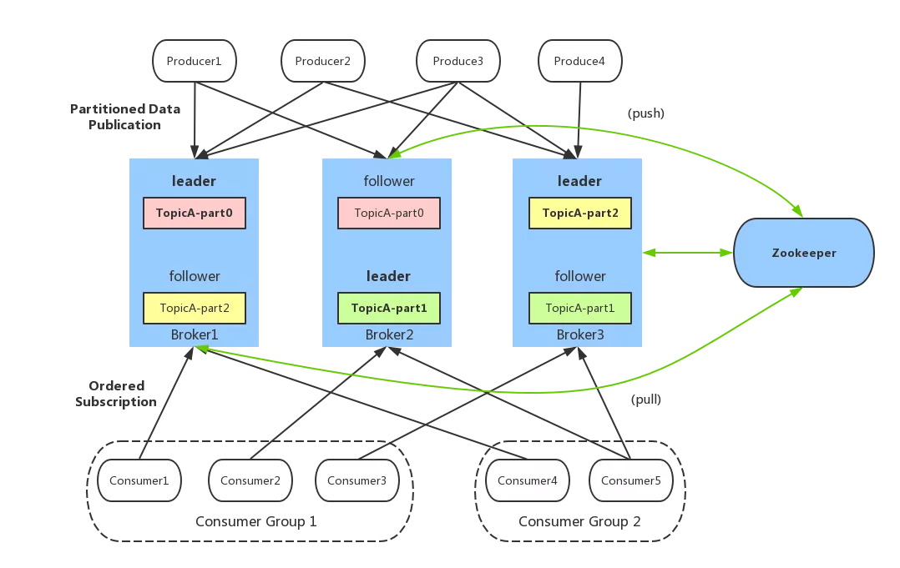
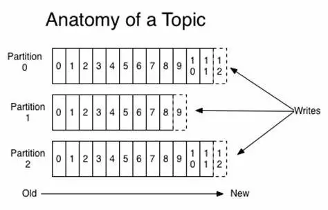
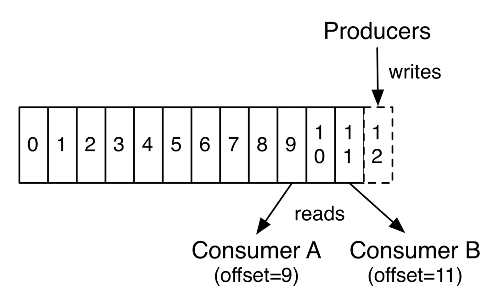
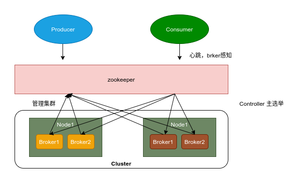
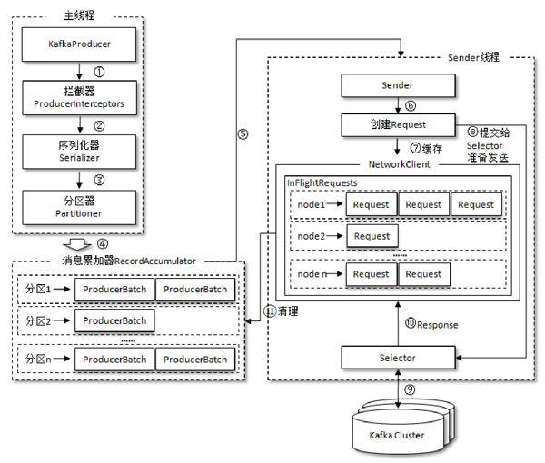
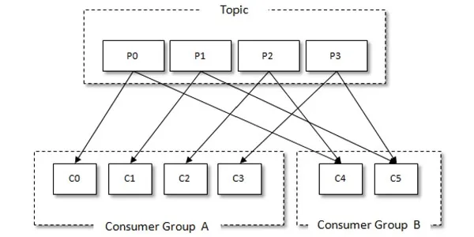
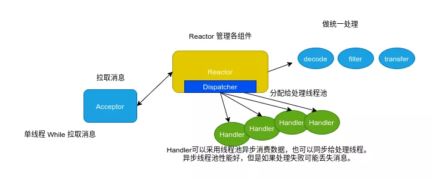
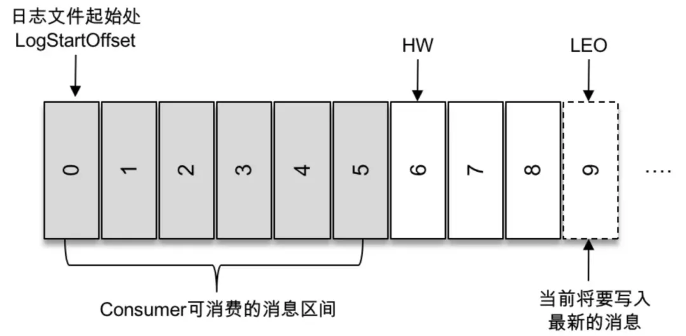
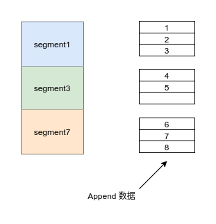

# 面试角度学习Kafka

[TOC]

<!-- START doctoc generated TOC please keep comment here to allow auto update -->
<!-- DON'T EDIT THIS SECTION, INSTEAD RE-RUN doctoc TO UPDATE -->

  - [一、Kafka 基本概念和架构](#%E4%B8%80kafka-%E5%9F%BA%E6%9C%AC%E6%A6%82%E5%BF%B5%E5%92%8C%E6%9E%B6%E6%9E%84)
    - [问题](#%E9%97%AE%E9%A2%98)
    - [zookeeper](#zookeeper)
    - [答案关键字](#%E7%AD%94%E6%A1%88%E5%85%B3%E9%94%AE%E5%AD%97)
  - [二、Kafka 使用](#%E4%BA%8Ckafka-%E4%BD%BF%E7%94%A8)
    - [问题](#%E9%97%AE%E9%A2%98-1)
    - [命令行工具](#%E5%91%BD%E4%BB%A4%E8%A1%8C%E5%B7%A5%E5%85%B7)
    - [Kafka Producer](#kafka-producer)
    - [Kafka Consumer](#kafka-consumer)
      - [Kafka consumer 参数](#kafka-consumer-%E5%8F%82%E6%95%B0)
      - [Kafka Rebalance](#kafka-rebalance)
    - [答案关键字](#%E7%AD%94%E6%A1%88%E5%85%B3%E9%94%AE%E5%AD%97-1)
  - [三、高可用和性能](#%E4%B8%89%E9%AB%98%E5%8F%AF%E7%94%A8%E5%92%8C%E6%80%A7%E8%83%BD)
    - [问题](#%E9%97%AE%E9%A2%98-2)
    - [分区与副本](#%E5%88%86%E5%8C%BA%E4%B8%8E%E5%89%AF%E6%9C%AC)
    - [性能优化](#%E6%80%A7%E8%83%BD%E4%BC%98%E5%8C%96)
      - [Partition 并发](#partition-%E5%B9%B6%E5%8F%91)
      - [顺序读写](#%E9%A1%BA%E5%BA%8F%E8%AF%BB%E5%86%99)
    - [答案关键字](#%E7%AD%94%E6%A1%88%E5%85%B3%E9%94%AE%E5%AD%97-2)

<!-- END doctoc generated TOC please keep comment here to allow auto update -->

## 一、Kafka 基本概念和架构

### 问题

- 简单讲下 Kafka 的架构？
- Kafka 是推模式还是拉模式，推拉的区别是什么？
- Kafka 如何广播消息？
- Kafka 的消息是否是有序的？
- Kafka 是否支持读写分离？
- Kafka 如何保证数据高可用？
- Kafka 中 zookeeper 的作用？
- 是否支持事务？
- 分区数是否可以减少？

**Kafka 架构中的一般概念：**

- Producer：生产者，也就是发送消息的一方。生产者负责创建消息，然后将其发送到 Kafka。
- Consumer：消费者，也就是接受消息的一方。消费者连接到 Kafka 上并接收消息，进而进行相应的业务逻辑处理。
- Consumer Group：一个消费者组可以包含一个或多个消费者。使用多分区 + 多消费者方式可以极大提高数据下游的处理速度，同一消费组中的消费者不会重复消费消息，同样的，不同消费组中的消费者消费消息时互不影响。Kafka 就是通过消费组的方式来实现消息 P2P 模式和广播模式。
- Broker：服务代理节点。Broker 是 Kafka 的服务节点，即 Kafka 的服务器。
- Topic：Kafka 中的消息以 Topic 为单位进行划分，生产者将消息发送到特定的 Topic，而消费者负责订阅 Topic 的消息并进行消费。
- Partition：Topic 是一个逻辑的概念，它可以细分为多个分区，每个分区只属于单个主题。同一个主题下不同分区包含的消息是不同的，分区在存储层面可以看作一个可追加的日志（Log）文件，消息在被追加到分区日志文件的时候都会分配一个特定的偏移量（offset）。
- Offset：offset 是消息在分区中的唯一标识，Kafka 通过它来保证消息在分区内的顺序性，不过 offset 并不跨越分区，也就是说，Kafka 保证的是分区有序性而不是主题有序性。
- Replication：副本，是 Kafka 保证数据高可用的方式，Kafka 同一 Partition 的数据可以在多 Broker 上存在多个副本，通常**只有主副本对外提供读写服务**，当主副本所在 broker 崩溃或发生网络一场，Kafka 会在 Controller 的管理下会重新选择新的 Leader 副本对外提供读写服务。
- Record：实际写入 Kafka 中并可以被读取的消息记录。每个 record 包含了 key、value 和 timestamp。

**Kafka Topic Partitions Layout**

Kafka 将 Topic 进行分区，分区可以并发读写。

**Kafka Consumer Offset**

### zookeeper

- Broker 注册：Broker 是分布式部署并且之间相互独立，Zookeeper 用来管理注册到集群的所有 Broker 节点。
- Topic 注册：在 Kafka 中，同一个 Topic 的消息会被分成多个分区并将其分布在多个 Broker 上，这些分区信息及与 Broker 的对应关系也都是由 Zookeeper 在维护
- 生产者负载均衡：由于同一个 Topic 消息会被分区并将其分布在多个 Broker 上，因此，生产者需要将消息合理地发送到这些分布式的 Broker 上。
- 消费者负载均衡：与生产者类似，Kafka 中的消费者同样需要进行负载均衡来实现多个消费者合理地从对应的 Broker 服务器上接收消息，每个消费者分组包含若干消费者，每条消息都只会发送给分组中的一个消费者，不同的消费者分组消费自己特定的 Topic 下面的消息，互不干扰。

### 答案关键字

- 简单讲下 Kafka 的架构？

  > Producer、Consumer、Consumer Group、Topic、Partition

- Kafka 是推模式还是拉模式，推拉的区别是什么？

  > Kafka Producer 向 Broker 发送消息使用 Push 模式，Consumer 消费采用的 Pull 模式。拉取模式，让 consumer 自己管理 offset，可以提供读取性能

- Kafka 如何广播消息？

  > Consumer group

- Kafka 的消息是否是有序的？

  > Topic 级别无序，Partition 有序

- Kafka 是否支持读写分离？

  > 不支持，只有 Leader 对外提供读写服务

- Kafka 如何保证数据高可用？

  > 副本，ack，HW

- Kafka 中 zookeeper 的作用？

  > 集群管理，元数据管理

- 是否支持事务？

  > 0.11 后支持事务，可以实现”exactly once“

- 分区数是否可以减少？

  > 不可以，会丢失数据

## 二、Kafka 使用

### 问题

- Kafka 有哪些命令行工具？你用过哪些？
- Kafka Producer 的执行过程？
- Kafka Producer 有哪些常见配置？
- 如何让 Kafka 的消息有序？
- Producer 如何保证数据发送不丢失？
- 如何提升 Producer 的性能？
- 如果同一 group 下 consumer 的数量大于 part 的数量，kafka 如何处理？
- Kafka Consumer 是否是线程安全的？
- 讲一下你使用 Kafka Consumer 消费消息时的线程模型，为何如此设计？
- Kafka Consumer 的常见配置？
- Consumer 什么时候会被踢出集群？
- 当有 Consumer 加入或退出时，Kafka 会作何反应？
- 什么是 Rebalance，何时会发生 Rebalance？

### 命令行工具

Kafka 的命令行工具在 Kafka 包的`/bin`目录下，主要包括服务和集群管理脚本，配置脚本，信息查看脚本，Topic 脚本，客户端脚本等。

- kafka-configs.sh：配置管理脚本
- kafka-console-consumer.sh：kafka 消费者控制台
- kafka-console-producer.sh：kafka 生产者控制台
- kafka-consumer-groups.sh：kafka 消费者组相关信息
- kafka-delete-records.sh：删除低水位的日志文件
- kafka-log-dirs.sh：kafka 消息日志目录信息
- kafka-mirror-maker.sh：不同数据中心 kafka 集群复制工具
- kafka-preferred-replica-election.sh：触发 preferred replica 选举
- kafka-producer-perf-test.sh：kafka 生产者性能测试脚本
- kafka-reassign-partitions.sh：分区重分配脚本
- kafka-replica-verification.sh：复制进度验证脚本
- kafka-server-start.sh：启动 kafka 服务
- kafka-server-stop.sh：停止 kafka 服务
- kafka-topics.sh：topic 管理脚本
- kafka-verifiable-consumer.sh：可检验的 kafka 消费者
- kafka-verifiable-producer.sh：可检验的 kafka 生产者
- zookeeper-server-start.sh：启动 zk 服务
- zookeeper-server-stop.sh：停止 zk 服务
- zookeeper-shell.sh：zk 客户端

我们通常可以使用`kafka-console-consumer.sh`和`kafka-console-producer.sh`脚本来测试 Kafka 生产和消费，`kafka-consumer-groups.sh`可以查看和管理集群中的 Topic，`kafka-topics.sh`通常用于查看 Kafka 的消费组情况。

### Kafka Producer

Kafka producer 的正常生产逻辑包含以下几个步骤：

1. 配置生产者客户端参数常见生产者实例。
2. 构建待发送的消息。
3. 发送消息。
4. 关闭生产者实例。

Producer 发送消息的过程如下图所示，需要经过`拦截器`，`序列化器`和`分区器`，最终由`累加器`批量发送至 Broker。

Kafka Producer 需要以下必要参数：

- bootstrap.server：指定 Kafka 的 Broker 的地址
- key.serializer：key 序列化器
- value.serializer：value 序列化器

常见参数：

- batch.num.messages

  > 默认值：200，每次批量消息的数量，只对 asyc 起作用。

- request.required.acks

  > 默认值：0，0 表示 producer 毋须等待 leader 的确认，1 代表需要 leader 确认写入它的本地 log 并立即确认，-1 代表所有的备份都完成后确认。只对 async 模式起作用，这个参数的调整是数据不丢失和发送效率的 tradeoff，如果对数据丢失不敏感而在乎效率的场景可以考虑设置为 0，这样可以大大提高 producer 发送数据的效率。

- request.timeout.ms

  > 默认值：10000，确认超时时间。

- partitioner.class

  > 默认值：kafka.producer.DefaultPartitioner，必须实现 kafka.producer.Partitioner，根据 Key 提供一个分区策略。*有时候我们需要相同类型的消息必须顺序处理，这样我们就必须自定义分配策略，从而将相同类型的数据分配到同一个分区中。*

- producer.type

  > 默认值：sync，指定消息发送是同步还是异步。异步 asyc 成批发送用 kafka.producer.AyncProducer， 同步 sync 用 kafka.producer.SyncProducer。同步和异步发送也会影响消息生产的效率。

- compression.topic

  > 默认值：none，消息压缩，默认不压缩。其余压缩方式还有，"gzip"、"snappy"和"lz4"。对消息的压缩可以极大地减少网络传输量、降低网络 IO，从而提高整体性能。

- compressed.topics

  > 默认值：null，在设置了压缩的情况下，可以指定特定的 topic 压缩，未指定则全部压缩。

- message.send.max.retries

  > 默认值：3，消息发送最大尝试次数。

- retry.backoff.ms

  > 默认值：300，每次尝试增加的额外的间隔时间。

- topic.metadata.refresh.interval.ms

  > 默认值：600000，定期的获取元数据的时间。当分区丢失，leader 不可用时 producer 也会主动获取元数据，如果为 0，则每次发送完消息就获取元数据，不推荐。如果为负值，则只有在失败的情况下获取元数据。

- queue.buffering.max.ms

  > 默认值：5000，在 producer queue 的缓存的数据最大时间，仅仅 for asyc。

- queue.buffering.max.message

  > 默认值：10000，producer 缓存的消息的最大数量，仅仅 for asyc。

- queue.enqueue.timeout.ms

  > 默认值：-1，0 当 queue 满时丢掉，负值是 queue 满时 block, 正值是 queue 满时 block 相应的时间，仅仅 for asyc。

### Kafka Consumer

Kafka 有消费组的概念，每个消费者只能消费所分配到的分区的消息，每一个分区只能被一个消费组中的一个消费者所消费，所以同一个消费组中消费者的数量如果超过了分区的数量，将会出现有些消费者分配不到消费的分区。消费组与消费者关系如下图所示：

Kafka Consumer Client 消费消息通常包含以下步骤：

1. 配置客户端，创建消费者
2. 订阅主题
3. 拉去消息并消费
4. 提交消费位移
5. 关闭消费者实例

因为 Kafka 的 Consumer 客户端是线程不安全的，为了保证线程安全，并提升消费性能，可以在 Consumer 端采用类似 Reactor 的线程模型来消费数据。

#### Kafka consumer 参数

- bootstrap.servers：连接 broker 地址，`host：port` 格式。
- group.id：消费者隶属的消费组。
- key.deserializer：与生产者的`key.serializer`对应，key 的反序列化方式。
- value.deserializer：与生产者的`value.serializer`对应，value 的反序列化方式。
- session.timeout.ms：coordinator 检测失败的时间。默认 10s 该参数是 Consumer Group 主动检测 （组内成员 comsummer) 崩溃的时间间隔，类似于心跳过期时间。
- auto.offset.reset：该属性指定了消费者在读取一个没有偏移量后者偏移量无效（消费者长时间失效当前的偏移量已经过时并且被删除了）的分区的情况下，应该作何处理，默认值是 latest，也就是从最新记录读取数据（消费者启动之后生成的记录），另一个值是 earliest，意思是在偏移量无效的情况下，消费者从起始位置开始读取数据。
- enable.auto.commit：否自动提交位移，如果为`false`，则需要在程序中手动提交位移。对于精确到一次的语义，最好手动提交位移
- fetch.max.bytes：单次拉取数据的最大字节数量
- max.poll.records：单次 poll 调用返回的最大消息数，如果处理逻辑很轻量，可以适当提高该值。但是`max.poll.records`条数据需要在在 session.timeout.ms 这个时间内处理完 。默认值为 500
- request.timeout.ms：一次请求响应的最长等待时间。如果在超时时间内未得到响应，kafka 要么重发这条消息，要么超过重试次数的情况下直接置为失败。

#### Kafka Rebalance

rebalance 本质上是一种协议，规定了一个 consumer group 下的所有 consumer 如何达成一致来分配订阅 topic 的每个分区。比如某个 group 下有 20 个 consumer，它订阅了一个具有 100 个分区的 topic。正常情况下，Kafka 平均会为每个 consumer 分配 5 个分区。这个分配的过程就叫 rebalance。

**什么时候 rebalance？**

这也是经常被提及的一个问题。rebalance 的触发条件有三种：

- 组成员发生变更（新 consumer 加入组、已有 consumer 主动离开组或已有 consumer 崩溃了——这两者的区别后面会谈到）
- 订阅主题数发生变更
- 订阅主题的分区数发生变更

**如何进行组内分区分配？**

Kafka 默认提供了两种分配策略：Range 和 Round-Robin。当然 Kafka 采用了可插拔式的分配策略，你可以创建自己的分配器以实现不同的分配策略。

### 答案关键字

- Kafka 有哪些命令行工具？你用过哪些？`/bin`目录，管理 kafka 集群、管理 topic、生产和消费 kafka
- Kafka Producer 的执行过程？拦截器，序列化器，分区器和累加器
- Kafka Producer 有哪些常见配置？broker 配置，ack 配置，网络和发送参数，压缩参数，ack 参数
- 如何让 Kafka 的消息有序？Kafka 在 Topic 级别本身是无序的，只有 partition 上才有序，所以为了保证处理顺序，可以自定义分区器，将需顺序处理的数据发送到同一个 partition
- Producer 如何保证数据发送不丢失？ack 机制，重试机制
- 如何提升 Producer 的性能？批量，异步，压缩
- 如果同一 group 下 consumer 的数量大于 part 的数量，kafka 如何处理？多余的 Part 将处于无用状态，不消费数据
- Kafka Consumer 是否是线程安全的？不安全，单线程消费，多线程处理
- 讲一下你使用 Kafka Consumer 消费消息时的线程模型，为何如此设计？拉取和处理分离
- Kafka Consumer 的常见配置？broker, 网络和拉取参数，心跳参数
- Consumer 什么时候会被踢出集群？奔溃，网络异常，处理时间过长提交位移超时
- 当有 Consumer 加入或退出时，Kafka 会作何反应？进行 Rebalance
- 什么是 Rebalance，何时会发生 Rebalance？topic 变化，consumer 变化

## 三、高可用和性能

### 问题

- Kafka 如何保证高可用？
- Kafka 的交付语义？
- Replic 的作用？
- 什么事 AR，ISR？
- Leader 和 Flower 是什么？
- Kafka 中的 HW、LEO、LSO、LW 等分别代表什么？
- Kafka 为保证优越的性能做了哪些处理？

### 分区与副本

在分布式数据系统中，通常使用分区来提高系统的处理能力，通过副本来保证数据的高可用性。多分区意味着并发处理的能力，这多个副本中，只有一个是 leader，而其他的都是 follower 副本。仅有 leader 副本可以对外提供服务。多个 follower 副本通常存放在和 leader 副本不同的 broker 中。通过这样的机制实现了高可用，当某台机器挂掉后，其他 follower 副本也能迅速”转正“，开始对外提供服务。

**为什么 follower 副本不提供读服务？**

这个问题本质上是对性能和一致性的取舍。试想一下，如果 follower 副本也对外提供服务那会怎么样呢？首先，性能是肯定会有所提升的。但同时，会出现一系列问题。类似数据库事务中的幻读，脏读。比如你现在写入一条数据到 kafka 主题 a，消费者 b 从主题 a 消费数据，却发现消费不到，因为消费者 b 去读取的那个分区副本中，最新消息还没写入。而这个时候，另一个消费者 c 却可以消费到最新那条数据，因为它消费了 leader 副本。Kafka 通过 WH 和 Offset 的管理来决定 Consumer 可以消费哪些数据，已经当前写入的数据。

**只有 Leader 可以对外提供读服务，那如何选举 Leader**

kafka 会将与 leader 副本保持同步的副本放到 ISR 副本集合中。当然，leader 副本是一直存在于 ISR 副本集合中的，在某些特殊情况下，ISR 副本中甚至只有 leader 一个副本。当 leader 挂掉时，kakfa 通过 zookeeper 感知到这一情况，在 ISR 副本中选取新的副本成为 leader，对外提供服务。但这样还有一个问题，前面提到过，有可能 ISR 副本集合中，只有 leader，当 leader 副本挂掉后，ISR 集合就为空，这时候怎么办呢？这时候如果设置 unclean.leader.election.enable 参数为 true，那么 kafka 会在非同步，也就是不在 ISR 副本集合中的副本中，选取出副本成为 leader。

**副本的存在就会出现副本同步问题**

Kafka 在所有分配的副本 (AR) 中维护一个可用的副本列表 (ISR)，Producer 向 Broker 发送消息时会根据`ack`配置来确定需要等待几个副本已经同步了消息才相应成功，Broker 内部会`ReplicaManager`服务来管理 flower 与 leader 之间的数据同步。

### 性能优化

- partition 并发
- 顺序读写磁盘
- page cache：按页读写
- 预读：Kafka 会将将要消费的消息提前读入内存
- 高性能序列化（二进制）
- 内存映射
- 无锁 offset 管理：提高并发能力
- Java NIO 模型
- 批量：批量读写
- 压缩：消息压缩，存储压缩，减小网络和 IO 开销

#### Partition 并发

一方面，由于不同 Partition 可位于不同机器，因此可以充分利用集群优势，实现机器间的并行处理。另一方面，由于 Partition 在物理上对应一个文件夹，即使多个 Partition 位于同一个节点，也可通过配置让同一节点上的不同 Partition 置于不同的 disk drive 上，从而实现磁盘间的并行处理，充分发挥多磁盘的优势。

#### 顺序读写

Kafka 每一个 partition 目录下的文件被平均切割成大小相等（默认一个文件是 500 兆，可以手动去设置）的数据文件， 每一个数据文件都被称为一个段（segment file）, 每个 segment 都采用 append 的方式追加数据。

### 答案关键字

- Kafka 如何保证高可用？

  > 通过副本来保证数据的高可用，producer ack、重试、自动 Leader 选举，Consumer 自平衡

- Kafka 的交付语义？

  > 交付语义一般有`at least once`、`at most once`和`exactly once`。kafka 通过 ack 的配置来实现前两种。

- Replic 的作用？

  > 实现数据的高可用

- 什么是 AR，ISR？

  > AR：Assigned Replicas。AR 是主题被创建后，分区创建时被分配的副本集合，副本个 数由副本因子决定。ISR：In-Sync Replicas。Kafka 中特别重要的概念，指代的是 AR 中那些与 Leader 保 持同步的副本集合。在 AR 中的副本可能不在 ISR 中，但 Leader 副本天然就包含在 ISR 中。关于 ISR，还有一个常见的面试题目是如何判断副本是否应该属于 ISR。目前的判断依据是：Follower 副本的 LEO 落后 Leader LEO 的时间，是否超过了 Broker 端参数 replica.lag.time.max.ms 值。如果超过了，副本就会被从 ISR 中移除。

- Kafka 中的 HW 代表什么？

  > 高水位值 (High watermark)。这是控制消费者可读取消息范围的重要字段。一 个普通消费者只能“看到”Leader 副本上介于 Log Start Offset 和 HW（不含）之间的 所有消息。水位以上的消息是对消费者不可见的。

- Kafka 为保证优越的性能做了哪些处理？

  > partition 并发、顺序读写磁盘、page cache 压缩、高性能序列化（二进制）、内存映射 无锁 offset 管理、Java NIO 模型