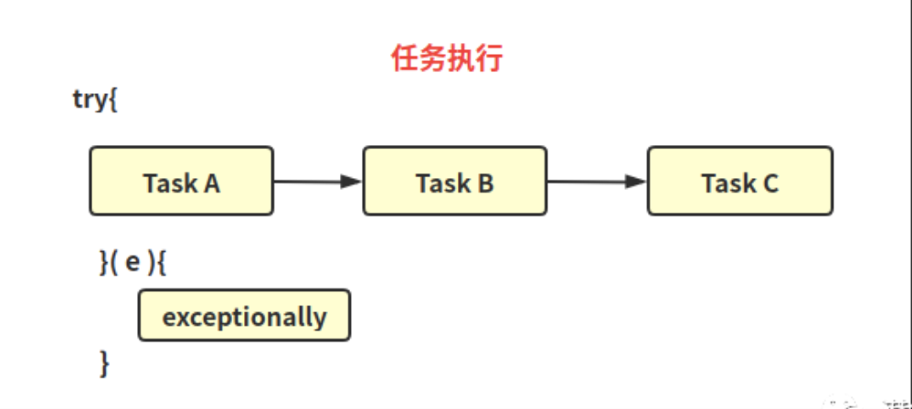
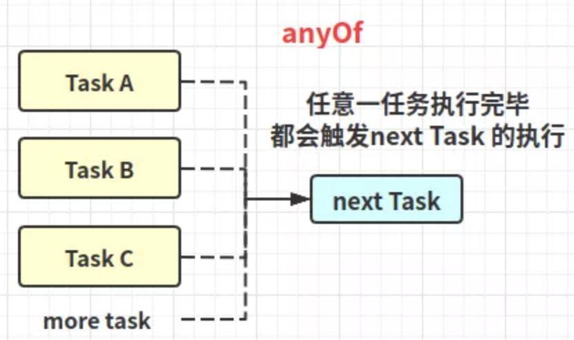
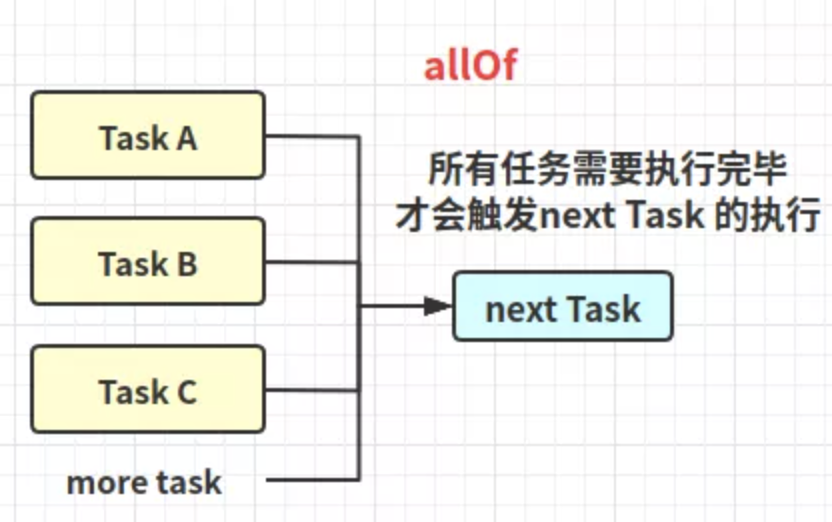

# CompeletableFuture

目录
+ [使用场景](#使用场景)
+ [创建异步线程任务](#创建异步线程任务)
+ [线程串行执行](#线程串行执行)
+ [线程并行执行](#线程并行执行)
+ [线程并行执行，谁先执行完则谁触发下一任务](#线程并行执行，谁先执行完则谁触发下一任务)
+ [处理任务结果或者异常](#处理任务结果或者异常)
+ [多个任务的简单组合](#多个任务的简单组合)
+ [取消执行线程任务](#取消执行线程任务)


## 使用场景
以前需要异步执行一个任务时，一般是用Thread或者线程池Executor去创建。如果需要返回值，则是调用Executor.submit获取Future。但是多个线程存在依赖组合，我们又能怎么办？可使用同步组件CountDownLatch、CyclicBarrier等；其实有简单的方法，就是用CompletableFuture。

## 创建异步线程任务
### 根据supplier创建CompletableFuture任务
```java
 //使用内置线程ForkJoinPool.commonPool()，根据supplier构建执行任务
 public static <U> CompletableFuture<U> supplyAsync(Supplier<U> supplier)
 //指定自定义线程，根据supplier构建执行任务
 public static <U> CompletableFuture<U> supplyAsync(Supplier<U> supplier, Executor executor)
```

### 根据runnable创建CompletableFuture任务
```java
//使用内置线程ForkJoinPool.commonPool()，根据runnable构建执行任务
public static CompletableFuture<Void> runAsync(Runnable runnable)
//指定自定义线程，根据runnable构建执行任务
public static CompletableFuture<Void> runAsync(Runnable runnable, Executor executor)
```

### 使用示例
```java
public class Demo1 {
    public static void main(String[] args) {
        // 创建一个单线程线程池
        ExecutorService executor = Executors.newSingleThreadExecutor();
        CompletableFuture<Void> rFuture = CompletableFuture
                .runAsync(() -> System.out.println("hello siting"), executor);
        //supplyAsync的使用
        CompletableFuture<String> future = CompletableFuture
                .supplyAsync(() -> {
                    System.out.print("hello ");
                    return "siting";
                }, executor);

        //阻塞等待，runAsync 的future 无返回值，输出null
        System.out.println(rFuture.join());
        //阻塞等待
        String name = future.join();
        System.out.println(name);
        // 线程池需要关闭
        executor.shutdown();
    }
}
```

## 线程串行执行
### 任务完成则运行action，不关心上一个任务的结果，无返回值
```java
public CompletableFuture<Void> thenRun(Runnable action)
public CompletableFuture<Void> thenRunAsync(Runnable action)
public CompletableFuture<Void> thenRunAsync(Runnable action, Executor executor)
```

### 任务完成则运行action，依赖上一个任务的结果，无返回值
```java
public <U> CompletableFuture<U> thenApply(Function<? super T,? extends U> fn)
public <U> CompletableFuture<U> thenApplyAsync(Function<? super T,? extends U> fn)        
public <U> CompletableFuture<U> thenApplyAsync(Function<? super T,? extends U> fn, Executor executor)
```

### thenCompose - 任务完成则运行fn，依赖上一个任务的结果，有返回值
类似thenApply（区别是thenCompose的返回值是CompletionStage，thenApply则是返回 U），提供该方法为了和其他CompletableFuture任务更好地配套组合使用
```java
public <U> CompletableFuture<U> thenCompose(Function<? super T, ? extends CompletionStage<U>> fn) 
public <U> CompletableFuture<U> thenComposeAsync(Function<? super T, ? extends CompletionStage<U>> fn)
public <U> CompletableFuture<U> thenComposeAsync(Function<? super T, ? extends CompletionStage<U>> fn,
  Executor executor)        
```

### 使用示例
```java
public class Demo2 {
    /**
     * 依赖上一个任务的结果，有返回值
     * @param executor
     */
    static void method3(ExecutorService executor) {
        //第一个异步任务，常量任务
        CompletableFuture<String> f = CompletableFuture.completedFuture("OK");
        //第二个异步任务
        CompletableFuture<String> future = CompletableFuture
                .supplyAsync(() -> "hello world", executor)
                .thenComposeAsync(data -> {
                    System.out.println(data); return f; //使用第一个任务作为返回
                }, executor);
        System.out.println(future.join());
    }

    /**
     * 依赖上一个任务的结果，无返回值
     * @param executor
     */
    static void method2(ExecutorService executor) {
        CompletableFuture<String> future = CompletableFuture
                .supplyAsync(() -> "hello world", executor)
                .thenApplyAsync(data -> {
                    System.out.println(data); return "OK";
                }, executor);
        System.out.println(future.join());
    }

    /**
     * 不关心上一个任务的结果，无返回值
     * @param executor
     */
    static void method1(ExecutorService executor) {

        CompletableFuture.supplyAsync(() -> "hello 傻逼",executor)
                .thenRunAsync(() -> System.out.println("你个大傻子"),executor);
    }
}
```

## 线程并行执行
### 两个CompletableFuture[并行]执行完，然后执行action，不依赖上两个任务的结果，无返回值
```java
public CompletableFuture<Void> runAfterBoth(CompletionStage<?> other, Runnable action)
public CompletableFuture<Void> runAfterBothAsync(CompletionStage<?> other, Runnable action)
public CompletableFuture<Void> runAfterBothAsync(CompletionStage<?> other, Runnable action, Executor executor)
```

### 两个CompletableFuture[并行]执行完，然后执行action，依赖上两个任务的结果，无返回值
```java
//第一个任务完成再运行other，fn再依赖消费两个任务的结果，无返回值
public <U> CompletableFuture<Void> thenAcceptBoth(CompletionStage<? extends U> other,
        BiConsumer<? super T, ? super U> action)
//两个任务异步完成，fn再依赖消费两个任务的结果，无返回值     
public <U> CompletableFuture<Void> thenAcceptBothAsync(CompletionStage<? extends U> other,
        BiConsumer<? super T, ? super U> action)  
//两个任务异步完成（第二个任务用指定线程池执行），fn再依赖消费两个任务的结果，无返回值                
public <U> CompletableFuture<Void> thenAcceptBothAsync(CompletionStage<? extends U> other,
        BiConsumer<? super T, ? super U> action, Executor executor) 
```

### 两个CompletableFuture[并行]执行完，然后执行action，依赖上两个任务的结果，有返回值
```java
//第一个任务完成再运行other，fn再依赖消费两个任务的结果，有返回值
public <U,V> CompletableFuture<V> thenCombine(CompletionStage<? extends U> other, 
  BiFunction<? super T,? super U,? extends V> fn)
//两个任务异步完成，fn再依赖消费两个任务的结果，有返回值
public <U,V> CompletableFuture<V> thenCombineAsync(CompletionStage<? extends U> other,
        BiFunction<? super T,? super U,? extends V> fn)   
//两个任务异步完成（第二个任务用指定线程池执行），fn再依赖消费两个任务的结果，有返回值        
public <U,V> CompletableFuture<V> thenCombineAsync(CompletionStage<? extends U> other,
        BiFunction<? super T,? super U,? extends V> fn, Executor executor)
```

### 使用示例
```java
public class Demo3 {
    /**
     * 两个CompletableFuture[并行]执行完，然后执行action，依赖上两个任务的结果，有返回值
     * @param executor
     */
    static void method3(ExecutorService executor) {
        //第一个异步任务，常量任务
        CompletableFuture<String> first = CompletableFuture.completedFuture("hello world");
        CompletableFuture<String> future = CompletableFuture
                //第二个异步任务
                .supplyAsync(() -> "hello 傻逼", executor)
                // (w, s) -> System.out.println(s) 是第三个任务
                .thenCombineAsync(first, (s, w) -> {
                    System.out.println(s);
                    System.out.println(w);
                    return "OK";
                }, executor);
        System.out.println(future.join());
    }

    /**
     * 两个CompletableFuture[并行]执行完，然后执行action，依赖上两个任务的结果，无返回值
     * @param executor
     */
    static void method2(ExecutorService executor) {
        //第一个异步任务，常量任务
        CompletableFuture<String> first = CompletableFuture.completedFuture("hello world");
        CompletableFuture<Void> future = CompletableFuture
                //第二个异步任务
                .supplyAsync(() -> "hello 傻逼", executor)
                // (w, s) -> System.out.println(s) 是第三个任务
                .thenAcceptBothAsync(first, (s, w) -> {
                        System.out.println(s);
                        System.out.println(w);
                    }, executor);
    }

    /**
     * 两个CompletableFuture[并行]执行完，然后执行action，不依赖上两个任务的结果，无返回值
     * @param executor
     */
    static void method1(ExecutorService executor) {
        //第一个异步任务，常量任务
        CompletableFuture<String> first = CompletableFuture.completedFuture("hello world");
        CompletableFuture<Void> future = CompletableFuture
                //第二个异步任务
                .supplyAsync(() -> "hello siting", executor)
                // () -> System.out.println("OK") 是第三个任务
                .runAfterBothAsync(first, () -> System.out.println("OK"), executor);
    }
}
```

## 线程并行执行，谁先执行完则谁触发下一任务
### 上一个任务或者other任务完成, 运行action，不依赖前一任务的结果，无返回值
```java
public CompletableFuture<Void> runAfterEither(CompletionStage<?> other, Runnable action)   
public CompletableFuture<Void> runAfterEitherAsync(CompletionStage<?> other, Runnable action)
public CompletableFuture<Void> runAfterEitherAsync(CompletionStage<?> other,
  Runnable action, Executor executor)
```

### 上一个任务或者other任务完成, 运行action，依赖最先完成任务的结果，无返回值
```java
public CompletableFuture<Void> acceptEither(CompletionStage<? extends T> other,
  Consumer<? super T> action)
public CompletableFuture<Void> acceptEitherAsync(CompletionStage<? extends T> other,
  Consumer<? super T> action, Executor executor)       
public CompletableFuture<Void> acceptEitherAsync(CompletionStage<? extends T> other,
  Consumer<? super T> action, Executor executor)
```

### 上一个任务或者other任务完成, 运行fn，依赖最先完成任务的结果，有返回值
```java
public <U> CompletableFuture<U> applyToEither(CompletionStage<? extends T> other,
  Function<? super T, U> fn) 
public <U> CompletableFuture<U> applyToEitherAsync(CompletionStage<? extends T> other,
  Function<? super T, U> fn)         
public <U> CompletableFuture<U> applyToEitherAsync(CompletionStage<? extends T> other,
  Function<? super T, U> fn, Executor executor)         
```

### 使用示例
```java
public class Demo4 {
    /**
     * 上一个任务或者other任务完成, 运行fn，依赖最先完成任务的结果，有返回值
     * @param executor
     */
    static void method3(ExecutorService executor) {
        //第一个异步任务，休眠1秒，保证最晚执行晚
        CompletableFuture<String> first = CompletableFuture.supplyAsync(()->{
            try{ Thread.sleep(1000);  }catch (Exception e){}
            return "hello 智障";
        });
        CompletableFuture<String> future = CompletableFuture
                //第二个异步任务
                .supplyAsync(() -> "hello 傻逼", executor)
                // data ->  System.out.println(data) 是第三个任务
                .applyToEitherAsync(first, data ->  {
                    System.out.println(data);
                    return "OK";
                } , executor);
        System.out.println(future.join());
    }

    /**
     * 上一个任务或者other任务完成, 运行action，依赖最先完成任务的结果，无返回值
     * @param executor
     */
    static void method2(ExecutorService executor) {
        //第一个异步任务，休眠1秒，保证最晚执行晚
        CompletableFuture<String> first = CompletableFuture.supplyAsync(()->{
            try{ Thread.sleep(1000);  }catch (Exception e){}
            return "hello 智障";
        });
        CompletableFuture<Void> future = CompletableFuture
                //第二个异步任务
                .supplyAsync(() -> "hello 傻逼", executor)
                // data ->  System.out.println(data) 是第三个任务
                .acceptEitherAsync(first, data ->  System.out.println(data) , executor);
    }

    /**
     * 上一个任务或者other任务完成, 运行action，不依赖前一任务的结果，无返回值
     * @param executor
     */
    static void method1(ExecutorService executor) {
        //第一个异步任务，休眠1秒，保证最晚执行晚
        CompletableFuture<String> first = CompletableFuture.supplyAsync(()->{
            try{ Thread.sleep(1000); } catch (Exception e){}
            System.out.println("hello 智障");
            return "hello world";
        });
        CompletableFuture<Void> future = CompletableFuture
                //第二个异步任务
                .supplyAsync(() ->{
                    System.out.println("hello 傻逼");
                    return "hello 大福";
                } , executor)
                //() ->  System.out.println("OK") 是第三个任务
                .runAfterEitherAsync(first, () ->  System.out.println("OK") , executor);
    }

}
```

## 处理任务结果或者异常
### exceptionally-处理异常


```java
public CompletableFuture<T> exceptionally(Function<Throwable, ? extends T> fn)
```

### handle-任务完成或者异常时运行fn，返回值为fn的返回
```java
public <U> CompletableFuture<U> handle(BiFunction<? super T, Throwable, ? extends U> fn) 
public <U> CompletableFuture<U> handleAsync(BiFunction<? super T, Throwable, ? extends U> fn) 
public <U> CompletableFuture<U> handleAsync(BiFunction<? super T, Throwable, ? extends U> fn, 
  Executor executor)       
```

### whenComplete-任务完成或者异常时运行action，有返回值
- whenComplete与handle的区别在于，它不参与返回结果的处理，把它当成监听器即可
- 即使异常被处理，在CompletableFuture外层，异常也会再次复现
- 使用whenCompleteAsync时，返回结果则需要考虑多线程操作问题，毕竟会出现两个线程同时操作一个结果
```java
public CompletableFuture<T> whenComplete(BiConsumer<? super T, ? super Throwable> action) 
public CompletableFuture<T> whenCompleteAsync(BiConsumer<? super T, ? super Throwable> action) 
public CompletableFuture<T> whenCompleteAsync(BiConsumer<? super T, ? super Throwable> action,
  Executor executor) 
```

### 使用示例
```java
public class Demo5 {
    /**
     * whenComplete-任务完成或者异常时运行action，有返回值：异常
     */
    static void method3() {
        CompletableFuture<AtomicBoolean> first = CompletableFuture
                .supplyAsync(() -> {
                    if (true) {  throw new RuntimeException("发生了异常弟弟"); }
                    return "hello world";
                })
                .thenApply(data -> new AtomicBoolean(false))
                .whenCompleteAsync((data,e) -> {
                    //异常捕捉处理, 但是异常还是会在外层复现
                    System.out.println(e.getMessage());
                });
        System.out.println(first.join());
    }

    /**
     * 相比exceptionally而言，即可处理上一环节的异常也可以处理其正常返回值
     * 输出结果：null 2
     */
    static void method2() {
        CompletableFuture<Integer> first = CompletableFuture
                .supplyAsync(() -> {
                    if (true) { throw new RuntimeException("发生了异常弟弟"); }
                    return "hello world";
                })
                .thenApply(data -> 1)
                .handleAsync((data,e) -> {
                    // 异常捕捉处理
                    e.printStackTrace();
                    System.out.println(data);
                    return 2;
                });
        System.out.println(first.join());
    }

    /**
     * exceptionally-处理异常
     * 如果之前的处理环节有异常问题，则会触发exceptionally的调用相当于 try...catch
     */
    static void method1() {
        CompletableFuture<Integer> first = CompletableFuture
                .supplyAsync(() -> {
                    if (true) {
                        throw new RuntimeException("发生了异常弟弟");
                    }
                    return "hello world";
                })
                .thenApply(data -> 1)
                .exceptionally(e -> {
                    e.printStackTrace(); // 异常捕捉处理，前面两个处理环节的异常都能捕获
                    return 0;
                });
    }
}
```

## 多个任务的简单组合
```java
public static CompletableFuture<Void> allOf(CompletableFuture<?>... cfs)
public static CompletableFuture<Object> anyOf(CompletableFuture<?>... cfs)
```

  
  

### 使用示例
```java
public class Demo6 {
    public static void main(String[] args) {

        //全部任务都需要执行完
        CompletableFuture<Void> future = CompletableFuture
                .allOf(CompletableFuture.completedFuture("A"),
                        CompletableFuture.completedFuture("B"));
        System.out.println(future.join());

        CompletableFuture<Object> future2 = CompletableFuture
                .anyOf(CompletableFuture.completedFuture("C"),
                        CompletableFuture.completedFuture("D"));
        //其中一个任务行完即可
        System.out.println(future2.join());
    }
}
```

## 取消执行线程任务
```java
// mayInterruptIfRunning 无影响；如果任务未完成,则返回异常
public boolean cancel(boolean mayInterruptIfRunning) 
//任务是否取消
public boolean isCancelled()
```

### 使用示例
```java
public class Demo7 {
    public static void main(String[] args) {
        CompletableFuture<Integer> future = CompletableFuture
                .supplyAsync(() -> {
                    try { Thread.sleep(1000);  } catch (Exception e) { }
                    return "hello world";
                })
                .thenApply(data -> 1);

        System.out.println("任务取消前:" + future.isCancelled());
        // 如果任务未完成,则返回异常,需要对使用exceptionally，handle 对结果处理
        future.cancel(true);
        System.out.println("任务取消后:" + future.isCancelled());
        future = future.exceptionally(e -> {
            e.printStackTrace();
            return 0;
        });
        System.out.println(future.join());
    }
}
```
