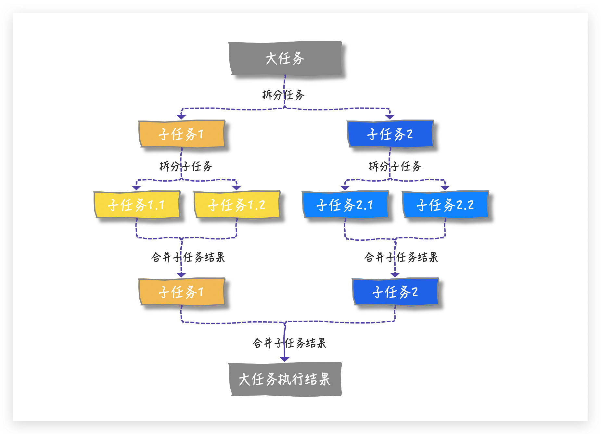
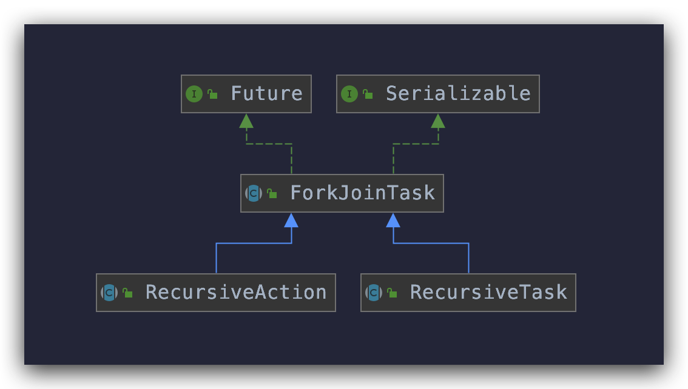
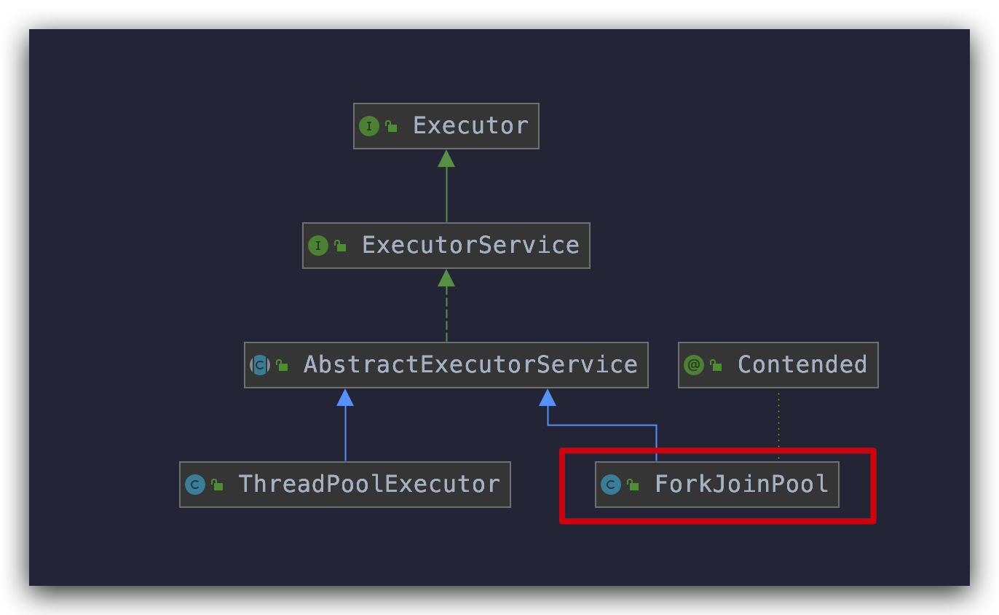
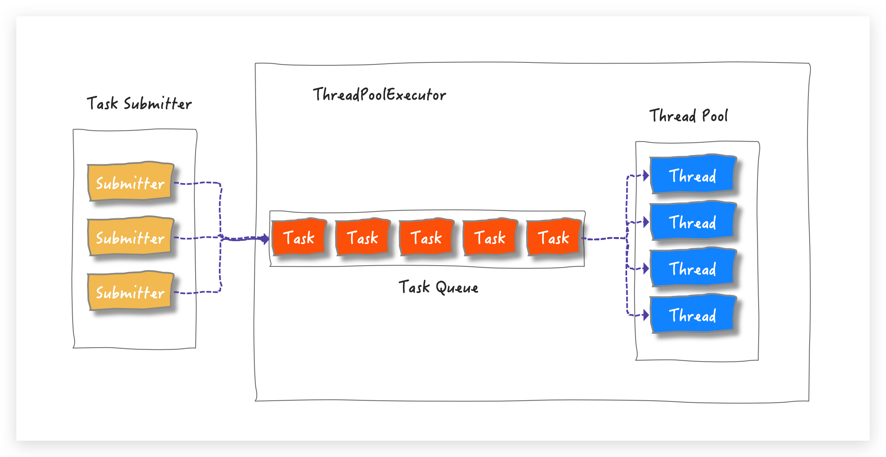
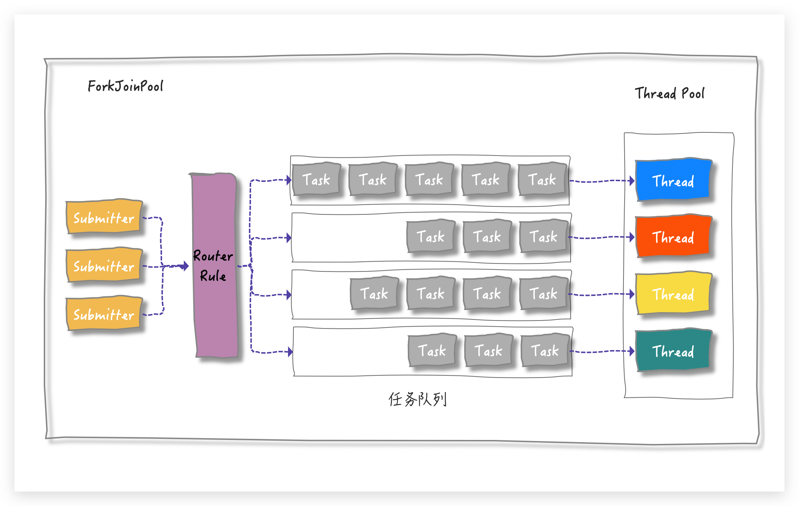
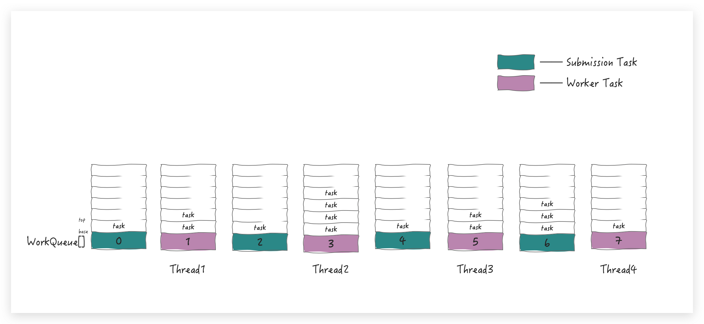
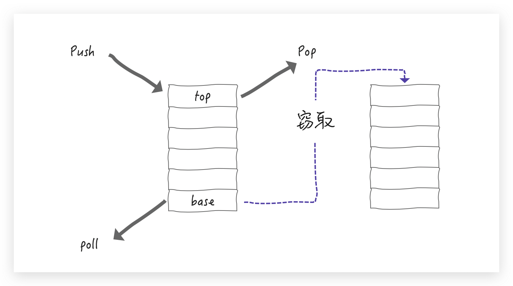

# ForkJoinPool

[TOC]

## 一、分治

### 1. 分治思想

在计算机科学中，分治法是一种很重要的算法。字面上的解释是「分而治之」，就是把一个复杂的问题**分成**两个或更多的相同或相似的**子问题**，再把子问题分成更小的子问题……直到最后子问题可以简单的直接求解，原问题的解就变成了子问题解的**合并**。



### 2. 分治法适用的情况

那所有的大任务都能用分治算法来解决吗？很显然不是的。

总体来说，分治法所能解决的问题一般具有以下几个特征：

1. 该问题的规模缩小到一定的程度就可以容易地解决
2. 该问题可以分解为若干个规模较小的相同问题，即该问题具有最优子结构性质。
3. 利用该问题分解出的子问题的解可以合并为该问题的解；
4. 该问题所分解出的各个子问题是相互独立的，即子问题之间不包含公共的子子问题

了解了分治算法的核心思想，我们就来看看 Java 是如何利用分治思想拆分与合并任务的吧


## 二、ForkJoin

有子任务，自然要用到多线程。一般而言，执行子任务的线程不允许单独创建，要用线程池管理**。秉承相同设计理念，再结合分治算法， ForkJoin 框架中就出现了 ForkJoinPool 和 ForkJoinTask。

先大致看一下这两个类：

### 1. ForkJoinTask

```java
/**
 * Abstract base class for tasks that run within a {@link ForkJoinPool}.
 * A {@code ForkJoinTask} is a thread-like entity that is much
 * lighter weight than a normal thread.  Huge numbers of tasks and
 * subtasks may be hosted by a small number of actual threads in a
 * ForkJoinPool, at the price of some usage limitations.
 *
 * @since 1.7
 * @author Doug Lea
 */
public abstract class ForkJoinTask<V> implements Future<V>, Serializable
```

可以看到 `ForkJoinTask` 实现了 `Future` 接口（那就是具有 Future 接口的特性），同样如其名，`fork()` 和 `join()` 自然是它的两个核心方法

- `fork()` : 异步执行一个子任务（上面说的拆分）
- `join()` : 阻塞当前线程等待子任务的执行结果（上面说的合并）

另外，从上面代码中可以看出，`ForkJoinTask` 是一个抽象类，在分治模型中，它还有两个抽象子类 `RecursiveAction` 和 `RecursiveTask`:



这两个子类的区别就在于**是否有返回值**，其中`RecursiveTask`是有返回值的，而`RecursiveAction`没有返回值。

```java
public abstract class RecursiveAction extends ForkJoinTask<Void>{
	...
  /**
   * The main computation performed by this task.
   */
  protected abstract void compute();
  ...
}


public abstract class RecursiveTask<V> extends ForkJoinTask<V>{
	...
  protected abstract void compute();
  ...
}
```

两个类里面都定义了一个**抽象**方法 `compute()` ，需要子类重写实现具体逻辑。

### 2. ForkJoinPool

池化既然是一类思想，Java 已经有了 `ThreadPoolExecutor` ，为什么又要搞出个 `ForkJoinPool` 呢？



借助下面这张图，先来回忆一下 ThreadPoolExecutor 的实现原理：



一眼就能看出来这是典型的`生产者/消费者`模式，**消费者线程都从一个共享的 Task Queue 中消费提交的任务**。ThreadPoolExecutor 简单的并行操作主要是为了**执行时间不确定的任务**（I/O 或定时任务等）。

分治思想其实也可以理解成一种父子任务依赖的关系，当依赖层级非常深，用 `ThreadPoolExecutor` 来处理这种关系很显然是不太现实的，所以 `ForkJoinPool` 作为功能补充就出现了。

任务拆分后有依赖关系，还得减少线程之间的竞争，那就让线程执行属于自己的 task 就可以了呗，所以较 `ThreadPoolExecutor` 的单个 TaskQueue 的形式，`ForkJoinPool` 是多个 TaskQueue的形式，简单用图来表示，就是这样滴：



有多个任务队列，所以在 ForkJoinPool 中就有一个数组形式的成员变量 `WorkQueue[]`。那问题又来了：

任务队列有多个，提交的任务放到哪个队列中呢？（上图中的 `Router Rule` 部分）

这就需要一套路由规则，从上面的代码 Demo 中可以理解，提交的任务主要有两种：

- 有外部直接提交的（**submission task**）
- 也有任务自己 fork 出来的（**worker task**）

为了进一步区分这两种 task，Doug Lea 就设计一个简单的路由规则：

- 将  `submission task` 放到 WorkQueue 数组的`「偶数」`下标中
- 将 `worker task` 放在 WorkQueue 的`「奇数」`下标中，并且只有奇数下标才有线程( worker )与之相对

应局部丰富一下上图就是这样滴：


每个任务执行时间都是不一样的（当然是在 CPU 眼里），执行快的线程的工作队列的任务就可能是空的，为了最大化利用 CPU 资源，就允许空闲线程拿取其它任务队列中的内容，这个过程就叫做 `work-stealing` (工作窃取)

当前线程要执行一个任务，其他线程还有可能过来窃取任务，这就会产生竞争，为了减少竞争，WorkQueue 就设计成了一个双端队列：

- 支持 LIFO(last-in-first-out) 的 push（放）和 pop（拿）操作——**操作 top 端**
- 支持 FIFO (first-in-first-out) 的 poll （拿）操作——**操作 base 端**

线程（worker）操作自己的 WorkQueue 默认是 LIFO 操作(可选FIFO)，当线程（worker）尝试窃取其他 WorkQueue 里的任务时，这个时候执行的是FIFO操作，即从 base 端窃取，用图丰富一下就是这样滴：



这样的好处非常明显了：

1. LIFO 操作只有对应的 worker 才能执行，push和pop不需要考虑并发
2. 拆分时，越大的任务越在WorkQueue的base端，尽早分解，能够尽快进入计算

从 WorkQueue 的成员变量的修饰符中也能看出一二了(base 有 volatile 修饰，而 top 却没有)：

```java
volatile int base;         // index of next slot for poll
int top;                   // index of next slot for push
```

到这里，相信你已经了解 ForkJoinPool 的基本实现原理了。


## 三、源码分析（JDK 1.8）

ForkJoinPool 的源码涉及到大量的位运算，会适当跳过部分。。。

结合上面的铺垫，你应该知道 ForkJoinPool 里有三个重要的角色：

- ForkJoinWorkerThread（继承 Thread）：就是我们上面说的线程（Worker）
- WorkQueue：双向的任务队列
- ForkJoinTask：Worker 执行的对象

源码分析的整个流程也是围绕这几个类的方法来说明，但在了解这三个角色之前，我们需要先了解 ForkJoinPool 都为这三个角色铺垫了哪些内容。

故事就得从 ForkJoinPool 的构造方法说起
