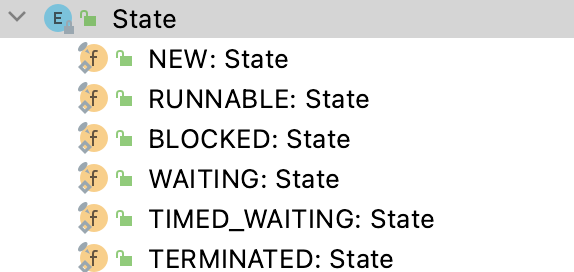

# 为什么Java线程没有Running状态

[TOC]

Java虚拟机层面所暴露给我们的状态，与操作系统底层的线程状态是两个不同层面的事。

具体而言，这里说的 Java 线程状态均来自于 Thread 类下的 State 这一内部枚举类中所定义的状态：

## 1. 什么是 RUNNABLE？

直接看它的 Javadoc 中的说明：

> 一个在 JVM 中**执行**的线程处于这一状态中。
>
> （A thread **executing** in the Java virtual machine is in this state.）

而传统的进（线）程状态一般划分如下：

程状态划分图.png)

> 注：这里的进程指早期的**单线程**进程，这里所谓进程状态实质就是线程状态。

那么 runnable 与图中的 ready 与 running 区别在哪呢？

## 2. 与传统的ready状态的区别

更具体点，javadoc 中是这样说的：

> 处于 runnable 状态下的线程正在 Java 虚拟机中执行，但它**可能正在等待**来自于操作系统的其它资源，比如处理器。
>
> A thread in the runnable state is executing in the Java virtual machine but **it may be waiting for**other resources from the operating system such as processor.

显然，runnable 状态实质上是包括了 ready 状态的。

> 甚至还可能有包括上图中的 waiting 状态的部分细分状态，在后面我们将会看到这一点

## 3. 与传统的running状态的区别

有人常觉得 Java 线程状态中还少了个 running 状态，这其实是把两个不同层面的状态混淆了。

对 Java 线程状态而言，不存在所谓的running 状态，它的 runnable 状态包含了 running 状态。

我们可能会问，为何 JVM 中没有去区分这两种状态呢？

现在的**时分**（time-sharing）**多任务**（multi-task）操作系统架构通常都是用所谓的“**时间分片**（time quantum or time slice）”方式进行**抢占式**（preemptive）轮转调度（round-robin式）。

> 更复杂的可能还会加入优先级（priority）的机制。

这个时间分片通常是很小的，一个线程一次最多只能在 cpu 上运行比如10-20ms 的时间（此时处于 running 状态），也即大概只有0.01秒这一量级，时间片用后就要被切换下来放入调度队列的末尾等待再次调度。（也即回到 ready 状态）

> 注：如果期间进行了 I/O 的操作还会导致提前释放时间分片，并进入等待队列。
>
> 又或者是时间分片没有用完就被抢占，这时也是回到 ready 状态。

这一切换的过程称为线程的**上下文切换**（context switch），当然 cpu 不是简单地把线程踢开就完了，还需要把被相应的执行状态保存到内存中以便后续的恢复执行。

显然，10-20ms 对人而言是很快的，

> 不计切换开销（每次在1ms 以内），相当于1秒内有50-100次切换。
>
> 事实上时间片经常没用完，线程就因为各种原因被中断，实际发生的切换次数还会更多。

也这正是单核 CPU 上实现所谓的“**并发**"（concurrent）”的基本原理，但其实是快速切换所带来的假象

这有点类似一个手脚非常快的杂耍演员可以让好多个球同时在空中运转那般。

> 时间分片也是可配置的，如果不追求在多个线程间很快的响应，也可以把这个时间配置得大一点，以减少切换带来的开销。
>
> 如果是多核CPU，才有可能实现真正意义上的并发，这种情况通常也叫**并行**（pararell），不过你可能也会看到这两词会被混着用，这里就不去纠结它们的区别了。

通常，Java的线程状态是服务于监控的，如果线程切换得是如此之快，那么区分 ready 与 running 就没什么太大意义了。

> 当你看到监控上显示是 running 时，对应的线程可能早就被切换下去了，甚至又再次地切换了上来，也许你只能看到 ready 与 running 两个状态在快速地闪烁。
>
> 当然，对于精确的性能评估而言，获得准确的 running 时间是有必要的。

现今主流的 JVM 实现都把 Java 线程一一映射到操作系统底层的线程上，把调度委托给了操作系统，我们在虚拟机层面看到的状态实质是对底层状态的映射及包装。

JVM 本身没有做什么实质的调度，把底层的 ready 及 running 状态映射上来也没多大意义，因此，统一成为runnable 状态是不错的选择。

> 我们将看到，Java 线程状态的改变通常只与自身显式引入的机制有关。

