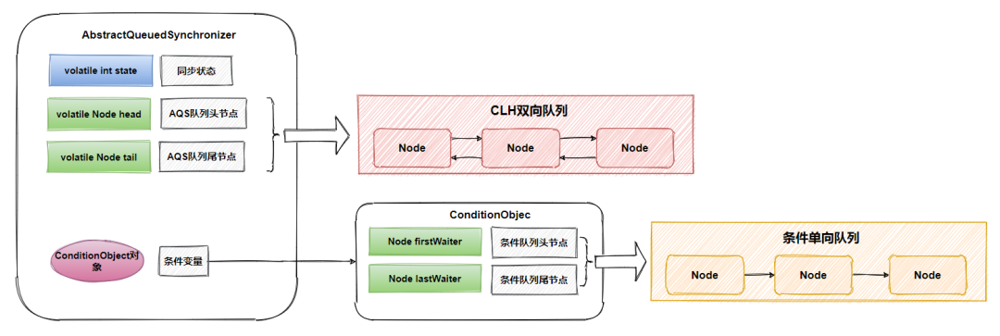
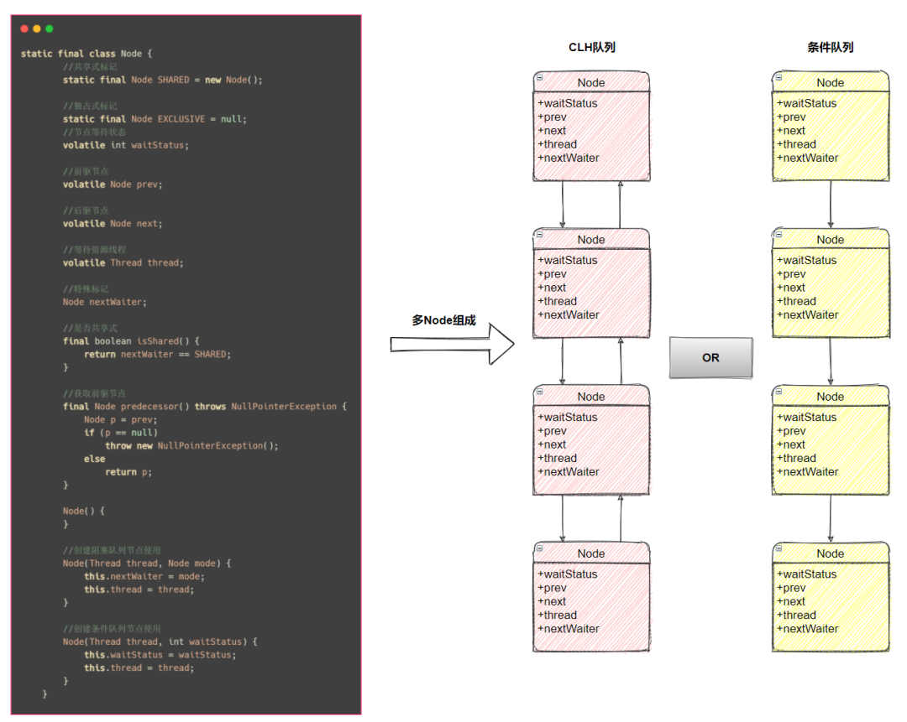
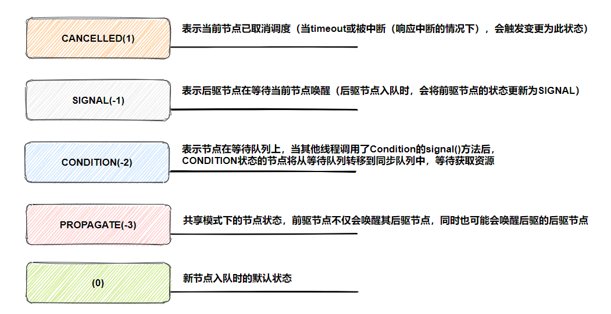
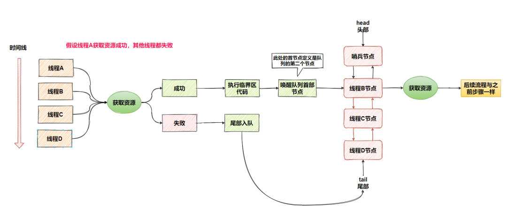
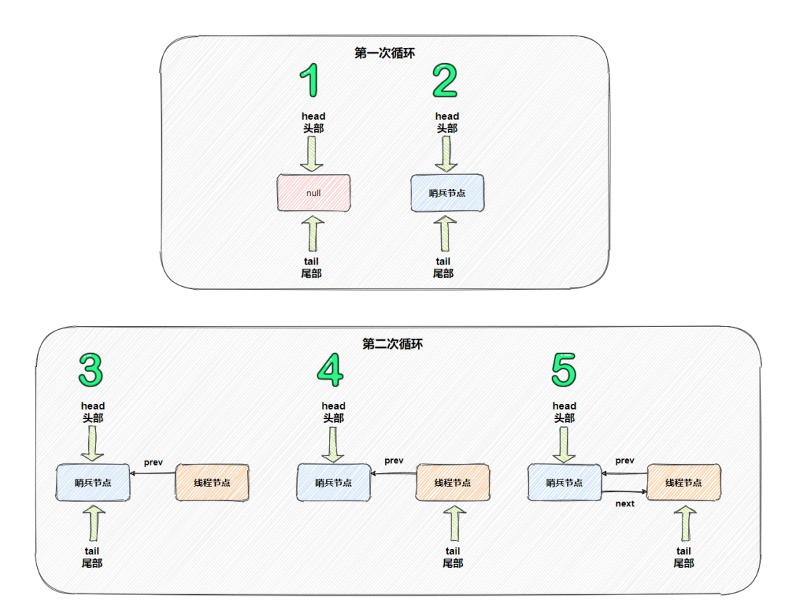
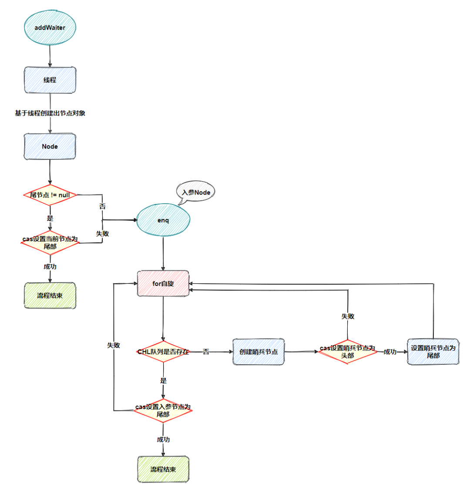
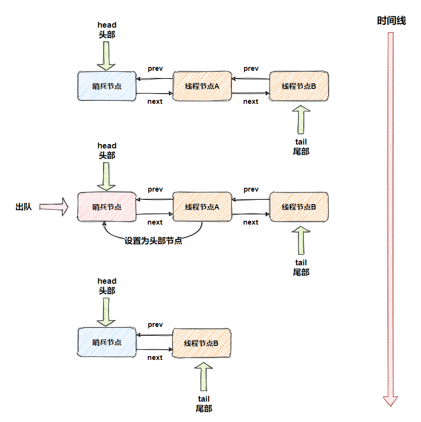
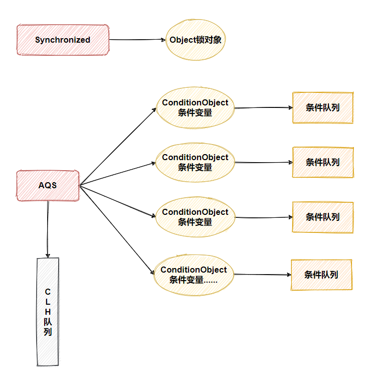
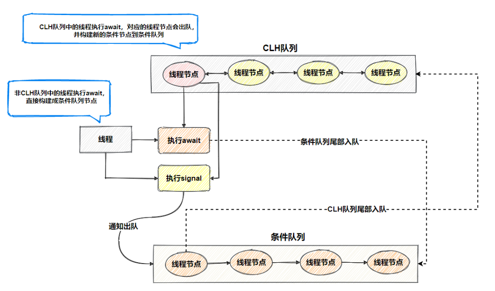

# 16张图解开AbstractQueuedSynchronizer

[TOC]

## 一、基础

`AbstractQueuedSynchronizer`抽象同步队列简称`A Q S`，它是实现同步器的基础组件，如常用的`ReentrantLock、Semaphore、CountDownLatch`等。

`A Q S`定义了一套多线程访问共享资源的同步模板，解决了实现同步器时涉及的大量细节问题，能够极大地减少实现工作，虽然大多数开发者可能永远不会使用`A Q S`实现自己的同步器（`J U C`包下提供的同步器基本足够应对日常开发），但是知道`A Q S`的原理对于架构设计还是很有帮助的，面试还可以吹吹牛，下面是`A Q S`的组成结构：



三部分组成，`state`同步状态、`Node`组成的`CLH`队列、`ConditionObject`条件变量（**包含`Node`组成的条件单向队列**），下面会分别对这三部分做介绍。

先贴下`AbstractQueuedSynchronizer`提供的核心函数，混个脸熟就够了，后面会讲解

**状态**

- `getState()`：返回同步状态
- `setState(int newState)`：设置同步状态
- `compareAndSetState(int expect, int update)`：使用`C A S`设置同步状态
- `isHeldExclusively()`：当前线程是否持有资源

**独占资源（不响应线程中断）**

- `tryAcquire(int arg)`：独占式获取资源，子类实现
- `acquire(int arg)`：独占式获取资源模板
- `tryRelease(int arg)`：独占式释放资源，子类实现
- `release(int arg)`：独占式释放资源模板

**共享资源（不响应线程中断）**

- `tryAcquireShared(int arg)`：共享式获取资源，返回值大于等于0则表示获取成功，否则获取失败，子类实现
- `acquireShared(int arg)`：共享式获取资源模板
- `tryReleaseShared(int arg)`：共享式释放资源，子类实现
- `releaseShared(int arg)`：共享式释放资源模板

这里补充下，获取独占、共享资源操作还提供超时与响应中断的扩展函数，有兴趣的读者可以去`AbstractQueuedSynchronizer`源码了解。

### 1. 同步状态

在`A Q S`中维护了一个同步状态变量`state`，`getState`函数获取同步状态，`setState、compareAndSetState`函数修改同步状态，对于`A Q S`来说，线程同步的关键是对`state`的操作，可以说获取、释放资源是否成功都是由`state`决定的，比如`state>0`代表可获取资源，否则无法获取，所以`state`的具体语义由实现者去定义，现有的`ReentrantLock、ReentrantReadWriteLock、Semaphore、CountDownLatch`定义的`state`语义都不一样。

- **`ReentrantLock`的`state`用来表示是否有锁资源**
- **`ReentrantReadWriteLock`的`state`高`16`位代表读锁状态，低`16`位代表写锁状态**
- **`Semaphore`的`state`用来表示可用信号的个数**
- **`CountDownLatch`的`state`用来表示计数器的值**

### 2. CLH队列

`CLH`是`A Q S`内部维护的`FIFO`（**先进先出**）双端双向队列（**方便尾部节点插入**），基于链表数据结构，当一个线程竞争资源失败，就会将等待资源的线程封装成一个`Node`节点，通过`C A S`原子操作插入队列尾部，最终不同的`Node`节点连接组成了一个`CLH`队列，所以说`A Q S`通过`CLH`队列管理竞争资源的线程，个人总结`CLH`队列具有如下几个优点：

- 先进先出保证了公平性
- 非阻塞的队列，通过自旋锁和`C A S`保证节点插入和移除的原子性，实现无锁快速插入
- 采用了自旋锁思想，所以`CLH`也是一种基于链表的可扩展、高性能、公平的自旋锁

#### 1. Node内部类

`Node`是`A Q S`的内部类，每个等待资源的线程都会封装成`Node`节点组成`C L H`队列、等待队列，所以说`Node`是非常重要的部分，理解它是理解`A Q S`的第一步。



`Node`类中的变量都很好理解，只有`waitStatus、nextWaiter`没有细说，下面做个补充说明：

**waitStatus等待状态如下**



**nextWaiter特殊标记**

- **`Node`在`CLH`队列时，`nextWaiter`表示共享式或独占式标记**
- **`Node`在条件队列时，`nextWaiter`表示下个`Node`节点指针**

**1. 流程概述**

线程获取资源失败，封装成`Node`节点从`C L H`队列尾部入队并阻塞线程，某线程释放资源时会把`C L H`队列首部`Node`节点关联的线程唤醒（**此处的首部是指第二个节点，后面会细说**），再次获取资源。



**2. 入队**

获取资源失败的线程需要封装成`Node`节点，接着尾部入队，在`A Q S`中提供`addWaiter`函数完成`Node`节点的创建与入队：

```java
/**
* @description:  Node节点入队-CLH队列
* @param mode 标记  Node.EXCLUSIVE独占式 or Node.SHARED共享式
*/
private Node addWaiter(Node mode) {
    //根据当前线程创建节点，等待状态为0
    Node node = new Node(Thread.currentThread(), mode);
    // 获取尾节点
    Node pred = tail;
    if (pred != null) {
      //如果尾节点不等于null，把当前节点的前驱节点指向尾节点
      node.prev = pred;
      //通过cas把尾节点指向当前节点
      if (compareAndSetTail(pred, node)) {
        //之前尾节点的下个节点指向当前节点
        pred.next = node;
        return node;
      }
    }
    //如果添加失败或队列不存在，执行enq函数
    enq(node);
    return node;
}
```

添加节点的时候，如果从`C L H`队列已经存在，通过`C A S`快速将当前节点添加到队列尾部，如果添加失败或队列不存在，则指向`enq`函数自旋入队：

```java
/**
* @description: 自旋cas入队
* @param node 节点
*/
private Node enq(final Node node) {
  for (;;) { //循环
    //获取尾节点
    Node t = tail;
    if (t == null) {
      //如果尾节点为空，创建哨兵节点，通过cas把头节点指向哨兵节点
      if (compareAndSetHead(new Node()))
        //cas成功，尾节点指向哨兵节点
        tail = head;
    } else {
      //当前节点的前驱节点设指向之前尾节点
      node.prev = t;
      //cas设置把尾节点指向当前节点
      if (compareAndSetTail(t, node)) {
        //cas成功，之前尾节点的下个节点指向当前节点
        t.next = node;
        return t;
      }
    }
  }
}
```

通过自旋`C A S`尝试往队列尾部插入节点，直到成功，自旋过程如果发现`C L H`队列不存在时会初始化`C L H`队列，入队过程流程如下图：



**第一次循环**

1. 刚开始`C L H`队列不存在，`head`与`tail`都指向`null`
2. 要初始化`C L H`队列，会创建一个哨兵节点，`head`与`tail`都指向哨兵节点

**第二次循环**

3. 当前线程节点的前驱节点指向尾部节点（哨兵节点） 
4. 设置当前线程节点为尾部，`tail`指向当前线程节点
5. 前尾部节点的后驱节点指向当前线程节点（当前尾部节点）

最后结合`addWaiter`与`enq`函数的入队流程图如下：



**3. 出队**

`C L H`队列中的节点都是获取资源失败的线程节点，当持有资源的线程释放资源时，会将`head.next`指向的线程节点唤醒（**`C L H`队列的第二个节点**），如果唤醒的线程节点获取资源成功，线程节点清空信息设置为头部节点（**新哨兵节点**），原头部节点出队（**原哨兵节点**）

**acquireQueued函数中的部分代码**

```java
//1.获取前驱节点
final Node p = node.predecessor();
//如果前驱节点是首节点，获取资源（子类实现）
if (p == head && tryAcquire(arg)) {
    //2.获取资源成功，设置当前节点为头节点，清空当前节点的信息，把当前节点变成哨兵节点
    setHead(node);
    //3.原来首节点下个节点指向为null
    p.next = null; // help GC
    //4.非异常状态，防止指向finally逻辑
    failed = false;
    //5.返回线程中断状态
    return interrupted;
}

private void setHead(Node node) {
    //节点设置为头部
    head = node;
    //清空线程
    node.thread = null;
    //清空前驱节点
    node.prev = null;
}
```

只需要关注`1~3`步骤即可，过程非常简单，假设获取资源成功，更换头部节点，并把头部节点的信息清除变成哨兵节点，注意这个过程是不需要使用`C A S`来保证，因为只有一个线程能够成功获取到资源。



#### 2. 条件变量

`Object`的`wait、notify`函数是配合`Synchronized`锁实现线程间同步协作的功能，`A Q S`的`ConditionObject`条件变量也提供这样的功能，通过`ConditionObject`的`await`和`signal`两类函数完成。

不同于`Synchronized`锁，一个`A Q S`可以对应多个条件变量，而`Synchronized`只有一个。



如上图所示，`ConditionObject`内部维护着一个单向条件队列，不同于`C H L`队列，条件队列只入队执行`await`的线程节点，并且加入条件队列的节点，不能在`C H L`队列， 条件队列出队的节点，会入队到`C H L`队列。

当某个线程执行了`ConditionObject`的`await`函数，阻塞当前线程，线程会被封装成`Node`节点添加到条件队列的末端，其他线程执行`ConditionObject`的`signal`函数，会将条件队列头部线程节点转移到`C H L`队列参与竞争资源，具体流程如下图：



最后补充下，条件队列`Node`类是使用`nextWaiter`变量指向下个节点，并且因为是单向队列，所以`prev`与`next`变量都是`null`。

## 二、进阶

