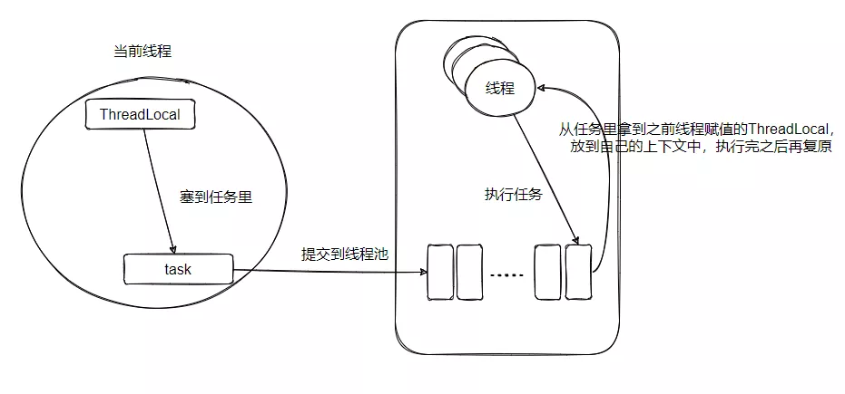
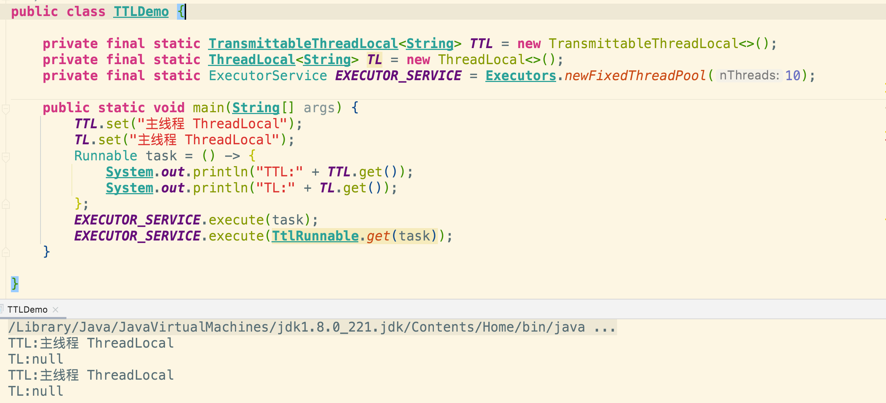
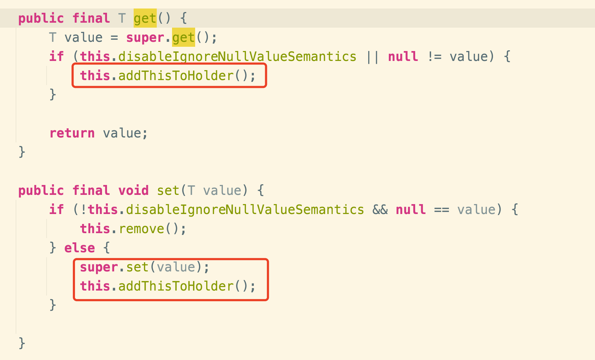

# TransmittableThreadLocal

[TOC]

## 零、开篇

任何一个组件的出现必有其缘由，知其缘由背景才能更深刻地理解它。

我们知道 ThreadLocal 的出现就是为了本地化线程资源，防止不必要的多线程之间的竞争。

在有些场景，当父线程 new 一个子线程的时候，希望把它的 ThreadLocal 继承给子线程。

这时候 InheritableThreadLocal 就来了，它就是为了父子线程传递本地化资源而提出的。

具体的实现是在子线程对象被 new 的时候，即 Thread.init 的时，如果查看到父线程内部有 InheritableThreadLocal 的数据。

那就在子 Thread 初始化的时，把父线程的 InheritableThreadLocal 拷贝给子线程。

```java
private void init(ThreadGroup g,Runnable target,String name,
                  long stackSize,AccessControlContext acc,
                  boolean inheritThreadLocals){
  // 省略部分...
  if(inheritThreadLocals&&parent.inheritableThreadLocals!=null)
    this.inheritableThreadLocals=
    ThreadLocal.createInheritedMap(parent.inheritableThreadLocals);
  // 省略部分...
}
```

就这样简单地把父线程的 ThreadLocal 数据传递给子线程了。

但是，这个场景只能发生在 new Thread 的时候！也就是手动创建线程之时！那就有个问题了，在平时我们使用的时候基本用的都是线程池。

那就麻了啊，线程池里面的线程都预创建好了，调用的时候就没法直接用 InheritableThreadLocal 了。

所以就产生了一个需求，如何往线程池内的线程传递 ThreadLocal？，JDK 的类库没这个功能，所以怎么搞？

只能我们自己造轮子了。

## 一、如何设计

需求已经明确了，但是怎么实现呢？

平时我们用线程池的话，比如你要提交任务，则使用代码如下：

```
Runnable task = new Runnable....;
executorService.submit(task);
```

> 小贴士：以下的 ThreadLocal 泛指线程本地数据，不是指 ThreadLocal 这个类

这时候，我们想着把当前线程的 ThreadLocal 传递给线程池内部将要执行这个 task 的线程。

但此时我们哪知道线程池里面的哪个线程会来执行这个任务？

所以，我们得先把当前线程的 ThreadLocal 保存到这个 task 中。

然后当线程池里的某个线程，比如线程 A 获取这个任务要执行的时候，看看 task 里面是否有存储着的 ThreadLocal 。

如果存着那就把这个 ThreadLocal 放到线程 A 的本地变量里，这样就完成了传递。

然后还有一步，也挺关键的，就是恢复线程池内部执行线程的上下文，也就是该任务执行完毕之后，把任务带来的本地数据给删了，把线程以前的本地数据复原。



设计思路应该已经很明确了吧？来看看具体需要如何实现吧！

## 二、如何实现

把上面的思路翻译过来就是：

```java
// 获取父线程的threadlocal
Object parent=THREAD_LOCAL.get();
Runnable task=()->{
  // 获取子线程的threadlocal
  Object sub=THREAD_LOCAL.get();
  try{
    // 把threadlocal的值设置为父线程的
    THREAD_LOCAL.set(parent);
    // do sth...
  }finally{
    // 最后把子线程原来的threadlocal塞回去...
    THREAD_LOCAL.set(sub);
  }
};
```

这样虽然可以实现，但是可操作性太差，耦合性太高。

所以我们得想想怎么优化一下，其实有个设计模式就很合适，那就是装饰器模式。

我们可以自己搞一个 Runnable 类，比如 MyRunnable，然后在 new MyRunnable 的时候，在构造器里面把当前线程的 threadlocal 赋值进去。

然后 run 方法那里也修饰一下，我们直接看看伪代码：

```java
public MyRunnable(Runnable runable){
  this.threadlocalCopy=copyFatherThreadlocal();
  this.runable=runable;
}

public void run(){
  // 塞入父threadlocal，并返回当前线程原先threadlocal
  Object backup=setThreadlocal(threadlocalCopy)；
    try{
      // 执行被装饰的任务逻辑
      runable.run()；
    }finally{
      // 复原当前线程的上下文
      restore(backup);
    }
}
```

使用方式如下：

```java
Runnable task=()->{...};
MyRunnable myRunnable=new MyRunnable(task);
executorService.submit(myRunnable);
```

你看，这不就实现我们上面的设计了嘛！

不过还有一个点没有揭秘，就是如何实现 `copyFatherThreadlocal`。

我们如何得知父线程现在到底有哪些 Threadlocal？并且哪些是需要上下文传递的？

所以我们还需要创建一个类来继承 Threadlocal。

比如叫 MyThreadlocal，用它声明的变量就表明需要父子传递的！

```
public class MyThreadlocal<T> extends ThreadLocal<T>
```

然后我们需要搞个地方来存储当前父线程上下文用到的所有 MyThreadlocal，这样在 `copyFatherThreadlocal`的时候我们才好遍历复制对吧？

我们可以搞个 holder 来保存这些 MyThreadlocal ，不过 holder 变量也得线程隔离。

毕竟每个线程所要使用的 MyThreadlocal 都不一样，所以需要用 ThreadLocal 来修饰 holder 。

然后 MyThreadlocal 可能会有很多，我们可以用 set 来保存。

但是为了防止我们搞的这个 holder 造成内存泄漏的风险，我们需要弱引用它，不过没有 WeakHashSet，那我们就用 WeakHashMap 来替代存储。

```
private static final ThreadLocal<WeakHashMap<MyThreadlocal<Object>, ?>> holder = new .....
```

这样我们就打造了一个变量，它是线程独有的，且又能拿来存储当前线程用到的所有 MyThreadlocal ，便于后面的复制，且又不会造成内存泄漏(弱引用)。

是不是感觉有点暂时理不清？没事，我们继续来看看具体怎么用上这个 hold ，可能会清晰些。

首先我们将需要传递给线程池的本地变量从 ThreadLocal 替换成 MyThreadlocal。

然后重写 set 方法，实现如下：

```java
@Override
public final void set(T value){
  // 调用 ThreadLocal 的 set
  super.set(value);
  // 把当前的 MyThreadlocal 对象塞入 hold 中
  addThisToHolder();
}
private void addThisToHolder(){
  if(!holder.get().containsKey(this)){
    holder.get().put((MyThreadlocal<Object>)this,null);
  }
}
```

你看这样就把所有用到的 MyThreadlocal 塞到 holder 中了，然后再来看看 copyFatherThreadlocal 应该如何实现。

```java
 private static HashMap<MyThreadlocal<Object>,Object> copyFatherThreadlocal(){
   HashMap<MyThreadlocal<Object>,Object>fatherMap=new HashMap<MyThreadlocal<Object>,Object>();
   for(MyThreadlocal<Object> threadLocal:MyThreadlocal.holder.get().keySet()){
     fatherMap.put(threadLocal,threadLocal.copyValue());
   }
   return fatherMap;
 }
```

逻辑很简单，就是一个 map 遍历拷贝。

我现在用一段话来小结一下，把上面的全部操作联合起来理解，应该会清晰很多。

**实现思路小结**

1.新建一个 MyThreadLocal 类继承自 ThreadLocal ，用于标识这个修饰的变量需要父子线程拷贝

2.新建一个 MyRunnable 类继承自 Runnable，采用装饰器模式，这样就不用修改原有的 Runnable。在构造阶段复制父线程的 MyThreadLocal 变量赋值给 MyRunnable 的一个成员变量
threadlocalCopy 保存。

3.并修饰 MyRunnable#run 方法，在真正逻辑执行前将 threadlocalCopy 赋值给当前执行线程的上下文，且保存当前线程之前的上下文，在执行完毕之后，再复原此线程的上下文。

4.由于需要在构造的时候复制所有父线程用到的 MyThreadLocal ，因此需要有个 holder 变量来保存所有用到的 MyThreadLocal ，这样在构造的时候才好遍历赋值。

5.并且 holder 变量也需要线程隔离，所以用 ThreadLocal 修饰，并且为了防止 holder 强引用导致内存泄漏，所以用 WeakHashMap 存储。

6.往 holder 添加 MyThreadLocal 的时机就在 MyThreadLocal#set 之时

## 三、TransmittableThreadLocal 的实现

> 这篇只讲 TTL 核心思想（关键路径），由于篇幅原因其它的不作展开，之后再写一篇详细的。

我上面的实现其实就是 TTL 的复制版，如果你理解了上面的实现，那么接下来对 TTL 介绍理解起来应该很简单，相当于复习了。

我们先简单看一下 TTL 的使用方式。



```java
private final static TransmittableThreadLocal<String> TTL = new TransmittableThreadLocal<>();
private final static ThreadLocal<String> TL = new ThreadLocal<>();
private final static ExecutorService EXECUTOR_SERVICE = Executors.newFixedThreadPool(10);

public static void main(String[] args) {
  TTL.set("主线程 ThreadLocal");
  TL.set("主线程 ThreadLocal");
  Runnable task = () -> {
    System.out.println("TTL:" + TTL.get());
    System.out.println("TL:" + TL.get());
  };
  EXECUTOR_SERVICE.execute(task);
  EXECUTOR_SERVICE.execute(TtlRunnable.get(task));
}
```

使用起来很简单对吧？

TTL 对标上面的 YesThreadLocal ，差别在于它继承的是 InheritableThreadLocal，因为这样直接 new TTL 也会拥有父子线程本地变量的传递能力。

```java
public class TransmittableThreadLocal<T> extends InheritableThreadLocal<T>
```

我们再来看看 TTL 的 get 和 set 这两个核心操作：



可以看到 get 和 set 其实就是复用父类 ThreadLocal 的方法，关键就在于 `addThisToHolder`，就是我上面分析的将当前使用的 TTL 对象加到 holder 里面。

