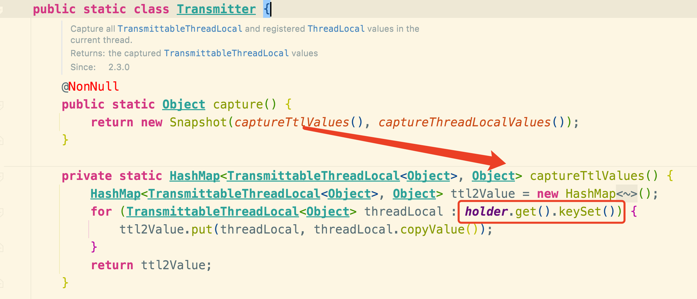

# TransmittableThreadLocal

<!-- START doctoc generated TOC please keep comment here to allow auto update -->
<!-- DON'T EDIT THIS SECTION, INSTEAD RE-RUN doctoc TO UPDATE -->

- [零、开篇](#%E9%9B%B6%E5%BC%80%E7%AF%87)
- [一、如何设计](#%E4%B8%80%E5%A6%82%E4%BD%95%E8%AE%BE%E8%AE%A1)
- [二、如何实现](#%E4%BA%8C%E5%A6%82%E4%BD%95%E5%AE%9E%E7%8E%B0)
- [三、TransmittableThreadLocal 的实现](#%E4%B8%89transmittablethreadlocal-%E7%9A%84%E5%AE%9E%E7%8E%B0)
- [四、一些用法](#%E5%9B%9B%E4%B8%80%E4%BA%9B%E7%94%A8%E6%B3%95)
- [五、总结](#%E4%BA%94%E6%80%BB%E7%BB%93)

<!-- END doctoc generated TOC please keep comment here to allow auto update -->


[TOC]

## 零、开篇

任何一个组件的出现必有其缘由，知其缘由背景才能更深刻地理解它。

我们知道 ThreadLocal 的出现就是为了本地化线程资源，防止不必要的多线程之间的竞争。

在有些场景，当父线程 new 一个子线程的时候，希望把它的 ThreadLocal 继承给子线程。

这时候 InheritableThreadLocal 就来了，它就是为了父子线程传递本地化资源而提出的。

具体的实现是在子线程对象被 new 的时候，即 Thread.init 的时，如果查看到父线程内部有 InheritableThreadLocal 的数据。

那就在子 Thread 初始化的时，把父线程的 InheritableThreadLocal 拷贝给子线程。

```java
private void init(ThreadGroup g,Runnable target,String name,
        long stackSize,AccessControlContext acc,
        boolean inheritThreadLocals){
        // 省略部分...
        if(inheritThreadLocals&&parent.inheritableThreadLocals!=null)
        this.inheritableThreadLocals=
        ThreadLocal.createInheritedMap(parent.inheritableThreadLocals);
        // 省略部分...
        }
```

就这样简单地把父线程的 ThreadLocal 数据传递给子线程了。

但是，这个场景只能发生在 new Thread 的时候！也就是手动创建线程之时！那就有个问题了，在平时我们使用的时候基本用的都是线程池。

那就麻了啊，线程池里面的线程都预创建好了，调用的时候就没法直接用 InheritableThreadLocal 了。

所以就产生了一个需求，如何往线程池内的线程传递 ThreadLocal？，JDK 的类库没这个功能，所以怎么搞？

只能我们自己造轮子了。

## 一、如何设计

需求已经明确了，但是怎么实现呢？

平时我们用线程池的话，比如你要提交任务，则使用代码如下：

```
Runnable task = new Runnable....;
executorService.submit(task);
```

> 小贴士：以下的 ThreadLocal 泛指线程本地数据，不是指 ThreadLocal 这个类

这时候，我们想着把当前线程的 ThreadLocal 传递给线程池内部将要执行这个 task 的线程。

但此时我们哪知道线程池里面的哪个线程会来执行这个任务？

所以，我们得先把当前线程的 ThreadLocal 保存到这个 task 中。

然后当线程池里的某个线程，比如线程 A 获取这个任务要执行的时候，看看 task 里面是否有存储着的 ThreadLocal 。

如果存着那就把这个 ThreadLocal 放到线程 A 的本地变量里，这样就完成了传递。

然后还有一步，也挺关键的，就是恢复线程池内部执行线程的上下文，也就是该任务执行完毕之后，把任务带来的本地数据给删了，把线程以前的本地数据复原。


设计思路应该已经很明确了吧？来看看具体需要如何实现吧！

## 二、如何实现

把上面的思路翻译过来就是：

```java
// 获取父线程的threadlocal
Object parent=THREAD_LOCAL.get();
        Runnable task=()->{
        // 获取子线程的threadlocal
        Object sub=THREAD_LOCAL.get();
        try{
        // 把threadlocal的值设置为父线程的
        THREAD_LOCAL.set(parent);
        // do sth...
        }finally{
        // 最后把子线程原来的threadlocal塞回去...
        THREAD_LOCAL.set(sub);
        }
        };
```

这样虽然可以实现，但是可操作性太差，耦合性太高。

所以我们得想想怎么优化一下，其实有个设计模式就很合适，那就是装饰器模式。

我们可以自己搞一个 Runnable 类，比如 MyRunnable，然后在 new MyRunnable 的时候，在构造器里面把当前线程的 threadlocal 赋值进去。

然后 run 方法那里也修饰一下，我们直接看看伪代码：

```java
public MyRunnable(Runnable runable){
        this.threadlocalCopy=copyFatherThreadlocal();
        this.runable=runable;
        }

public void run(){
        // 塞入父threadlocal，并返回当前线程原先threadlocal
        Object backup=setThreadlocal(threadlocalCopy)；
        try{
        // 执行被装饰的任务逻辑
        runable.run()；
        }finally{
        // 复原当前线程的上下文
        restore(backup);
        }
        }
```

使用方式如下：

```java
Runnable task=()->{...};
        MyRunnable myRunnable=new MyRunnable(task);
        executorService.submit(myRunnable);
```

你看，这不就实现我们上面的设计了嘛！

不过还有一个点没有揭秘，就是如何实现 `copyFatherThreadlocal`。

我们如何得知父线程现在到底有哪些 Threadlocal？并且哪些是需要上下文传递的？

所以我们还需要创建一个类来继承 Threadlocal。

比如叫 MyThreadlocal，用它声明的变量就表明需要父子传递的！

```
public class MyThreadlocal<T> extends ThreadLocal<T>
```

然后我们需要搞个地方来存储当前父线程上下文用到的所有 MyThreadlocal，这样在 `copyFatherThreadlocal`的时候我们才好遍历复制对吧？

我们可以搞个 holder 来保存这些 MyThreadlocal ，不过 holder 变量也得线程隔离。

毕竟每个线程所要使用的 MyThreadlocal 都不一样，所以需要用 ThreadLocal 来修饰 holder 。

然后 MyThreadlocal 可能会有很多，我们可以用 set 来保存。

但是为了防止我们搞的这个 holder 造成内存泄漏的风险，我们需要弱引用它，不过没有 WeakHashSet，那我们就用 WeakHashMap 来替代存储。

```
private static final ThreadLocal<WeakHashMap<MyThreadlocal<Object>, ?>> holder = new .....
```

这样我们就打造了一个变量，它是线程独有的，且又能拿来存储当前线程用到的所有 MyThreadlocal ，便于后面的复制，且又不会造成内存泄漏(弱引用)。

是不是感觉有点暂时理不清？没事，我们继续来看看具体怎么用上这个 hold ，可能会清晰些。

首先我们将需要传递给线程池的本地变量从 ThreadLocal 替换成 MyThreadlocal。

然后重写 set 方法，实现如下：

```java
@Override
public final void set(T value){
        // 调用 ThreadLocal 的 set
        super.set(value);
        // 把当前的 MyThreadlocal 对象塞入 hold 中
        addThisToHolder();
        }
private void addThisToHolder(){
        if(!holder.get().containsKey(this)){
        holder.get().put((MyThreadlocal<Object>)this,null);
        }
        }
```

你看这样就把所有用到的 MyThreadlocal 塞到 holder 中了，然后再来看看 copyFatherThreadlocal 应该如何实现。

```java
 private static HashMap<MyThreadlocal<Object>,Object>copyFatherThreadlocal(){
        HashMap<MyThreadlocal<Object>,Object>fatherMap=new HashMap<MyThreadlocal<Object>,Object>();
        for(MyThreadlocal<Object> threadLocal:MyThreadlocal.holder.get().keySet()){
        fatherMap.put(threadLocal,threadLocal.copyValue());
        }
        return fatherMap;
        }
```

逻辑很简单，就是一个 map 遍历拷贝。

我现在用一段话来小结一下，把上面的全部操作联合起来理解，应该会清晰很多。

**实现思路小结**

1.新建一个 MyThreadLocal 类继承自 ThreadLocal ，用于标识这个修饰的变量需要父子线程拷贝

2.新建一个 MyRunnable 类继承自 Runnable，采用装饰器模式，这样就不用修改原有的 Runnable。在构造阶段复制父线程的 MyThreadLocal 变量赋值给 MyRunnable 的一个成员变量
threadlocalCopy 保存。

3.并修饰 MyRunnable#run 方法，在真正逻辑执行前将 threadlocalCopy 赋值给当前执行线程的上下文，且保存当前线程之前的上下文，在执行完毕之后，再复原此线程的上下文。

4.由于需要在构造的时候复制所有父线程用到的 MyThreadLocal ，因此需要有个 holder 变量来保存所有用到的 MyThreadLocal ，这样在构造的时候才好遍历赋值。

5.并且 holder 变量也需要线程隔离，所以用 ThreadLocal 修饰，并且为了防止 holder 强引用导致内存泄漏，所以用 WeakHashMap 存储。

6.往 holder 添加 MyThreadLocal 的时机就在 MyThreadLocal#set 之时

## 三、TransmittableThreadLocal 的实现

> 这篇只讲 TTL 核心思想（关键路径），由于篇幅原因其它的不作展开，之后再写一篇详细的。

我上面的实现其实就是 TTL 的复制版，如果你理解了上面的实现，那么接下来对 TTL 介绍理解起来应该很简单，相当于复习了。

我们先简单看一下 TTL 的使用方式。


```java
private final static TransmittableThreadLocal<String> TTL=new TransmittableThreadLocal<>();
private final static ThreadLocal<String> TL=new ThreadLocal<>();
private final static ExecutorService EXECUTOR_SERVICE=Executors.newFixedThreadPool(10);

public static void main(String[]args){
        TTL.set("主线程 ThreadLocal");
        TL.set("主线程 ThreadLocal");
        Runnable task=()->{
        System.out.println("TTL:"+TTL.get());
        System.out.println("TL:"+TL.get());
        };
        EXECUTOR_SERVICE.execute(task);
        EXECUTOR_SERVICE.execute(TtlRunnable.get(task));
        }
```

使用起来很简单对吧？

TTL 对标上面的 MyThreadLocal ，差别在于它继承的是 InheritableThreadLocal，因为这样直接 new TTL 也会拥有父子线程本地变量的传递能力。

```java
public class TransmittableThreadLocal<T> extends InheritableThreadLocal<T>
```

我们再来看看 TTL 的 get 和 set 这两个核心操作：


可以看到 get 和 set 其实就是复用父类 ThreadLocal 的方法，关键就在于 `addThisToHolder`，就是我上面分析的将当前使用的 TTL 对象加到 holder 里面。

```java
private void addThisToHolder(){
        if(!((WeakHashMap)holder.get()).containsKey(this)){
        ((WeakHashMap)holder.get()).put(this,(Object)null);
        }
        }
```

所以，在父线程赋值即执行 set 操作之后，父线程里的 holder 就存储了当前的 TTL 对象了，即上面演示代码的 ttl.set() 操作。

然后重点就移到了`TtlRunnable.get` 上了，根据上面的理解我们知道这里是要进行一个装饰的操作，这个 get 代码也比较简单，核心就是 new 一个 TtlRunnable 包装了原始的 task。

```java
public static TtlRunnable get(@Nullable Runnable runnable,boolean releaseTtlValueReferenceAfterRun,boolean idempotent){
        if(null==runnable)return null;

        if(runnable instanceof TtlEnhanced){
        // avoid redundant decoration, and ensure idempotency
        if(idempotent)return(TtlRunnable)runnable;
        else throw new IllegalStateException("Already TtlRunnable!");
        }
        return new TtlRunnable(runnable,releaseTtlValueReferenceAfterRun);
        }
```

那我们来看一下它的构造方法：

```java
private TtlRunnable(@NonNull Runnable runnable,boolean releaseTtlValueReferenceAfterRun){
        this.capturedRef=new AtomicReference<Object>(capture());
        this.runnable=runnable;
        this.releaseTtlValueReferenceAfterRun=releaseTtlValueReferenceAfterRun;
        }
```

这个 capturedRef 其实就是父线程本地变量的拷贝，然后 `capture()` 其实就等同于`copyFatherThreadlocal()`

再来看一下 TtlRunnable 装饰的 run 方法：

```java
public void run(){
// 获取父类的
final Object captured=capturedRef.get();
        if(captured==null||releaseTtlValueReferenceAfterRun&&!capturedRef.compareAndSet(captured,null)){
        throw new IllegalStateException("TTL value reference is released after run!");
        }

// 将父类的塞入当前线程，并返回当前线程的
final Object backup=replay(captured);
        try{
        runnable.run();
        }finally{
        // 恢复当前线程的
        restore(backup);
        }
        }
```

逻辑很清晰的四步骤：

1. 拿到父类本地变量拷贝
2. 赋值给当前线程（线程池内的某线程），并保存之前的本地变量
3. 执行逻辑
4. 复原当前线程之前的本地变量

我们再来分析一下 `capture()` 方法，即如何拷贝的。

在 TTL 中是专门定义了一个静态工具类 Transmitter 来实现上面的 capture、 replay、restore 操作。



可以看到 capture 的逻辑其实就是返回一个快照，而这个快照就是遍历 holder 获取所有存储在 holder 里面的 TTL ，返回一个新的 map，还是很简单的吧！

> 这里还有个 captureThreadLocalValues ，这个是为兼容那些无法将 ThreadLocal 类变更至 TTL ，但是又想复制传递 ThreadLocal 的值而使用的，可以先忽略。

我们再来看看 replay，即如何将父类的本地变量赋值给当前线程的。

```java
public static Object replay(@NonNull Object captured){
final Snapshot capturedSnapshot=(Snapshot)captured;
        return new Snapshot(replayTtlValues(capturedSnapshot.ttl2Value),replayThreadLocalValues(capturedSnapshot.threadLocal2Value));
        }

private static HashMap<TransmittableThreadLocal<Object>,Object>replayTtlValues(@NonNull HashMap<TransmittableThreadLocal<Object>,Object>captured){
        HashMap<TransmittableThreadLocal<Object>,Object>backup=new HashMap<TransmittableThreadLocal<Object>,Object>();

        for(final Iterator<TransmittableThreadLocal<Object>>iterator=holder.get().keySet().iterator();iterator.hasNext();){
        TransmittableThreadLocal<Object> threadLocal=iterator.next();

        // 遍历当前线程存储的TTL，做一个备份，等下次恢复使用
        // backup
        backup.put(threadLocal,threadLocal.get());

        // clear the TTL values that is not in captured
        // avoid the extra TTL values after replay when run task
        if(!captured.containsKey(threadLocal)){
        // 如果当前线程有父线程没有的TTL，先remove，防止污染上下文
        iterator.remove();
        threadLocal.superRemove();
        }
        }

        // set TTL values to captured
        // 将父线程的TTL拷贝到当前线程
        setTtlValuesTo(captured);

        // call beforeExecute callback
        doExecuteCallback(true);

        // 返回备份
        return backup;
        }
```

逻辑还是很清晰的，先备份，再拷贝覆盖，最后会返回备份，拷贝覆盖的代码 `setTtlValuesTo` 很简单:

```java
private static void setTtlValuesTo(@NonNull HashMap<TransmittableThreadLocal<Object>,Object>ttlValues){
        for(Map.Entry<TransmittableThreadLocal<Object>,Object>entry:ttlValues.entrySet()){
        TransmittableThreadLocal<Object> threadLocal=entry.getKey();
        threadLocal.set(entry.getValue());
        }
        }
```

就是 for 循环进行了一波 set ，从这里也可以得知为什么上面需要移除父线程没有的 TTL，因为这里只是进行了 set。如果不 remove
当前线程的本地变量，那就不是完全继承自父线程的本地变量了，可能掺杂着之前的本地变量，也就是不干净了，防止这种干扰，所以还是 remove 了为妙。

最后我们看下 restore 操作：

```java
public static void restore(@NonNull Object backup){
final Snapshot backupSnapshot=(Snapshot)backup;
        restoreTtlValues(backupSnapshot.ttl2Value);
        restoreThreadLocalValues(backupSnapshot.threadLocal2Value);
        }

private static void restoreTtlValues(@NonNull HashMap<TransmittableThreadLocal<Object>,Object>backup){
        // call afterExecute callback
        doExecuteCallback(false);

        for(final Iterator<TransmittableThreadLocal<Object>>iterator=holder.get().keySet().iterator();iterator.hasNext();){
        TransmittableThreadLocal<Object> threadLocal=iterator.next();

        // clear the TTL values that is not in backup
        // avoid the extra TTL values after restore
        if(!backup.containsKey(threadLocal)){
        // 和 replay 反向操作，把backup没有的remove了，保持上下文干净
        iterator.remove();
        threadLocal.superRemove();
        }
        }

        // restore TTL values
        // 恢复之前上下文
        setTtlValuesTo(backup);
        }
```

至此想必对 TTL 的原理应该都很清晰了吧！

## 四、一些用法

上面我们展示的只是其中一个用法也就是利用 `TtlRunnable.get` 来包装 Runnable。

TTL 还提供了线程池的修饰方法，即 TtlExecutors，比如可以这样使用：

```
 ExecutorService executorService = TtlExecutors.getTtlExecutorService(Executors.newFixedThreadPool(1));
```

其实原理也很简单，装饰了一下线程池提交任务的方法，里面实现了 `TtlRunnable.get` 的包装

还有一种使用方式更加透明，即利用 Java Agent 来修饰 JDK 的线程池实现类，这种方式在使用上基本就是无感知了。

在 Java 的启动参数加上：-javaagent:path/to/transmittable-thread-local-2.x.y.jar 即可，然后就正常的使用就行，原生的线程池实现类已经悄悄的被改了！

```java
TransmittableThreadLocal<String> ttl=new TransmittableThreadLocal<>();
        ExecutorService executorService=Executors.newFixedThreadPool(1);
        Runnable task=new RunnableTask();
        executorService.submit(task);
```

## 五、总结

好了，有关 TTL 的原理和用法解释的都差不多了。

总结下来的核心操作就是 CRR（Capture/Replay/Restore），拷贝快照、重放快照、复原上下文。

可能有些人会疑惑为什么需要复原，线程池的线程每次执行的时候，如果用了 TTL 那执行的线程都会被覆盖上下文，没必要复原对吧？

其实也有人向作者提了这个疑问，回答是：

- 线程池满了且线程池拒绝策略使用的是『CallerRunsPolicy』，这样执行的线程就变成当前线程了，那肯定是要复原的，不然上下文就没了。
- 使用ForkJoinPool（包含并行执行Stream与CompletableFuture，底层使用ForkJoinPool）的场景，展开的ForkJoinTask会在调用线程中直接执行。