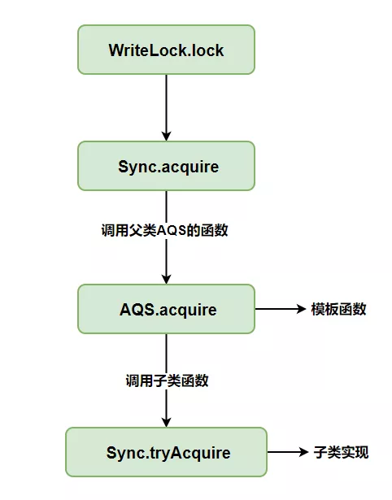

# 剖析ReentrantReadWriteLock源码

[TOC]

## 零、开篇

本文大纲如下

## 一、纵观全局

我的英文名叫`ReentrantReadWriteLock`（后面简称`RRW`），大家喜欢叫我读写锁，因为我常年混迹在读多写少的场景。

### 1. 读写锁规范

作为合格的读写锁，先要有读锁与写锁才行。

所以声明了`ReadWriteLock`接口，作为读写锁的基本规范。

之后都是**围绕着规范**去实现读锁与写锁。

### 2. 读锁与写锁

WriteLock与ReadLock就是读锁和写锁，它们是RRW实现`ReadWriteLock`接口的产物。

但读锁、写锁也要遵守锁操作的基本规范。

所以WriteLock与ReadLock都实现了`Lock`接口。

那么WriteLock与ReadLock对Lock接口具体是**如何实现**的呢？

自然是少不了我们的老朋友`AQS`了。

### 3. AQS

众所周知，要实现锁的基本操作，必须要仰仗`AQS`老大哥了。

`AQS（AbstractQueuedSynchronizer）`抽象类定义了一套多线程访问共享资源的同步模板，解决了实现同步器时涉及的大量细节问题，能够极大地减少实现工作，用大白话来说，`AQS`为加锁和解锁过程提供了统一的模板函数，只有少量细节由子类自己决定。

AQS简化流程图如下

### 4. Sync

AQS为加锁和解锁过程提供了统一的模板函数，只有少量细节由子类自己决定，但是WriteLock与ReadLock**没有直接去继承AQS**。

因为WriteLock与ReadLock觉得，自己还要去继承`AQS`实现一些两者可以公用的抽象函数，不仅麻烦，还有重复劳动。

所以干脆单独提供一个对锁操作的类，由WriteLock与ReadLock持有使用，这个类叫`Sync`。

Sync继承AQS实现了如下的核心抽象函数

- **tryAcquire**
- **release**
- **tryAcquireShared**
- **tryReleaseShared**

其中tryAcquire、release是为`WriteLock`写锁准备的。

tryAcquireShared、tryReleaseShared是为`ReadLock`读锁准备的，这里阿星后面会说。

上面说了Sync实现了一些`AQS`的核心抽象函数，但是Sync本身也有一些重要的内容，看看下面这段代码：

我们都知道`AQS`中维护了一个`state`状态变量，正常来说，维护读锁与写锁状态需要两个变量，但是为了节约资源，使用高低位切割实现`state`状态变量维护两种状态，即高`16`位表示读状态，低`16`位表示写状态。

Sync中还定义了HoldCounter与ThreadLocalHoldCounter

- **HoldCounter是用来记录读锁重入数的对象**
- **ThreadLocalHoldCounter是ThreadLocal变量，用来存放第一个获取读锁线程外的其他线程的读锁重入数对象**

### 5. 公平与非公平策略

你看，人家`ReentrantLock`都有公平与非公平策略，所以`ReentrantReadWriteLock`也要有。

什么是公平与非公平策略？

因为在`AQS`流程中，获取锁失败的线程，会被构建成节点入队到`CLH`队列，其他线程释放锁会唤醒`CLH`队列的线程重新竞争锁，如下图所示（简化流程）。

非公平策略是指，非`CLH`队列的线程与`CLH`队列的线程竞争锁，大家各凭本事，不会因为你是`CLH`队列的线程，排了很久的队，就把锁让给你。

公平策略是指，严格按照`CLH`队列顺序获取锁，一定会让`CLH`队列线程竞争成功，如果非`CLH`队列线程一直占用时间片，那就一直失败，直到时间片轮到`CLH`队列线程为止，所以公平策略的性能会更差。

回到正题，为了支持公平与非公平策略，Sync扩展了`FairSync、NonfairSync`子类，两个子类实现了readerShouldBlock、writerShouldBlock函数，**即读锁与写锁是否阻塞**。

readerShouldBlock、writerShouldBlock函数在什么地方使用后面会说。

### 6. ReentrantReadWriteLock全局图

最后把前面讲过的内容，全部组装起来，构成下面这张图。

有了全局观后，后面就可以深入细节逐个击破了。

## 二、深入细节

后面我们只要攻破`5`个细节就够了，分别是读写锁的创建、获取写锁、释放写锁、获取读锁、释放读锁。

### 1. ReentrantReadWriteLock的创建

读写锁的创建，会初始化一系列类，代码如下：

`ReentrantReadWriteLock`默认是非公平策略，如果想用公平策略，可以直接调用有参构造器，传入`true`即可。

但不管是创建FairSync还是NonfairSync，都会触发`Sync`的无参构造器，因为`Sync`是它们的父类（**本质上它们俩都是Sync**）。

因为Sync需要提供给ReadLock与WriteLock使用，所以创建ReadLock与WriteLock时，会接收`ReentrantReadWriteLock`对象作为入参。

最后通过`ReentrantReadWriteLock.sync`把`Sync`交给了ReadLock与WriteLock。

### 2. 获取写锁

我们遵守ReadWriteLock接口规范，调用`ReentrantReadWriteLock.writeLock`函数获取写锁对象。

获取到写锁对象后，遵守Lock接口规范，调用`lock`函数获取写锁。

WriteLock.lock函数是由`Sync`实现的（**FairSync或NonfairSync**）。

`sync.acquire(1)`函数是AQS中的独占式获取锁流程模板（Sync继承自AQS）。

WriteLock.lock调用链如下图

我们只关注`tryAcquire`函数，其他函数是AQS的获取独占式锁失败后的流程内容，不属于本文范畴，`tryAcquire`函数代码如下

为了易于理解，把它转成流程图

通过流程图，我们发现了一些要点

- **读写互斥**
- **写写互斥**
- **写锁支持同一个线程重入**
- **writerShouldBlock写锁是否阻塞实现取决公平与非公平的策略（FairSync和NonfairSync）**

