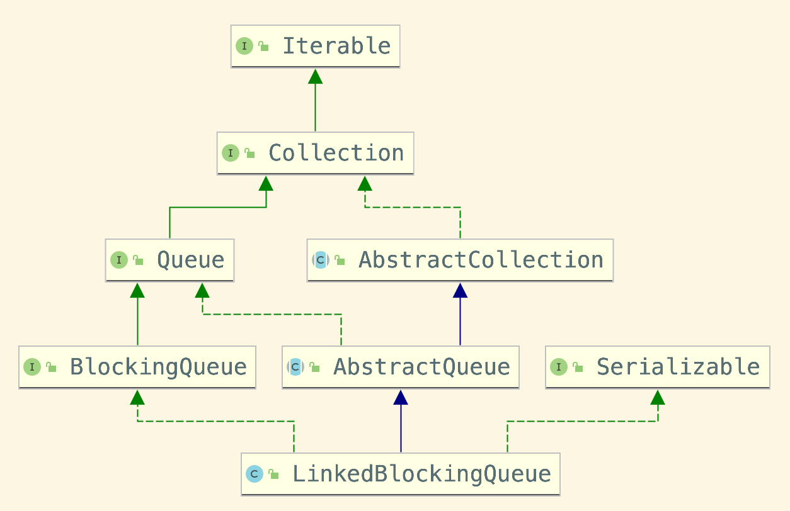

# 阻塞队列

目录
+ [什么是阻塞队列](#什么是阻塞队列)
+ [阻塞队列继承关系](#阻塞队列继承关系)
+ [BlockingQueue接口分析](#BlockingQueue接口分析)
  - [Queue接口分析](#Queue接口分析)
  - [BlockingQueue接口分析](#BlockingQueue接口分析)
+ [源码解析](#源码解析)
  - [变量分析](#变量分析)
  - [构造器分析](#构造器分析)
  - [节点入队](#节点入队)
  - [节点出队](#节点出队)


## 什么是阻塞队列
阻塞队列是在队列的基础上额外添加两个操作的队列，分别是：
1. 支持阻塞的插入方法：队列容量满时，插入元素线程会被阻塞，直到队列有多余容量为止；
2. 支持阻塞的移除方法：当队列中无元素时，移除元素的线程会被阻塞，直到队列有元素可被移除。

文章以 LinkedBlockingQueue 为例，讲述队列之间实现的不同点，为方便小伙伴阅读，LinkedBlockingQueue 取别名 LBQ。

## 阻塞队列继承关系
阻塞队列是一个抽象的叫法，阻塞队列底层数据结构**可以是数组，可以是单向链表，亦或者是双向链表...**

LBQ 是一个以 **单向链表组成的队列**，下图为 LBQ 上下继承关系图：  


### Queue接口分析
以自上而下的方式，先分析一波 Queue 接口里都定义了哪些方法：
```java
// 如果队列容量允许，立即将元素插入队列，成功后返回
// 🌟如果队列容量已满，则抛出异常
boolean add(E e);

//  如果队列容量允许，立即将元素插入队列，成功后返回
// 🌟如果队列容量已满，则返回 false
// 当使用有界队列时，offer 比 add 方法更合适
boolean offer(E e);

// 检索并删除队列的头节点，返回值为删除的队列头节点
// 🌟如果队列为空则抛出异常
E remove();

// 检索并删除队列的头节点，返回值为删除的队列头节点
// 🌟如果队列为空则返回 null
E poll();

// 检查但不删除队列头节点
// 🌟如果队列为空则抛出异常
E element();

// 检查但不删除队列头节点
// 🌟如果队列为空则返回 null
E peek();
```
总结一下 Queue 接口的方法，分为三个大类：
1. 新增元素到队列容器中：add、offer；
2. 从队列容器中移除元素：remove、poll；
3. 查询队列头节点是否为空：element、peek。

从接口 API 的程序健壮性考虑，可以分为两大类：
1. 健壮 API：offer、poll、peek；
2. 非健壮 API：add、remove、element。

**接口 API 并无健壮可言**，这里说的健壮界限指得是，使用了非健壮性的 API 接口，程序会出错的几率大了点，所以我们 **更应该关注的是如何捕获可能出现的异常，以及对应异常处理**。

## BlockingQueue接口分析
BlockingQueue 接口继承自 Queue 接口，所以有些语义相同的 API 接口就没有放上来解读：
```java
// 将指定元素插入队列，如果队列已满，等待直到有空间可用；通过 throws 异常得知，可在等待时打断
// 🌟相对于 Queue 接口而言，是一个全新的方法
void put(E e) throws InterruptedException;

// 将指定元素插入队列，如果队列已满，在等待指定的时间内等待腾出空间；通过 throws 异常得知，可在等待时打断
// 🌟相当于是 offer(E e) 的扩展方法
boolean offer(E e, long timeout, TimeUnit unit) throws InterruptedException;

// 检索并除去此队列的头节点，如有必要，等待直到元素可用；通过 throws 异常得知，可在等待时打断
E take() throws InterruptedException;

// 检索并删除此队列的头，如果有必要使元素可用，则等待指定的等待时间；通过 throws 异常得知，可在等待时打断
// 🌟相当于是 poll() 的扩展方法
E poll(long timeout, TimeUnit unit) throws InterruptedException;

// 返回队列剩余容量，如果为无界队列，返回 Integer.MAX_VALUE
int remainingCapacity();

// 如果此队列包含指定的元素，则返回 true
public boolean contains(Object o);

// 从此队列中删除所有可用元素，并将它们添加到给定的集合中
int drainTo(Collection<? super E> c);

// 从此队列中最多移除给定数量的可用元素，并将它们添加到给定的集合中
int drainTo(Collection<? super E> c, int maxElements);
```
可以看到 BlockingQueue 接口中个性化的方法还是挺多的。本文的猪脚 LBQ 就是实现自 BlockingQueue 接口。

## 源码解析
### 变量分析
LBQ 为了保证并发添加、移除等操作，使用了 JUC 包下的 ReentrantLock、Condition 控制：
```java
// take, poll 等移除操作需要持有的锁
private final ReentrantLock takeLock = new ReentrantLock();
// 当队列没有数据时，删除元素线程被挂起
private final Condition notEmpty = takeLock.newCondition();
// put, offer 等新增操作需要持有的锁
private final ReentrantLock putLock = new ReentrantLock();
// 当队列为空时，添加元素线程被挂起
private final Condition notFull = putLock.newCondition();
```

接下来从结构体入手，知道它是由什么元素组成，每个元素是做啥使的：
```java
// 绑定的容量，如果无界，则为 Integer.MAX_VALUE
private final int capacity;
// 当前队列中元素个数
private final AtomicInteger count = new AtomicInteger();
// 当前队列的头节点
transient Node<E> head;
// 当前队列的尾节点
private transient Node<E> last;
```

看到 head 和 last 元素，是不是对 LBQ 就有个大致的雏形了，这个时候还差一个类 Node：
```java
static class Node<E> {
    // 节点存储的元素
    E item;
    // 当前节点的后继节点
    LinkedBlockingQueue.Node<E> next;

    Node(E x) { item = x; }
}
```

### 构造器分析
```java
public LinkedBlockingQueue() {
    this(Integer.MAX_VALUE);
}

public LinkedBlockingQueue(int capacity) {
    if (capacity <= 0) throw new IllegalArgumentException();
    this.capacity = capacity;
    last = head = new Node<E>(null);
}
```
可以看出，默认构造方法会将容量设置为 Integer.MAX_VALUE，也就是大家常说的无界队列；  
内部其实调用的是重载的有参构造，方法内部设置了容量大小，以及初始化了 item 为空的 Node 节点，把 head last 两节点进行一个关联；  
初始化的队列 head last 节点指向的 Node 中 item、next 都为空。

### 节点入队
需要添加的元素会被封装为 Node 添加到队列中, put 入队方法语义，如果队列元素已满，**阻塞当前插入线程，直到队列中有空缺位置被唤醒**：
```java
public void put(E e) throws InterruptedException {
    if (e == null) throw new NullPointerException();
    int c = -1;
    Node<E> node = new Node<E>(e);  // 将需要添加的数据封装为 Node
    final ReentrantLock putLock = this.putLock;  // 获取添加操作的锁
    final AtomicInteger count = this.count;  // 获取队列实际元素数量
    putLock.lockInterruptibly();  // 运行可被中断加锁 API
    try {
        while (count.get() == capacity) {  // 如果队列元素数量 == 队列最大值，则将线程放入条件队列阻塞
            notFull.await();
        }
        enqueue(node);  // 执行入队流程
        c = count.getAndIncrement();  // 获取值并且自增，举例：count = 0，执行后结果值 count+1 = 2，返回 0
        if (c + 1 < capacity)  // 如果自增过的队列元素 +1 小于队列容器最大数量，唤醒一条被阻塞在插入等待队列的线程
            notFull.signal();
    } finally {
        putLock.unlock();  // 解锁操作
    }
    if (c == 0)  // 当队列中有一条数据，则唤醒消费组线程进行消费
        signalNotEmpty();
}
```
入队方法整体流程比较清晰，做了以下几件事：
1. 队列已满，则将当前线程阻塞；
2. 队列中如果有空缺位置，将数据封装的 Node 执行入队操作；
3. 如果 Node 执行入队操作后，队列还有空余位置，则唤醒等待队列中的添加线程；
4. 如果数据入队前队列没有元素，入队成功后唤醒消费阻塞队列中的线程。

继续看一下入队方法 LBQ#enqueue 都做了什么操作：
```java
private void enqueue(Node<E> node) {
    last = last.next = node;
}
```

LBQ#offer 也是入队方法，不同的是：如果队列元素已满，则直接返回 false，不阻塞线程：
```java
public boolean offer(E e, long timeout, TimeUnit unit)
        throws InterruptedException {

        if (e == null) throw new NullPointerException();
        long nanos = unit.toNanos(timeout);
        int c = -1;
        final ReentrantLock putLock = this.putLock;
        final AtomicInteger count = this.count;
        putLock.lockInterruptibly();
        try {
            while (count.get() == capacity) {
                if (nanos <= 0)
                    return false;
                nanos = notFull.awaitNanos(nanos);
            }
            enqueue(new Node<E>(e));
            c = count.getAndIncrement();
            if (c + 1 < capacity)
                notFull.signal();
        } finally {
            putLock.unlock();
        }
        if (c == 0)
            signalNotEmpty();
        return true;
    }
```

### 节点出队
LBQ#take 出队方法，**如果队列中元素为空，阻塞当前出队线程，直到队列中有元素为止**：
```java
public E take() throws InterruptedException {
    E x;
    int c = -1;
    final AtomicInteger count = this.count;  // 获取当前队列实际元素个数
    final ReentrantLock takeLock = this.takeLtakeLocock;  // 获取 takeLock 锁实例
    takeLock.lockInterruptibly();  // 获取 takeLock 锁，获取不到阻塞过程中，可被中断
    try {
        while (count.get() == 0) {  // 如果当前队列元素 == 0，当前获取节点线程加入等待队列
            notEmpty.await();
        }
        x = dequeue();  // 当前队列元素 > 0，执行头节点出队操作
        c = count.getAndDecrement();  // 获取当前队列元素个数，并将数量 - 1
        if (c > 1)  // 当队列中还有还有元素时，唤醒下一个消费线程进行消费
            notEmpty.signal();
    } finally {
        takeLock.unlock();  // 释放锁
    }
    if (c == capacity)  // 移除元素之前队列是满的，唤醒生产者线程添加元素
        signalNotFull();
    return x;  // 返回头节点
}
```
出队操作整体流程清晰明了，和入队操作执行流程相似：
1. 队列已满，则将当前出队线程阻塞；
2. 队列中如果有元素可消费，执行节点出队操作；
3. 如果节点出队后，队列中还有可出队元素，则唤醒等待队列中的出队线程；
4. 如果移除元素之前队列是满的，唤醒生产者线程添加元素。

LBQ#dequeue 出队操作相对于入队操作稍显复杂一些：
```java
private E dequeue() {
    Node<E> h = head;  // 获取队列头节点
    Node<E> first = h.next;  // 获取头节点的后继节点
    h.next = h; // help GC
    head = first;  // 相当于把头节点的后继节点，设置为新的头节点
    E x = first.item;  // 获取到新的头节点 item
    first.item = null;  // 因为头节点 item 为空，所以 item 赋值为 null
    return x;
}
```
出队流程中，会将原头节点自己指向自己本身，这么做是为了帮助 GC 回收当前节点，接着将原 head 的 next 节点设置为新的 head，下图为一个完整的出队流程：  


出队流程图如上，流程中没有特别注意的点。另外一个 LBQ#poll 出队方法，如果队列中元素为空，返回 null，不会像 take 一样阻塞。

[回到顶部](#阻塞队列)