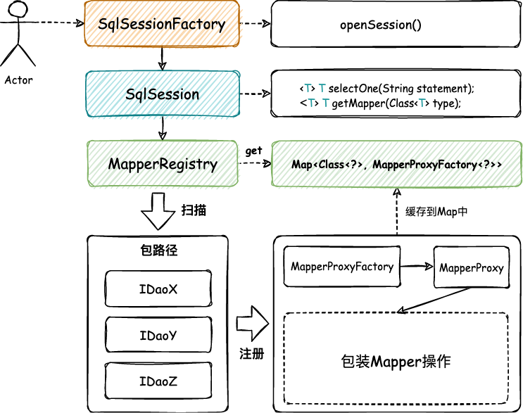
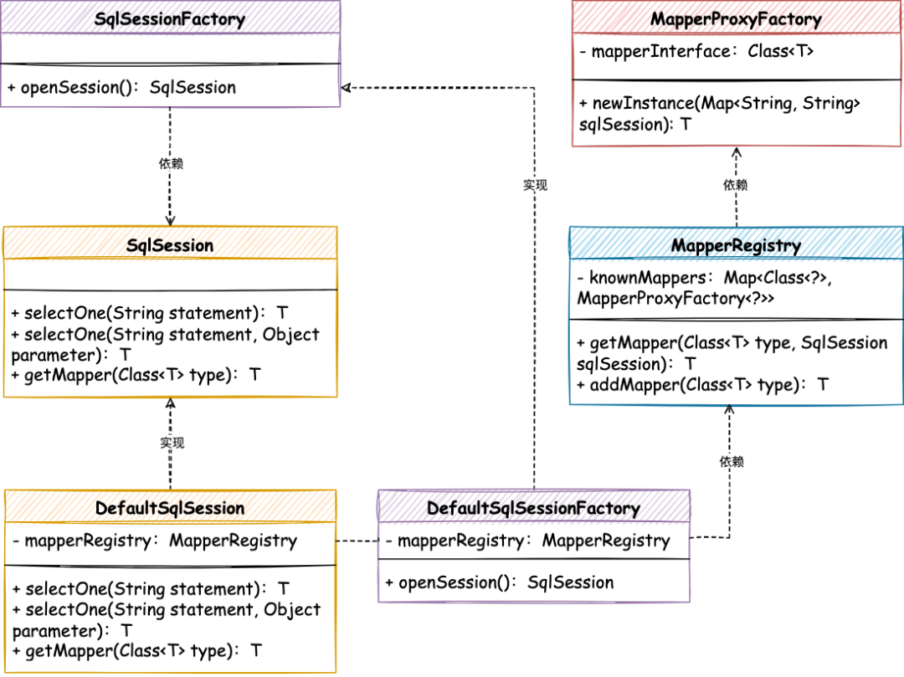

# 手撸Mybatis-02-实现映射器的注册和使用

<!-- START doctoc generated TOC please keep comment here to allow auto update -->
<!-- DON'T EDIT THIS SECTION, INSTEAD RE-RUN doctoc TO UPDATE -->

- [一、目标](#%E4%B8%80%E7%9B%AE%E6%A0%87)
- [二、设计](#%E4%BA%8C%E8%AE%BE%E8%AE%A1)
- [三、实现](#%E4%B8%89%E5%AE%9E%E7%8E%B0)
    - [1. 映射器注册机](#1-%E6%98%A0%E5%B0%84%E5%99%A8%E6%B3%A8%E5%86%8C%E6%9C%BA)
    - [2. SqlSession 标准定义和实现](#2-sqlsession-%E6%A0%87%E5%87%86%E5%AE%9A%E4%B9%89%E5%92%8C%E5%AE%9E%E7%8E%B0)
    - [3. SqlSessionFactory 工厂定义和实现](#3-sqlsessionfactory-%E5%B7%A5%E5%8E%82%E5%AE%9A%E4%B9%89%E5%92%8C%E5%AE%9E%E7%8E%B0)
- [四、测试](#%E5%9B%9B%E6%B5%8B%E8%AF%95)
    - [1. 事先准备](#1-%E4%BA%8B%E5%85%88%E5%87%86%E5%A4%87)
    - [2. 单元测试](#2-%E5%8D%95%E5%85%83%E6%B5%8B%E8%AF%95)
- [五、总结](#%E4%BA%94%E6%80%BB%E7%BB%93)

<!-- END doctoc generated TOC please keep comment here to allow auto update -->

[TOC]

## 一、目标

在上一章节我们初步的了解了怎么给一个接口类生成对应的映射器代理，并在代理中完成一些用户对接口方法的调用处理。虽然我们已经看到了一个核心逻辑的处理方式，但在使用上还是有些刀耕火种的，包括：需要编码告知 MapperProxyFactory
要对哪个接口进行代理，以及自己编写一个假的 SqlSession 处理实际调用接口时的返回结果。

那么结合这两块问题点，我们本章节要对映射器的注册提供注册机处理，满足用户可以在使用的时候提供一个包的路径即可完成扫描和注册。与此同时需要对 SqlSession
进行规范化处理，让它可以把我们的映射器代理和方法调用进行包装，建立一个生命周期模型结构，便于后续的内容的添加。

## 二、设计

鉴于我们希望把整个工程包下关于数据库操作的 DAO 接口与 Mapper 映射器关联起来，那么就需要包装一个可以扫描包路径的完成映射的注册器类。

当然我们还要把上一章节中简化的 SqlSession 进行完善，由 SqlSession 定义数据库处理接口和获取 Mapper 对象的操作，并把它交给映射器代理类进行使用。*这一部分是对上一章节内容的完善*

有了 SqlSession 以后，你可以把它理解成一种功能服务，有了功能服务以后还需要给这个功能服务提供一个工厂，来对外统一提供这类服务。比如我们在 Mybatis 中非常常见的操作，开启一个 SqlSession。整个设计可以如图：



- 以包装接口提供映射器代理类为目标，补全映射器注册机 `MapperRegistry`，自动扫描包下接口并把每个接口类映射的代理类全部存入映射器代理的 HashMap 缓存中。
- 而 SqlSession、SqlSessionFactory 是在此注册映射器代理的上次层使用标准定义和对外服务提供的封装，便于用户使用。*我们把使用方当成用户*
  经过这样的封装就就可以更加方便我们后续在框架上功能的继续扩展了，也希望大家可以在学习的过程中对这样的设计结构有一些思考，它可以帮助你解决一些业务功能开发过程中的领域服务包装。

## 三、实现

映射器标准定义实现关系，如图



- MapperRegistry 提供包路径的扫描和映射器代理类注册机服务，完成接口对象的代理类注册处理。
- SqlSession、DefaultSqlSession 用于定义执行 SQL 标准、获取映射器以及将来管理事务等方面的操作。基本我们平常使用 Mybatis 的 API 接口也都是从这个接口类定义的方法进行使用的。
- SqlSessionFactory 是一个简单工厂模式，用于提供 SqlSession 服务，屏蔽创建细节，延迟创建过程。

### 1. 映射器注册机

```java
import cn.hutool.core.lang.ClassScanner;
import com.collect.mybatis.session.SqlSession;

import java.util.HashMap;
import java.util.Map;
import java.util.Set;

/**
 * @description: mapper 注册
 * @date: 2022/5/18 22:31
 **/
public class MapperRegistry {

    /**
     * 代理类 <--> 代理工厂
     */
    private static final Map<Class<?>, MapperProxyFactory<?>> FACTORY_MAP = new HashMap<>();

    public <T> T getMapper(Class<T> type, SqlSession sqlSession) {
        MapperProxyFactory<T> factory = (MapperProxyFactory<T>) FACTORY_MAP.get(type);
        if (factory == null) {
            throw new RuntimeException(String.format("类型为 %s 的mapper未注册", type));
        }

        return factory.newInstance(sqlSession);
    }

    public <T> void addMapper(Class<T> type) {
        // Mapper必须是接口
        if (type.isInterface()) {
            FACTORY_MAP.computeIfAbsent(type, t -> {
                throw new RuntimeException(String.format("已存在类型:%s", t));
            });
            FACTORY_MAP.put(type, new MapperProxyFactory<>(type));
        }
    }

    public void addMappers(String packageName) {
        // 这里引用了hutool的包扫描
        Set<Class<?>> mapperSet = ClassScanner.scanPackage(packageName);
        for (Class<?> mapperClass : mapperSet) {
            addMapper(mapperClass);
        }
    }

}
```

- MapperRegistry 映射器注册类的核心主要在于提供了 `ClassScanner.scanPackage` 扫描包路径，调用 `addMapper` 方法，给接口类创建 `MapperProxyFactory`
  映射器代理类，并写入到 FACTORY_MAP 的 HashMap 缓存中。
- 另外就是这个类也提供了对应的 getMapper 获取映射器代理类的方法，其实这步就包装了我们上一章节手动操作实例化的过程，更加方便在 DefaultSqlSession 中获取 Mapper 时进行使用。

### 2. SqlSession 标准定义和实现

```java
/**
 * @description: 标准定义和实现
 * @date: 2022/5/18 22:34
 **/
public interface SqlSession {

    /**
     * Retrieve a single row mapped from the statement key
     * 根据指定的SqlID获取一条记录的封装对象
     *
     * @param <T>       the returned object type 封装之后的对象类型
     * @param statement sqlID
     * @return Mapped object 封装之后的对象
     */
    <T> T selectOne(String statement);

    /**
     * Retrieve a single row mapped from the statement key and parameter.
     * 根据指定的SqlID获取一条记录的封装对象，只不过这个方法容许我们可以给sql传递一些参数
     * 一般在实际使用中，这个参数传递的是pojo，或者Map或者ImmutableMap
     *
     * @param <T>       the returned object type
     * @param statement Unique identifier matching the statement to use.
     * @param parameter A parameter object to pass to the statement.
     * @return Mapped object
     */
    <T> T selectOne(String statement, Object parameter);

    /**
     * Retrieves a mapper.
     * 得到映射器，这个巧妙的使用了泛型，使得类型安全
     *
     * @param <T>  the mapper type
     * @param type Mapper interface class
     * @return a mapper bound to this SqlSession
     */
    <T> T getMapper(Class<T> type);

}
```

- 在 SqlSession 中定义用来执行 SQL、获取映射器对象以及后续管理事务操作的标准接口。
- 目前这个接口中对于数据库的操作仅仅只提供了 selectOne，后续还会有相应其他方法的定义。

```java
import com.collect.mybatis.binding.MapperRegistry;
import com.collect.mybatis.session.SqlSession;

/**
 * @description: 默认SqlSession
 * @author: panhongtong
 * @date: 2022/5/19 08:38
 **/
public class DefaultSqlSession implements SqlSession {

    /**
     * 映射器注册机
     */
    private MapperRegistry mapperRegistry;

    public DefaultSqlSession(MapperRegistry mapperRegistry) {
        this.mapperRegistry = mapperRegistry;
    }

    @Override
    public <T> T selectOne(String statement) {
        return (T) ("你被代理了！" + "方法：");
    }

    @Override
    public <T> T selectOne(String statement, Object parameter) {
        return (T) ("你被代理了！" + "方法：" + statement + " 入参：" + parameter);
    }

    @Override
    public <T> T getMapper(Class<T> type) {
        return mapperRegistry.getMapper(type, this);
    }
}
```

- 通过 DefaultSqlSession 实现类对 SqlSession 接口进行实现。
- getMapper 方法中获取映射器对象是通过 MapperRegistry 类进行获取的，后续这部分会被配置类进行替换。
- 在 selectOne 中是一段简单的内容返回，目前还没有与数据库进行关联，这部分在我们渐进式的开发过程中逐步实现。

### 3. SqlSessionFactory 工厂定义和实现

```java
/**
 * @description: SqlSessionFactory
 * @date: 2022/5/19 08:40
 **/
public interface SqlSessionFactory {

    /**
     * 打开一个 session
     *
     * @return SqlSession
     */
    SqlSession openSession();

}
```

- 这其实就是一个简单工厂的定义，在工厂中提供接口实现类的能力，也就是 SqlSessionFactory 工厂中提供的开启 SqlSession 的能力。

```java
import com.collect.mybatis.binding.MapperRegistry;
import com.collect.mybatis.session.SqlSession;
import com.collect.mybatis.session.SqlSessionFactory;

/**
 * @description: DefaultSqlSessionFactory
 * @date: 2022/5/19 08:41
 **/
public class DefaultSqlSessionFactory implements SqlSessionFactory {

    private final MapperRegistry mapperRegistry;

    public DefaultSqlSessionFactory(MapperRegistry mapperRegistry) {
        this.mapperRegistry = mapperRegistry;
    }

    @Override
    public SqlSession openSession() {
        return new DefaultSqlSession(mapperRegistry);
    }
}
```

- 默认的简单工厂实现，处理开启 SqlSession 时，对 DefaultSqlSession 的创建以及传递 mapperRegistry，这样就可以在使用 SqlSession 时获取每个代理类的映射器对象了。

## 四、测试

### 1. 事先准备

在同一个包路径下，提供2个以上的 Dao 接口：

```java
public interface ISchoolDao {

    String querySchoolName(String uId);

}

public interface IUserDao {

    String queryUserName(String uId);

    Integer queryUserAge(String uId);

}
```

### 2. 单元测试

```java
import com.collect.mybatis.binding.MapperRegistry;
import com.collect.mybatis.session.SqlSession;
import com.collect.mybatis.session.SqlSessionFactory;
import com.collect.mybatis.session.defaults.DefaultSqlSessionFactory;
import com.collection.mybatis.test.dao.IUserDao;
import lombok.extern.slf4j.Slf4j;
import org.junit.Test;

/**
 * @description: ApiTest
 * @date: 2022/5/17 22:46
 **/
@Slf4j
public class ApiTest {

    @Test
    public void testMapperProxyFactory() {
        // 1. 注册 Mapper
        MapperRegistry registry = new MapperRegistry();
        registry.addMappers("com.collection.mybatis.test.dao");

        // 2. 从 SqlSession 工厂获取 Session
        SqlSessionFactory sqlSessionFactory = new DefaultSqlSessionFactory(registry);
        SqlSession sqlSession = sqlSessionFactory.openSession();

        // 3. 获取映射器对象
        IUserDao userDao = sqlSession.getMapper(IUserDao.class);

        // 4. 测试验证
        String res = userDao.queryUserName("10001");
        log.info("测试结果：{}", res);
    }

}
```

- 在单元测试中通过注册机扫描包路径注册映射器代理对象，并把注册机传递给 SqlSessionFactory 工厂，这样完成一个链接过程。
- 之后通过 SqlSession 获取对应 DAO 类型的实现类，并进行方法验证。

**测试结果**

```
INFO [main] - 测试结果：你被代理了！方法：com.collection.mybatis.test.dao.IUserDao.queryUserName 入参：[Ljava.lang.Object;@4c75cab9
```

- 通过测试大家可以看到，目前我们已经在一个有 Mybatis 影子的手写 ORM 框架中，完成了代理类的注册和使用过程。

## 五、总结

- 首先要从设计结构上了解工厂模式对具体功能结构的封装，屏蔽过程细节，限定上下文关系，把对外的使用减少耦合。
- 从这个过程上读者伙伴也能发现，使用 SqlSessionFactory 的工厂实现类包装了 SqlSession 的标准定义实现类，并由 SqlSession 完成对映射器对象的注册和使用。
- 本章学习要注意几个重要的知识点，包括：映射器、代理类、注册机、接口标准、工厂模式、上下文。这些工程开发的技巧都是在手写 Mybatis 的过程中非常重要的部分，了解和熟悉才能更好的在自己的业务中进行使用。