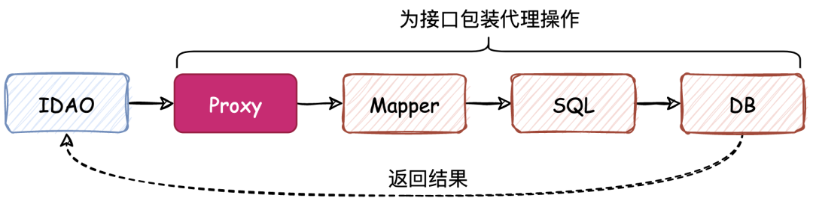
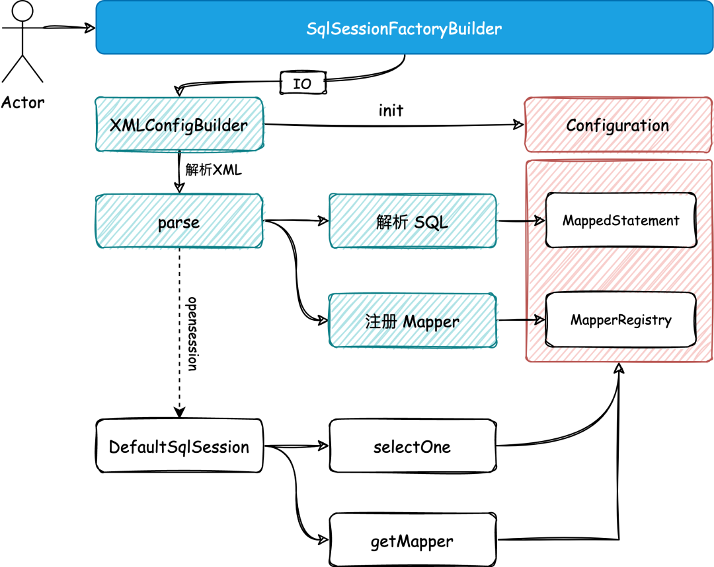
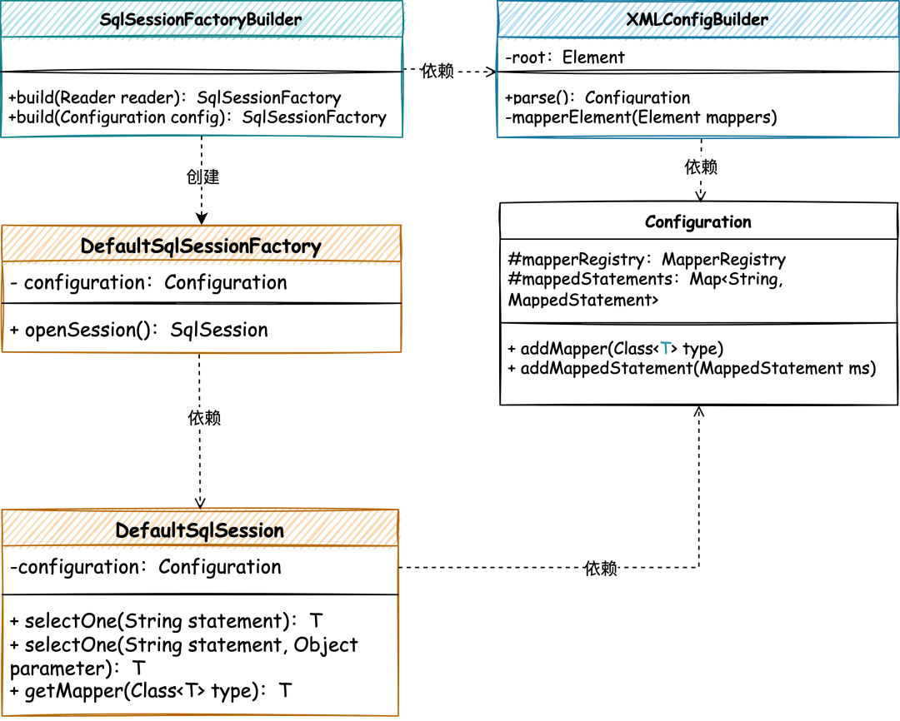

# Mapper-XML的解析和注册使用

<!-- START doctoc generated TOC please keep comment here to allow auto update -->
<!-- DON'T EDIT THIS SECTION, INSTEAD RE-RUN doctoc TO UPDATE -->

- [零、源码](#%E9%9B%B6%E6%BA%90%E7%A0%81)
- [一、目标](#%E4%B8%80%E7%9B%AE%E6%A0%87)
- [二、设计](#%E4%BA%8C%E8%AE%BE%E8%AE%A1)
- [三、实现](#%E4%B8%89%E5%AE%9E%E7%8E%B0)
    - [1. 构建SqlSessionFactory建造者工厂](#1-%E6%9E%84%E5%BB%BAsqlsessionfactory%E5%BB%BA%E9%80%A0%E8%80%85%E5%B7%A5%E5%8E%82)
    - [2. XML 解析处理](#2-xml-%E8%A7%A3%E6%9E%90%E5%A4%84%E7%90%86)
    - [3. 通过配置类包装注册机和SQL语句](#3-%E9%80%9A%E8%BF%87%E9%85%8D%E7%BD%AE%E7%B1%BB%E5%8C%85%E8%A3%85%E6%B3%A8%E5%86%8C%E6%9C%BA%E5%92%8Csql%E8%AF%AD%E5%8F%A5)
    - [. DefaultSqlSession结合配置项获取信息](#-defaultsqlsession%E7%BB%93%E5%90%88%E9%85%8D%E7%BD%AE%E9%A1%B9%E8%8E%B7%E5%8F%96%E4%BF%A1%E6%81%AF)
- [四、测试](#%E5%9B%9B%E6%B5%8B%E8%AF%95)
    - [1. 事先准备](#1-%E4%BA%8B%E5%85%88%E5%87%86%E5%A4%87)
    - [2. 单元测试](#2-%E5%8D%95%E5%85%83%E6%B5%8B%E8%AF%95)
- [五、总结](#%E4%BA%94%E6%80%BB%E7%BB%93)

<!-- END doctoc generated TOC please keep comment here to allow auto update -->

[TOC]

## 零、源码

工程源码在本项目`mybatis-code`-`mybatis-03`

## 一、目标

在我们渐进式的逐步实现 Mybatis 框架过程中，首先我们要有一个目标导向的思路，也就是说 Mybatis 的核心逻辑怎么实现。

其实我们可以把这样一个 ORM 框架的目标，简单的描述成是为了给一个接口提供代理类，类中包括了对 Mapper 也就是 xml 文件中的 SQL 信息(`类型`、`入参`、`出参`、`条件`)
进行解析和处理，这个处理过程就是对数据库的操作以及返回对应的结果给到接口。如图



那么按照 ORM 核心流程的执行过程，我们本章节就需要在上一章节的基础上，继续扩展对 Mapper 文件的解析以及提取出对应的 SQL 文件。并在当前这个阶段，可以满足我们调用 DAO 接口方法的时候，可以返回 Mapper 中对应的待执行
SQL 语句。*为了不至于把整个工程撑大，我会带着大家逐步完成这些内容，所以本章节暂时不会对数据库进行操作，待后续逐步实现*

## 二、设计

结合上一章节我们使用了 `MapperRegistry` 对包路径进行扫描注册映射器，并在 `DefaultSqlSession` 中进行使用。那么在我们可以把这些命名空间、SQL描述、映射信息统一维护到每一个 DAO 对应的 Mapper
XML 的文件以后，其实 XML 就是我们的源头了。通过对 XML 文件的解析和处理就可以完成 Mapper 映射器的注册和 SQL 管理。这样也就更加我们操作和使用了。如图



- 首先需要定义 `SqlSessionFactoryBuilder` 工厂建造者模式类，通过入口 IO 的方式对 XML 文件进行解析。当前我们主要以解析 SQL 部分为主，并注册映射器，串联出整个核心流程的脉络。
- 文件解析以后会存放到 Configuration 配置类中，接下来你会看到这个配置类会被串联到整个 Mybatis 流程中，所有内容存放和读取都离不开这个类。如我们在 DefaultSqlSession 中获取 Mapper 和执行
  selectOne 也同样是需要在 Configuration 配置类中进行读取操作。

## 三、实现

XML 解析和注册类实现关系，如图



SqlSessionFactoryBuilder 作为整个 Mybatis 的入口，提供建造者工厂，包装 XML 解析处理，并返回对应 SqlSessionFactory 处理类。

通过解析把 XML 信息注册到 Configuration 配置类中，再通过传递 Configuration 配置类到各个逻辑处理类里，包括 DefaultSqlSession
中，这样就可以在获取映射器和执行SQL的时候，从配置类中拿到对应的内容了。

### 1. 构建SqlSessionFactory建造者工厂

```java
import com.collect.mybatis.builder.xml.XMLConfigBuilder;
import com.collect.mybatis.session.defaults.DefaultSqlSessionFactory;

import java.io.Reader;

/**
 * @description: SqlSessionFactoryBuilder
 * @date: 2022/5/19 20:41
 **/
public class SqlSessionFactoryBuilder {

    public SqlSessionFactory build(Reader reader) {
        XMLConfigBuilder xmlConfigBuilder = new XMLConfigBuilder(reader);
        return build(xmlConfigBuilder.parse());
    }

    public SqlSessionFactory build(Configuration config) {
        return new DefaultSqlSessionFactory(config);
    }

}
```

SqlSessionFactoryBuilder 是作为整个 Mybatis 的入口类，通过指定解析XML的IO，引导整个流程的启动。

从这个类开始新增加了 XMLConfigBuilder、Configuration 两个处理类，分别用于解析 XML 和串联整个流程的对象保存操作。接下来我们会分别介绍这些新引入的对象。

### 2. XML 解析处理

BaseBuilder

```java
import com.collect.mybatis.session.Configuration;

/**
 * @description: 构建器的基类，建造者模式
 * @date: 2022/5/20 09:07
 **/
public abstract class BaseBuilder {

    protected final Configuration configuration;

    protected BaseBuilder(Configuration configuration) {
        this.configuration = configuration;
    }

    public Configuration getConfiguration() {
        return configuration;
    }

}
```

XMLConfigBuilder

```java
package com.collect.mybatis.builder.xml;

import com.collect.mybatis.builder.BaseBuilder;
import com.collect.mybatis.io.Resources;
import com.collect.mybatis.mapping.MappedStatement;
import com.collect.mybatis.mapping.SqlCommandType;
import com.collect.mybatis.session.Configuration;
import org.dom4j.Document;
import org.dom4j.DocumentException;
import org.dom4j.Element;
import org.dom4j.io.SAXReader;
import org.xml.sax.InputSource;

import java.io.Reader;
import java.util.HashMap;
import java.util.List;
import java.util.Locale;
import java.util.Map;
import java.util.regex.Matcher;
import java.util.regex.Pattern;

/**
 * @description: XML配置构建器，建造者模式，继承BaseBuilder
 * @date: 2022/5/20 09:08
 **/
public class XMLConfigBuilder extends BaseBuilder {

    private Element root;

    public XMLConfigBuilder(Reader reader) {
        // 1. 调用父类初始化Configuration
        super(new Configuration());
        // 2. dom4j 处理 xml
        SAXReader saxReader = new SAXReader();
        try {
            Document document = saxReader.read(new InputSource(reader));
            root = document.getRootElement();
        } catch (DocumentException e) {
            e.printStackTrace();
        }
    }

    /**
     * 解析配置；类型别名、插件、对象工厂、对象包装工厂、设置、环境、类型转换、映射器
     *
     * @return Configuration
     */
    public Configuration parse() {
        try {
            // 解析映射器
            mapperElement(root.element("mappers"));
        } catch (Exception e) {
            throw new RuntimeException("Error parsing SQL Mapper Configuration. Cause: " + e, e);
        }
        return configuration;
    }

    private void mapperElement(Element mappers) throws Exception {
        List<Element> mapperList = mappers.elements("mapper");
        for (Element e : mapperList) {
            // 读取config利配置的每个mapper
            String resource = e.attributeValue("resource");
            Reader reader = Resources.getResourceAsReader(resource);
            // 此处读到具体的一个mapper.xml文件
            SAXReader saxReader = new SAXReader();
            Document document = saxReader.read(new InputSource(reader));
            Element root = document.getRootElement();
            // 命名空间
            String namespace = root.attributeValue("namespace");

            // SELECT
            List<Element> selectNodes = root.elements("select");
            for (Element node : selectNodes) {
                String id = node.attributeValue("id");
                String parameterType = node.attributeValue("parameterType");
                String resultType = node.attributeValue("resultType");
                String sql = node.getText();

                // ? 匹配
                Map<Integer, String> parameter = new HashMap<>();
                Pattern pattern = Pattern.compile("(#\\{(.*?)})");
                Matcher matcher = pattern.matcher(sql);
                for (int i = 1; matcher.find(); i++) {
                    String g1 = matcher.group(1);
                    String g2 = matcher.group(2);
                    parameter.put(i, g2);
                    sql = sql.replace(g1, "?");
                }

                String msId = namespace + "." + id;
                String nodeName = node.getName();
                SqlCommandType sqlCommandType = SqlCommandType.valueOf(nodeName.toUpperCase(Locale.ENGLISH));
                MappedStatement mappedStatement = new MappedStatement.Builder(configuration, msId, sqlCommandType, parameterType, resultType, sql, parameter).build();
                // 添加解析 SQL
                configuration.addMappedStatement(mappedStatement);
            }

            // 注册Mapper映射器
            configuration.addMapper(Resources.classForName(namespace));
        }
    }

}

```

其中Resources类请参照源码，因为不是主要内容，所以这里不放出。

XMLConfigBuilder 核心操作在于初始化 Configuration，因为 Configuration 的使用离解析 XML 和存放是最近的操作，所以放在这里比较适合。

之后就是具体的 parse() 解析操作，并把解析后的信息，通过 Configuration 配置类进行存放，包括：添加解析 SQL、注册Mapper映射器。

解析配置整体包括：类型别名、插件、对象工厂、对象包装工厂、设置、环境、类型转换、映射器，但目前我们还不需要那么多，所以只做一些必要的 SQL 解析处理。

### 3. 通过配置类包装注册机和SQL语句

```java
import com.collect.mybatis.binding.MapperRegistry;
import com.collect.mybatis.mapping.MappedStatement;

import java.util.HashMap;
import java.util.Map;

/**
 * @description: 配置项
 * @date: 2022/5/20 08:56
 **/
public class Configuration {

    private final MapperRegistry mapperRegistry = new MapperRegistry(this);

    /**
     * 映射的语句，存在Map里 Map<MappedStatement.id, MappedStatement>
     */
    private final Map<String, MappedStatement> mappedStatements = new HashMap<>();

    public <T> void addMapper(Class<T> type) {
        mapperRegistry.addMapper(type);
    }

    public <T> T getMapper(Class<T> type, SqlSession sqlSession) {
        return mapperRegistry.getMapper(type, sqlSession);
    }

    public void addMappedStatement(MappedStatement ms) {
        mappedStatements.put(ms.getId(), ms);
    }

    public MappedStatement getMappedStatement(String id) {
        return mappedStatements.get(id);
    }
}
```

在配置类中添加映射器注册机和映射语句的存放；

- 映射器注册机是我们上一章节实现的内容，用于注册 Mapper 映射器锁提供的操作类。
- 另外一个 MappedStatement 是本章节新添加的 SQL 信息记录对象，包括记录：SQL类型、SQL语句、入参类型、出参类型等。*详细可参照源码*

### . DefaultSqlSession结合配置项获取信息

```java
package com.collect.mybatis.session.defaults;

import com.collect.mybatis.mapping.MappedStatement;
import com.collect.mybatis.session.Configuration;
import com.collect.mybatis.session.SqlSession;

/**
 * @description: 默认SqlSession
 * @date: 2022/5/19 08:38
 **/
public class DefaultSqlSession implements SqlSession {

    private Configuration configuration;

    public DefaultSqlSession(Configuration configuration) {
        this.configuration = configuration;
    }

    @Override
    public <T> T selectOne(String statement) {
        MappedStatement mappedStatement = configuration.getMappedStatement(statement);
        return (T) ("你被代理了！" + "\n方法：" + statement + "\n待执行SQL：" + mappedStatement.getSql());
    }

    @Override
    public <T> T selectOne(String statement, Object parameter) {
        MappedStatement mappedStatement = configuration.getMappedStatement(statement);
        return (T) ("你被代理了！" + "\n方法：" + statement + "\n入参：" + parameter + "\n待执行SQL：" + mappedStatement.getSql());
    }

    @Override
    public <T> T getMapper(Class<T> type) {
        return configuration.getMapper(type, this);
    }

    @Override
    public Configuration getConfiguration() {
        return configuration;
    }
}
```

- DefaultSqlSession 相对于上一章节，这里把 `MapperRegistry mapperRegistry` 替换为 `Configuration configuration`
  ，这样才能传递更丰富的信息内容，而不只是注册器操作。
- 之后在 DefaultSqlSession#selectOne、DefaultSqlSession#getMapper 两个方法中都使用 configuration 来获取对应的信息。
- 目前 selectOne 方法中只是把获取的信息进行打印，后续将引入 SQL 执行器进行结果查询并返回。

## 四、测试

### 1. 事先准备

提供 DAO 接口和对应的 Mapper xml 配置

```java
public interface IUserDao {

    String queryUserInfoById(String uId);

}
```

```xml
<?xml version="1.0" encoding="UTF-8"?>
<!DOCTYPE mapper PUBLIC "-//mybatis.org//DTD Mapper 3.0//EN" "http://mybatis.org/dtd/mybatis-3-mapper.dtd">
<mapper namespace="com.collection.mybatis.test.dao.IUserDao">

    <select id="queryUserInfoById" parameterType="java.lang.Long" resultType="com.collection.mybatis.test.model.User">
        SELECT id, userId, userHead, createTime
        FROM user
        where id = #{id}
    </select>

</mapper>
```

mybatis-config-datasource.xml

```xml
<?xml version="1.0" encoding="UTF-8"?>
<!DOCTYPE configuration PUBLIC "-//mybatis.org//DTD Config 3.0//EN"
        "http://mybatis.org/dtd/mybatis-3-config.dtd">
<configuration>

    <mappers>
        <mapper resource="mapper/UserMapper.xml"/>
    </mappers>
</configuration>
```

### 2. 单元测试

```java
@Test
public void test_SqlSessionFactory()throws IOException{
        // 1. 从SqlSessionFactory中获取SqlSession
        Reader reader=Resources.getResourceAsReader("mybatis-config-datasource.xml");
        SqlSessionFactory sqlSessionFactory=new SqlSessionFactoryBuilder().build(reader);
        SqlSession sqlSession=sqlSessionFactory.openSession();

        // 2. 获取映射器对象
        IUserDao userDao=sqlSession.getMapper(IUserDao.class);

        // 3. 测试验证
        String res=userDao.queryUserInfoById("10001");
        log.info("测试结果：{}",res);
        }
```

目前的使用方式就和 Mybatis 非常像了，通过加载 xml 配置文件，交给 SqlSessionFactoryBuilder 进行构建解析，并获取 SqlSessionFactory 工厂。这样就可以顺利的开启 Session
以及完成后续的操作。

**测试结果**

```
INFO [main] - 测试结果：你被代理了！
方法：com.collection.mybatis.test.dao.IUserDao.queryUserInfoById
入参：[Ljava.lang.Object;@326de728
待执行SQL：
        SELECT id, userId, userHead, createTime
        FROM user
        where id = ?
```

从测试结果我们可以看到，目前的代理操作已经可以把我们从 XML 中解析的 SQL 信息进行打印了，后续我们将结合这部分的处理继续完成数据库的操作。

## 五、总结

再来梳理一下流程

**初始化流程**

1. `Resources`读取mybatis配置文件，获取到mapper的位置；
2. 通过`SqlSessionFactoryBuilder`构建`SqlSessionFactory`，这一步主要是构建配置类`Configuration`；
3. 配置`Configuration#MapperRegistry`：解析*mapper.xml文件，把被代理的接口放入其中；
4. 配置`Configuration#mappedStatements`：解析*mapper.xml文件，把XML中定义的数据库操作解析成`MappedStatement`放入其中；

**使用流程**

1. 通过`SqlSessionFactory`获取`SqlSession`；
2. `SqlSession`中维护了`Configuration`，可通过其获取获取mapper，此时获取的mapper是经过代理的对象，即`MapperProxy`；从而实现了一个接口没有被实现却能被调用成功。

了解 ORM 处理的核心流程，知晓目前我们所处在的步骤和要完成的内容，只有非常清楚的知道这个代理、封装、解析和返回结果的过程才能更好的完成整个框架的实现。

SqlSessionFactoryBuilder 的引入包装了整个执行过程，包括：XML 文件的解析、Configuration 配置类的处理，让 DefaultSqlSession 可以更加灵活的拿到对应的信息，获取 Mapper 和
SQL 语句。

另外从整个工程搭建的过程中，可以看到有很多工厂模式、建造者模式、代理模式的使用，也有很多设计原则的运用，这些技巧都可以让整个工程变得易于维护和易于迭代。*这也是研发人员在学习源码的过程中，非常值得重点关注的地方。*