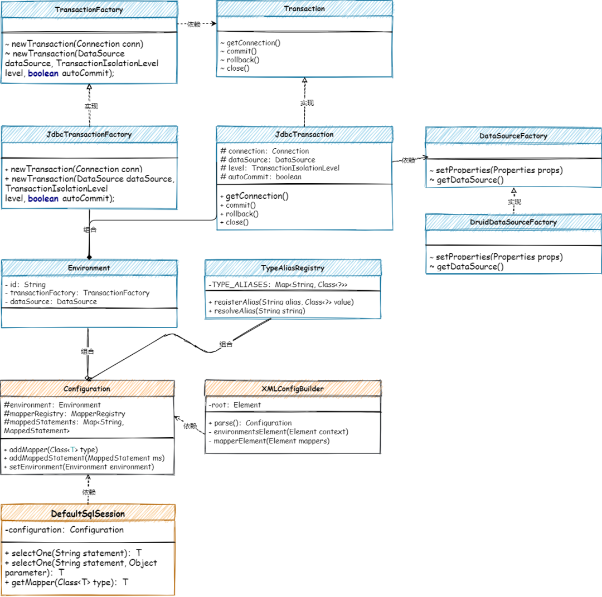

# 手撸Mybatis-04-数据源的解析、创建和使用

<!-- START doctoc generated TOC please keep comment here to allow auto update -->
<!-- DON'T EDIT THIS SECTION, INSTEAD RE-RUN doctoc TO UPDATE -->

- [零、源码](#%E9%9B%B6%E6%BA%90%E7%A0%81)
- [二、目标](#%E4%BA%8C%E7%9B%AE%E6%A0%87)
- [三、设计](#%E4%B8%89%E8%AE%BE%E8%AE%A1)
- [四、实现](#%E5%9B%9B%E5%AE%9E%E7%8E%B0)
    - [1. 依赖关系](#1-%E4%BE%9D%E8%B5%96%E5%85%B3%E7%B3%BB)
    - [2. 事务管理](#2-%E4%BA%8B%E5%8A%A1%E7%AE%A1%E7%90%86)
        - [2.1 事务接口](#21-%E4%BA%8B%E5%8A%A1%E6%8E%A5%E5%8F%A3)
        - [2.2 事务工厂](#22-%E4%BA%8B%E5%8A%A1%E5%B7%A5%E5%8E%82)
    - [3. 类型别名注册器](#3-%E7%B1%BB%E5%9E%8B%E5%88%AB%E5%90%8D%E6%B3%A8%E5%86%8C%E5%99%A8)
        - [3.1 基础注册器](#31-%E5%9F%BA%E7%A1%80%E6%B3%A8%E5%86%8C%E5%99%A8)
        - [3.2 注册事务](#32-%E6%B3%A8%E5%86%8C%E4%BA%8B%E5%8A%A1)
    - [4. 解析数据源配置](#4-%E8%A7%A3%E6%9E%90%E6%95%B0%E6%8D%AE%E6%BA%90%E9%85%8D%E7%BD%AE)
    - [5. SQL执行和结果封装](#5-sql%E6%89%A7%E8%A1%8C%E5%92%8C%E7%BB%93%E6%9E%9C%E5%B0%81%E8%A3%85)
- [五、测试](#%E4%BA%94%E6%B5%8B%E8%AF%95)
    - [1. 事先准备](#1-%E4%BA%8B%E5%85%88%E5%87%86%E5%A4%87)
        - [1.1 创建库表](#11-%E5%88%9B%E5%BB%BA%E5%BA%93%E8%A1%A8)
        - [2. 配置数据源](#2-%E9%85%8D%E7%BD%AE%E6%95%B0%E6%8D%AE%E6%BA%90)
        - [3. 配置Mapper](#3-%E9%85%8D%E7%BD%AEmapper)
    - [2. 单元测试](#2-%E5%8D%95%E5%85%83%E6%B5%8B%E8%AF%95)
- [六、总结](#%E5%85%AD%E6%80%BB%E7%BB%93)

<!-- END doctoc generated TOC please keep comment here to allow auto update -->

[TOC]

## 零、源码

工程源码在本项目`mybatis-code`-`mybatis-04`

## 二、目标

在上一章节我们解析 XML 中的 SQL 配置信息，并在代理对象调用 DefaultSqlSession
中进行获取和打印操作，从整个框架结构来看我们解决了对象的代理、Mapper的映射、SQL的初步解析，那么接下来就应该是连库和执行SQL语句并返回结果了。

那么这部分内容就会涉及到解析 XML 中关于 dataSource 数据源信息配置，并建立事务管理和连接池的启动和使用。并将这部分能力在 DefaultSqlSession 执行 SQL
语句时进行调用。但为了不至于在一个章节把整个工程撑大，这里我们会把重点放到解析配置、建立事务框架和引入 DRUID 连接池，以及初步完成 SQL 的执行和结果简单包装上。便于读者先熟悉整个框架结构，在后续章节再陆续迭代和完善框架细节。

## 三、设计

建立数据源连接池和 JDBC 事务工厂操作，并以 xml 配置数据源信息为入口，在 XMLConfigBuilder 中添加数据源解析和构建操作，向配置类configuration添加 JDBC 操作环境信息。以便在
DefaultSqlSession 完成对 JDBC 执行 SQL 的操作。


- 在 parse 中解析 XML DB 链接配置信息，并完成事务工厂和连接池的注册环境到配置类的操作。
- 与上一章节改造 selectOne 方法的处理，不再是打印 SQL 语句，而是把 SQL 语句放到 DB 连接池中进行执行，以及完成简单的结果封装。

## 四、实现

### 1. 依赖关系

数据源的解析和使用核心类关系，如图



- 以事务接口 Transaction 和事务工厂 TransactionFactory 的实现，包装数据源 DruidDataSourceFactory 的功能。这里的数据源连接池我们采用的是阿里的 Druid，暂时还没有实现
  Mybatis 的 JNDI 和 Pooled 连接池，这部分可以后续专门以数据源连接池的专项来开发。
- 当所有的数据源相关功能准备好后，就是在 XMLConfigBuilder 解析 XML 配置操作中，对数据源的配置进行解析以及创建出相应的服务，存放到 Configuration 的环境配置中。
- 最后在 DefaultSqlSession#selectOne 方法中完成 SQL 的执行和结果封装，最终就把整个 Mybatis 核心脉络串联出来了。

### 2. 事务管理

一次数据库的操作应该具有事务管理能力，而不是通过 JDBC 获取链接后直接执行即可。还应该把控链接、提交、回滚和关闭的操作处理。所以这里我们结合 JDBC 的能力封装事务管理。

#### 2.1 事务接口

```java
import java.sql.Connection;
import java.sql.SQLException;

/**
 * @description: 事务接口
 * @date: 2022/5/22 10:24
 **/
public interface Transaction {

    Connection getConnection() throws SQLException;

    void commit() throws SQLException;

    void rollback() throws SQLException;

    void close() throws SQLException;

}
```

定义标准的事务接口，链接、提交、回滚、关闭，具体可以由不同的事务方式进行实现，包括：JDBC和托管事务，托管事务是交给 Spring 这样的容器来管理。

```java
import com.collect.mybatis.session.TransactionIsolationLevel;
import com.collect.mybatis.transaction.Transaction;
import lombok.extern.slf4j.Slf4j;

import javax.sql.DataSource;
import java.sql.Connection;
import java.sql.SQLException;

/**
 * @description: JDBC 事务，直接利用 JDBC 的 commit、rollback。依赖于数据源获得的连接来管理事务范围。
 * @date: 2022/5/22 10:25
 **/
@Slf4j
public class JdbcTransaction implements Transaction {

    protected Connection connection;
    protected DataSource dataSource;
    protected TransactionIsolationLevel level = TransactionIsolationLevel.NONE;
    protected boolean autoCommit;

    public JdbcTransaction(DataSource dataSource, TransactionIsolationLevel level, boolean autoCommit) {
        this.dataSource = dataSource;
        this.level = level;
        this.autoCommit = autoCommit;
    }

    public JdbcTransaction(Connection connection) {
        this.connection = connection;
    }

    @Override
    public Connection getConnection() throws SQLException {
        connection = dataSource.getConnection();
        connection.setTransactionIsolation(level.getLevel());
        connection.setAutoCommit(autoCommit);
        return connection;
    }

    @Override
    public void commit() throws SQLException {
        if (connection != null && !connection.getAutoCommit()) {
            connection.commit();
            log.info("[JdbcTransaction]Jdbc Transaction commit...");
        }
    }

    @Override
    public void rollback() throws SQLException {
        if (connection != null && !connection.getAutoCommit()) {
            connection.rollback();
            log.info("[JdbcTransaction]Jdbc Transaction rollback...");
        }
    }

    @Override
    public void close() throws SQLException {
        if (connection != null && !connection.getAutoCommit()) {
            connection.close();
            log.info("[JdbcTransaction]Jdbc Transaction close...");
        }
    }
}
```

在 JDBC 事务实现类中，封装了获取链接、提交事务等操作，其实使用的也就是 JDBC 本身提供的能力。

#### 2.2 事务工厂

```java
import com.collect.mybatis.session.TransactionIsolationLevel;

import javax.sql.DataSource;
import java.sql.Connection;

/**
 * @description: 事务工厂
 * @date: 2022/5/22 10:29
 **/
public interface TransactionFactory {

    /**
     * 根据 Connection 创建 Transaction
     *
     * @param conn Existing database connection
     * @return Transaction
     */
    Transaction newTransaction(Connection conn);

    /**
     * 根据数据源和事务隔离级别创建 Transaction
     *
     * @param dataSource DataSource to take the connection from
     * @param level      Desired isolation level
     * @param autoCommit Desired autocommit
     * @return Transaction
     */
    Transaction newTransaction(DataSource dataSource, TransactionIsolationLevel level, boolean autoCommit);

}
```

以工厂方法模式包装 JDBC 事务实现，为每一个事务实现都提供一个对应的工厂。与简单工厂的接口包装不同。

### 3. 类型别名注册器

在 Mybatis 框架中我们所需要的基本类型、数组类型以及自己定义的事务实现和事务工厂都需要注册到类型别名的注册器中进行管理，在我们需要使用的时候可以从注册器中获取到具体的对象类型，之后在进行实例化的方式进行使用。

#### 3.1 基础注册器

```java
import java.util.HashMap;
import java.util.Locale;
import java.util.Map;

/**
 * @description: 类型别名注册机
 * @date: 2022/5/22 10:36
 **/
public class TypeAliasRegistry {

    private final Map<String, Class<?>> TYPE_ALIASES = new HashMap<>();

    public TypeAliasRegistry() {
        // 构造函数里注册系统内置的类型别名
        registerAlias("string", String.class);

        // 基本包装类型
        registerAlias("byte", Byte.class);
        registerAlias("long", Long.class);
        registerAlias("short", Short.class);
        registerAlias("int", Integer.class);
        registerAlias("integer", Integer.class);
        registerAlias("double", Double.class);
        registerAlias("float", Float.class);
        registerAlias("boolean", Boolean.class);
    }

    public void registerAlias(String alias, Class<?> value) {
        String key = alias.toLowerCase(Locale.ENGLISH);
        TYPE_ALIASES.put(key, value);
    }

    public <T> Class<T> resolveAlias(String string) {
        String key = string.toLowerCase(Locale.ENGLISH);
        return (Class<T>) TYPE_ALIASES.get(key);
    }

}
```

在 TypeAliasRegistry 类型别名注册器中先做了一些基本的类型注册，以及提供 registerAlias 注册方法和 resolveAlias 获取方法。

#### 3.2 注册事务

```java
import com.collect.mybatis.binding.MapperRegistry;
import com.collect.mybatis.datasource.druid.DruidDataSourceFactory;
import com.collect.mybatis.datasource.pooled.PooledDataSourceFactory;
import com.collect.mybatis.datasource.unpooled.UnPooledDataSourceFactory;
import com.collect.mybatis.mapping.Environment;
import com.collect.mybatis.mapping.MappedStatement;
import com.collect.mybatis.transaction.jdbc.JdbcTransactionFactory;
import com.collect.mybatis.type.TypeAliasRegistry;

import java.util.HashMap;
import java.util.Map;

/**
 * @description: 配置项
 * @author: panhongtong
 * @date: 2022/5/20 08:56
 **/
public class Configuration {

    //环境
    protected Environment environment;

    // 映射注册机
    protected MapperRegistry mapperRegistry = new MapperRegistry(this);

    // 映射的语句，存在Map里
    protected final Map<String, MappedStatement> mappedStatements = new HashMap<>();

    // 类型别名注册机
    protected final TypeAliasRegistry typeAliasRegistry = new TypeAliasRegistry();

    public Configuration() {
        typeAliasRegistry.registerAlias("JDBC", JdbcTransactionFactory.class);
        typeAliasRegistry.registerAlias("DRUID", DruidDataSourceFactory.class);
    }

    //...
}
```

在 Configuration 配置选项类中，添加类型别名注册机，通过构造函数添加 JDBC、DRUID 注册操作。

读者应该注意到，整个 Mybatis 的操作都是使用 Configuration 配置项进行串联流程，所以所有内容都会在 Configuration 中进行链接。

### 4. 解析数据源配置

通过在 XML 解析器 XMLConfigBuilder 中，扩展对环境信息的解析，我们这里把数据源、事务类内容称为操作 SQL 的环境。解析后把配置信息写入到 Configuration 配置项中，便于后续使用。

```java
/**
 * @description: XML配置构建器，建造者模式，继承BaseBuilder
 * @date: 2022/5/20 09:08
 **/
public class XMLConfigBuilder extends BaseBuilder {

    public Configuration parse() {
        try {
            // 环境
            environmentsElement(root.element("environments"));
            // 解析映射器
            mapperElement(root.element("mappers"));
        } catch (Exception e) {
            throw new RuntimeException("Error parsing SQL Mapper Configuration. Cause: " + e, e);
        }
        return configuration;
    }

    private void environmentsElement(Element context) throws Exception {
        String environment = context.attributeValue("default");
        List<Element> environmentList = context.elements("environment");
        for (Element e : environmentList) {
            String id = e.attributeValue("id");
            if (environment.equals(id)) {
                // 事务管理器
                TransactionFactory txFactory = (TransactionFactory) typeAliasRegistry.resolveAlias(e.element("transactionManager").attributeValue("type")).newInstance();
                // 数据源
                Element dataSourceElement = e.element("dataSource");
                DataSourceFactory dataSourceFactory = (DataSourceFactory) typeAliasRegistry.resolveAlias(dataSourceElement.attributeValue("type")).newInstance();
                List<Element> propertyList = dataSourceElement.elements("property");
                Properties props = new Properties();
                for (Element property : propertyList) {
                    props.setProperty(property.attributeValue("name"), property.attributeValue("value"));
                }
                dataSourceFactory.setProperties(props);
                DataSource dataSource = dataSourceFactory.getDataSource();
                // 构建环境
                Environment.Builder environmentBuilder = new Environment.Builder(id)
                        .transactionFactory(txFactory)
                        .dataSource(dataSource);
                configuration.setEnvironment(environmentBuilder.build());
            }
        }
    }

}
```

- 以 XMLConfigBuilder#parse 解析扩展对数据源解析操作，在 environmentsElement 方法中包括事务管理器解析和从类型注册器中读取到事务工程的实现类，同理数据源也是从类型注册器中获取。
- 最后把事务管理器和数据源的处理，通过环境构建 Environment.Builder 存放到 Configuration 配置项中，也就可以通过 Configuration 存在的地方都可以获取到数据源了。

### 5. SQL执行和结果封装

在上一章节中在 DefaultSqlSession#selectOne 只是打印了 XML 中配置的 SQL 语句，现在把数据源的配置加载进来以后，就可以把 SQL 语句放到数据源中进行执行以及结果封装。

```java
/**
 * @description: 默认SqlSession
 * @date: 2022/5/19 08:38
 **/
public class DefaultSqlSession implements SqlSession {

    private Configuration configuration;

    public DefaultSqlSession(Configuration configuration) {
        this.configuration = configuration;
    }

    @Override
    public <T> T selectOne(String statement, Object parameter) {
        try {
            MappedStatement mappedStatement = configuration.getMappedStatement(statement);
            Environment environment = configuration.getEnvironment();

            Connection connection = environment.getDataSource().getConnection();

            BoundSql boundSql = mappedStatement.getBoundSql();
            PreparedStatement preparedStatement = connection.prepareStatement(boundSql.getSql());
            preparedStatement.setLong(1, Long.parseLong(((Object[]) parameter)[0].toString()));
            ResultSet resultSet = preparedStatement.executeQuery();

            List<T> objList = resultSet2Obj(resultSet, Class.forName(boundSql.getResultType()));
            return objList.get(0);
        } catch (Exception e) {
            e.printStackTrace();
            return null;
        }
    }

    // ...

}
```

- 在 selectOne 方法中获取 Connection 数据源链接，并简单的执行 SQL 语句，并对执行的结果进行封装处理。
- 因为目前这部分主要是为了大家串联出整个功能结构，所以关于 SQL 的执行、参数传递和结果封装都是写死的，后续我们进行扩展。

## 五、测试

### 1. 事先准备

#### 1.1 创建库表

创建一个数据库名称为 test_mybatis 并在库中创建表 user 以及添加测试数据，如下：

```sql
CREATE TABLE
    user
(
    id         bigint NOT NULL AUTO_INCREMENT COMMENT '自增ID',
    userId     VARCHAR(9) COMMENT '用户ID',
    userHead   VARCHAR(16) COMMENT '用户头像',
    createTime TIMESTAMP NULL COMMENT '创建时间',
    updateTime TIMESTAMP NULL COMMENT '更新时间',
    userName   VARCHAR(64),
    PRIMARY KEY (id)
) ENGINE=InnoDB DEFAULT CHARSET=utf8;

insert into user (id, userId, userHead, createTime, updateTime, userName)
values (1, '10001', '1_04', '2022-04-13 00:00:00', '2022-04-13 00:00:00', '大福');    
```

#### 2. 配置数据源

```xml

<environments default="development">
    <environment id="development">
        <transactionManager type="JDBC"/>
        <dataSource type="DRUID">
            <property name="driver" value="com.mysql.cj.jdbc.Driver"/>
            <property name="url" value="jdbc:mysql://127.0.0.1:3306/test_mybatis?useUnicode=true"/>
            <property name="username" value="root"/>
            <property name="password" value="123456"/>
        </dataSource>
    </environment>
</environments>
```

- 通过 `mybatis-config-datasource.xml` 配置数据源信息，包括：driver、url、username、password
- 另外这里要注意下，DataSource 配置的是 DRUID，因为我们实现的是这个数据源的处理方式。

#### 3. 配置Mapper

```xml

<select id="queryUserInfoById" parameterType="java.lang.Long" resultType="com.collection.mybatis.test.model.User">
    SELECT id, userId, userName, userHead
    FROM user
    where id = #{id}
</select>
```

Mapper 的配置内容在上一章节的解析学习中已经做了配置，本章节做了简单的调整。

### 2. 单元测试

```
@Test
public void test_SqlSessionFactory() throws IOException {
    // 1. 从SqlSessionFactory中获取SqlSession
    SqlSessionFactory sqlSessionFactory = new SqlSessionFactoryBuilder().build(Resources.getResourceAsReader("mybatis-config-datasource.xml"));
    SqlSession sqlSession = sqlSessionFactory.openSession();
    
    // 2. 获取映射器对象
    IUserDao userDao = sqlSession.getMapper(IUserDao.class);
    
    // 3. 测试验证
    User user = userDao.queryUserInfoById(1L);
    logger.info("测试结果：{}", JSON.toJSONString(user));
}
```

单元测试没有什么改变，仍是通过 SqlSessionFactory 中获取 SqlSession 并获得映射对象和执行方法调用。

**测试结果**

```
INFO [main] - {dataSource-1} inited
INFO [main] - 测试结果：{"id":1,"userId":"10001","userHead":"1_04","createTime":1649779200000}
```

- 从现在的测试结果已经可以看出，通过我们对数据源的解析、包装和使用，已经可以对 SQL 语句进行执行和包装返回的结果信息了。
- 读者在学习的过程中可以调试下代码，看看每一步都是如何完成执行步骤的，也在这个过程中进行学习 Mybatis 框架的设计技巧。

## 六、总结

- 以解析 XML 配置解析为入口，添加数据源的整合和包装，引出事务工厂对 JDBC 事务的处理，并加载到环境配置中进行使用。
- 那么通过数据源的引入就可以在 DefaultSqlSession 中从 Configuration 配置引入环境信息，把对应的 SQL 语句提交给 JDBC 进行处理并简单封装结果数据。
- 结合本章节建立起来的框架结构，数据源、事务、简单的SQL调用，下个章节将继续这部分内容的扩展处理，让整个功能模块逐渐完善。