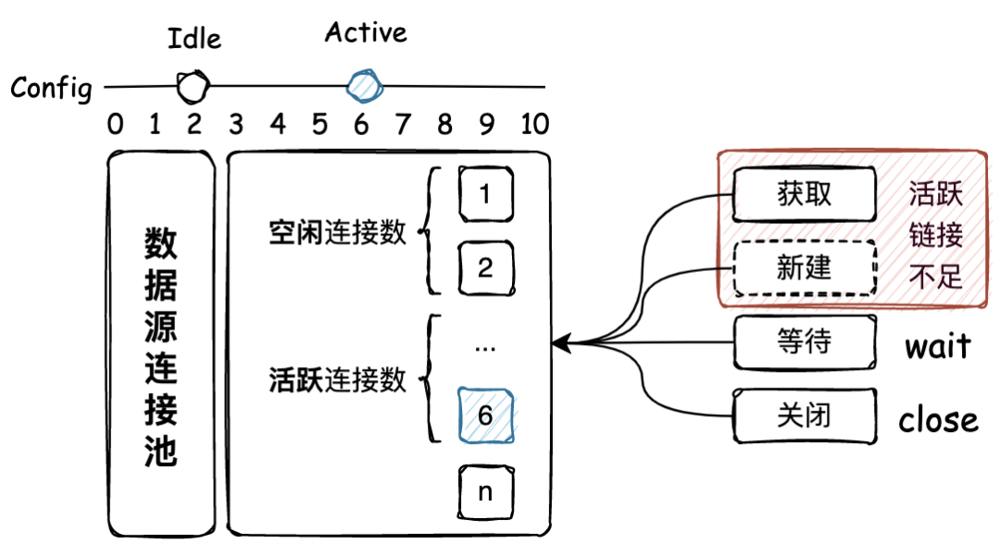
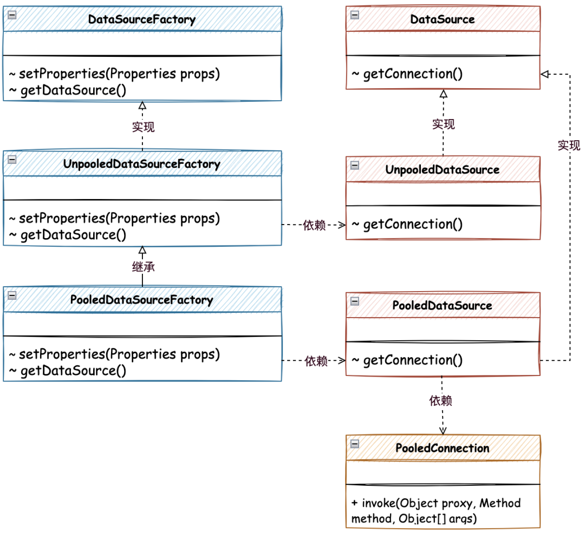

# 手撸Mybatis-05-数据源池化技术实现

<!-- START doctoc generated TOC please keep comment here to allow auto update -->
<!-- DON'T EDIT THIS SECTION, INSTEAD RE-RUN doctoc TO UPDATE -->

- [一、源码](#%E4%B8%80%E6%BA%90%E7%A0%81)
- [二、目标](#%E4%BA%8C%E7%9B%AE%E6%A0%87)
- [三、设计](#%E4%B8%89%E8%AE%BE%E8%AE%A1)
- [四、实现](#%E5%9B%9B%E5%AE%9E%E7%8E%B0)
    - [1. 无池化链接实现](#1-%E6%97%A0%E6%B1%A0%E5%8C%96%E9%93%BE%E6%8E%A5%E5%AE%9E%E7%8E%B0)
    - [2. 有池化连接实现](#2-%E6%9C%89%E6%B1%A0%E5%8C%96%E8%BF%9E%E6%8E%A5%E5%AE%9E%E7%8E%B0)
        - [2.1 池化连接的代理](#21-%E6%B1%A0%E5%8C%96%E8%BF%9E%E6%8E%A5%E7%9A%84%E4%BB%A3%E7%90%86)
        - [2.2 pushConnection 回收链接](#22-pushconnection-%E5%9B%9E%E6%94%B6%E9%93%BE%E6%8E%A5)
    - [3. 数据源工厂](#3-%E6%95%B0%E6%8D%AE%E6%BA%90%E5%B7%A5%E5%8E%82)
        - [3.1 无池化工厂](#31-%E6%97%A0%E6%B1%A0%E5%8C%96%E5%B7%A5%E5%8E%82)
        - [3.2 有池化工厂](#32-%E6%9C%89%E6%B1%A0%E5%8C%96%E5%B7%A5%E5%8E%82)
    - [4. 新增类型别名注册器](#4-%E6%96%B0%E5%A2%9E%E7%B1%BB%E5%9E%8B%E5%88%AB%E5%90%8D%E6%B3%A8%E5%86%8C%E5%99%A8)
- [**五、测试**](#%E4%BA%94%E6%B5%8B%E8%AF%95)
    - [1. 事先准备](#1-%E4%BA%8B%E5%85%88%E5%87%86%E5%A4%87)
        - [1.1 创建库表](#11-%E5%88%9B%E5%BB%BA%E5%BA%93%E8%A1%A8)
        - [1.2 配置数据源](#12-%E9%85%8D%E7%BD%AE%E6%95%B0%E6%8D%AE%E6%BA%90)
        - [1.3 配置Mapper](#13-%E9%85%8D%E7%BD%AEmapper)
    - [2. 单元测试](#2-%E5%8D%95%E5%85%83%E6%B5%8B%E8%AF%95)
        - [2.1 无池化测试](#21-%E6%97%A0%E6%B1%A0%E5%8C%96%E6%B5%8B%E8%AF%95)
        - [2.2 有池化测试](#22-%E6%9C%89%E6%B1%A0%E5%8C%96%E6%B5%8B%E8%AF%95)
- [**六、总结**](#%E5%85%AD%E6%80%BB%E7%BB%93)

<!-- END doctoc generated TOC please keep comment here to allow auto update -->

[TOC]

## 一、源码

工程源码在本项目`mybatis-code`-`mybatis-05`

## 二、目标

在上一章节我们解析了 XML 中数据源配置信息，并使用 Druid 创建数据源完成数据库的操作。但其实在 Mybatis 中是有自己的数据源实现的，包括无池化的 UnPooledDataSource 实现方式和有池化的
PooledDataSource 实现方式。

那么本章节我们就来实现一下关于池化数据源的处理，通过这些实现读者也能更好的理解在我们日常开发中一些关于数据源的配置属性到底意欲何为，包括：最大活跃连接数、空闲连接数、检测时长等，在连接池中所起到的作用。

## 三、设计

首先你可以把池化技术理解为享元模式的具体实现方案，通常我们对一些需要较高创建成本且高频使用的资源，需要进行缓存或者也称预热处理。并把这些资源存放到一个预热池子中，需要用的时候从池子中获取，使用完毕再进行使用。通过池化可以非常有效的控制资源的使用成本，包括；资源数量、空闲时长、获取方式等进行统一控制和管理。如图



- 通过提供统一的连接池中心，存放数据源链接，并根据配置按照请求获取链接的操作，创建连接池的数据源链接数量。这里就包括了最大空闲连接和最大活跃连接，都随着创建过程被控制。
-
此外由于控制了连接池中连接的数量，所以当外部从连接池获取链接时，如果连接已满则会进行循环等待。这也是大家日常使用DB连接池，如果一个SQL操作引起了慢查询，则会导致整个服务进入瘫痪的阶段，各个和数据库相关的接口调用，都不能获得到链接，接口查询TP99陡然增高，系统开始大量报警。*
那连接池可以配置的很大吗，也不可以，因为连接池要和数据库所分配的连接池对应上，避免应用配置连接池超过数据库所提供的连接池数量，否则会出现夯住不能分配链接的问题，导致数据库拖垮从而引起连锁反应。*

## 四、实现

池化数据源核心类关系，如图



- 在 Mybatis 数据源的实现中，包括两部分分为无池化的 UnpooledDataSource 实现类和有池化的 PooledDataSource 实现类，池化的实现类 PooledDataSource 以对无池化的
  UnpooledDataSource 进行扩展处理。把创建出来的链接保存到内存中，记录为空闲连接和活跃连接，在不同的阶段进行使用。
- PooledConnection 是对连接的代理操作，通过invoke方法的反射调用，对关闭的连接进行回收处理，并使用 notifyAll 通知正在等待链接的用户进行抢链接。
- 另外是对 DataSourceFactory 数据源工厂接口的实现，由无池化工厂实现后，有池化工厂继承的方式进行处理，这里没有太多的复杂操作，池化的处理主要集中在 PooledDataSource 类中进行处理。

### 1. 无池化链接实现

对于数据库连接池的实现，不一定非得提供池化技术，对于某些场景可以只使用无池化的连接池。那么在实现的过程中，可以把无池化的实现和池化实现拆分解耦，在需要的时候只需要配置对应的数据源即可。

```java
public class UnpooledDataSource implements DataSource {

    private ClassLoader driverClassLoader;
    // 驱动配置，也可以扩展属性信息 driver.encoding=UTF8
    private Properties driverProperties;
    // 驱动注册器
    private static Map<String, Driver> registeredDrivers = new ConcurrentHashMap<>();
    // 驱动
    private String driver;
    // DB 链接地址
    private String url;
    // 账号
    private String username;
    // 密码
    private String password;
    // 是否自动提交
    private Boolean autoCommit;
    // 事务级别
    private Integer defaultTransactionIsolationLevel;

    static {
        Enumeration<Driver> drivers = DriverManager.getDrivers();
        while (drivers.hasMoreElements()) {
            Driver driver = drivers.nextElement();
            registeredDrivers.put(driver.getClass().getName(), driver);
        }
    }

    private Connection doGetConnection(Properties properties) throws SQLException {
        initializerDriver();
        Connection connection = DriverManager.getConnection(url, properties);
        if (autoCommit != null && autoCommit != connection.getAutoCommit()) {
            connection.setAutoCommit(autoCommit);
        }
        if (defaultTransactionIsolationLevel != null) {
            connection.setTransactionIsolation(defaultTransactionIsolationLevel);
        }
        return connection;
    }

    /**
     * 初始化驱动
     */
    private synchronized void initializerDriver() throws SQLException {
        if (!registeredDrivers.containsKey(driver)) {
            try {
                Class<?> driverType = Class.forName(driver, true, driverClassLoader);
                // https://www.kfu.com/~nsayer/Java/dyn-jdbc.html
                Driver driverInstance = (Driver) driverType.newInstance();
                DriverManager.registerDriver(new DriverProxy(driverInstance));
                registeredDrivers.put(driver, driverInstance);
            } catch (Exception e) {
                throw new SQLException("Error setting driver on UnpooledDataSource. Cause: " + e);
            }
        }
    }

}
```

无池化的数据源连接实现比较简单，核心在于 initializerDriver 初始化驱动中使用了 Class.forName 和 newInstance 的方式创建了数据源链接操作。

在创建完成连接以后，把链接存放到驱动注册器中，方便后续使用中可以直接获取链接，避免重复创建所带来的资源消耗。

### 2. 有池化连接实现

有池化的数据源连接，核心在于对无池化连接的包装，同时提供了相应的池化技术实现，包括：pushConnection、popConnection、forceCloseAll、pingConnection 的操作处理。

这样当用户想要获取连接的时候，则会从连接池中进行获取，同时判断是否有空闲链接、最大活跃链接多少，以及是否需要等待处理或是最终抛出异常。

#### 2.1 池化连接的代理

由于我们需要对连接进行池化处理，所以当连接调用一些 CLOSE 方法的时候，也需要把连接从池中关闭和恢复可用，允许其他用户获取到连接。那么这里就需要对连接类进行代理包装，处理 CLOSE 方法。

```java
public class PooledConnection implements InvocationHandler {

    @Override
    public Object invoke(Object proxy, Method method, Object[] args) throws Throwable {
        String methodName = method.getName();
        // 如果是调用 CLOSE 关闭链接方法，则将链接加入连接池中，并返回null
        if (CLOSE.hashCode() == methodName.hashCode() && CLOSE.equals(methodName)) {
            dataSource.pushConnection(this);
            return null;
        } else {
            if (!Object.class.equals(method.getDeclaringClass())) {
                // 除了toString()方法，其他方法调用之前要检查connection是否还是合法的,不合法要抛出SQLException
                checkConnection();
            }
            // 其他方法交给connection去调用
            return method.invoke(realConnection, args);
        }
    }

}
```

通过 PooledConnection 实现 InvocationHandler#invoke 方法，包装代理连接，这样就可以对具体的调用方法进行控制了。

在 invoke 方法中处理对 CLOSE 方法控制以外，排除 toString 等Object 的方法后，则是其他真正需要被 DB 链接处理的方法了。

那么这里有一个对于 CLOSE 方法的数据源回收操作 dataSource.pushConnection(this); 有一个具体的实现方法，在池化实现类 PooledDataSource 中进行处理。

#### 2.2 pushConnection 回收链接

```java
protected void pushConnection(PooledConnection connection)throws SQLException{
synchronized (state){
        state.activeConnections.remove(connection);
        // 判断链接是否有效
        if(connection.isValid()){
        // 如果空闲链接小于设定数量，也就是太少时
        if(state.idleConnections.size()<poolMaximumIdleConnections &&connection.getConnectionTypeCode()==expectedConnectionTypeCode){
        state.accumulatedCheckoutTime+=connection.getCheckoutTime();
        if(!connection.getRealConnection().getAutoCommit()){
        connection.getRealConnection().rollback();
        }
        // 实例化一个新的DB连接，加入到idle列表
        PooledConnection newConnection=new PooledConnection(connection.getRealConnection(),this);
        state.idleConnections.add(newConnection);
        newConnection.setCreatedTimestamp(connection.getCreatedTimestamp());
        newConnection.setLastUsedTimestamp(connection.getLastUsedTimestamp());
        connection.invalidate();
        logger.info("Returned connection "+newConnection.getRealHashCode()+" to pool.");
        // 通知其他线程可以来抢DB连接了
        state.notifyAll();
        }
        // 否则，空闲链接还比较充足
        else{
        state.accumulatedCheckoutTime+=connection.getCheckoutTime();
        if(!connection.getRealConnection().getAutoCommit()){
        connection.getRealConnection().rollback();
        }
        // 将connection关闭
        connection.getRealConnection().close();
        logger.info("Closed connection "+connection.getRealHashCode()+".");
        connection.invalidate();
        }
        }else{
        logger.info("A bad connection ("+connection.getRealHashCode()+") attempted to return to the pool, discarding connection.");
        state.badConnectionCount++;
        }
        }
        }
```

popConnection 获取连接是一个 while 死循环操作，只有获取到连接抛异常才会退出循环，如果仔细阅读这些异常代码，是不是也是你在做一些开发的时候所遇到的异常呢。

获取连接的过程会使用 synchronized
进行加锁，因为所有线程在资源竞争的情况下，都需要进行加锁处理。在加锁的代码块中通过判断是否还有空闲链接进行返回，如果没有则会判断活跃连接数是否充足，不充足则进行创建后返回。在这里也会遇到活跃连接已经进行循环等待的过程，最后再不能获取则抛出异常。

### 3. 数据源工厂

数据源工厂包括两部分，分别是无池化和有池化，有池化的工程继承无池化工厂，因为在 Mybatis 源码的实现类中，这样就可以减少对 Properties
统一包装的反射方式的属性处理。由于我们暂时没有对这块逻辑进行开发，只是简单的获取属性传参，所以还不能体现出这样的继承有多便捷，读者可以参考源码进行理解。

#### 3.1 无池化工厂

```java
public class UnpooledDataSourceFactory implements DataSourceFactory {

    protected Properties props;

    @Override
    public void setProperties(Properties props) {
        this.props = props;
    }

    @Override
    public DataSource getDataSource() {
        UnpooledDataSource unpooledDataSource = new UnpooledDataSource();
        unpooledDataSource.setDriver(props.getProperty("driver"));
        unpooledDataSource.setUrl(props.getProperty("url"));
        unpooledDataSource.setUsername(props.getProperty("username"));
        unpooledDataSource.setPassword(props.getProperty("password"));
        return unpooledDataSource;
    }

}
```

简单包装 getDataSource 获取数据源处理，把必要的参数进行传递过去。在 Mybatis 源码中这部分则是进行了大量的反射字段处理的方式进行存放和获取的。

#### 3.2 有池化工厂

```java
public class PooledDataSourceFactory extends UnpooledDataSourceFactory {

    @Override
    public DataSource getDataSource() {
        PooledDataSource pooledDataSource = new PooledDataSource();
        pooledDataSource.setDriver(props.getProperty("driver"));
        pooledDataSource.setUrl(props.getProperty("url"));
        pooledDataSource.setUsername(props.getProperty("username"));
        pooledDataSource.setPassword(props.getProperty("password"));
        return pooledDataSource;
    }

}
```

有池化的数据源工厂实现的也比较简单，只是继承 UnpooledDataSourceFactory 共用获取属性的能力，以及实例化出池化数据源即可。

### 4. 新增类型别名注册器

当我们新开发了两个数据源和对应的工厂实现类以后，则需要把它们配置到 Configuration 中，这样才能在解析 XML 时候根据不同的数据源类型获取和实例化对应的实现类。

```java
public class Configuration {

    // 类型别名注册机
    protected final TypeAliasRegistry typeAliasRegistry = new TypeAliasRegistry();

    public Configuration() {
        typeAliasRegistry.registerAlias("JDBC", JdbcTransactionFactory.class);

        typeAliasRegistry.registerAlias("DRUID", DruidDataSourceFactory.class);
        typeAliasRegistry.registerAlias("UNPOOLED", UnpooledDataSourceFactory.class);
        typeAliasRegistry.registerAlias("POOLED", PooledDataSourceFactory.class);
    }

}
```

在构造方法 Configuration 添加 UNPOOLED、POOLED 两个数据源注册到类型注册器中，方便后续使用 XMLConfigBuilder#environmentsElement 方法解析 XML 处理数据源时候进行使用。

## **五、测试**

### 1. 事先准备

#### 1.1 创建库表

创建一个数据库名称为 mybatis 并在库中创建表 user 以及添加测试数据，如下：

```sql
CREATE TABLE
    user
(
    id         bigint NOT NULL AUTO_INCREMENT COMMENT '自增ID',
    userId     VARCHAR(9) COMMENT '用户ID',
    userHead   VARCHAR(16) COMMENT '用户头像',
    createTime TIMESTAMP NULL COMMENT '创建时间',
    updateTime TIMESTAMP NULL COMMENT '更新时间',
    userName   VARCHAR(64),
    PRIMARY KEY (id)
) ENGINE=InnoDB DEFAULT CHARSET=utf8;

insert into user (id, userId, userHead, createTime, updateTime, userName)
values (1, '10001', '1_04', '2022-04-13 00:00:00', '2022-04-13 00:00:00', '大福');

```

#### 1.2 配置数据源

```
<environments default="development">
    <environment id="development">
        <transactionManager type="JDBC"/>
        <dataSource type="DRUID">
            <property name="driver" value="com.mysql.jdbc.Driver"/>
            <property name="url" value="jdbc:mysql://127.0.0.1:3306/test_mybatis?useUnicode=true"/>
            <property name="username" value="root"/>
            <property name="password" value="123456"/>
        </dataSource>
    </environment>
</environments>
```

通过 `mybatis-config-datasource.xml` 配置数据源信息，包括：driver、url、username、password

在这里 dataSource 的配置又上一章节的 DRUID 修改为，UNPOOLED 和 POOLED 进行测试验证。这两个数据源也就是我们本章节自己实现的数据源。

#### 1.3 配置Mapper

```
<select id="queryUserInfoById" parameterType="java.lang.Long" resultType="cn.bugstack.mybatis.test.po.User">
    SELECT id, userId, userName, userHead
    FROM user
    where id = #{id}
</select>
```

Mapper 的配置内容在上一章节的解析学习中已经做了配置，本章节做了简单的调整。

### 2. 单元测试

```
@Test
public void test_SqlSessionFactory() throws IOException {
    // 1. 从SqlSessionFactory中获取SqlSession
    SqlSessionFactory sqlSessionFactory = new SqlSessionFactoryBuilder().build(Resources.getResourceAsReader("mybatis-config-datasource.xml"));
    SqlSession sqlSession = sqlSessionFactory.openSession();
    
    // 2. 获取映射器对象
    IUserDao userDao = sqlSession.getMapper(IUserDao.class);
    
    // 3. 测试验证
    for (int i = 0; i < 50; i++) {
        User user = userDao.queryUserInfoById(1L);
        logger.info("测试结果：{}", JSON.toJSONString(user));
    }
}
```

在无池化和有池化的测试中，基础的单元测试类不需要改变，仍是通过 SqlSessionFactory 中获取 SqlSession 并获得映射对象和执行方法调用。另外这里是添加了50次的查询调用，便于验证连接池的创建和获取以及等待。

变化的在于 mybatis-config-datasource.xml 中 dataSource 数据源类型的调整 `dataSource type="POOLED/UNPOOLED"`

#### 2.1 无池化测试

```
<dataSource type="UNPOOLED"></dataSource>
```

**测试结果**

```
 INFO [main] - 测试结果：{"id":1,"userId":"10001","userName":"大福","userHead":"1_04"}
 INFO [main] - 测试结果：{"id":1,"userId":"10001","userName":"大福","userHead":"1_04"}
 INFO [main] - 测试结果：{"id":1,"userId":"10001","userName":"大福","userHead":"1_04"}
 INFO [main] - 测试结果：{"id":1,"userId":"10001","userName":"大福","userHead":"1_04"}
 INFO [main] - 测试结果：{"id":1,"userId":"10001","userName":"大福","userHead":"1_04"}
 INFO [main] - 测试结果：{"id":1,"userId":"10001","userName":"大福","userHead":"1_04"}
 INFO [main] - 测试结果：{"id":1,"userId":"10001","userName":"大福","userHead":"1_04"}
 ...
```

无池化的连接池操作，会不断的与数据库建立新的链接并执行 SQL 操作，这个过程中只要数据库还有链接可以被链接，就可以创建链接。

#### 2.2 有池化测试

```
<dataSource type="POOLED"></dataSource>
```

**测试结果**

```
 INFO [main] - PooledDataSource forcefully closed/removed all connections.
 INFO [main] - PooledDataSource forcefully closed/removed all connections.
 INFO [main] - PooledDataSource forcefully closed/removed all connections.
 INFO [main] - PooledDataSource forcefully closed/removed all connections.
 INFO [main] - Created connection 2141817446.
 INFO [main] - 测试结果：{"id":1,"userId":"10001","userName":"大福","userHead":"1_04"}
 INFO [main] - Created connection 1146825051.
 INFO [main] - 测试结果：{"id":1,"userId":"10001","userName":"大福","userHead":"1_04"}
 INFO [main] - Created connection 1970436060.
 INFO [main] - 测试结果：{"id":1,"userId":"10001","userName":"大福","userHead":"1_04"}
 INFO [main] - Created connection 1789718525.
 INFO [main] - 测试结果：{"id":1,"userId":"10001","userName":"大福","userHead":"1_04"}
 INFO [main] - Created connection 279593458.
 INFO [main] - 测试结果：{"id":1,"userId":"10001","userName":"大福","userHead":"1_04"}
 INFO [main] - Created connection 925308434.
 INFO [main] - 测试结果：{"id":1,"userId":"10001","userName":"大福","userHead":"1_04"}
 INFO [main] - Created connection 1278254413.
 INFO [main] - 测试结果：{"id":1,"userId":"10001","userName":"大福","userHead":"1_04"}
 INFO [main] - Created connection 31114735.
 INFO [main] - 测试结果：{"id":1,"userId":"10001","userName":"大福","userHead":"1_04"}
 INFO [main] - Created connection 1491755116.
 INFO [main] - 测试结果：{"id":1,"userId":"10001","userName":"大福","userHead":"1_04"}
 INFO [main] - Created connection 954702563.
 INFO [main] - 测试结果：{"id":1,"userId":"10001","userName":"大福","userHead":"1_04"}
 INFO [main] - Waiting as long as 20000 milliseconds for connection.
 INFO [main] - Claimed overdue connection 2141817446.
 INFO [main] - 测试结果：{"id":1,"userId":"10001","userName":"大福","userHead":"1_04"}
 INFO [main] - Claimed overdue connection 1146825051.
 INFO [main] - 测试结果：{"id":1,"userId":"10001","userName":"大福","userHead":"1_04"}
 INFO [main] - Claimed overdue connection 1970436060.
 INFO [main] - 测试结果：{"id":1,"userId":"10001","userName":"大福","userHead":"1_04"}
 INFO [main] - Claimed overdue connection 1789718525.
 INFO [main] - 测试结果：{"id":1,"userId":"10001","userName":"大福","userHead":"1_04"}
 INFO [main] - Claimed overdue connection 279593458.
 INFO [main] - 测试结果：{"id":1,"userId":"10001","userName":"大福","userHead":"1_04"}
 INFO [main] - Claimed overdue connection 925308434.
 INFO [main] - 测试结果：{"id":1,"userId":"10001","userName":"大福","userHead":"1_04"}
 INFO [main] - Claimed overdue connection 1278254413.
 INFO [main] - 测试结果：{"id":1,"userId":"10001","userName":"大福","userHead":"1_04"}
 INFO [main] - Claimed overdue connection 31114735.
 INFO [main] - 测试结果：{"id":1,"userId":"10001","userName":"大福","userHead":"1_04"}
 INFO [main] - Claimed overdue connection 1491755116.
 INFO [main] - 测试结果：{"id":1,"userId":"10001","userName":"大福","userHead":"1_04"}
 INFO [main] - Claimed overdue connection 954702563.
 INFO [main] - 测试结果：{"id":1,"userId":"10001","userName":"大福","userHead":"1_04"}
 INFO [main] - Waiting as long as 20000 milliseconds for connection.
 ...
```

通过使用连接池的配置可以看到，在调用和获取连接的过程中，当调用次数打到10次以后，连接池中就有了10个活跃的链接，再调用的时候则需要等待连接释放后才能使用并执行 SQL 操作。

测试的过程中还包括了连接的空闲数量、活跃数量、关闭、异常等，读者伙伴也可以在学习的过程中进行验证处理。

## **六、总结**

本章节我们完成了 Mybatis 数据源池化的设计和实现，也能通过这样的分析、实现、验证的过程让大家更好的理解我们平常使用的连接池所遇到的一些真实问题都是怎么发生的，做到知其然知其所以然。

另外关于连接池的实现重点可以随着调试验证的过程中进行学习，包括：synchronized 加锁、创建连接、活跃数量控制、休眠等待时长，抛异常逻辑等，这些都与我们日常使用连接池时的配置息息相关。

这一章节的内容可以算作是 Mybatis 核心功能实现过程上的重要分支，虽然可以使用 Druid 替代数据源的处理，但只有动手自己实现一遍数据源连接池才能更好的理解池化技术的落地方案，也能为以后做此类功能时，有一个可落地的具体方案。