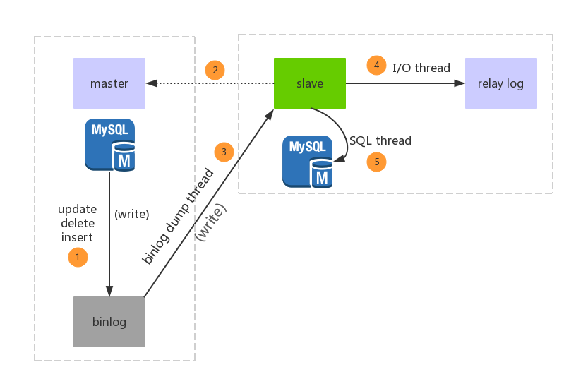
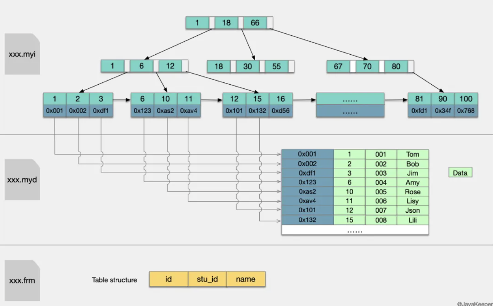

# MySQL大杂烩

目录

+ [主从复制](#主从复制)
+ [RedoLog和UndoLog](#RedoLog和UndoLog)
    - [RedoLog](#RedoLog)
    - [UndoLog](#UndoLog)
+ [MySQL架构](#MySQL架构)
+ [MySQL存储引擎](#MySQL存储引擎)
+ [MySQL数据类型](#MySQL数据类型)
+ [MySQL索引](#MySQL索引)
+ [MySQL查询](#MySQL查询)
+ [MySQL事务](#MySQL事务)
+ [MySQL锁机制](#MySQL锁机制)

## <span id="主从复制">主从复制</span>

### 为什么要主从复制

1. 可以为读写分离提供支持；
2. 做数据的热备，主库宕机后能够及时替换主库，保证业务可用性；
3. ... 自己补充吧

### 主从复制是啥

MySQL 主从复制是指数据可以从一个MySQL数据库服务器主节点复制到一个或多个从节点。

### 主从复制原理

1. 数据库有个 binlog 二进制文件，记录所有更新事件(update、insert、delete)；
2. 我们的目标就是把主数据库的 binlog 文件的更新事件复制过来；
3. 让其在从数据库的 relay log 中继日志文件中再执行一次这些更新即可；
4. 具体需要三个线程来操作：

- binlog输出线程：用于将 binlog 推送到从库；
- 从库I/O线程：该线程连接到主库并请求主库发送 binlog 里面的更新记录到从库上；从库I/O线程读取主库的 binlog 输出线程发送的更新并拷贝这些更新到本地文件 relay log；
- 从库的SQL线程：这个线程读取从库I/O线程写到 relay log 的更新事件并执行。

### 主从复制流程

上图！  


1. 主库的更新事件被写到binlog；
2. 从库启动并发起连接，连接到主库
3. 主库创建一个 binlog dump thread，把 binlog 推送的从库；
4. 从库启动后，创建一个I/O线程，把从主库传过来的 binlog 写到 relay log；
5. 创建一个SQL线程，从 relay log 里面读取内容，从 Exec_Master_Log_Pos 位置开始执行读取到的更新事件，将更新内容写入到slave的db

## RedoLog和UndoLog

这两个log都是为MySQL innodb的事务提供支持的，redo log 是重做日志，提供前滚操作，undo log 是回滚日志，提供回滚操作。

**undo log并不是redo log的逆向过程！！！**

1. redo log 通常是物理日志，记录的数据页的物理修改，而不是某一行或几行修改成怎样，它用来恢复提交后的数据页；
2. undo用来回滚行记录到某个版本。undo log一般是逻辑日志，根据每行记录进行记录。

### RedoLog

在MySQL中如果每一次的更新操作都需要写进磁盘，然后磁盘也要找到对应的那条记录，然后再更新，整个过程IO成本、查找成本都很高。为了解决这个问题，MySQL用到的是 Write-Ahead Logging
技术，它的关键点就是先写日志，再写磁盘：

1. 记录更新时，InnoDB引擎就会先把记录写到RedoLog里面，并更新内存。同时，InnoDB引擎会在空闲时将这个操作记录更新到磁盘里面。
2. 如果更新太多RedoLog处理不了的时候，需先将RedoLog部分数据写到磁盘，然后擦除RedoLog部分数据。

先来看张RedoLog的示意图：  


RedoLog有`write pos`跟`checkpoint`

- **write pos**：是当前记录的位置，一边写一边后移，写到第3号文件末尾后就回到0号文件开头。
- **check point**：是当前要擦除的位置，也是往后推移并且循环的，擦除记录前要把记录更新到数据文件。

`write pos`和`check point`之间的是还空着的部分，可以用来记录新的操作。如果`write pos`追上`checkpoint`，表示文件满了，这时候不能再执行新的更新，得停下来先擦掉一些记录，把`checkpoint`
推进一下。

有了redo log，InnoDB就可以保证即使数据库发生异常重启，之前提交的记录都不会丢失，这个能力称为`crash-safe`。

#### redolog两阶段提交

为了让binlog跟redolog两份日志之间的逻辑一致。提交流程大致如下：
> 1 prepare阶段 -->  2 写binlog --> 3 commit

1. 当在2之前崩溃时，重启恢复后发现没有commit，回滚；备份恢复：没有binlog，数据一致。
2. 当在3之前崩溃时，重启恢复发现虽没有commit，但满足prepare和binlog完整，所以重启后会自动commit；备份：有binlog，数据一致。

#### binlog跟redolog区别

1. redo log是InnoDB引擎特有的；binlog是MySQL的Server层实现的，所有引擎都可以使用。
2. redo log是物理日志，记录的是在某个数据页上做了什么修改；binlog是逻辑日志，记录的是这个语句的原始逻辑，比如给ID=2这一行的某个字段加1。
3. redo log是循环写的，空间固定会用完；binlog是可以追加写入的。追加写是指binlog文件写到一定大小后会切换到下一个，并不会覆盖以前的日志。

### UndoLog

UndoLog 一般是逻辑日志，主要分为两种：

1. insert undo log  
   代表事务在insert新记录时产生的undo log, 只在事务回滚时需要，并且在事务提交后可以被立即丢弃。
2. update undo log  
   事务在进行update或delete时产生的undo log; 不仅在事务回滚时需要，在快照读时也需要；所以不能随便删除，只有在快速读或事务回滚不涉及该日志时，对应的日志才会被purge线程统一清除。

## MySQL架构

MySQL的架构和其他数据库的架构区别主要体现在存储引擎的架构上，**插件式的存储引擎架构将查询处理和其它的系统任务以及数据的存储提取相分离**。这种架构可以根据业务的需求和实际需要选择合适的存储引擎。

主要分为4层：

1. **连接层**：最上层是一些客户端和连接服务。**主要完成一些类似于连接处理、授权认证、及相关的安全方案**
   。在该层上引入了线程池的概念，为通过认证安全接入的客户端提供线程。同样在该层上可以实现基于SSL的安全链接。服务器也会为安全接入的每个客户端验证它所具有的操作权限。
2. **服务层**：第二层服务层，主要完成大部分的核心服务功能，**包括查询解析、分析、优化、缓存、以及所有的内置函数**，所有跨存储引擎的功能也都在这一层实现，包括触发器、存储过程、视图等。
3. **引擎层**：第三层存储引擎层，存储引擎真正的负责了MySQL中数据的存储和提取，服务层通过API与存储引擎进行通信。不同的存储引擎具有的功能不同，这样我们可以根据自己的实际需要进行选取。
4. **存储层**：第四层为数据存储层，主要是将数据存储在运行于该设备的文件系统之上，并完成与存储引擎的交互。

> #### MySQL的查询流程具体是？一条SQL语句在MySQL中如何执行的？

客户端请求 ---> 连接器（验证用户身份，给予权限） ---> 查询缓存（存在缓存则直接返回，不存在则执行后续操作） ---> 分析器（对SQL进行词法分析和语法分析操作） ---> 优化器（主要对执行的sql优化选择最优的执行方案方法）
---> 执行器（执行时会先看用户是否有执行权限，有才去使用这个引擎提供的接口） ---> 去引擎层获取数据返回（如果开启查询缓存则会缓存查询结果）


## MySQL存储引擎

存储引擎是MySQL的组件，用于处理不同表类型的SQL操作。不同的存储引擎提供不同的存储机制、索引技巧、锁定水平等功能，使用不同的存储引擎，还可以获得特定的功能。

使用哪一种引擎可以灵活选择，**一个数据库中多个表可以使用不同引擎以满足各种性能和实际需求**，使用合适的存储引擎，将会提高整个数据库的性能。

MySQL服务器使用可插拔的存储引擎体系结构，可以从运行中的 MySQL 服务器加载或卸载存储引擎。

### 查看存储引擎

```mysql
# 查看支持的存储引擎
SHOW ENGINES

# 查看默认存储引擎
SHOW VARIABLES LIKE 'storage_engine'

# 查看具体某一个表所使用的存储引擎，这个默认存储引擎被修改了！
show create table tablename

# 准确查看某个数据库中的某一表所使用的存储引擎
show table status like 'tablename'
show table status from database where name = "tablename"
```

### 存储引擎对比

常见的存储引擎就 InnoDB、MyISAM；

InnoDB 现在是 MySQL 默认的存储引擎，**支持事务、行级锁定和外键**

### 文件存储结构对比

在 MySQL中建立任何一张数据表，在其数据目录对应的数据库目录下都有对应表的 `.frm` 文件，`.frm` 文件是用来保存每个数据表的元数据(meta)
信息，包括表结构的定义等，与数据库存储引擎无关，也就是任何存储引擎的数据表都必须有.frm文件，命名方式为 数据表名.frm，如user.frm。

查看MySQL 数据保存在哪里：`show variables like 'data%'`

InnoDB 物理文件结构为：

- **.frm 文件**：与表相关的元数据信息都存放在frm文件，包括表结构的定义信息等；
- **.ibd 文件或 .ibdata 文件**：这两种文件都是存放 InnoDB 数据的文件，之所以有两种文件形式存放 InnoDB 的数据，是因为 InnoDB 的数据存储方式能够通过配置来决定是使用**共享表空间**
  存放存储数据，还是用**独享表空间**存放存储数据。

独享表空间存储方式使用.ibd文件，并且每个表一个.ibd文件共享表空间存储方式使用.ibdata文件，所有表共同使用一个.ibdata文件（或多个，可自己配置）

MyISAM 物理文件结构为：

- **.frm文件**：与表相关的元数据信息都存放在frm文件，包括表结构的定义信息等；
- **.MYD (MYData) 文件**：MyISAM 存储引擎专用，用于存储 MyISAM 表的数据；
- **.MYI (MYIndex)文件**：MyISAM 存储引擎专用，用于存储 MyISAM 表的索引相关信息。

> #### 说说MySQL有哪些存储引擎？都有哪些区别？

常见存储引擎有 InnoDB、MyISAM。  
主要区别为：

1. InnoDB 支持事务，MyISAM 不支持事务。这是 MySQL 将默认存储引擎从 MyISAM 变成 InnoDB 的重要原因之一；
2. InnoDB 支持外键，而 MyISAM 不支持。对一个包含外键的 InnoDB 表转为 MYISAM 会失败；
3. InnoDB 是聚簇索引，MyISAM 是非聚簇索引。聚簇索引的文件存放在主键索引的叶子节点上，因此 InnoDB 必须要有主键，通过主键索引效率很高。但是辅助索引(非聚簇索引)
   需要两次查询，先查询到主键，然后再通过主键查询到数据，因此，主键不应该过大，因为主键太大，其他索引也都会很大。而 MyISAM 是非聚集索引，数据文件是分离的，索引保存的是数据文件的指针；主键索引和辅助索引是独立的。
4. InnoDB 不保存表的具体行数，执行select count(*) from table 时需要全表扫描。而 MyISAM 用一个变量保存了整个表的行数，执行上述语句时只需要读出该变量即可，速度很快。
5. InnoDB 最小的锁粒度是行锁，MyISAM 最小的锁粒度是表锁 —— 一个更新语句会锁住整张表，导致其他查询和更新都会被阻塞，因此并发访问受限；这也是 MySQL 将默认存储引擎从 MyISAM 变成 InnoDB
   的重要原因之一。

> #### 一张表，里面有ID自增主键，当insert了17条记录之后，删除了第15,16,17条记录，再把Mysql重启，再insert一条记录，这条记录的ID是18还是15 ？

1. 如果表的类型是 MyISAM，那么是18。因为MyISAM表会把自增主键的最大ID记录到数据文件中，重启MySQL自增主键的最大ID也不会丢失；
2. 如果表的类型是InnoDB，那么是15。因为InnoDB 表只是把自增主键的最大ID记录到内存中，所以重启数据库或对表进行OPTION操作，都会导致最大ID丢失。

> #### 哪个存储引擎执行 select count(*) 更快，为什么?

MyISAM更快，因为MyISAM内部维护了一个计数器，可以直接调取。

## MySQL数据类型

主要包括以下五大类：

- 整数类型：BIT、BOOL、TINY INT、SMALL INT、MEDIUM INT、 INT、 BIG INT；
- 浮点数类型：FLOAT、DOUBLE、DECIMAL；
- 字符串类型：CHAR、VARCHAR、TINY TEXT、TEXT、MEDIUM TEXT、LONGTEXT、TINY BLOB、BLOB、MEDIUM BLOB、LONG BLOB；
- 日期类型：Date、DateTime、TimeStamp、Time、Year；
- 其他数据类型：BINARY、VARBINARY、ENUM、SET、Geometry、Point、MultiPoint、LineString、MultiLineString、Polygon、GeometryCollection等。

> #### CHAR 和 VARCHAR 的区别？
简单来说就是 **char是固定长度，varchar长度可变**：

- char(n) 和 varchar(n) 中括号中 n 代表字符的个数，并不代表字节个数，比如 CHAR(30) 就可以存储 30 个字符；
- 存储时，前者不管实际存储数据的长度，直接按 char 规定的长度分配存储空间；而后者会根据实际存储的数据分配最终的存储空间。

相同点：

- char(n)，varchar(n)中的n都代表字符的个数；
- 超过char，varchar最大长度n的限制后，字符串会被截断。

不同点：

- char不论实际存储的字符数都会占用n个字符的空间，而varchar只会占用实际字符应该占用的字节空间加1（实际长度length，0<=length<255）或加2（length>
  255），因为varchar保存数据时除了要保存字符串之外还会加一个字节来记录长度（如果列声明长度大于255则使用两个字节来保存长度）；
- 能存储的最大空间限制不一样：char的存储上限为255字节；
- char在存储时会截断尾部的空格，而varchar不会。

char是适合存储很短的、一般固定长度的字符串。例如，char非常适合存储密码的MD5值，因为这是一个定长的值。**对于非常短的列，char比varchar在存储空间上也更有效率**。

> #### BLOB和TEXT有什么区别？

1. BLOB 是一个二进制对象，可以容纳可变数量的数据。有四种类型的BLOB：TINYBLOB、BLOB、MEDIUMBLOB和 LONGBLOB（小，正常，中，大BLOB）；
2. TEXT是一个不区分大小写的BLOB。四种TEXT类型：TINYTEXT、TEXT、MEDIUMTEXT 和 LONGTEXT；
3. BLOB 保存二进制数据，TEXT 保存字符数据。

## MySQL索引

> #### 说说你对 MySQL 索引的理解？

1. MYSQL官方对索引的定义为：索引（Index）是帮助MySQL高效获取数据的数据结构，所以说索引的本质是：数据结构，索引的目的在于提高查询效率；
2. 可以简单的理解为“排好序的快速查找数据结构”，数据本身之外；
3. 索引本身也很大，不可能全部存储在内存中，一般以索引文件的形式存储在磁盘上；
4. 平常说的索引，没有特别指明的话，就是B+树（多路搜索树，不一定是二叉树）结构组织的索引。其中聚集索引，次要索引，覆盖索引，符合索引，前缀索引，唯一索引默认都是使用B+树索引，统称索引。此外还有哈希索引等。

> #### 使用索引有什么优缺点
优点：

1. 提高数据检索效率，降低数据库IO成本；
2. 降低数据排序的成本，降低CPU的消耗。

缺点：

1. 索引也是一张表，保存了主键和索引字段，并指向实体表的记录，所以也需要占用内存；
2.
虽然索引大大提高了查询速度，同时却会降低更新表的速度，如对表进行INSERT、UPDATE和DELETE；因为更新表时，MySQL不仅要保存数据，还要保存一下索引文件每次更新添加了索引列的字段，都会调整因为更新所带来的键值变化后的索引信息。

### 索引分类

数据结构角度：

- B+树索引
- Hash索引
- Full-Text全文索引
- R-Tree索引

从物理存储角度：

- 聚集索引（clustered index）
- 非聚集索引（non-clustered index），也叫辅助索引（secondary index）

从逻辑角度：

- 主键索引：主键索引是一种特殊的唯一索引，不允许有空值；
- 普通索引或者单列索引：每个索引只包含单个列，一个表可以有多个单列索引；
- 多列索引（复合索引、联合索引）：复合索引指多个字段上创建的索引，只有在查询条件中使用了创建索引时的第一个字段，索引才会被使用。使用复合索引时遵循最左前缀集合；
- 唯一索引或者非唯一索引；
-
空间索引：空间索引是对空间数据类型的字段建立的索引，MYSQL中的空间数据类型有4种，分别是GEOMETRY、POINT、LINESTRING、POLYGON。MYSQL使用SPATIAL关键字进行扩展，使得能够用于创建正规索引类型的语法创建空间索引。创建空间索引的列，必须将其声明为NOT
NULL，空间索引只能在存储引擎为MYISAM的表中创建。

### MySQL索引结构

首先要明白索引（index）是在**存储引擎（storage engine）层面实现**的，而不是server层面。不是所有的存储引擎都支持所有的索引类型。即使多个存储引擎支持某一索引类型，它们的实现和行为也可能有所差别。

#### B+Tree索引

MyISAM 和 InnoDB 存储引擎，都使用 B+Tree 的数据结构，它相对与 B-Tree 结构，所有的数据都存放在叶子节点上，且把叶子节点通过指针连接到一起，形成了一条数据链表，以加快相邻数据的检索效率。

**先了解下 B-Tree 和 B+Tree 的区别**

**B-Tree**  
B-Tree是为磁盘等外存储设备设计的一种平衡查找树。  
系统从磁盘读取数据到内存时是以磁盘块（block）为基本单位的，位于同一个磁盘块中的数据会被一次性读取出来，而不是需要什么取什么。  
InnoDB 存储引擎中有页（Page）的概念，页是其磁盘管理的最小单位。InnoDB 存储引擎中默认每个页的大小为16KB，可通过参数 innodb_page_size 将页的大小设置为 4K、8K、16K；  
而系统一个磁盘块的存储空间往往没有这么大，因此 InnoDB 每次申请磁盘空间时都会读**若干地址连续磁盘块**来达到页的大小 16KB。InnoDB
在把磁盘数据读入到磁盘时会以页为基本单位，在查询数据时如果一个页中的每条数据都能有助于定位数据记录的位置，这将会减少磁盘I/O次数，提高查询效率。  
B-Tree 结构的数据可以让系统高效的找到数据所在的磁盘块。为了描述 B-Tree，首先定义一条记录为一个二元组[key, data] ，key为记录的键值，对应表中的主键值，data
为一行记录中除主键外的数据。对于不同的记录，key值互不相同。  
一棵m阶的B-Tree有如下特性：

1. 每个节点最多有m个孩子；
2. 除了根节点和叶子节点外，其它每个节点至少有Ceil(m/2)个孩子；
3. 若根节点不是叶子节点，则至少有2个孩子；
4. 所有叶子节点都在同一层，且不包含其它关键字信息；
5. 每个非终端节点包含n个关键字信息（P0,P1,…Pn, k1,…kn）
6. 关键字的个数n满足：ceil(m/2)-1 <= n <= m-1；
7. ki(i=1,…n)为关键字，且关键字升序排序；
8. Pi(i=1,…n)为指向子树根节点的指针。P(i-1)指向的子树的所有节点关键字均小于ki，但都大于k(i-1)。

B-Tree 中的每个节点根据实际情况可以包含大量的关键字信息和分支，如下图所示为一个 3 阶的 B-Tree：  


每个节点占用一个盘块的磁盘空间，一个节点上有两个升序排序的关键字和三个指向子树根节点的指针，指针存储的是子节点所在磁盘块的地址。两个关键词划分成的三个范围域对应三个指针指向的子树的数据的范围域。以根节点为例，关键字为17和35，P1指针指向的子树的数据范围为小于17，P2指针指向的子树的数据范围为17~
35，P3指针指向的子树的数据范围为大于35。

模拟查找关键字29的过程：

1. 根据根节点找到磁盘块1，读入内存；【磁盘I/O操作第1次】
2. 比较关键字29在区间（17,35），找到磁盘块1的指针P2；
3. 根据P2指针找到磁盘块3，读入内存；【磁盘I/O操作第2次】
4. 比较关键字29在区间（26,30），找到磁盘块3的指针P2；
5. 根据P2指针找到磁盘块8，读入内存；【磁盘I/O操作第3次】
6. 在磁盘块8中的关键字列表中找到关键字29。

分析上面过程，发现需要3次磁盘I/O操作，和3次内存查找操作。由于内存中的关键字是一个有序表结构，可以利用二分法查找提高效率。而3次磁盘I/O操作是影响整个B-Tree查找效率的决定因素。B-Tree相对于AVLTree缩减了节点个数，使每次磁盘I/O取到内存的数据都发挥了作用，从而提高了查询效率。

**B+Tree**  
B+Tree 是在 B-Tree 基础上的一种优化，使其更适合实现外存储索引结构，InnoDB 存储引擎就是用 B+Tree 实现其索引结构。

从B-Tree结构图中可以看到每个节点中不仅包含数据的key值，还有data值。而每一个页的存储空间是有限的，如果data数据较大时将会导致每个节点（即一个页）能存储的key的数量很小，当存储的数据量很大时同样会导致B-Tree的深度较大，增大查询时的磁盘I/O次数，进而影响查询效率。在B+Tree中，所有数据记录节点都是按照键值大小顺序存放在同一层的叶子节点上，而非叶子节点上只存储key值信息，这样可以大大加大每个节点存储的key值数量，降低B+Tree的高度。

B+Tree相对于B-Tree有几点不同：

1. 非叶子节点只存储键值信息；
2. 所有叶子节点之间都有一个链指针；
3. 数据记录都存放在叶子节点中。

将上一节中的B-Tree优化，由于B+Tree的非叶子节点只存储键值信息，假设每个磁盘块能存储4个键值及指针信息，则变成B+Tree后其结构如下图所示：  


通常在B+Tree上有两个头指针，一个指向根节点，另一个指向关键字最小的叶子节点，而且所有叶子节点（即数据节点）之间是一种链式环结构。因此可以对B+Tree进行两种查找运算：一种是对于主键的范围查找和分页查找，另一种是从根节点开始，进行随机查找。

下面做一个推算：  
InnoDB存储引擎中页的大小为16KB，一般表的主键类型为INT（占用4个字节）或BIGINT（占用8个字节），指针类型也一般为4或8个字节，也就是说一个页（B+Tree中的一个节点）中大概存储16KB/(8B+8B)
=1K个键值（因为是估值，为方便计算，这里的K取值为10^3）。也就是说一个深度为3的B+Tree索引可以维护10^3 * 10^3 * 10^3 = 10亿 条记录。

B+Tree性质：

1. 通过上面的分析，我们知道IO次数取决于b+树的高度h，假设当前数据表的数据为N，每个磁盘块的数据项的数量是m，则有h=㏒(m+1)N，当数据量N一定的情况下，m越大，h越小；而m = 磁盘块的大小 /
   数据项的大小，磁盘块的大小也就是一个数据页的大小，是固定的，如果数据项占的空间越小，数据项的数量越多，树的高度越低。这就是为什么每个数据项，即索引字段要尽量的小，比如int占4字节，要比bigint8字节少一半。这也是为什么b+树要求把真实的数据放到叶子节点而不是内层节点，一旦放到内层节点，磁盘块的数据项会大幅度下降，导致树增高。当数据项等于1时将会退化成线性表。
2. 当b+树的数据项是复合的数据结构，比如(name,age,sex)的时候，b+数是按照从左到右的顺序来建立搜索树的，比如当(张三,20,F)
   这样的数据来检索的时候，b+树会优先比较name来确定下一步的所搜方向，如果name相同再依次比较age和sex，最后得到检索的数据；但当(20,F)
   这样的没有name的数据来的时候，b+树就不知道下一步该查哪个节点，因为建立搜索树的时候name就是第一个比较因子，必须要先根据name来搜索才能知道下一步去哪里查询。比如当(张三,F)
   这样的数据来检索时，b+树可以用name来指定搜索方向，但下一个字段age的缺失，所以只能把名字等于张三的数据都找到，然后再匹配性别是F的数据了，这个是非常重要的性质，即索引的**最左匹配特性**。

#### MyISAM主键索引与辅助索引的结构

MyISAM引擎的索引文件和数据文件是分离的。**MyISAM引擎索引结构的叶子节点的数据域，存放的并不是实际的数据记录，而是数据记录的地址**。索引文件与数据文件分离，这样的索引称为"非聚簇索引"
。MyISAM的主索引与辅助索引区别并不大，只是主键索引不能有重复的关键字。



在MyISAM中，索引（含叶子节点）存放在单独的.myi文件中，叶子节点存放的是数据的物理地址偏移量（通过偏移量访问就是随机访问，速度很快）。  
主索引是指主键索引，键值不可能重复；辅助索引则是普通索引，键值可能重复。  
通过索引查找数据的流程：先从索引文件中查找到索引节点，从中拿到数据的文件指针，再到数据文件中通过文件指针定位了具体的数据。辅助索引类似。

#### InnoDB主键索引与辅助索引的结构

**InnoDB引擎索引结构的叶子节点的数据域，存放的就是实际的数据记录**（对于主索引，此处会存放表中所有的数据记录；对于辅助索引此处会引用主键，检索的时候通过主键到主键索引中找到对应数据行），或者说，**
InnoDB的数据文件本身就是主键索引文件**，这样的索引被称为“**_聚簇索引_**”，一个表只能有一个聚簇索引。

**主键索引**  
InnoDB索引是聚集索引，它的索引和数据是存入同一个.idb文件中的，因此它的索引结构是在同一个树节点中同时存放索引和数据，如下图中最底层的叶子节点有三行数据，对应于数据表中的id、stu_id、name数据项：  


在Innodb中，索引分叶子节点和非叶子节点，非叶子节点就像新华字典的目录，单独存放在索引段中，叶子节点则是顺序排列的，在数据段中。Innodb的数据文件可以按照表来切分（只需要开启innodb_file_per_table)
，切分后存放在xxx.ibd中，默认不切分，存放在xxx.ibdata中。

**辅助（非主键）索引**  
以表中的name列建立辅助索引，它的索引结构跟主键索引的结构有很大差别，在最底层的叶子结点有两行数据，第一行的字符串是辅助索引，按照ASCII码进行排序，第二行的整数是主键的值。  
这就意味着，对name列进行条件搜索，需要两个步骤：

1. 在辅助索引上检索name，到达其叶子节点获取对应的主键；
2. 使用主键在主索引上再进行对应的检索操作。

这也就是所谓的“**回表查询**”。  


**InnoDB 索引结构需要注意的点**

1. 数据文件本身就是索引文件；
2. 表数据文件本身就是按 B+Tree 组织的一个索引结构文件；
3. 聚集索引中叶节点包含了完整的数据记录；
4. InnoDB 表必须要有主键，并且推荐使用整型自增主键。

正如上面介绍 InnoDB 存储结构，索引与数据是共同存储的，不管是主键索引还是辅助索引，在查找时都是通过先查找到索引节点才能拿到相对应的数据，如果我们在设计表结构时没有显式指定索引列的话，MySQL
会从表中选择数据不重复的列建立索引，如果没有符合的列，则 MySQL 自动为 InnoDB 表生成一个隐含字段作为主键，并且这个字段长度为6个字节，类型为整型，注意：拥有此主键，修改一条记录时会锁表，而非锁住一条记录。

#### Hash索引

主要就是通过Hash算法（常见的Hash算法有直接定址法、平方取中法、折叠法、除数取余法、随机数法），将数据库字段数据转换成定长的Hash值，与这条数据的行指针一并存入Hash表的对应位置；如果发生Hash碰撞（两个不同关键字的Hash值相同），则在对应Hash键下以链表形式存储。

检索算法：在检索查询时，就再次对待查关键字再次执行相同的Hash算法，得到Hash值，到对应Hash表对应位置取出数据即可，如果发生Hash碰撞，则需要在取值时进行筛选。目前使用Hash索引的数据库并不多，主要有Memory等。

MySQL目前有Memory引擎和NDB引擎支持Hash索引。（基本上没听过吧）

> #### 那为什么推荐使用整型自增主键而不是选择UUID？

1. UUID是字符串，比整型消耗更多的存储空间；
2. 在B+树中进行查找时需要跟经过的节点值比较大小，整型数据的比较运算比字符串更快速；
3. 自增的整型索引在磁盘中会连续存储，在读取一页数据时也是连续；UUID是随机产生的，读取的上下两行数据存储是分散的，不适合执行where id > 5 && id < 20的条件查询语句；
4. 在插入或删除数据时，整型自增主键会在叶子结点的末尾建立新的叶子节点，不会破坏左侧子树的结构；UUID主键很容易出现这样的情况，B+树为了维持自身的特性，有可能会进行结构的重构，消耗更多的时间。

> #### 为什么非主键索引结构叶子节点存储的是主键值？
保证数据一致性和节省存储空间，可以这么理解：商城系统订单表会存储一个用户ID作为关联外键，而不推荐存储完整的用户信息，因为当我们用户表中的信息（真实名称、手机号、收货地址···）修改后，不需要再次维护订单表的用户数据，同时也节省了存储空间.

> #### 为什么Mysql索引要用B+树不是B树？
用B+树不用B树考虑的是IO对性能的影响，B树的每个节点都存储数据，而B+树只有叶子节点才存储数据，所以查找相同数据量的情况下，B树的高度更高，IO更频繁。数据库索引是存储在磁盘上的，当数据量大时，就不能把整个索引全部加载到内存了，只能逐一加载每一个磁盘页（对应索引树的节点）。其中在MySQL底层对B+树进行进一步优化：在叶子节点中是双向链表，且在链表的头结点和尾节点也是循环指向的。

> #### 为何不采用Hash方式？
因为Hash索引底层是哈希表，哈希表是一种以key-value存储数据的结构，所以多个数据在存储关系上是完全没有任何顺序关系的，所以，对于区间查询是无法直接通过索引查询的，就需要全表扫描。所以，哈希索引只适用于等值查询的场景。而B+Tree是一种多路平衡查询树，所以他的节点是天然有序的（左子节点小于父节点、父节点小于右子节点），所以对于范围查询的时候不需要做全表扫描。

哈希索引不支持多列联合索引的最左匹配规则，如果有大量重复键值得情况下，哈希索引的效率会很低，因为存在哈希碰撞问题。

### MySQL高效索引

#### 哪些情况需要创建索引

1. 主键自动建立唯一索引；
2. 频繁作为查询条件的字段；
3. 查询中与其他表关联的字段，外键关系建立索引；
4. 单键/组合索引的选择问题，高并发下倾向创建组合索引；
5. 查询中排序的字段，排序字段通过索引访问大幅提高排序速度；
6. 查询中统计或分组字段。

#### 哪些情况不要创建索引

1. 表记录太少；
2. 经常增删改的表；
3. 数据重复且分布均匀的表字段，只应该为最经常查询和最经常排序的数据列建立索引（如果某个数据类包含太多的重复数据，建立索引没有太大意义）；
4. 频繁更新的字段不适合创建索引（会加重IO负担）；
5. where条件里用不到的字段不创建索引。

**覆盖索引**（Covering Index），或者叫索引覆盖，也就是平时所说的不需要回表操作。

- 就是select的数据列只用从索引中就能够取得，不必读取数据行，MySQL可以利用索引返回select列表中的字段，而不必根据索引再次读取数据文件，换句话说查询列要被所建的索引覆盖；
-
索引是高效找到行的一个方法，但是一般数据库也能使用索引找到一个列的数据，因此它不必读取整个行。毕竟索引叶子节点存储了它们索引的数据，当能通过读取索引就可以得到想要的数据，那就不需要读取行了。一个索引包含（覆盖）满足查询结果的数据就叫做覆盖索引。

**判断标准**  
使用explain，可以通过输出的extra列来判断，对于一个索引覆盖查询，显示为using index，MySQL查询优化器在执行查询前会决定是否有索引覆盖查询

## MySQL查询

> #### count(*) 和 count(1)和count(列名)区别
执行效果上：

- count(*)包括了所有的列，相当于行数，在统计结果的时候，不会忽略列值为NULL；
- count(1)包括了所有列，用1代表代码行，在统计结果的时候，不会忽略列值为NULL；
- count(列名)只包括列名那一列，在统计结果的时候，会忽略列值为空（这里的空不是只空字符串或者0，而是表示null）的计数，即某个字段值为NULL时，不统计。

执行效率上：

- 列名为主键，count(列名)会比count(1)快；
- 列名不为主键，count(1)会比count(列名)快；
- 如果表多个列并且没有主键，则 count(1) 的执行效率优于 count(*)；
- 如果有主键，则 select count（主键）的执行效率是最优的；
- 如果表只有一个字段，则 select count(*) 最优。

> #### MySQL中 in和 exists 的区别？

-
exists：exists对外表用loop逐条查询，每次查询都会查看exists的条件语句，当exists里的条件语句能够返回记录行时（无论记录行是的多少，只要能返回），条件就为真，返回当前loop到的这条记录；反之，如果exists里的条件语句不能返回记录行，则当前loop到的这条记录被丢弃，exists的条件就像一个bool条件，当能返回结果集则为true，不能返回结果集则为false；
- in：in查询相当于多个or条件的叠加。

**如果查询的两个表大小相当，那么用in和exists差别不大**。

如果两个表中一个较小，一个是大表，则子查询表大的用exists，子查询表小的用in。

> #### UNION和UNION ALL的区别?
UNION和UNION ALL都是将两个结果集合并为一个，两个要联合的SQL语句字段个数必须一样，而且字段类型要“相容”（一致）；

- UNION在进行表连接后会筛选掉重复的数据记录（效率较低），而UNION ALL则不会去掉重复的数据记录；
- UNION会按照字段的顺序进行排序，而UNION ALL只是简单的将两个结果合并就返回。

### SQL执行顺序

```mysql
FROM  <left_table>
ON <join_condition>
<join_type> JOIN  <right_table>
WHERE  <where_condition>
GROUP BY  <group_by_list>
HAVING <having_condition>
SELECT DISTINCT <select_list>
ORDER BY <order_by_condition>
LIMIT <limit_number>
```

> #### mysql 的内连接、左连接、右连接有什么区别？什么是内连接、外连接、交叉连接、笛卡尔积呢？


## MySQL事务

### ACID — 事务基本要素

事务是由一组SQL语句组成的逻辑处理单元，具有4个属性，通常简称为事务的ACID属性。

- A (Atomicity) 原子性：整个事务中的所有操作，要么全部完成，要么全部不完成，不可能停滞在中间某个环节。事务在执行过程中发生错误，会被回滚（Rollback）到事务开始前的状态，就像这个事务从来没有执行过一样。
- C (Consistency) 一致性：在事务开始之前和事务结束以后，数据库的完整性约束没有被破坏。
- I (Isolation)隔离性：一个事务的执行不能其它事务干扰。即一个事务内部的操作及使用的数据对其它并发事务是隔离的，并发执行的各个事务之间不能互相干扰。
- D (Durability) 持久性：在事务完成以后，该事务所对数据库所作的更改便持久的保存在数据库之中，并不会被回滚。

### 并发事务处理带来的问题

- 更新丢失（Lost Update)：事务A和事务B选择同一行，然后基于最初选定的值更新该行时，由于两个事务都不知道彼此的存在，就会发生丢失更新问题
- 脏读(Dirty Reads)：事务A读取了事务B更新的数据，然后B回滚操作，那么A读取到的数据是脏数据
- 不可重复读（Non-Repeatable Reads)：事务 A 多次读取同一数据，事务B在事务A多次读取的过程中，对数据作了更新并提交，导致事务A多次读取同一数据时，结果不一致。
- 幻读（Phantom Reads)：幻读与不可重复读类似。它发生在一个事务A读取了几行数据，接着另一个并发事务B插入了一些数据时。在随后的查询中，事务A就会发现多了一些原本不存在的记录，就好像发生了幻觉一样，所以称为幻读。

幻读和不可重复读的区别：

- 不可重复读的重点是修改：在同一事务中，同样的条件，第一次读的数据和第二次读的数据不一样。（因为中间有其他事务提交了修改）
- 幻读的重点在于新增或者删除：在同一事务中，同样的条件，第一次和第二次读出来的记录数不一样。（因为中间有其他事务提交了插入/删除）

并发事务处理带来的问题的解决办法：

- “更新丢失”通常是应该完全避免的。但防止更新丢失，并不能单靠数据库事务控制器来解决，需要应用程序对要更新的数据加必要的锁来解决，因此，防止更新丢失应该是应用的责任。
- “脏读”、“不可重复读”和“幻读”，其实都是数据库读一致性问题，必须由数据库提供一定的事务隔离机制来解决：
    - 一种是加锁：在读取数据前，对其加锁，阻止其他事务对数据进行修改；
    - 另一种是数据多版本并发控制（MultiVersion Concurrency Control，简称 MVCC 或 MCC），也称为多版本数据库：不用加任何锁， 通过一定机制生成一个数据请求时间点的一致性数据快照
      （Snapshot)， 并用这个快照来提供一定级别 （语句级或事务级） 的一致性读取。从用户的角度来看，好象是数据库可以提供同一数据的多个版本。

### 事务隔离级别

数据库事务的隔离级别有4种，由低到高分别为：

1. **READ-UNCOMMITTED(读未提交)**：最低的隔离级别，允许读取尚未提交的数据变更，可能会导致脏读、幻读或不可重复读。
2. **READ-COMMITTED(读已提交)**：允许读取并发事务已经提交的数据，可以阻止脏读，但是幻读或不可重复读仍有可能发生。
3. **REPEATABLE-READ(可重复读)**：对同一字段的多次读取结果都是一致的，除非数据是被本身事务自己所修改，可以阻止脏读和不可重复读，但幻读仍有可能发生。
4. SERIALIZABLE(可串行化)： 最高的隔离级别，完全服从ACID的隔离级别。所有的事务依次逐个执行，这样事务之间就完全不可能产生干扰，也就是说，该级别可以防止脏读、不可重复读以及幻读。

数据库的事务隔离越严格，并发副作用越小，但付出的代价就越大，因为事务隔离实质上就是使事务在一定程度上“串行化”进行，这显然与“并发”是矛盾的。同时，不同的应用对读一致性和事务隔离程度的要求也是不同的，比如许多应用对“不可重复读”和“幻读”并不敏感，可能更关心数据并发访问的能力。

MySQL InnoDB 存储引擎的默认支持的隔离级别是 **REPEATABLE-READ（可重读）**。

这里需要注意的是：与 SQL 标准不同的地方在于InnoDB 存储引擎在 **REPEATABLE-READ（可重复读）** 事务隔离级别下使用的是Next-Key Lock 算法，因此可以避免幻读的产生，这与其他数据库系统(如 SQL
Server)是不同的。所以说InnoDB 存储引擎的默认支持的隔离级别是 **REPEATABLE-READ（可重读）** 已经可以完全保证事务的隔离性要求，即达到了 SQL标准的 SERIALIZABLE(可串行化)
隔离级别，而且保留了比较好的并发性能。

### MVCC 多版本并发控制

可以认为 MVCC 是行级锁的一个变种，但它在很多情况下避免了加锁操作，因此开销更低。虽然实现机制有所不同，但大都实现了非阻塞的读操作，写操作也只是锁定必要的行。

MVCC 的实现是通过保存数据在某个时间点的快照来实现的。也就是说不管需要执行多长时间，每个事物看到的数据都是一致的。

典型的MVCC实现方式，分为乐观（optimistic）并发控制和悲观（pressimistic）并发控制。下边通过 InnoDB的简化版行为来说明 MVCC 是如何工作的：  
InnoDB 的 MVCC，是通过在每行记录后面保存两个隐藏的列来实现。这两个列，一个保存了行的创建时间，一个保存行的过期时间（删除时间）。当然存储的并不是真实的时间，而是系统版本号（system version
number）。每开始一个新的事务，系统版本号都会自动递增。事务开始时刻的系统版本号会作为事务的版本号，用来和查询到的每行记录的版本号进行比较。

**REPEATABLE READ（可重读）** 隔离级别下MVCC如何工作：
**SELECT**：  
InnoDB会根据以下两个条件检查每行记录，只有符合两个条件的才会被查询出来：

1. InnoDB只查找版本早于当前事务版本的数据行，这样可以确保事务读取的行，要么是在开始事务之前已经存在要么是事务自身插入或者修改过的；
2. 行的删除版本号要么未定义，要么大于当前事务版本号，这样可以确保事务读取到的行在事务开始之前未被删除。

**INSERT**：InnoDB为新插入的每一行保存当前系统版本号作为行版本号。  
**DELETE**：InnoDB为删除的每一行保存当前系统版本号作为行删除标识。  
**UPDATE**：InnoDB为插入的一行新纪录保存当前系统版本号作为行版本号，同时保存当前系统版本号到原来的行作为删除标识。

保存这两个额外系统版本号，使大多数操作都不用加锁。使数据操作简单，性能很好，并且也能保证只会读取到符合要求的行。不足之处是每行记录都需要额外的存储空间，需要做更多的行检查工作和一些额外的维护工作。

MVCC 只在 **COMMITTED READ（读提交）和REPEATABLE READ（可重复读）** 两种隔离级别下工作。

### 事务的实现

事务的实现是基于数据库的存储引擎。不同的存储引擎对事务的支持程度不一样。MySQL 中支持事务的存储引擎有 InnoDB 和 NDB。

事务的隔离性是通过锁实现，而事务的原子性、一致性和持久性则是通过事务日志实现。

事务日志包括：重做日志**redo**和回滚日志**undo**：

- **redo log（重做日志）** 实现持久化和原子性  
  在innoDB的存储引擎中，事务日志通过重做(redo)日志和innoDB存储引擎的日志缓冲(InnoDB Log Buffer)
  实现。事务开启时，事务中的操作，都会先写入存储引擎的日志缓冲中，在事务提交之前，这些缓冲的日志都需要提前刷新到磁盘上持久化，这就是DBA们口中常说的“日志先行”(Write-Ahead Logging)。当事务提交之后，在Buffer
  Pool中映射的数据文件才会慢慢刷新到磁盘。此时如果数据库崩溃或者宕机，那么当系统重启进行恢复时，就可以根据redo
  log中记录的日志，把数据库恢复到崩溃前的一个状态。未完成的事务，可以继续提交，也可以选择回滚，这基于恢复的策略而定。  
  在系统启动的时候，就已经为redo log分配了一块连续的存储空间，以顺序追加的方式记录Redo Log，通过顺序IO来改善性能。所有的事务共享redo log的存储空间，它们的Redo Log按语句的执行顺序，依次交替的记录在一起。
- **undo log（回滚日志）**  实现一致性  
  undo log 主要为事务的回滚服务。在事务执行的过程中，除了记录redo log，还会记录一定量的undo log。undo log记录了数据在每个操作前的状态，如果事务执行过程中需要回滚，就可以根据undo
  log进行回滚操作。单个事务的回滚，只会回滚当前事务做的操作，并不会影响到其他的事务做的操作。  
  Undo记录的是已部分完成并且写入硬盘的未完成的事务，默认情况下回滚日志是记录下表空间中的（共享表空间或者独享表空间）。

二种日志均可以视为一种恢复操作，redo_log是恢复提交事务修改的页操作，而undo_log是回滚行记录到特定版本。二者记录的内容也不同，redo_log是物理日志，记录页的物理修改操作，而undo_log是逻辑日志，根据每行记录进行记录。

## MySQL锁机制

### 锁的分类

从对数据操作的类型分类：

- **读锁（共享锁）**：针对同一份数据，多个读操作可以同时进行，不会互相影响；
- **写锁（排他锁）**：当前写操作没有完成前，它会阻断其他写锁和读锁。

从对数据操作的粒度分类：

- **表级锁**：开销小，加锁快；不会出现死锁；锁定粒度大，发生锁冲突的概率最高，并发度最低（MyISAM 和 MEMORY 存储引擎采用的是表级锁）；
- **行级锁**：开销大，加锁慢；会出现死锁；锁定粒度最小，发生锁冲突的概率最低，并发度也最高（InnoDB 存储引擎既支持行级锁也支持表级锁，但默认情况下是采用行级锁）；
- **页级锁**：开销和加锁时间界于表锁和行锁之间；会出现死锁；锁定粒度界于表锁和行锁之间，并发度一般。

### InnoDB 行锁

InnoDB 实现了以下两种类型的行锁：

- 共享锁（S）：允许一个事务去读一行，阻止其他事务获得相同数据集的排他锁(可能有点绕，就是加了S锁的数据集不允许加X锁)；
- 排他锁（X）：允许获得排他锁的事务更新数据，阻止其他事务取得相同数据集的共享读锁和排他写锁(不允许其他事务加S、X锁)。

为了允许行锁和表锁共存，实现多粒度锁机制，InnoDB 还有两种内部使用的**意向锁（Intention Locks）**，这两种意向锁都是表锁：

- 意向共享锁（IS）：事务打算给数据行加行共享锁，事务在给一个数据行加共享锁前必须先取得该表的 IS 锁。
- 意向排他锁（IX）：事务打算给数据行加行排他锁，事务在给一个数据行加排他锁前必须先取得该表的 IX 锁。

#### 关于允许行锁和表锁共存

我第一次看这概念也懵逼了好久，一直不太明白共存个啥。。

**那么意向锁怎么支持表锁和行锁并存？**

1. 首先明确并存的概念是**指数据库同时支持表、行锁，而不是任何情况都支持一个表中同时有一个事务A持有行锁、又有一个事务B持有表锁**，因为表一旦被上了一个表级的写锁，肯定不能再上一个行级的锁；
2. 如果事务A对某一行上锁，其他事务就不可能修改这一行。这与“事务B锁住整个表就能修改表中的任意一行”形成了冲突。所以，没有意向锁的时候，让行锁与表锁共存，就会带来很多问题。

关于没有意向锁会带来的问题，举个栗子：

事务A锁住了表中的一行，让这一行只能读，不能写。

之后，事务B申请整个表的写锁。

如果事务B申请成功，那么理论上它就能修改表中的任意一行，这与A持有的行锁是冲突的。

数据库需要避免这种冲突，就是说要让B的申请被阻塞，直到A释放了行锁。

数据库要怎么判断这个冲突呢？

step1：判断表是否已被其他事务用表锁锁表； step2：判断表中的每一行是否已被行锁锁住。

注意step2，这样的判断方法效率实在不高，因为需要遍历整个表，于是就有了意向锁。

在意向锁存在的情况下，事务A必须先申请表的意向共享锁，成功后再申请一行的行锁。

在意向锁存在的情况下，上面的判断可以改成

step1：不变 step2：发现表上有意向共享锁，说明表中有些行被共享行锁锁住了，因此，事务B申请表的写锁会被阻塞。

大致就是这么个作用。。。

注意：**索引失效会导致行锁变表锁**。

#### 锁模式(InnoDB有三种行锁的算法)

- **记录锁(Record Locks)**：单个行记录上的锁。对索引项加锁，锁定符合条件的行。其他事务不能修改和删除加锁项；在通过 **主键索引** 与 **唯一索引** 对数据行进行 UPDATE 操作时，也会对该行数据加记录锁。
- **间隙锁（Gap Locks）**：当我们使用范围条件而不是相等条件检索数据，并请求共享或排他锁时，InnoDB会给符合条件的已有数据记录的索引项加锁。对于键值在条件范围内但并不存在的记录，叫做“间隙”。InnoDB
  也会对这个“间隙”加锁，这种锁机制就是所谓的间隙锁。间隙锁基于非唯一索引，它锁定一段范围内的索引记录。间隙锁基于下面将会提到的 Next-Key Locking
  算法，请务必牢记：使用间隙锁锁住的是一个区间，而不仅仅是这个区间中的每一条数据。GAP锁的目的，是为了防止同一事务的两次当前读，出现幻读的情况。
- **临键锁(Next-key Locks)**：临键锁，是记录锁与间隙锁的组合，它的封锁范围，既包含索引记录，又包含索引区间。(临键锁的主要目的，也是为了避免幻读(Phantom Read)
  。如果把事务的隔离级别降级为RC，临键锁则也会失效。)

Next-Key 可以理解为一种特殊的间隙锁，也可以理解为一种特殊的算法。通过临建锁可以解决幻读的问题。每个数据行上的非唯一索引列上都会存在一把临键锁，当某个事务持有该数据行的临键锁时，会锁住一段**左开右闭区间**
的数据。需要强调的一点是，InnoDB 中行级锁是基于索引实现的，临键锁只与非唯一索引列有关，在唯一索引列（包括主键列）上不存在临键锁。

**select .. for update**  
for update 仅适用于InnoDB，且必须在事务块(BEGIN/COMMIT)中才能生效。在进行事务操作时，通过“for
update”语句，MySQL会对查询结果集中每行数据都添加排他锁，其他线程对该记录的更新与删除操作都会阻塞。排他锁包含行锁、表锁。

#### 死锁

死锁定义和产生跳过了，这个也懒得说了。

**检测死锁**  
数据库系统实现了各种死锁检测和死锁超时的机制。InnoDB存储引擎能检测到死锁的循环依赖并立即返回一个错误。

**死锁恢复**  
死锁发生以后，只有部分或完全回滚其中一个事务，才能打破死锁，InnoDB目前处理死锁的方法是，将**持有最少行级排他锁的事务进行回滚**。所以事务型应用程序在设计时必须考虑如何处理死锁，多数情况下只需要重新执行因死锁回滚的事务即可。

**外部锁的死锁检测**  
发生死锁后，InnoDB 一般都能自动检测到，并使一个事务释放锁并回退，另一个事务获得锁，继续完成事务。但在涉及外部锁，或涉及表锁的情况下，InnoDB 并不能完全自动检测到死锁， 这需要通过设置锁等待超时参数
innodb_lock_wait_timeout 来解决。

**死锁影响性能**  
死锁会影响性能而不是会产生严重错误，因为InnoDB会自动检测死锁状况并回滚其中一个受影响的事务。在高并发系统上，当许多线程等待同一个锁时，死锁检测可能导致速度变慢。有时当发生死锁时，禁用死锁检测（使用innodb_deadlock_detect配置选项）可能会更有效，这时可以依赖innodb_lock_wait_timeout设置进行事务回滚。

**InnoDB避免死锁**

- 为了在单个InnoDB表上执行多个并发写入操作时避免死锁，可以在事务开始时通过为预期要修改的每个元祖（行）使用SELECT ... FOR UPDATE语句来获取必要的锁，即使这些行的更改语句是在之后才执行的。
- 在事务中，如果要更新记录，应该直接申请足够级别的锁，即排他锁，而不应先申请共享锁、更新时再申请排他锁，因为这时候当用户再申请排他锁时，其他事务可能又已经获得了相同记录的共享锁，从而造成锁冲突，甚至死锁。
- 如果事务需要修改或锁定多个表，则应在每个事务中以相同的顺序使用加锁语句。在应用中，如果不同的程序会并发存取多个表，应尽量约定以相同的顺序来访问表，这样可以大大降低产生死锁的机会。
- 改变事务隔离级别。

如果出现死锁，可以用 show engine innodb status;命令来确定最后一个死锁产生的原因。返回结果中包括死锁相关事务的详细信息，如引发死锁的 SQL
语句，事务已经获得的锁，正在等待什么锁，以及被回滚的事务等。据此可以分析死锁产生的原因和改进措施。