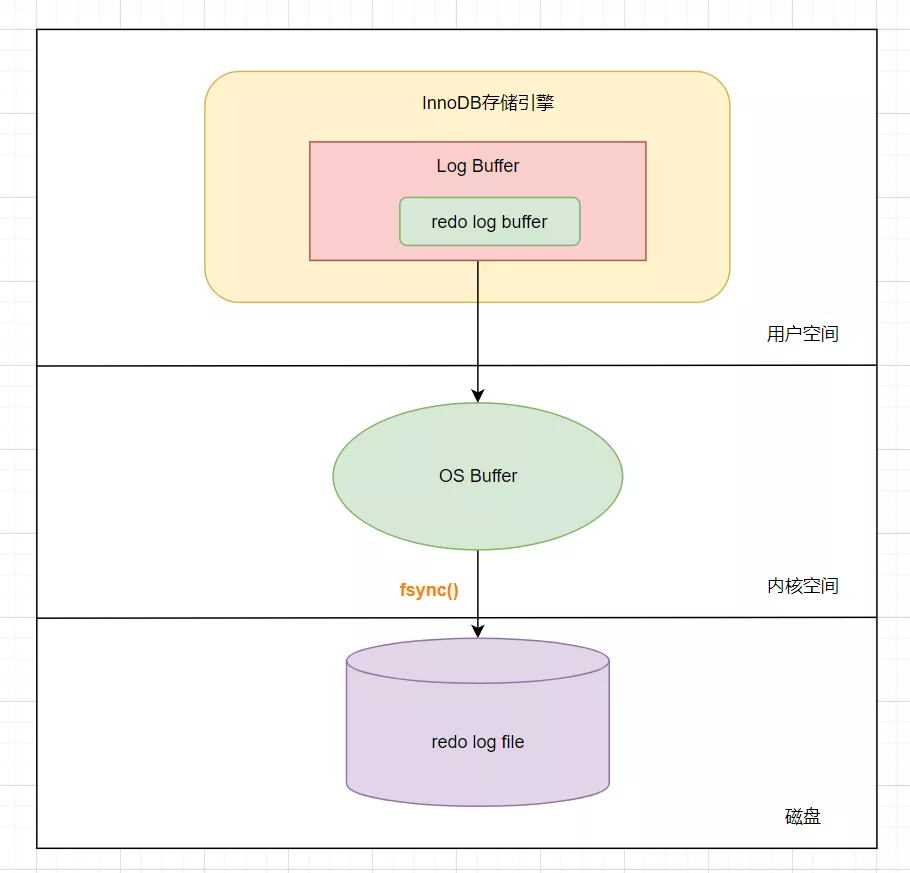
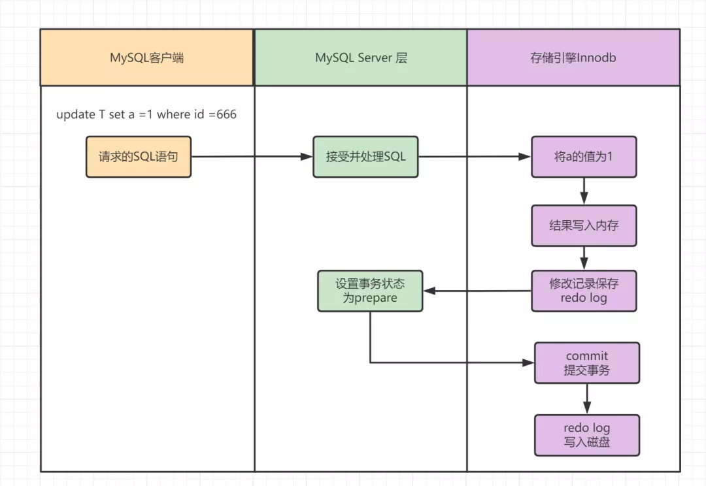
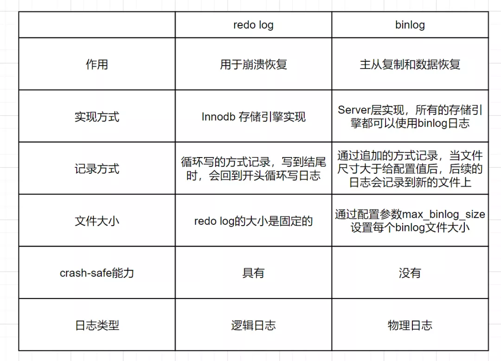

# MySQL日志15连问

[TOC]

## 1. redo log是什么? 为什么需要redo log？

**redo log 是什么呢**?

- redo log 是**重做日志**。
- 它记录了**数据页**上的改动。
- 它指**事务**中修改了的数据，将会备份存储。
- 发生数据库服务器宕机、或者脏页未写入磁盘，可以通过redo log恢复。
- 它是**Innodb存储**引擎独有的

**为什么需要 redo log？**

- redo log主要用于MySQL异常重启后的一种数据恢复手段，确保了数据的一致性。
- 其实是为了配合MySQL的WAL机制。因为MySQL进行更新操作，为了能够快速响应，所以采用了异步写回磁盘的技术，写入内存后就返回。但是这样，会存在**crash后**内存数据丢失的隐患，而redo log具备crash safe的能力。

## 2. 什么是WAL技术, 好处是什么?

- WAL，全称是Write-Ahead Logging(可以翻译为 日志先行)，它的关键点就是日志先写内存，再写磁盘。MySQL执行更新操作后，**在真正把数据写入到磁盘前，先记录日志**。
- 好处是不用每一次操作都实时把数据写盘，就算crash后也可以通过redo log恢复，所以能够实现快速响应SQL语句。

## 3. redo log的写入方式

redo log包括两部分内容，分别是内存中的**日志缓冲**(redo log buffer)和磁盘上的**日志文件**(redo log file)。

mysql每执行一条DML语句，会先把记录写入**redo log buffer**，后续某个时间点再一次性将多个操作记录写到**redo log file**。这种先写日志，再写磁盘的技术，就是**WAL**。

在计算机操作系统中，用户空间(user space)下的缓冲区数据，一般是无法直接写入磁盘的，必须经过操作系统内核空间缓冲区(即OS Buffer)。

- 日志最开始会写入位于存储引擎Innodb的redo log buffer，这个是在用户空间完成的。
- 然后再将日志保存到操作系统内核空间的缓冲区(OS buffer)中。
- 最后，通过系统调用`fsync()`，从**OS buffer**写入到磁盘上的**redo log file**中，完成写入操作。这个写入磁盘的操作，就叫做**刷盘**。



我们可以发现，redo log buffer写入到redo log file，是经过OS buffer中转的。其实可以通过参数`innodb_flush_log_at_trx_commit`进行配置，参数值含义如下：

- 0：称为**延迟写**事务提交时不会将redo log buffer中日志写入到OS buffer，而是每秒写入OS buffer并调用写入到redo log file中。
- 1：称为**实时写，实时刷**。事务每次提交都会将redo log buffer中的日志写入OS buffer并保存到redo log file中。
- 2：称为**实时写，延迟刷**。每次事务提交写入到OS buffer，然后是每秒将日志写入到redo log file。

## 4. Redo log的执行流程

我们来看下Redo log的执行流程，假设执行的SQL如下：

```sql
update T set a =1 where id =666
```



1. MySQL客户端将请求语句`update T set a =1 where id =666`，发往MySQL Server层。
2. MySQL Server 层接收到SQL请求后，对其进行分析、优化、执行等处理工作，将生成的SQL执行计划发到InnoDb存储引擎层执行。
3. InnoDb存储引擎层将**a修改为1**的这个操作记录到内存中。
4. 记录到内存以后会修改redo log 的记录，会在添加一行记录，其内容是**需要在哪个数据页上做什么修改**。
5. 此后，将事务的状态设置为prepare ，说明已经准备好提交事务了。
6. 等到MySQL Server层处理完事务以后，会将事务的状态设置为**commit**，也就是提交该事务。
7. 在收到事务提交的请求以后，**redo log**会把刚才写入内存中的操作记录写入到磁盘中，从而完成整个日志的记录过程。

## 5. redo log 为什么可以保证crash safe机制呢？

- 因为redo log每次更新操作完成后，就一定会写入的，如果**写入失败**，说明此次操作失败，事务也不可能提交。
- redo log内部结构是基于页的，记录了这个页的字段值变化，只要crash后读取redo log进行重放，就可以恢复数据。

## 6. binlog的概念是什么, 起到什么作用, 可以保证crash-safe吗?

- bin log是归档日志，属于MySQL Server层的日志。可以实现**主从复制**和**数据恢复**两个作用。
- 当需要**恢复数据**时，可以取出某个时间范围内的bin log进行重放恢复。
- 但是bin log不可以做crash safe，因为crash之前，bin log**可能没有写入完全**MySQL就挂了。所以需要配合**redo log**才可以进行crash safe。

## 7. binlog和redolog的不同点有哪些?



## 8. 执行器和innoDB在执行update语句时候的流程是什么样的?

- 执行器在优化器选择了索引后，会调用InnoDB读接口，读取要更新的行到内存中。
- 执行SQL操作后，更新到内存，然后写redo log，写bin log，此时即为完成。
- 后续InnoDB会在合适的时候把此次操作的结果写回到磁盘。

## 9. 如果数据库误操作, 如何执行数据恢复?


数据库在某个时候误操作，就可以找到距离误操作最近的时间节点的bin log，重放到临时数据库里，然后选择误删的数据节点，恢复到线上数据库。

## 10. binlog日志三种格式

binlog日志有三种格式

- Statement：基于SQL语句的复制(statement-based replication,SBR)
- Row:基于行的复制。(row-based replication,RBR)
- Mixed:混合模式复制。(mixed-based replication,MBR)

**Statement格式**

每一条会修改数据的sql都会记录在binlog中

- 优点：不需要记录每一行的变化，减少了binlog日志量，节约了IO，提高性能。
- 缺点：由于记录的只是执行语句，为了这些语句能在备库上正确运行，还必须记录每条语句在执行的时候的一些相关信息，以保证所有语句能在备库得到和在主库端执行时候相同的结果。

**Row格式**

不记录sql语句上下文相关信息，仅保存哪条记录被修改。

- 优点：binlog中可以不记录执行的sql语句的上下文相关的信息，仅需要记录那一条记录被修改成什么了。所以rowlevel的日志内容会非常清楚的记录下每一行数据修改的细节。不会出现某些特定情况下的存储过程、或function、或trigger的调用和触发无法被正确复制的问题。
- 缺点:可能会产生大量的日志内容。

**Mixed格式**

实际上就是Statement与Row的结合。一般的语句修改使用statment格式保存binlog，如一些函数，statement无法完成主从复制的操作，则采用row格式保存binlog,MySQL会根据执行的每一条具体的sql语句来区分对待记录的日志形式。

