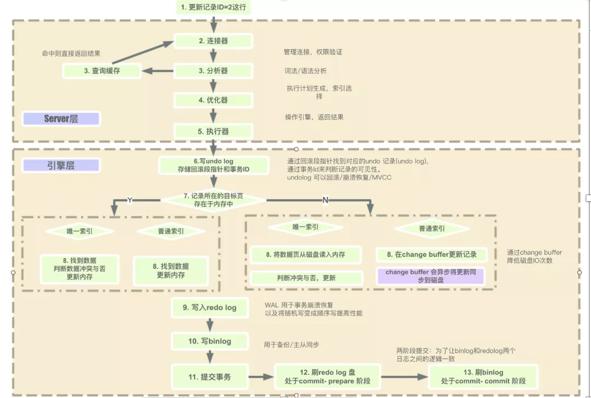
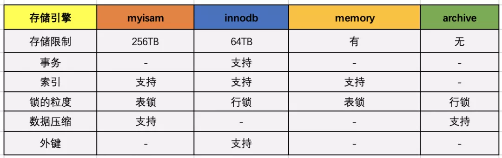
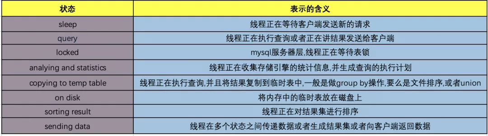
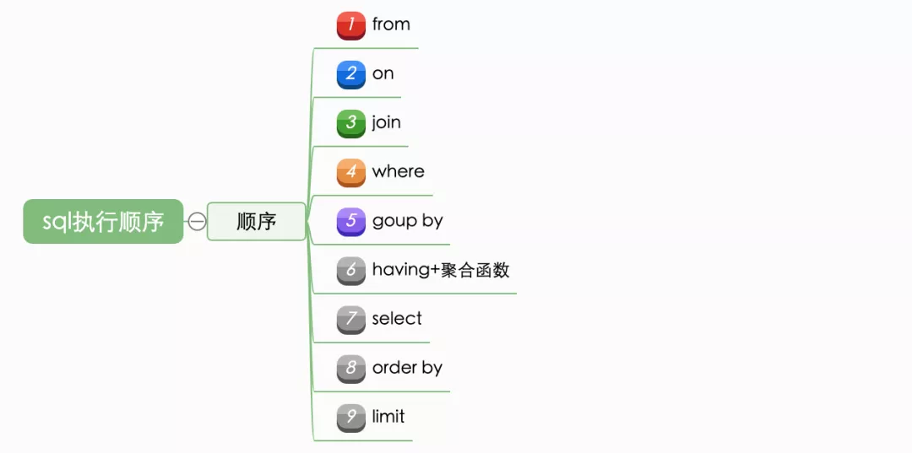

# MySQL是这样执行的

<!-- START doctoc generated TOC please keep comment here to allow auto update -->
<!-- DON'T EDIT THIS SECTION, INSTEAD RE-RUN doctoc TO UPDATE -->

- [零、开篇](#%E9%9B%B6%E5%BC%80%E7%AF%87)
- [一、MySQL执行过程](#%E4%B8%80mysql%E6%89%A7%E8%A1%8C%E8%BF%87%E7%A8%8B)
    - [0. mysql整体的执行过程图](#0-mysql%E6%95%B4%E4%BD%93%E7%9A%84%E6%89%A7%E8%A1%8C%E8%BF%87%E7%A8%8B%E5%9B%BE)
    - [1. 连接器](#1-%E8%BF%9E%E6%8E%A5%E5%99%A8)
    - [2. 缓存](#2-%E7%BC%93%E5%AD%98)
    - [3. 分析器](#3-%E5%88%86%E6%9E%90%E5%99%A8)
    - [4. 优化器](#4-%E4%BC%98%E5%8C%96%E5%99%A8)
    - [5. 执行器](#5-%E6%89%A7%E8%A1%8C%E5%99%A8)
- [二、执行的状态](#%E4%BA%8C%E6%89%A7%E8%A1%8C%E7%9A%84%E7%8A%B6%E6%80%81)
- [三、sql的执行顺序](#%E4%B8%89sql%E7%9A%84%E6%89%A7%E8%A1%8C%E9%A1%BA%E5%BA%8F)
- [四、总结](#%E5%9B%9B%E6%80%BB%E7%BB%93)

<!-- END doctoc generated TOC please keep comment here to allow auto update -->

[TOC]

## 零、开篇

mysql在我们的开发中基本每天都要面对的，作为开发中的数据的来源，mysql承担者存储数据和读写数据的职责。

因为学习和了解mysql是至关重要的，那么当我们在客户端发起一个sql到出现详细的查询数据，这其中究竟经历了什么样的过程？mysql服务端是如何处理请求的，又是如何执行sql语句的？

## 一、MySQL执行过程

### 0. mysql整体的执行过程图



### 1. 连接器

连接器的主要职责就是:

1. 负责与客户端的通信，是半双工模式，这就意味着某一固定时刻只能由客户端向服务器请求或者服务器向客户端发送数据，而不能同时进行，其中mysql在与客户端连接TC/IP的

2. 验证请求用户的账户和密码是否正确,如果账户和密码错误，会报错:Access denied for user 'root'@'localhost' (using password: YES)

3. 如果用户的账户和密码验证通过，会在mysql自带的权限表中查询当前用户的权限：mysql中存在4个控制权限的表，分别为**user表，db表，tables_priv表，columns_priv表**，mysql权限表的验证过程为：
    1. **User** 表：存放用户账户信息以及全局级别（所有数据库）权限，决定了来自哪些主机的哪些用户可以访问数据库实例

       > **Db**表：存放`数据库级别`的权限，决定了来自哪些主机的哪些用户可以访问此数据库
       >
       > **Tables_priv**表：`存放表级别的权限`，决定了来自哪些主机的哪些用户可以访问数据库的这个表
       >
       > **Columns_priv**表：`存放列级别的权限`，决定了来自哪些主机的哪些用户可以访问数据库表的这个字段
       >
       > **Procs_priv**表：`存放存储过程和函数`级别的权限

    2. 先从user表中的Host、User、Password这3个字段中判断连接的ip、用户名、密码是否存在，存在则通过验证。

    3.
    通过身份认证后，进行权限分配，按照user，db，tables_priv，columns_priv的顺序进行验证。即先检查全局权限表user，如果user中对应的权限为Y，则此用户对所有数据库的权限都为Y，将不再检查db、tables_priv、columns_priv；如果为N，则到db表中检查此用户对应的具体数据库，并得到db中为Y的权限；如果db中为N，则检查tables_priv中此数据库对应的具体表，取得表中的权限Y，以此类推

4. 如果在任何一个过程中权限验证不通过，都会报错（此处是指3个大步骤，不是指权限表校验）

### 2. 缓存

mysql的缓存主要的作用是为了提升查询的效率。

缓存以key和value的哈希表形式存储，key是具体的sql语句，value是结果的集合。如果无法命中缓存，就继续走到分析器的的一步，如果命中缓存就直接返回给客户端。不过需要注意的是在mysql的8.0版本以后，缓存被官方删除掉了。之所以删除掉，是因为查询缓存的失效非常频繁，如果在一个写多读少的环境中，缓存会频繁的新增和失效。对于某些更新压力大的数据库来说，查询缓存的命中率会非常低，mysql为了维护缓存可能会出现一定的伸缩性的问题，目前在5.6的版本中已经默认关闭了，比较推荐的一种做法是将缓存放在客户端，性能大概会提升5倍左右。

### 3. 分析器

分析器的主要作用是将客户端发过来的sql语句进行分析，这将包括预处理与解析过程，在这个阶段会解析sql语句的语义，并进行关键词和非关键词进行提取、解析，并组成一个解析树。具体的关键词包括不限定于以下：select/update/delete/or/in/where/group
by/having/count/limit等。如果分析到语法错误，会直接给客户端抛出异常:ERROR:You have an error in your SQL syntax.

比如：select * from user where userId =1234;

在分析器中就通过语义规则器将select from where这些关键词提取和匹配出来,mysql会自动判断关键词和非关键词，将用户的匹配字段和自定义语句识别出来。这个阶段也会做一些校验:
比如校验当前数据库是否存在user表，同时假如User表中不存在userId这个字段同样会报错：**unknown column in field list.**

### 4. 优化器

能够进入到优化器阶段表示sql是符合mysql的标准语义规则的并且可以执行的，此阶段主要是进行sql语句的优化，会根据执行计划进行最优的选择，匹配合适的索引，选择最佳的执行方案。

比如一个典型的例子是这样的：

表T，对A、B、C列建立联合索引，在进行查询的时候，当sql查询到的结果是：

```sql
select xx where B=x and A=x and C=x
```

很多人会以为是用不到索引的，但其实会用到，虽然索引必须符合最左原则才能使用，但是本质上，优化器会自动将这条sql优化为：

```sql
where A=x and B=x and C=X
```

这种优化会为了底层能够匹配到索引，同时在这个阶段是自动按照执行计划进行预处理。mysql会计算各个执行方法的最佳时间，最终确定一条执行的sql交给最后的执行器

### 5. 执行器

在执行器的阶段，此时会调用存储引擎的API，API会调用存储引擎，主要有以下存储的引擎，不过常用的还是myisam和innodb：



引擎以前的名字叫做**表处理器**
，负责对具体的数据文件进行操作，对sql的语义比如select或者update进行分析，执行具体的操作。在执行完以后会将具体的操作记录到binlog中，需要注意的一点是：select不会记录到binlog中，只有update/delete/insert才会记录到binlog中。而update会采用两阶段提交的方式，记录到redolog中(
innodb)。

## 二、执行的状态

可以通过命令：`show full processlist`
，展示所有的处理进程，主要包含了以下的状态，表示服务器处理客户端的状态，状态包含了从客户端发起请求到后台服务器处理的过程，包括加锁的过程、统计存储引擎的信息，排序数据、搜索中间表、发送数据等。囊括了所有的mysql的所有状态，其中具体的含义如下图：



## 三、sql的执行顺序

事实上，sql并不是按照我们的书写顺序来从前往后、左往右依次执行的，它是按照固定的顺序解析的，主要的作用就是从上一个阶段的执行返回结果来提供给下一阶段使用，sql在执行的过程中会有不同的临时中间表，一般是按照如下顺序：



例子:

```sql
select distinct s.id
from T t
         join S s on t.id = s.id
where t.name = "Yrion"
group by t.mobile
having count(*) > 2
order by s.create_time limit 5;
```

**from**

第一步就是选择出from关键词后面跟的表，这也是sql执行的第一步：表示要从数据库中执行哪张表。

实例说明：在这个例子中就是首先从数据库中找到表T

**join on**

join是表示要关联的表，on是连接的条件。通过from和join on选择出需要执行的数据库表T和S，产生笛卡尔积，生成T和S合并的临时中间表Temp1。

on：确定表的绑定关系，通过on产生临时中间表Temp2。

实例说明：找到表S，生成临时中间表Temp1，然后找到表T的id和S的id相同的部分组成成表Temp2，Temp2里面包含着T和Sid相等的所有数据

**where**

where表示筛选，根据where后面的条件进行过滤，按照指定的字段的值(如果有and连接符会进行联合筛选)
从临时中间表Temp2中筛选需要的数据，注意如果在此阶段找不到数据，会直接返回客户端，不会往下进行。这个过程会生成一个临时中间表Temp3。

**注意在where中不可以使用聚合函数，聚合函数主要是(min\max\count\sum等函数)**

实例说明:在temp2临时表集合中找到T表的name="Yrion"的数据,找到数据后会成临时中间表Temp3,temp3里包含name列为"Yrion"的所有表数据

**group by**

group by是进行分组，对where条件过滤后的临时表Temp3按照固定的字段进行分组，产生临时中间表Temp4，这个过程只是数据的顺序发生改变，而数据总量不会变化，表中的数据以组的形式存在

实例说明:在temp3表数据中对mobile进行分组,查找出mobile一样的数据,然后放到一起，产生temp4临时表。

**Having**

对临时中间表Temp4进行聚合，这里可以为count等计数，然后产生中间表Temp5，在此阶段可以使用select中的别名

实例说明：在temp4临时表中找出条数大于2的数据，如果小于2直接被舍弃掉，然后生成临时中间表temp5

**select**

对分组聚合完的表挑选出需要查询的数据，如果为*会解析为所有数据，此时会产生中间表Temp6

实例说明：在此阶段就是对temp5临时聚合表中S表中的id进行筛选产生Temp6，此时temp6就只包含有s表的id列数据，并且name="Yrion"，通过mobile分组数量大于2的数据

**Distinct**

distinct对所有的数据进行去重,此时如果有min、max函数会执行字段函数计算，然后产生临时表Temp7

实例说明：此阶段对temp5中的数据进行去重，引擎API会调用去重函数进行数据的过滤，最终只保留id**第一次出现**的那条数据，然后产生临时中间表temp7

**order by**

会根据Temp7进行顺序排列或者逆序排列，然后插入临时中间表Temp8，这个过程比较耗费资源

实例说明：这段会将所有temp7临时表中的数据按照创建时间(create_time)进行排序,这个过程也不会有列或者行损失

**limit**

limit对中间表Temp8进行分页,产生临时中间表Temp9,返回给客户端。

实例说明：在temp7中排好序的数据,然后取前五条插入到Temp9这个临时表中，最终返回给客户端

**ps:实际上这个过程也并不是绝对这样的，中间mysql会有部分的优化以达到最佳的优化效果，比如在select筛选出找到的数据集**

## 四、总结

**
了解mysql的执行过程，以及sql的执行顺序，理解这些有助于我们对sql语句进行优化，以及明白mysql中的sql语句从写出来到最终执行的轨迹，有助于我们对sql有比较深入和细致的理解，提高我们的数据库理解能力。同时，对于复杂sql的执行过程、编写都会有一定程度的意义。**

