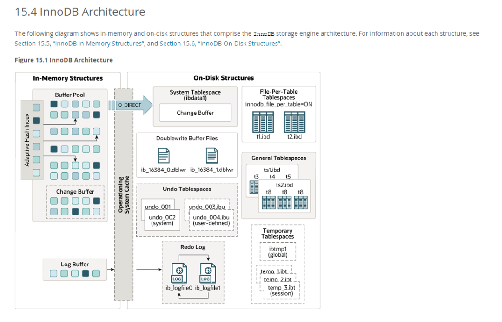
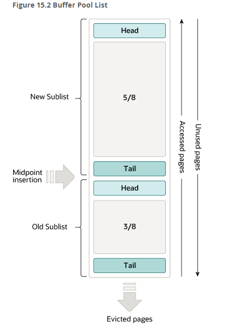
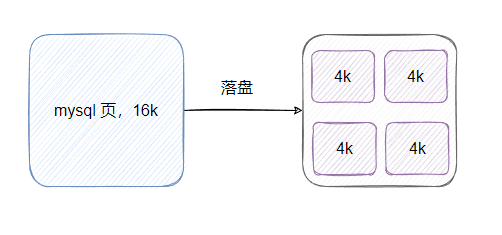
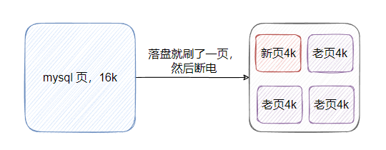

# MySQL的所有Buffer

[TOC]

<!-- START doctoc generated TOC please keep comment here to allow auto update -->
<!-- DON'T EDIT THIS SECTION, INSTEAD RE-RUN doctoc TO UPDATE -->

- [零、开篇](#%E9%9B%B6%E5%BC%80%E7%AF%87)
- [一、buffer pool](#%E4%B8%80buffer-pool)
- [二、change buffer](#%E4%BA%8Cchange-buffer)
- [三、Log Buffer](#%E4%B8%89log-buffer)
- [四、Doublewrite Buffer](#%E5%9B%9Bdoublewrite-buffer)
- [五、最后](#%E4%BA%94%E6%9C%80%E5%90%8E)

<!-- END doctoc generated TOC please keep comment here to allow auto update -->

## 零、开篇

我们来看一下官网的一张图：

这张图画的是 mysql innodb 的架构，从图中可以看到有很多 buffer，这篇我们就一个一个盘过去。

发车！（文档基于mysql8.0，以下描述的存储引擎基于 mysql innodb）

## 一、buffer pool

首先，我们来看下 buffer pool。

其实 buffer pool 就是内存中的一块缓冲池，用来缓存**表和索引**的数据。

我们都知道 mysql 的数据最终是存储在磁盘上的，但是如果读存数据都直接跟磁盘打交道的话，这速度就有点慢了。

所以 innodb 自己维护了一个 buffer pool，在读取数据的时候，会把数据加载到缓冲池中，这样下次再获取就不需要从磁盘读了，直接访问内存中的 buffer pool 即可。

包括修改也是一样，直接修改内存中的数据，然后到一定时机才会将这些脏数据刷到磁盘上。

看到这肯定有小伙伴有疑惑：直接就在内存中修改数据，假设服务器突然宕机了，这个修改不就丢了？

别怕，有个 redolog 的存在，它会持久化这些修改，恢复时可以读取 redolog 来还原数据，这个有空再详盘，今天的主角是 buffer 哈。

回到 buffer pool，其实缓冲池维护的是页数据，也就是说，即使你只想从磁盘中获取一条数据，但是 innodb 也会加载一页的数据到缓冲池中，一页默认是 16k。

当然，缓冲池的大小是有限的。按照 mysql 官网所说，在专用服务器上，通常会分配给缓冲池高达 80% 的物理内存，不管分配多少，反正内存大小正常来说肯定不会比磁盘大。

也就是说内存放不下全部的数据库数据，那说明缓冲池需要有淘汰机制，淘汰那些不常被访问的数据页。

按照这个需求，我们很容易想到 LRU 机制，最近最少使用的页面将被淘汰，即维护一个链表，被访问的页面移动到头部，新加的页面也加到头部，同时根据内存使用情况淘汰尾部的页面。

通过这样一个机制来维持内存且尽量让最近访问的数据留在内存中。

看起来这个想法不错，但 innodb 的实现并不是朴素的 LRU，而是一种变型的 LRU。

从图中我们可以看出 buffer pool 分为了老年代（old sublist）和新生代（new sublist）。

老年代默认占 3/8，当然，可以通过 innodb_old_blocks_pct 参数来调整比例。

当有新页面加入 buffer pool 时，插入的位置是老年代的头部，同时新页面在 1s 内再次被访问的话，不会移到新生代，等 1s 后，如果该页面再次被访问才会被移动到新生代。

这和我们正常了解的 LRU 不太一样，正常了解的 LRU 实现是新页面插入到头部，且老页面只要被访问到就会被移动到头部，这样保证最近访问的数据都留存在头部，淘汰的只会是尾部的数据。

> 那为什么要实现这样改造的 LRU 呢？

innodb 有预读机制，简单理解就是读取连续的多个页面后，innodb 认为后面的数据也会被读取，于是异步将这些数据载入 buffer pool
中，但是这只是一个预判，也就是说预读的页面不一定会被访问。所以如果直接将新页面都加到新生代，可能会污染热点数据，但是如果新页面是加到老年代头部，就没有这个问题。

同时大量数据的访问，例如不带 where 条件的 select 或者 mysqldump 的操作等，都会导致同等数量的数据页被淘汰，如果简单加到新生代的话，可能会一次性把大量热点数据淘汰了，所以新页面加到老年代头部就没这个问题。

**那 1s 机制是为了什么呢？**

这个机制其实也是为了处理大量数据访问的情况，因为基本上大数据扫描之后，可能立马又再次访问，正常这时候需要把页移到新生代了，但等这波操作结束了，后面还有可能再也没有请求访问这些页面了，但因为这波扫描把热点数据都淘汰了，这就不太美丽了。

于是乎搞了个时间窗口，新页面在 1s 内的访问，并不会将其移到新生代，这样就不会淘汰热点数据了，然后 1s 后如果这个页面再次被访问，才会被移到新生代，这次访问大概率已经是别的业务请求，也说明这个数据确实可能是热点数据。

经过这两个改造， innodb 就解决了预读失效和一次性大批量数据访问的问题。

至此，对 buffer pool 的了解就差不多了。

## 二、change buffer

从上面的图我们可以看到， buffer pool 里面其实有一块内存是留给 change buffer 用的。

那 change buffer 是个啥玩意呢？

还记得我在 buffer pool 写的一句话吗：innodb 直接修改内存中的数据，然后到一定时机才会将这些脏数据刷到磁盘上。

也就是修改的时候直接修改的是 buffer pool 中的数据，**但这个前提是 buffer pool 中已经存在你要修改的数据**。

假设我们就直接执行一条 `update table set name = 'yes' where id = 1`，如果此时 buffer pool 里没有 id 为 1 的这条数据，那怎么办？

难道把这条数据先加载到 buffer pool 中，然后再执行修改吗？

当然不是，这时候 change buffer 就上场了。

如果当前数据页不在 buffer pool 中，那么 innodb 会把更新操作缓存到 change buffer 中，当下次访问到这条数据后，会把数据页加载到 buffer pool 中，并且应用上 change buffer
里面的变更，这样就保证了数据的一致性。

所以 change buffer 有什么好处？

当**二级索引页**不在 buffer pool 中时，change buffer 可以避免立即从磁盘读取对应索引页导致的昂贵的随机I/O ，对应的更改可以在后面当二级索引页读入 buffer pool 时候被批量应用。

看到我加粗的字体没，二级索引页，没错 change buffer 只能用于二级索引的更改，不适用于主键索引，空间索引以及全文索引。

还有，唯一索引也不行，因为唯一索引需要读取数据然后检查数据的一致性。

看到这肯定又有小伙伴关心：更改先缓存在 change buffer 中，假如数据库挂了，更改不是丢了吗？

别怕，change buffer 也是要落盘存储的，从上图我们看到 change buffer 会落盘到系统表空间里面，然后 redo log 也会记录 chang buffer 的修改来保证数据一致性。

至此，想必你对 change buffer 已经有一定了解了吧。

这玩意主要用来避免于二级索引页修改产生的随机I/O，如果你的内存够大能装下所有数据，或者二级索引很少，或者你的磁盘是固态的对随机访问影响不大，其实可以关闭 change buffer，这玩意也增加了复杂度，当然最终还是得看压测结果。

## 三、Log Buffer

接下来，我们看看 Log Buffer。

从上面的图我们可以得知，这玩意就是给 redo log 做缓冲用的。

redo log 我们都知道是重做日志，用来保证崩溃恢复数据的正确性，innodb 写数据时是先写日志，再写磁盘数据，即 WAL (Write-Ahead Logging)，把数据的随机写入转换成日志的顺序写。

但，即使是顺序写 log ，每次都调用 write 或者 fsync 也是有开销的，毕竟也是系统调用，涉及上下文切换。

于是乎，搞了个 Log Buffer 来缓存 redo log 的写入。

即写 redo log 先写到 Log Buffer 中，等一定时机再写到 redo log 文件里。

我们每次事务可能涉及多个更改，这样就会产生多条 redo log，这时会都先写到 Log Buffer 中，等事务提交的时候，一起将这些 redo log 写到文件里。

或者当 Log Buffer 超过总量的一半（默认总量是 16mb），也会将数据刷到 redo log 文件中。

也有个后台线程，每隔 1s 就会将 Log Buffer 刷到 redo log 文件中。

从上面这些我们得知，Log Buffer 其实就是一个写优化操作，把多次 write 优化成一次 write，一次处理多数据，减少系统调用。

看到这肯定有小伙伴说，数据先写 Log Buffer 而不刷盘，这数据不会丢吗？

innodb 其实给了个配置，即 `innodb_flush_log_at_trx_commit` 来控制 redo log 写盘时机。

- 当值为 0，提交事务不会刷盘到 redo log，需要等每隔一秒的后台线程，将 log buffer 写到操作系统的 cache，并调用 fsync落盘，性能最好，但是可能会丢 1s 数据。
- 当值为 1，提交事务会将 log buffer 写到操作系统的 cache，并调用 fsync 落盘，保证数据正确，性能最差，这也是默认配置。
- 当值为 2，提交事务会将 log buffer 写到操作系统的 cache，但不调用 fsync，而是等每隔 1s 调用 fsync 落盘，性能折中，如果数据库挂了没事，如果服务器宕机了，会丢 1s 数据。

具体如何配置看你的业务了。

至此，想必你应该了解 Log Buffer 是干啥用了的吧。

## 四、Doublewrite Buffer

现在我们来看最后一个 buffer，即 Doublewrite Buffer。

这玩意又是啥用呢？

我们都知道 innodb 默认一页是 16K，而操作系统 Linux 内存页是 4K，那么一个 innodb 页对应 4 个系统页。

所以 innodb 的一页数据要刷盘等于需要写四个系统页，那假设一页数据落盘的时候，只写了一个系统页 就断电了，那 innodb 一页数据就坏了，然后就 g 了，恢复不了。

即产生了部分页面写问题，因为写 innodb 的一页无法保证原子性，所以引入了 Doublewrite Buffer。

其实就是当 innodb 要将数据落盘的时候，先将页数据拷贝到 Doublewrite Buffer 中，然后 Doublewrite Buffer 再刷盘到 Doublewrite Buffer Files，这时候数据已经落盘了。

然后再将数据页刷盘到本该到文件上。

从这个步骤我们得知，数据是写了两次磁盘，所以这玩意叫 double write。

之所以这样操作就是先找个地方暂存这次刷盘的完整数据，如果出现断电这种情况导致的部分页面写而损坏原先的完整页，可以从 Doublewrite Buffer Files 恢复数据。

但虽然是两次写，性能的话也不会低太多，因此数据拷贝到 Doublewrite Buffer 是内存拷贝操作，然后写到 Doublewrite Buffer Files 也是批量写，且是顺序写盘，所以整体而已，性能损失不会太多。

有了这玩意，在崩溃恢复的时候，如果发现页损坏，就可以从 Doublewrite Buffer Files 里面找到页副本，然后恢复即可。

完美。

## 五、最后

好了，关于 innodb buffer 们介绍完了，我们来总结一下：

buffer pool，缓存数据页，避免频繁地磁盘交互，内部利用定制的 LRU 来淘汰缓存页，LRU分老年代和新生代。

change buffer，用于二级非唯一索引的新增、修改或删除操作，当 buffer pool 没有数据的时候，不需要加载数据页到缓冲池中，而是通过 change buffer 来记录此变更，减少随机 I/O。

log buffer，用于 redo log 的缓冲，减少 I/O，批处理减少系统调用。

doublewrite Buffer，用于部分页面写问题，双写数据页，坏页时可从 doublewrite buffer files 进行页恢复，保证页的完整和数据的正确。