# InnoDB B-TREE 索引怎么定位一条记录

<!-- START doctoc generated TOC please keep comment here to allow auto update -->
<!-- DON'T EDIT THIS SECTION, INSTEAD RE-RUN doctoc TO UPDATE -->

- [零、开篇](#%E9%9B%B6%E5%BC%80%E7%AF%87)
- [一、概述](#%E4%B8%80%E6%A6%82%E8%BF%B0)
- [二、什么是扫描区间？](#%E4%BA%8C%E4%BB%80%E4%B9%88%E6%98%AF%E6%89%AB%E6%8F%8F%E5%8C%BA%E9%97%B4)
- [三、索引页结构](#%E4%B8%89%E7%B4%A2%E5%BC%95%E9%A1%B5%E7%BB%93%E6%9E%84)
- [四、定位扫描区间的第一条记录](#%E5%9B%9B%E5%AE%9A%E4%BD%8D%E6%89%AB%E6%8F%8F%E5%8C%BA%E9%97%B4%E7%9A%84%E7%AC%AC%E4%B8%80%E6%9D%A1%E8%AE%B0%E5%BD%95)
    - [1. 抽象过程描述](#1-%E6%8A%BD%E8%B1%A1%E8%BF%87%E7%A8%8B%E6%8F%8F%E8%BF%B0)
    - [2. 准备一棵 B+ 树](#2-%E5%87%86%E5%A4%87%E4%B8%80%E6%A3%B5-b-%E6%A0%91)
    - [3. 记录在哪个叶结点？](#3-%E8%AE%B0%E5%BD%95%E5%9C%A8%E5%93%AA%E4%B8%AA%E5%8F%B6%E7%BB%93%E7%82%B9)
    - [4. 记录在叶结点的哪个位置？](#4-%E8%AE%B0%E5%BD%95%E5%9C%A8%E5%8F%B6%E7%BB%93%E7%82%B9%E7%9A%84%E5%93%AA%E4%B8%AA%E4%BD%8D%E7%BD%AE)
- [五、性能优化](#%E4%BA%94%E6%80%A7%E8%83%BD%E4%BC%98%E5%8C%96)
    - [1. 根结点、内结点优化](#1-%E6%A0%B9%E7%BB%93%E7%82%B9%E5%86%85%E7%BB%93%E7%82%B9%E4%BC%98%E5%8C%96)
    - [2. 叶结点优化](#2-%E5%8F%B6%E7%BB%93%E7%82%B9%E4%BC%98%E5%8C%96)
- [六、总结](#%E5%85%AD%E6%80%BB%E7%BB%93)

<!-- END doctoc generated TOC please keep comment here to allow auto update -->

[TOC]

## 零、开篇

对于 SQL 语句的执行来说，定位 B-TREE 索引中的一条记录，是个举足轻重的能力。

InnoDB 是基于索引组织数据的，更新、删除操作都需要先去索引中找到具体的记录。

插入操作也需要先找到记录要插入到索引的哪个位置。

查询语句的 WHERE 条件能够命中索引时，也需要先找到 WHERE 条件对应的扫描区间的第一条记录，然后从这条记录开始沿着索引页内记录之间的单向链表、索引页之间的双向链表依次读取后续的记录。

通过以上简短的介绍，定位 B-TREE 索引中的记录的重要性就显而易见了。

> 本文内容基于 MySQL 8.0.29

## 一、概述

更新、删除、查询操作定位索引中的一条记录，插入操作找到要插入的位置，过程基本上是一样的，源码中也是在同一个方法中实现。

本文以 WHERE 条件能够命中索引为前提，介绍查询操作定位 WHERE 条件`扫描区间的第一条记录`。

定位记录过程中进行的二分法查找、顺序查找，会涉及到索引页的部分结构。

接下来会先用 2 个小节分别介绍扫描区间、以及和定位记录过程相关的索引页的部分结构。

## 二、什么是扫描区间？

扫描区间就是 WHERE 条件中，由字段、关系运算符（>、>=、<、<=、=）组成的，用于限定需要扫描记录的`范围`。

这个一句话描述太抽象，我们展开细说。

扫描区间可以按照不同维度分类：

- `按是否有界`，可以分为有界区间、单侧有界区间。
- `按开闭`，可以分为开区间、闭区间、半开半闭区间。
- `特殊区间`，单点区间。

**有界区间**

`开区间`，例如：WHERE a > 100 AND a < 200，扫描区间为 (100, 200)。

`闭区间`，例如：WHERE a >= 100 AND a <= 200，扫描区间为 [100, 200]。

`左开右闭区间`，例如：WHERE a > 100 AND a <= 200，扫描区间为 (100, 200]。

`左闭右开区间`，例如：WHERE a >= 100 AND a < 200，扫描区间为 [100, 200)。

**单侧有界区间**

`有下界，左开区间`，例如：WHERE a > 100，扫描区间为 (100, +∞)。

`有下界，左闭区间`，例如：WHERE a >= 100，扫描区间为 [100, +∞)。

`有上界，右开区间`，例如：WHERE a < 200，扫描区间为 (-∞, 200)。

`有上界，右闭区间`，例如：WHERE a <= 200，扫描区间为 (-∞, 200]。

**单点区间**

`只有一个值的区间`，例如：WHERE a = 100，扫描区间为 [100, 100]。

## 三、索引页结构

B-TREE 索引的根结点、内结点、叶结点，都是`索引页`。

索引页内部结构比较复杂，暂不做过多介绍，接下来我们只介绍`定位记录`需要用到的结构：伪记录、记录链表、槽（SLOT，也可以叫记录分组）。

**记录链表**

索引页每条记录的头信息中，都有一个 `2 字节`的空间，保存着下一条记录在当前索引页中的偏移量。

> 偏移量，是记录的数据（不包含记录头信息）的第一个字节的地址，减去索引页的第一个字节的地址得到的数字。

> InnoDB 索引页最大可以设置为 64K，2 字节就可以表示索引页中任何一个字节的偏移量。

这个 2 字节的空间，叫作 `next_record`，通过 next_record 可以把索引页中的记录串起来形成一个单向链表。

从任何一条记录开始，一直往后遍历，都能到达当前索引页中的最后一条记录。

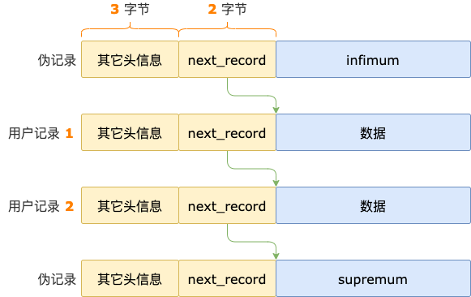

**伪记录**

`伪记录`指的是索引页中，不是由用户插入，而是 InnoDB 偷偷插入的记录。

不管索引页中是否有用户插入的记录（`用户记录`），每个索引页中都会有 2 条伪记录：

- `infimum`，索引页中的第一条记录。 索引页中`有`用户记录时，infimum 的 next_record 指向`第一条`用户记录。 索引页中`没有`用户记录时，infimum 的 next_record
  指向 `supremum` 记录。
- `supremum`，索引页中的最后一条记录。

**槽（SLOT）**

索引页中的 `槽` 分为 3 种类型：

- `infimum 槽`，只包含一条记录，就是 `infimum 伪记录`。
- `supremum 槽`，包含 1 ~ 8 条记录，最后一条是 `supremum 伪记录`，其余的是用户记录。
- `普通槽`，包含 4 ~ 8 条用户记录。

每个槽占用 `2 字节`，保存着该槽对应的 N 条记录中，最大的那条记录在当前索引页中的`偏移量`。

`最大记录`指的是槽中按照索引字段升序排序的最后一条记录。

索引页中的槽，存储在索引页的一个专门的区域，这个区域叫作`页目录（Page Directory）`。

页目录区域中的槽是按照倒序排序，并且是紧挨着存储的，第一个槽的位置在最后，第二个槽的位置在倒数第二个，依此类推，最后一个槽的位置在第一个。

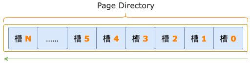

## 四、定位扫描区间的第一条记录

### 1. 抽象过程描述

B+ 树索引包含根结点、内结点、叶结点，在一棵 3 层的 B+ 树中定位扫描区间的第一条记录，大体流程如下：

- 从根结点开始，确定记录在哪个内结点中。
- 进入内结点，确定记录在哪个叶结点中。
- 进入叶结点，确定记录的位置。

> 随着 B+ 树的层级增多或减少，以上步骤也会相应的增多或减少。

上述流程中的每一个步骤，内部过程是一样的，都需要先进行二分法查找、再进行顺序查找。

最后，如果是根结点和内结点，就再进入下一个步骤；如果是叶结点，就没有然后了。

二分法查找、顺序查找过程如下：

**第 1 步**，通过二分法查找，确定记录属于哪个槽。

每个索引页的头信息中有一个 `2 字节`的区域，存放着当前索引页中有多少个槽，这个区域的名字叫作 `PAGE_N_DIR_SLOTS`。

读取 PAGE_N_DIR_SLOTS 的值，得到槽的数量，然后减 1，计算出槽的最大序号：`high = PAGE_N_DIR_SLOTS - 1`，由此，我们就得到了`二分法`的初始状态的上边界。

初始状态的下边界，就是第一个槽（`infimum 槽`）的序号，low = 0。

二分法查找可能会进行 0 ~ N 轮（N >= 1），每一轮查找，都会先通过  `mid = (low + high) / 2` 计算出`中间位置`。

然后，判断要查找的记录是在 `low 区间`（low ~ mid），还是在 `high 区间`（mid ~ high）。

最后，根据判断结果，进入 `low 区间`或 `high 区间`，查找范围就缩小了一半，继续进行下一轮查找，依此类推，直到 low 和 high 的值不满足循条件 `high - low > 1`，二分法查找结束。

> 这里的二分法，不仅要支持单点扫描区间，还要支持`大于`、`大于等于`、`小于`、`小于等于`这些范围扫描区间，不能找到一条满足扫描区间的记录之后就马上停下来，而是要等到 low 和 high 的值不满足循环条件，才能结束二分法查找的过程。

二分法查找结束时，要查找的记录总是属于`high 槽`（上边界 high 对应的槽），`low 槽` 总是 `high 槽`的前一个槽。这对于`第 2 步`顺序查找能够顺利的找到记录在槽中的位置很关键。

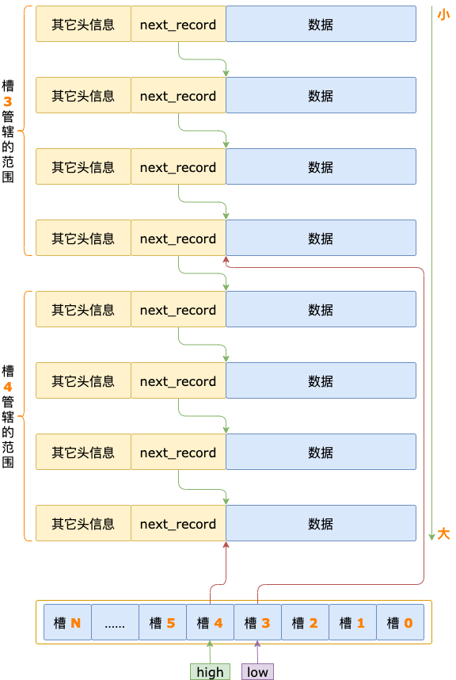

**第 2 步**，确定记录所在的槽之后，沿着每条记录头信息中的 `next_record` 顺序查找，确定记录在槽中的位置。

以二分法查找结束时的状态为基础，继续进行顺序查找。

从 `low 槽`的最大记录开始，通过头信息中的 `next_record` 读取下一条记录。

比较下一条记录中索引字段值和扫描区间的字段值，判断下一条记录是不是扫描区间的第一条记录。

如果`是`，顺序查找过程结束。

如果`不是`，继续读取下一条记录，并判断是否是扫描区间的第一条记录，依此类推，直到要读取的下一条记录是 `high 槽`中的最大记录，查找过程结束。

接下来，我们通过一个例子来把上面描述的抽象过程具体化。

### 2. 准备一棵 B+ 树

有一个主键索引，包含一个 int 类型的 id 字段，结构为 B+ 树，包含 2 层：根结点、叶结点，索引结构如下图所示：

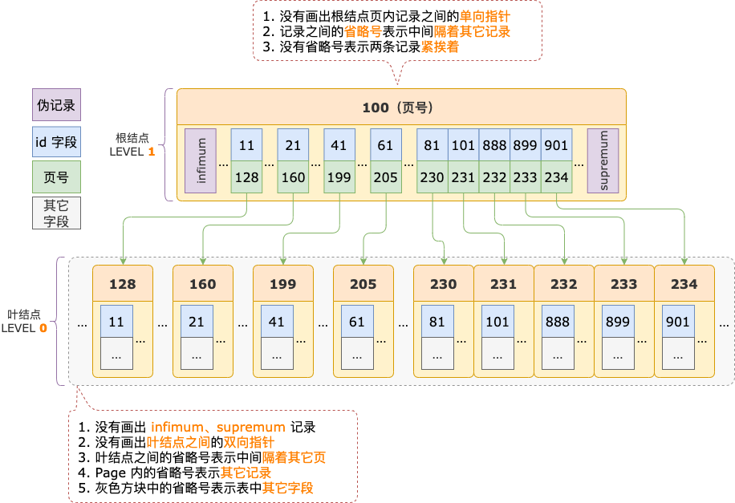

我们以定位 `id >= 700` 查询条件对应的扫描区间 `[700, +∞)` 的第一条记录为例，来分析在 B+ 树索引中定位扫描区间的第一条记录的过程。

### 3. 记录在哪个叶结点？

示例索引的 B+ 树，包含根结点、叶结点两层，定位扫描区间的第一条记录，从根结点开始。

根据抽象过程描述的步骤，先通过二分法查找确定 `[700, +∞)` 扫描区间的第一条记录在哪个槽。

示例索引的 B+ 树，根结点中有 8 个槽，初始状态下，二分法的上下边界分别为：low = 0、high = 8 - 1 = 7。

**二分法查找**

`第 1 轮`，计算中间位置 `mid = (low + high) / 2 = (0 + 7) / 2 = 3`，得到 low 区间（low ~ mid => 0 ~ 3）、high 区间（mid ~ high => 3 ~ 7）。

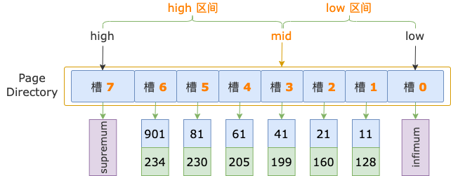

中间位置对应`槽 3`（序号为 3 的槽），其最大记录的 id = 41，`小于`扫描区间左端点值 700，说明 `id >= 700 的第一条记录`（后面就直接称为`第一条记录`了）位于 high 区间。

修改下边界值，low = mid = 3，进入 high 区间。

`第 2 轮`，计算中间位置 `mid = (low + high) / 2 = (3 + 7) / 2 = 5`，得到 low 区间（3 ~ 5）、high 区间（5 ~ 7）。

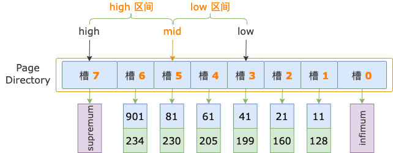

中间位置对应`槽 5`，其最大记录的 id = 81，`小于`扫描区间左端点值 700，说明`第一条记录`位于 high 区间。

修改下边界值，low = mid = 5，进入 high 区间。

`第 3 轮`，计算中间位置 `mid = (low + high) / 2 = (5 + 7) / 2 = 6`，得到 low 区间（5 ~ 6）、high 区间（6 ~ 7）。

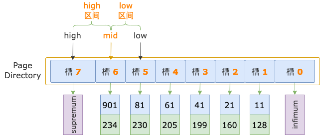

中间位置对应`槽 6`，其最大记录的 id = 901，`大于`扫描区间左端点值 700，说明`第一条记录`位于 low 区间。

修改上边界值，high = mid = 6。

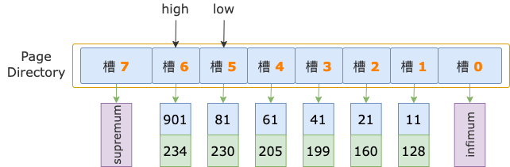

然后，`high - low = 6 - 5 = 1`，不满足循环条件 `high - low > 1`，二分法查找结束。

扫描区间左端点值 700，大于`槽 5`的最大记录的 id 值（81），小于`槽 6`的最大记录的 id 值（901），说明`第一条记录`属于`槽 6` 的管辖范围（此时，`槽 6` 就是 `high 槽`）。

接下来，就要进入顺序查找的主场，去寻找`第一条记录`在槽中的位置了。

**顺序查找**

二分法查找结束时，low = 5（`槽 5`），其最大记录的 id = 81；high = 6（`槽 6`），其最大记录的 id = 901。

二分法查找过程中，已经确定了扫描区间左端点值 700 在`槽 6`中，所以，在顺序查找过程中，不需要读取 id = 81 这条记录（`槽 5`的`最后一条`记录），而是从这条记录的下一条记录，也就是`槽 6` 的`第一条`记录开始。

`第 1 轮`，读取 id = 81 的下一条记录，得到 id = 101 的记录，101 小于扫描区间左端点值 700，还需要继续读取下一条记录进行比较。

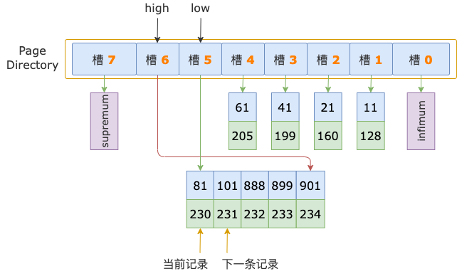

`第 2 轮`，读取 id = 101 的下一条记录，得到 id = 888 的记录，888 大于扫描区间左端点值 700，也就锁定了 id >= 700 的第一条记录，位于 id 为 101 ~ 888 的记录之间，也就是在 id =
888 之前。

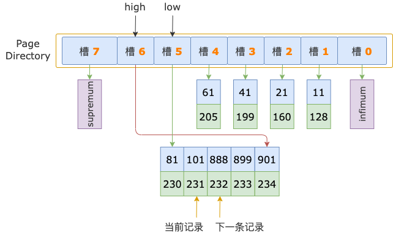

然而，id = 888 这条记录，是其所在的叶结点索引页的`第一条`用户记录。

id >= 700 的第一条记录，不可能和 id = 888 这条记录同处于一个索引页了，只能立足于这个索引页的`前一个索引页`。

根结点中 id = 101 是 id = 888 的前一条记录，id = 101 所在的叶结点索引页就是 id = 888 所在的叶结点索引页的前一页了。

最终，id >= 700 的第一条记录，也就位于 id = 101 这条记录所在的叶结点索引页中了。

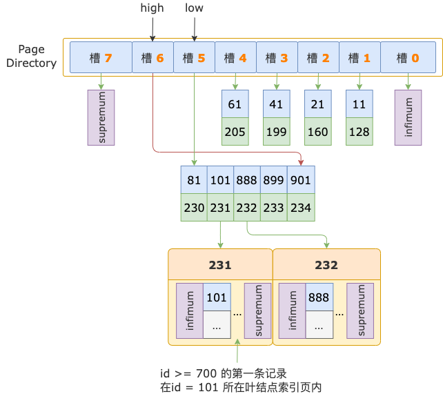

至此，经过 2 轮比较，就已经确定了 `id >= 700 的第一条记录`所在的叶结点索引页了，顺序查找过程结束。

接下来，从 id = 101 这条记录中读取其对应的叶结点索引页的页号，进入叶结点。

### 4. 记录在叶结点的哪个位置？

示例索引的 B+ 树，叶结点中有 10 个槽，初始化状态下，二分法查找的上下边界分别为：low = 0，high = 10 - 1 = 9。

**二分法查找**

`第 1 轮`，计算中间位置 `mid = (low + high) / 2 = (0 + 9) / 2 = 4`，得到 low 区间（low ~ mid => 0 ~ 4）、high 区间（mid ~ high => 4 ~ 9）。

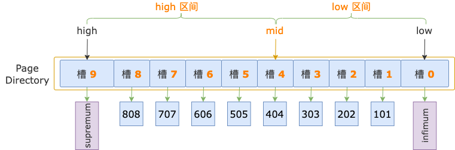

中间位置对应`槽 4`，其最大记录的 id = 404，`小于`扫描区间左端点值 700，说明 `id >= 700 的第一条记录`（简称为`第一条记录`）位于 high 区间。

修改下边界值，low = mid = 4，进入 high 区间。

`第 2 轮`，计算中间位置 `mid = (low + high) / 2 = (4 + 9) / 2 = 6`，得到 low 区间（4 ~ 6）、high 区间（6 ~ 9）。

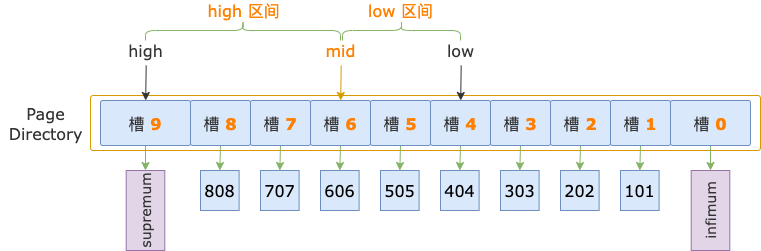

中间位置对应`槽 6`，其最大记录的 id = 606，`小于`扫描区间左端点值 700，说明`第一条记录`位于 high 区间。

修改下边界值，low = mid = 6，进入 high 区间。

`第 3 轮`，计算中间位置 `mid = (low + high) / 2 = (6 + 9) / 2 = 7`，得到 low 区间（6 ~ 7）、high 区间（7 ~ 9）。

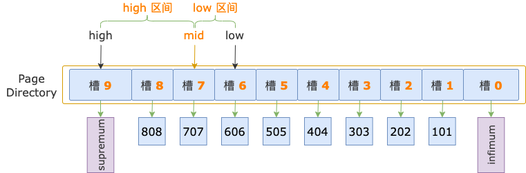

中间位置对应`槽 7`，其最大记录的 id = 707，`大于`扫描区间左端点值 700，说明`第一条记录`位于 low 区间。

修改上边界值，up = mid = 7，此时，high - low = 7 - 6 = 1，不满足循环条件 `up - low > 1`，循环结束。

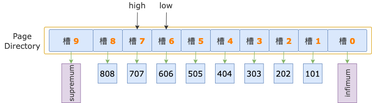

扫描区间左端点值 700，大于`槽 6` 的最大记录的 id（606），小于`槽 7` 的最大记录的 id（707），说明`第一条记录`属于`槽 7` 的管辖范围（此时，`槽 7`就是 `high 槽`）。

接下来，就要去寻找第一条记录在槽中的位置了。

**顺序查找**

二分法查找结束时，low = 6（`槽 6`），其最大记录的 id = 606；high = 7（`槽 7`），其最大记录的 id = 707。

二分法查找过程中，已经确定了`第一条记录`在`槽 7` 的范围内，所以，在顺序查找过程中，不需要读取 id = 606 这条记录（`槽 6` 的`最后一条`记录），而是从这条记录的下一条记录，也就是`槽 7` 的第一条记录开始。

`第 1 轮`，读取 id = 606 的下一条记录，得到 id = 666 的记录，666 小于扫描区间左端点值 700，还需要读取下一条记录进行比较。

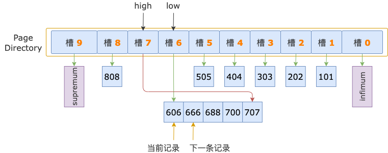

`第 2 轮`，读取 id = 666 的下一条记录，得到 id = 688 的记录，688 小于扫描区间左端点值 700，继续读取下一条记录。

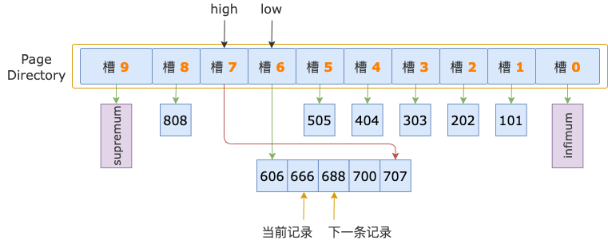

`第 3 轮`，读取 id = 688 的下一条记录，得到 id = 700 的记录，700 等于扫描区间左端点值 700， 满足 id >= 700 条件。

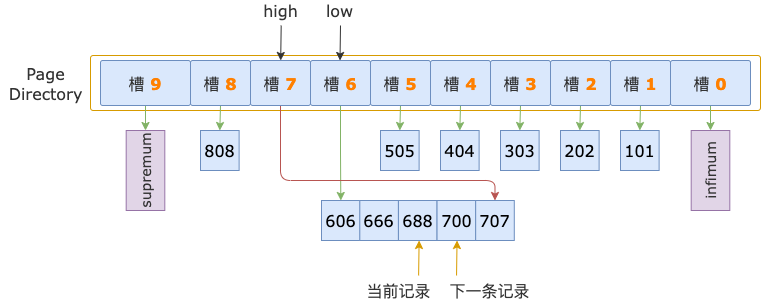

至此，经过 3 轮比较，已找到 `id >= 700` 对应的扫描区间 `[700, +∞)` 的`第一条记录`，叶结点的顺序查找过程结束，定位扫描区间的第一条记录的整个过程也结束了。

## 五、性能优化

前面介绍二分法查找定位槽、顺序查找定位记录位置的过程中，都涉及到对扫描区间字段值和索引字段值进行比较，但是我们没有更进一步介绍比较的过程。

如果只是常规的比较，无非是循环扫描区间的字段，逐个和索引中对应的字段进行比较，这也就不需要再多说什么了。

但是，InnoDB 对比较的过程进行了优化，对于已经比较过的字段、字段前面的部分内容，尽可能避免进行重复比较，从而提升二分法查找、顺序查找过程的执行效率，以提升性能。

InnoDB 对于叶结点的优化相比于根结点、内结点来说更进一步，我们分两个小节分别介绍对于根结点 & 内结点、叶结点的二分法查找、顺序查找的优化。

### 1. 根结点、内结点优化

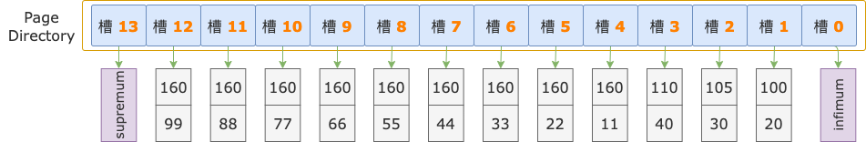

我们基于上图索引页中槽的示例数据，以查询条件 `i1 >= 160 and i2 >= 44` 为例，来分析定位扫描区间左端点 `160, 44`（用这个`代表`扫描区间的`第一条记录`） 在哪个槽中的过程。

初始状态下，二分法查找的上下边界为：low = 0，high = 13。

**二分法查找**

`第 1 轮`，计算中间位置 `mid = (low + high) / 2 = (0 + 13) / 2 = 6`，得到 low 区间（low ~ mid => 0 ~ 6）、high 区间（mid ~ high => 6 ~ 13）。

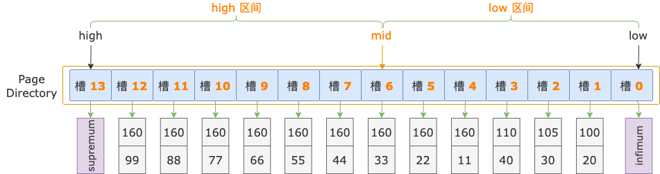

中间位置对应`槽 6`，其最大记录的 i1 = 160、i2 = 33，逐个比较扫描区间左端点和`槽 6` 的最大记录的 i1、i2 字段值，以确定扫描区间左端点位于 low 区间还是 high 区间。

先比较 i1 字段值，扫描区间左端点的 i1 字段值和索引中的 i1 字段值都等于 160。

接着比较 i2 字段的值，扫描区间左端点的 i2 字段值（44）`大于`索引记录中的 i2 字段值（33），说明扫描区间左端点值 `160, 44` 位于 high 区间（槽 6 ~ 13）。

修改下边界值，low = mid = 6，进入 high 区间。

`第 2 轮`，计算中间位置 `mid = (low + high) / 2 = (6 + 13) / 2 = 9`，得到 low 区间（6 ~ 9）、high 区间（9 ~ 13）。

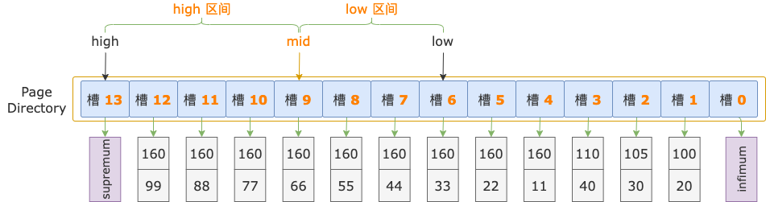

中间位置对应`槽 9`，其最大记录的 i1 = 160，i2 = 66，逐个比较扫描区间左端点和`槽 9` 的最大记录的 i1、i2 字段值，以确定扫描区间左端点位于 low 区间还是 high 区间。

先比较 i1 字段值，扫描区间左端点的 i1 字段值和索引记录中的 i1 字段值都等于 160。

接着比较 i2 字段的值，扫描区间左端点的 i2 字段值（44）`小于`索引记录中的 i2 字段值（66），说明扫描区间左端点值 `160, 44` 位于 low 区间（槽 6 ~ 9）。

修改上边界值，high = mid = 9，进入 low 区间。

`第 3 轮`，计算中间位置 `mid = (low + high) / 2 = (6 + 9) / 2 = 7`，得到 low 区间（6 ~ 7）、high 区间（7 ~ 9）。

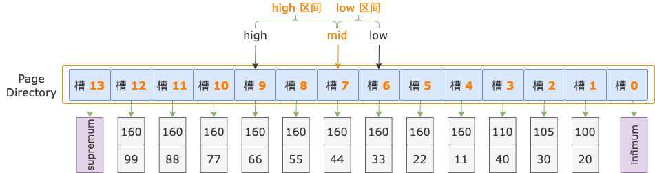

中间位置对应`槽 7`，其最大记录的 i1 = 160，i2 = 44。

按照第 1、2 轮的套路，接下来该逐个比较扫描区间左端点和`槽 7` 的最大记录的 i1、i2 字段值了。

但是 ……，**重点来了**，经过第 1 轮比较，确定了扫描区间左端点值 `160, 44` 位于`槽 6 ~ 13` 之间；经过第 2 轮比较，确定了扫描区间左端点值 `160, 44` 位于`槽 6 ~ 9` 之间。

取交集可得：扫描区间左端点值 `160, 44` 位于`槽 6 ~ 9` 之间。

从前面的示意图中可见，`槽 6 ~ 9` 之间，每个槽的最大记录的 i1 字段值都是 160，扫描区间左端点的 i1 字段值也是 160。

在这个范围内，不管接下来要进行多少轮比较，都能够很确定的知道记录的 i1 字段值是等于扫描区间左端点的 i1 字段值的。

既然在比较之前就已经能确定比较的结果是相等的，也就`不用`比较了 i1 字段的值了。

二分法查找结束之后，后面的顺序查找过程，也是在这个范围之内，也都可以`不用`比较 i1 字段的值了。

好了，这一节我们要讲的是 InnoDB 对定位过程的优化，目标已经达成，对于上面的例子，剩下的二分法查找和顺序查找过程，就不再接着往下分析了。

### 2. 叶结点优化

如果能够在二分法查找过程中锁定一个范围，叶结点的二分法查找、顺序查找过程，不但能跳过前面 N 个已经比较过并且相等的字段，还能更进一步，跳过第 N + 1 个字段中已经比较过并且相等的前 M 字节。

不过，跳过已经比较过的字节有一些限制，只能应用于以下字段：

- tinyint、int、smallint、mediumint、bigint、tinyblob、blob、mediumblob、longblob、binary、varbinary 类型的字段。
- InnoDB B-TREE `根结点`、`内结点`的记录中指向子结点索引页的`页号`。
- InnoDB B-TREE `叶结点`记录中的 DB_ROW_ID、DB_TRX_ID、DB_ROLL_PTR 字段。

> 以上这些类型的字段，在二分法查找和顺序查找的过程中，源码中是要循环字段内容，**逐字节**进行比较的。

我们还是以一个具体例子来说明：

有一个 B-TREE 索引，包含 2 个字段，i1 为 int 类型，b1 为 blob 类型，如下图所示：

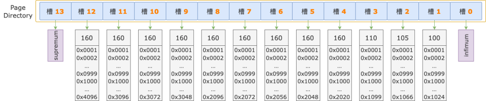

假设扫描区间左端点的 i1 字段值为 160，b1 字段值的前 1000 字节为 `0x001 0x002 … 0x999 0x1000`。

再次假设，经过前 2 轮比较已经锁定了扫描区间的左端点值在 `槽 6 ~ 槽 9` 之间，这个区间内所有记录的 i1 字段值都是 160，所有记录的 b1 字段前 1000 字节都是 `0x001 0x002 … 0x999 0x1000`
。

如果在第 3 轮及以后的二分法查找、顺序查找过程中，只能跳过已经比较过的 i1 字段，对于 b1 字段，每次都要从第 1 个字节开始比较，前 1000 字节的逐字节比较就`重复`了。

按照我们前面介绍的场景，在锁定范围内（`槽 6 ~ 9`），扫描区间左端点的 i1 字段和所有记录的 i1 字段值都相等；b1 字段前 1000 字节也都相等，也`不用`比较，是可以跳过的。

那么，在二分法查找的后续比较、顺序查找过程中，只需要从 b1 字段的第 1001 字节开始比较，又能更多的避免一些重复的比较操作了。

## 六、总结

正式进入本文主题内容之前，`2、3 小节`先介绍了扫描区间的定义，以及举例说明了每种类型的扫描区间；然后介绍了索引页中和本文关联比较大的结构：记录链表、伪记录、槽（SLOT）。

`4 小节`先对二分法查找定位槽、顺序查找定位槽中的记录进行抽象的过程描述，然后，以一个 2 层的 B-TREE 索引为例，详细分析了二分法查找定位槽、顺序查找定位槽中记录的每一步。

`5 小节`介绍了 InnoDB 为了`减少`
二分法查找定位槽、顺序查找定位槽中记录的过程中的比较次数，在锁定一个范围之后，对于根结点、内结点，能够跳过已经比较过并确认为相等的字段；对于叶结点，除了能跳过字段，还能跳过字段中已经比较过并确认为相等的前面的部分字节。