# explain-索引优化

[TOC]

## 零、开篇

对于互联网公司来说，随着用户量和数据量的不断增加，慢查询是无法避免的问题。一般情况下如果出现慢查询，意味着接口响应慢、接口超时等问题。如果是高并发的场景，可能会出现数据库连接被占满的情况，直接导致服务不可用。

慢查询的确会导致很多问题，我们要如何优化慢查询呢？

主要解决办法有：

- 监控sql执行情况，发邮件、短信报警，便于快速识别慢查询sql
- 打开数据库慢查询日志功能
- 简化业务逻辑
- 代码重构、优化
- 异步处理
- sql优化
- 索引优化

其他的办法先不说，后面有机会再单独介绍。今天我重点说说索引优化，因为它是解决慢查询sql问题最有效的手段。

如何查看某条sql的索引执行情况呢？

没错，在sql前面加上`explain`关键字，就能够看到它的执行计划，通过执行计划，我们可以清楚的看到表和索引执行的情况，索引有没有执行、索引执行顺序和索引的类型等。

索引优化的步骤是：

1. 使用`explain`查看sql执行计划
2. 判断哪些索引使用不当
3. 优化sql，sql可能需要多次优化才能达到索引使用的最优值

既然索引优化的第一步是使用`explain`，我们先全面的了解一下它。

## 一、explain介绍

先看看mysql的官方文档是怎么描述explain的：

- EXPLAIN可以使用于 SELECT， DELETE， INSERT， REPLACE，和 UPDATE语句。
- 当EXPLAIN与可解释的语句一起使用时，MySQL将显示来自优化器的有关语句执行计划的信息。也就是说，MySQL解释了它将如何处理该语句，包括有关如何连接表以及以何种顺序连接表的信息。
- 当EXPLAIN与非可解释的语句一起使用时，它将显示在命名连接中执行的语句的执行计划。
- 对于SELECT语句， EXPLAIN可以显示的其他执行计划的警告信息。

## 二、explain详解

explain的语法：

```sql
{EXPLAIN | DESCRIBE | DESC}
    tbl_name [col_name | wild]

{EXPLAIN | DESCRIBE | DESC}
    [explain_type]
    {explainable_stmt | FORCONNECTION connection_id}

explain_type: {
    EXTENDED
  | PARTITIONS
  | FORMAT = format_name
}

format_name: {
    TRADITIONAL
  | JSON
}

explainable_stmt: {
    SELECTstatement
  | DELETEstatement
  | INSERTstatement
  | REPLACEstatement
  | UPDATEstatement
}
```

用一条简单的sql看看使用`explain`关键字的效果：

```sql
explain select * from test1;
```

执行结果：

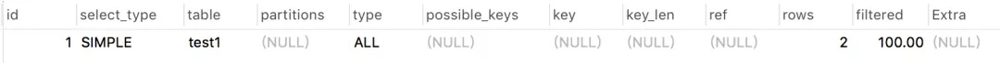

从上图中看到执行结果中会显示12列信息，每列具体信息如下：

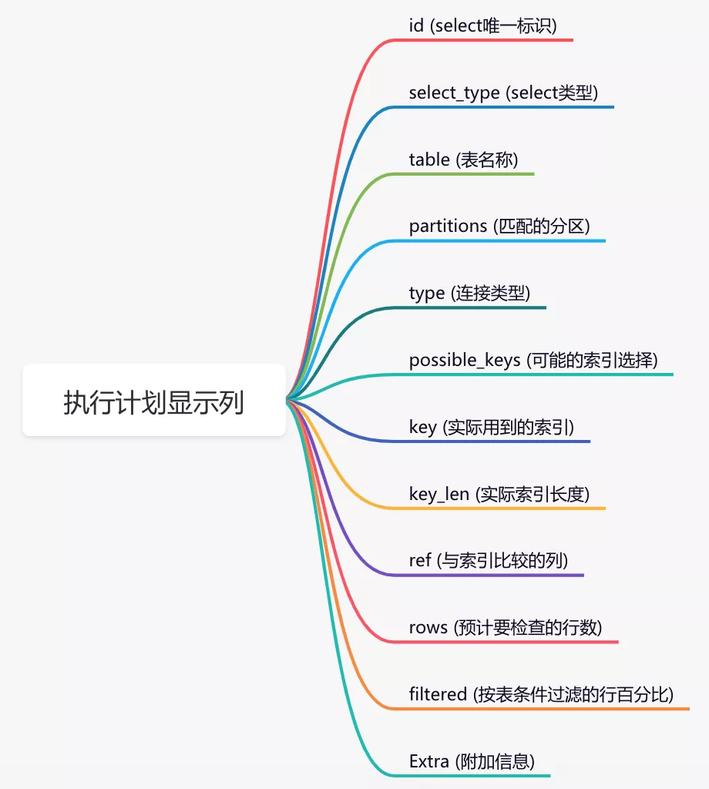

说白了，我们要搞懂这些列的具体含义才能正常判断索引的使用情况。

话不多说，直接开始介绍吧。

### 1. id列

该列的值是select查询中的序号，比如：1、2、3、4等，它决定了表的执行顺序。

某条sql的执行计划中一般会出现三种情况：

1. id相同
2. id不同
3. id相同和不同都有

那么这三种情况表的执行顺序是怎么样的呢？

**1. id相同**

执行sql如下：

```sql
explain select * from test1 t1 inner join test1 t2 on t1.id=t2.id
```

结果：

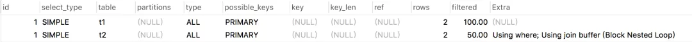

我们看到执行结果中的两条数据id都是1，是相同的。

这种情况表的执行顺序是怎么样的呢？

答案：从上到下执行，先执行表t1，再执行表t2。

执行的表要怎么看呢？

答案：看table字段，这个字段后面会详细解释。

**2. id不同**

执行sql如下：

```sql
explain select * from test1 t1 where t1.id = (select id from  test1 t2 where  t2.id=2);
```

结果：

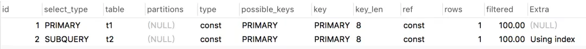

我们看到执行结果中两条数据的id不同，第一条数据是1，第二条数据是2。

这种情况表的执行顺序是怎么样的呢？

答案：序号大的先执行，这里会从下到上执行，先执行表t2，再执行表t1。

**3. id相同和不同都有**

执行sql如下：

```sql
explain
select t1.* from test1 t1
inner join (select max(id) mid from test1 group by id) t2
on t1.id=t2.mid
```

结果：

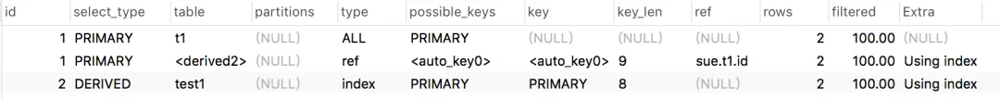

我们看到执行结果中三条数据，前面两条数据的的id相同，第三条数据的id跟前面的不同。

这种情况表的执行顺序又是怎么样的呢？

答案：先执行序号大的，先从下而上执行。遇到序号相同时，再从上而下执行。所以这个列子中表的顺序顺序是：test1、t1、

**也许你会在这里心生疑问：`<derived2>` 是什么鬼？**

它表示派生表，别急后面会讲的。

**还有一个问题：id列的值允许为空吗？**

答案在后面揭晓。

### 2. select_type列

该列表示select的类型。具体包含了如下11种类型：

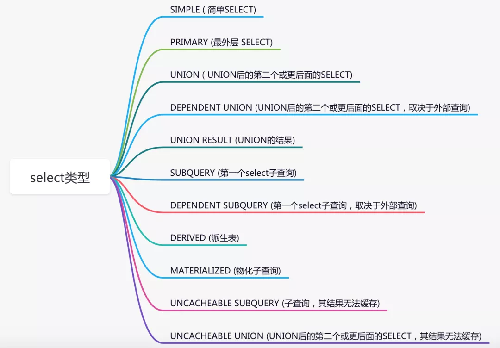

但是常用的其实就是下面几个：

|       类型       |                  含义                  |
| :--------------: | :------------------------------------: |
|   SIMPLE(简单)   |  简单SELECT查询，不包含子查询和UNION   |
| PRIMARY(主要的)  | 复杂查询中的最外层查询，表示主要的查询 |
| SUBQUERY(子查询) |    SELECT或WHERE列表中包含了子查询     |
|  DERIVED(衍生)   |     FROM列表中包含的子查询，即衍生     |
|      UNION       |         UNION关键字之后的查询          |
|   UNION RESULT   |        从UNION后的表获取结果集         |

下面看看这些SELECT类型具体是怎么出现的：


1. SIMPLE

   执行sql如下：

   ```sql
   explain select * from test1;
   ```

   结果：

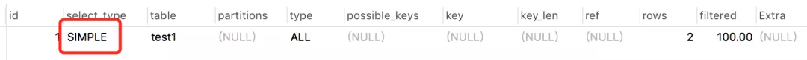

​		它只在简单SELECT查询中出现，不包含子查询和UNION，这种类型比较直观就不多说了。

2. PRIMARY 和 SUBQUERY

​		执行sql如下：

```sql
explain select * from test1 t1 where t1.id = (select id from  test1 t2 where  t2.id=2);
```

​		结果：

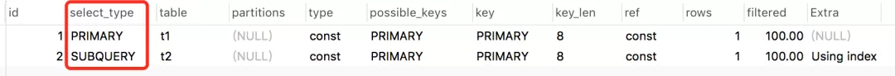

​		我们看到这条嵌套查询的sql中，最外层的t1表是PRIMARY类型，而最里面的子查询t2表是SUBQUERY类型。

3. DERIVED

​		执行sql如下：

```sql
explain
select t1.* from test1 t1
inner join (select max(id) mid from test1 group by id) t2
on t1.id=t2.mid
```

​		结果：

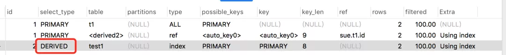

​		最后一条记录就是衍生表，它一般是FROM列表中包含的子查询，这里是sql中的分组子查询。

4. UNION 和 UNION RESULT

​		执行sql如下：

```sql
explain
select * from test1
union
select* from test2
```

​		结果：

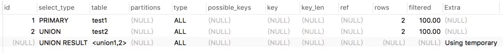

​		test2表是UNION关键字之后的查询，所以被标记为UNION，test1是最主要的表，被标记为PRIMARY。而<union1,2>表示id=1和id=2的表union，其结果被标记为UNION RESULT。

​		UNION 和 UNION RESULT一般会成对出现。


此外，回答上面的问题：**id列的值允许为空吗？**

如果仔细看上面那张图，会发现id列是可以允许为空的，并且是在SELECT类型为： UNION RESULT的时候。

### 2. table列

该列的值表示输出行所引用的表的名称，比如前面的：test1、test2等。

但也可以是以下值之一：

- `<unionM,N>`：具有和id值的行的M并集N。
- `<derivedN>`：用于与该行的派生表结果id的值N。派生表可能来自（例如）FROM子句中的子查询 。
- `<subqueryN>`：子查询的结果，其id值为N

### 3. partitions列

该列的值表示查询将从中匹配记录的分区

### 4. type列

该列的值表示连接类型，是查看索引执行情况的一个重要指标。包含如下类型：


执行结果从最好到最坏的的顺序是从上到下。

我们需要重点掌握的是下面几种类型：

system > const > eq_ref > ref > range > index > ALL

在演示之前，先说明一下test2表中只有一条数据：

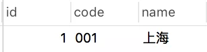

并且code字段上面建了一个普通索引：

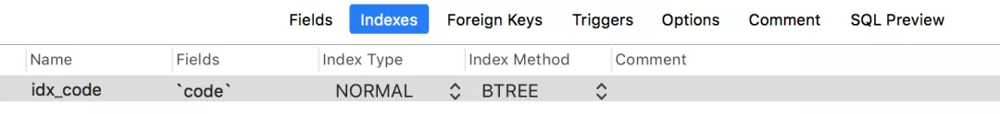

下面逐一看看常见的几个连接类型是怎么出现的：

1. system

   这种类型要求数据库表中只有一条数据，是const类型的一个特例，一般情况下是不会出现的。

2. const

   通过一次索引就能找到数据，一般用于主键或唯一索引作为条件的查询sql中，执行sql如下：

   ```sql
   explain select * from test2 where id=1;
   ```

   结果：

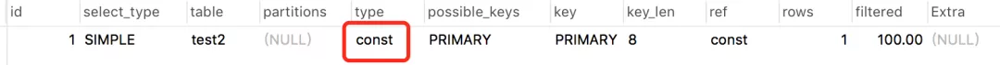

3. eq_ref

​		常用于主键或唯一索引扫描。执行sql如下：

```sql
explain select * from test2 t1 inner join test2 t2 on t1.id=t2.id;
```

​		结果：

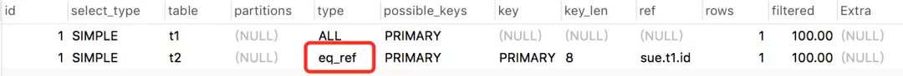

此时，有人可能感到不解，const和eq_ref都是对主键或唯一索引的扫描，有什么区别？

答：const只索引一次，而eq_ref主键和主键匹配，由于表中有多条数据，一般情况下要索引多次，才能全部匹配上。

4. ref

​		常用于非主键和唯一索引扫描。执行sql如下：

```sql
explain select * from test2 where code = '001';
```

​		结果：

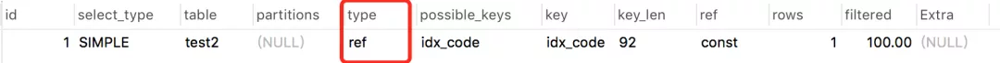

5. range

​		常用于范围查询，比如：between ... and 或 In 等操作，执行sql如下：

```sql
explain select * from test2 where id between 1 and 2;
```

​		结果：

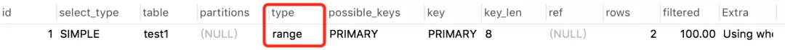

6. index

​		全索引扫描。执行sql如下：

```sql
explain select code from test2;
```

​	结果：

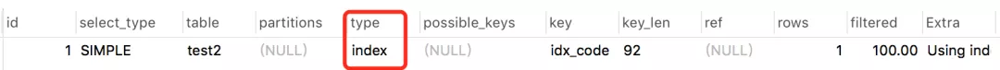

7. ALL

​		全表扫描。执行sql如下：

```sql
explain select * from test2;
```

​		结果：

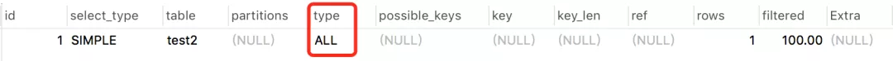

### 5. possible_keys列

该列表示可能的索引选择。

请注意，此列完全独立于表的顺序，这就意味着possible_keys在实践中，某些键可能无法与生成的表顺序一起使用。


如果此列是NULL，则没有相关的索引。在这种情况下，您可以通过检查该WHERE 子句以检查它是否引用了某些适合索引的列，从而提高查询性能。

### 6. key列

该列表示实际用到的索引。

可能会出现possible_keys列为NULL，但是key不为NULL的情况。

演示之前，先看看test1表结构：

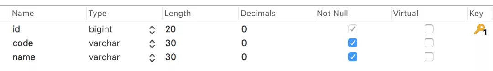

test1表中数据：

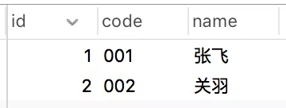

使用的索引：

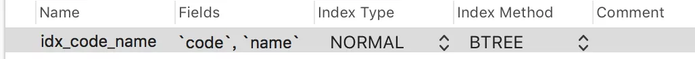

code和name字段使用了联合索引。

执行sql如下：

```sql
explain select code from test1;
```

结果：

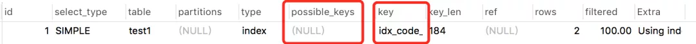

这条sql预计没有使用索引，但是实际上使用了全索引扫描方式的索引。

### 7. key_len列

该列表示使用索引的长度。上面的key列可以看出有没有使用索引，key_len列则可以更进一步看出索引使用是否充分。不出意外的话，它是最重要的列。


**有个关键的问题浮出水面：key_len是如何计算的？**

决定key_len值的三个因素：

 1.字符集

 2.长度

 3.是否为空 

常用的字符编码占用字节数量如下：

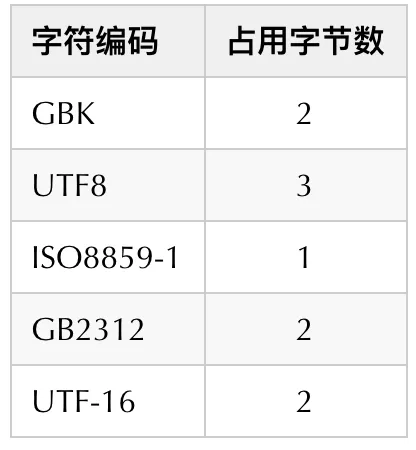

目前我的数据库字符编码格式用的：UTF8占3个字节。

mysql常用字段占用字节数：

|  字段类型  | 占用字节数 |
| :--------: | :--------: |
|  char(n)   |     n      |
| varchar(n) |   n + 2    |
|  tinyint   |     1      |
|  smallint  |     2      |
|    int     |     4      |
|   bigint   |     8      |
|    date    |     3      |
| timestamp  |     4      |
|  datetime  |     8      |

此外，如果字段类型允许为空则加1个字节。

上图中的 184是怎么算的？

184 = 30 * 3 + 2 + 30 * 3 + 2

> 184 = Length(30) * UTF8(3) + varchar(2) + Length(30) * UTF8(3) + varchar(2)

再把test1表的code字段类型改成char，并且改成允许为空：

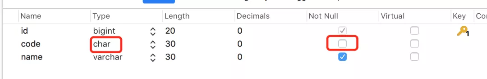

执行sql如下：

```sql
explain select code  from test1;
```

结果： 

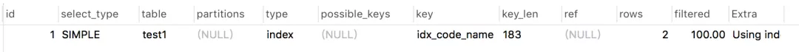

怎么算的？

183 = 30 * 3 + 1 + 30 * 3 + 2

**还有一个问题：为什么这列表示索引使用是否充分呢，还有使用不充分的情况？**

执行sql如下：

```
explain select code from test1 where code='001';
```

结果：

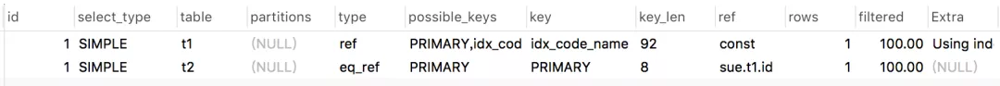

上图中使用了联合索引：idx_code_name，如果索引全匹配key_len应该是183，但实际上却是92，这就说明没有使用所有的索引，索引使用不充分。