# 聊聊数据页变成索引这件事

<!-- START doctoc generated TOC please keep comment here to allow auto update -->

<!-- DON'T EDIT THIS SECTION, INSTEAD RE-RUN doctoc TO UPDATE -->

- [一、数据页](#%E4%B8%80%E6%95%B0%E6%8D%AE%E9%A1%B5)
  - [1. 空闲空间](#1-%E7%A9%BA%E9%97%B2%E7%A9%BA%E9%97%B4)
  - [2. 双向链表](#2-%E5%8F%8C%E5%90%91%E9%93%BE%E8%A1%A8)
  - [数据页目录](#%E6%95%B0%E6%8D%AE%E9%A1%B5%E7%9B%AE%E5%BD%95)
- [二、索引](#%E4%BA%8C%E7%B4%A2%E5%BC%95)
  - [1. 页分裂](#1-%E9%A1%B5%E5%88%86%E8%A3%82)
  - [2. 主键目录](#2-%E4%B8%BB%E9%94%AE%E7%9B%AE%E5%BD%95)
  - [3. 索引页](#3-%E7%B4%A2%E5%BC%95%E9%A1%B5)

<!-- END doctoc generated TOC please keep comment here to allow auto update -->

## 一、数据页

我们都知道平时执行`crud`的时候，都会从磁盘上加载数据页到`Buffer Pool`的缓存页里去，更新缓存页后，由异步线程刷回磁盘的数据页。

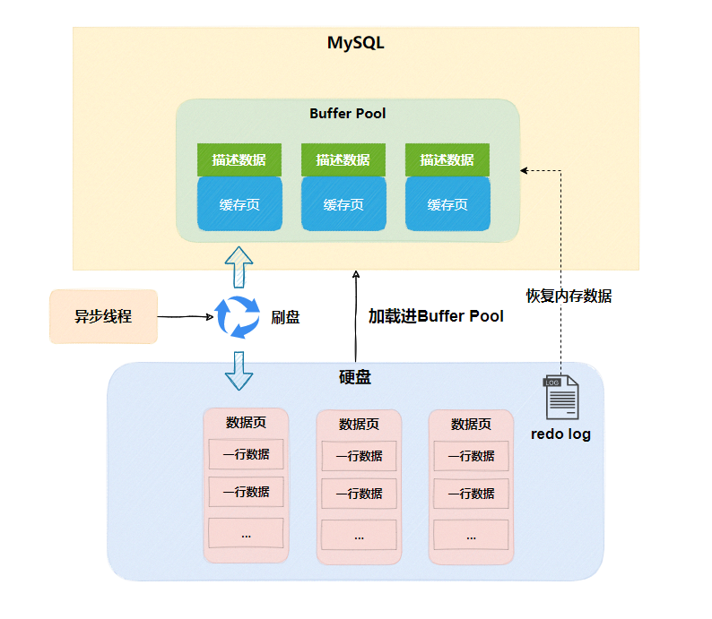

所以`MySQL`进行数据操作的最小单位是数据页，接下来就分析分析，数据页到底长什么样。

每个数据页默认`16kb`的大小，数据页由多个部分组成，如下图所示：

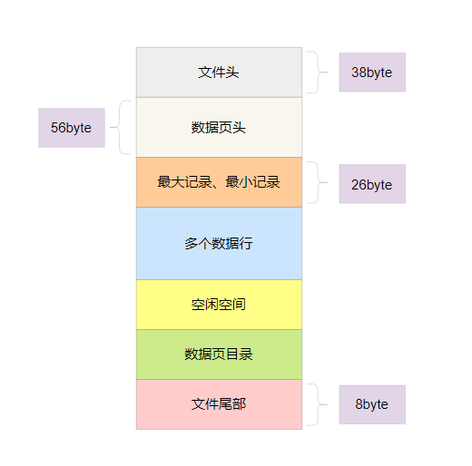

### 1. 空闲空间

其实数据页还未写入数据时，是没有数据行的，只有空闲空间，一旦写入，空闲空间会减少一些，直到空闲空间耗尽，具体过程如下图

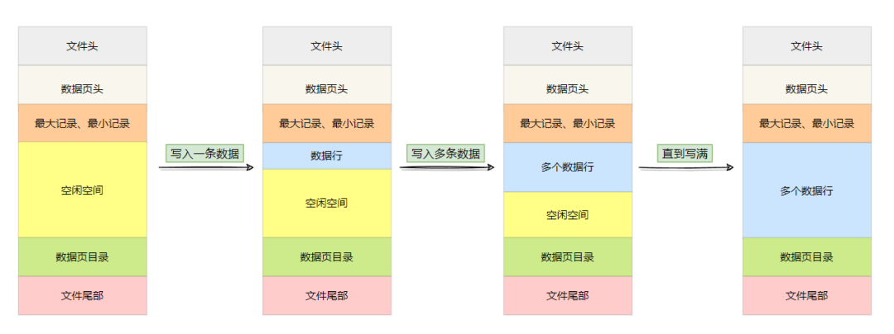

数据页满了，自然需要开辟新的数据页出来存储数据。

但是随着数据页多起来，它们怎么知道上一页与下一页在那呢？

### 2. 双向链表

其实在数据页**文件头**中存放了特别多的信息，如当前页号、页类型、所属表空间、上一页号、下一页号等等。

所以数据页是通过上下页号，组成双向链表，如下图所示

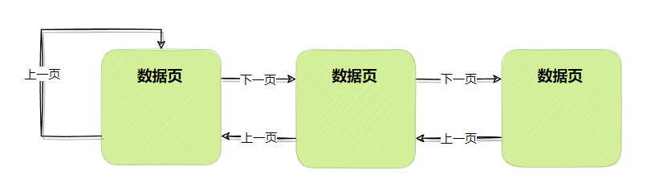

数据页内部会存储一行一行的数据，每一行数据都会按照主键大小进行排序存储，同时每一行数据都有指针指向下一行数据，组成单向链表。

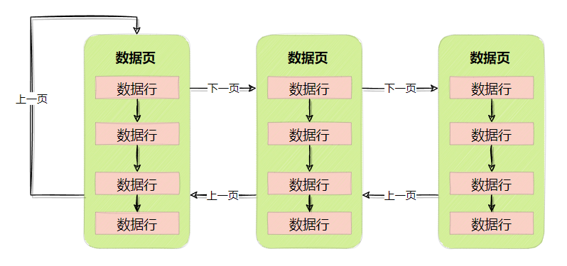

但是这个结构并不高效，假设根据主键`ID`查询数据，只能进入数据页，挨个挨个的对单向链表遍历查询。

所以要再加点料，把**二分查找**利用起来

### 数据页目录

这个料就是**数据页目录**部分，数据页目录存储的内容就是主键`ID`和行位置。

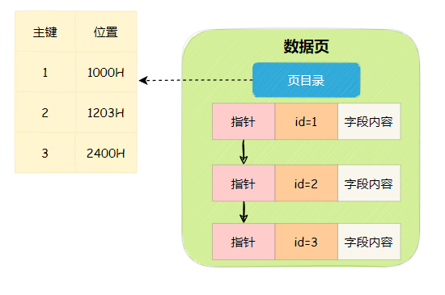

这样就可以通过**数据页目录**走二分查找，快速定位到数据页内的数据行。

如果只有一个数据页，倒没啥问题，哪有成千上万个数据页呢，还是得一个一个进数据页，搜索数据页目录。

有没有觉得，这似乎是在做**全表扫描**？

没错，在没有索引的情况下，数据库就是这样执行的

## 二、索引

如果没有索引，查询速度可以说是慢到惊人，一般是不能让查询走全表扫描的。

因此数据库中的查询，必须要运用索引来加速。

### 1. 页分裂

在说索引之前，先说个前置知识，索引的核心基础要求后一个数据页的主键值都大于前面一个数据页的主键值，如果你的主键是自增的，可以保证这一点。

但有时候主键并不是自增长的，可能会出现后一个数据页的主键值小于前一个数据页的主键值。

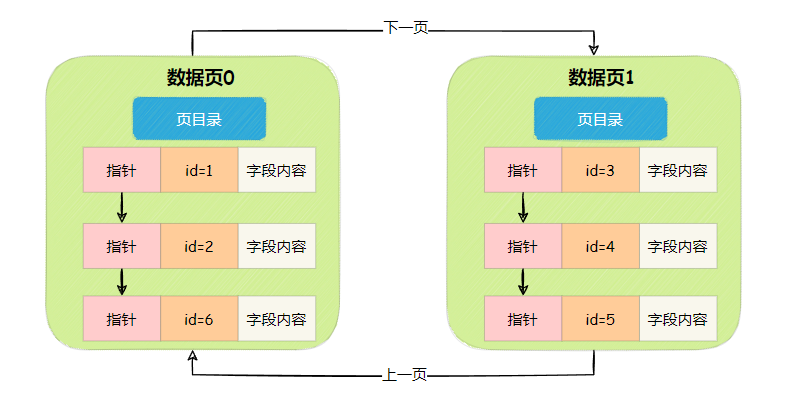

为了保证索引的核心基础，有个交换行数据的过程，这个过程叫页分裂。

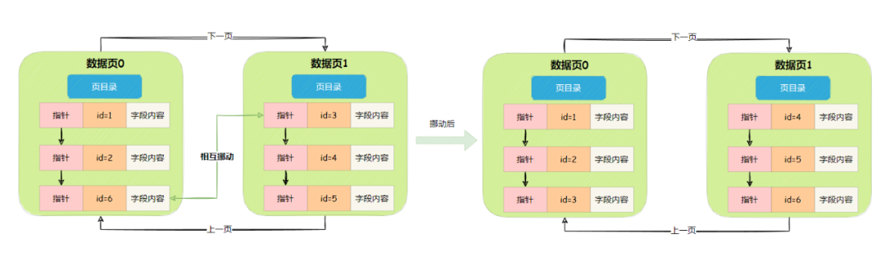

过程如下

- **数据页0的id=6行数据挪到数据页1**

- **数据页1的页目录更新**

- **数据页1的id=3行数据挪到数据页0**

- **数据页0的页目录更新**

### 2. 主键目录

好了，现在我们以主键为例，创建一个主键索引，这个主键索引就是**主键目录**，它会维护所有数据页的最小主键值与对应的页号。

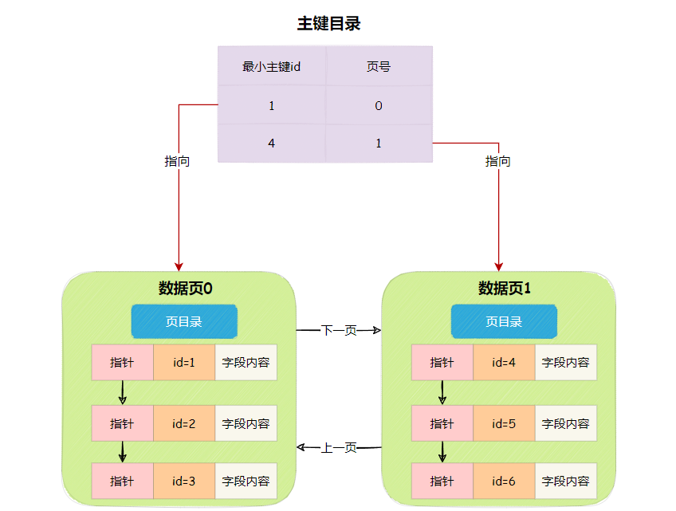

有了主键目录的加持，那找数据就非常快了，过程如下

- **二分查找主键目录，找到对应的数据页**

- **进入数据页，二分查找数据页目录，找到对应的行数据**

可是又来一个新问题，表里的数据可能有几百万，几千万，甚至几亿条数据，会有大量的数据页，意味着**主键目录**要存储大量的数据页号和最小主键值。

可能主键目录存储不下，就算能存储，海量的数据仅仅靠二分查找也很吃力。

所以`InnoDB`实际上是把主键目录数据存储在多个数据页中，我们把这个数据页称为**索引页**

### 3. 索引页

索引页，顾名思义，就是存储索引信息的数据页，在数据页的文件头部，有页类型来进行区分。

索引页会存储两类内容，一类是最小主键值与索引页号，另一类是最小主键值与数据页号。

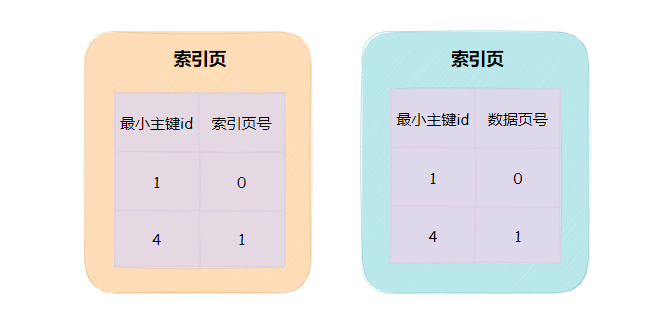

把大量的索引信息分散在多个索引页中，再将多个索引页组建成`B+`树结构，方便二分查找，结构如下图

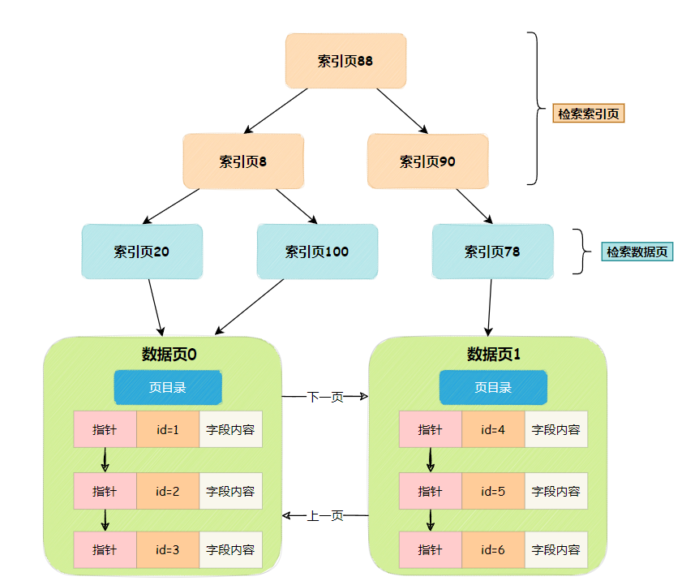

一直说`InnoDB`的索引是用`B+`树来组成的，其实就是这个意思，当然真实的`B+`树不长这样，这样画还是为了帮助大家理解。

现在整个搜索过程就十分简单了

- **根据主键id二分查找索引页**

- **找到对应索引页，再二分查找数据页**

- **进入数据页，二分查找数据页目录，找到对应的行数据**