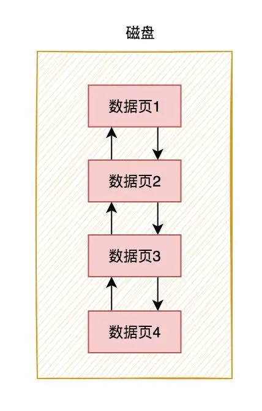
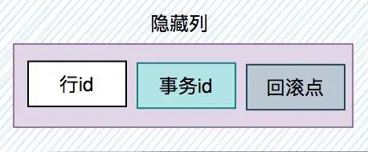
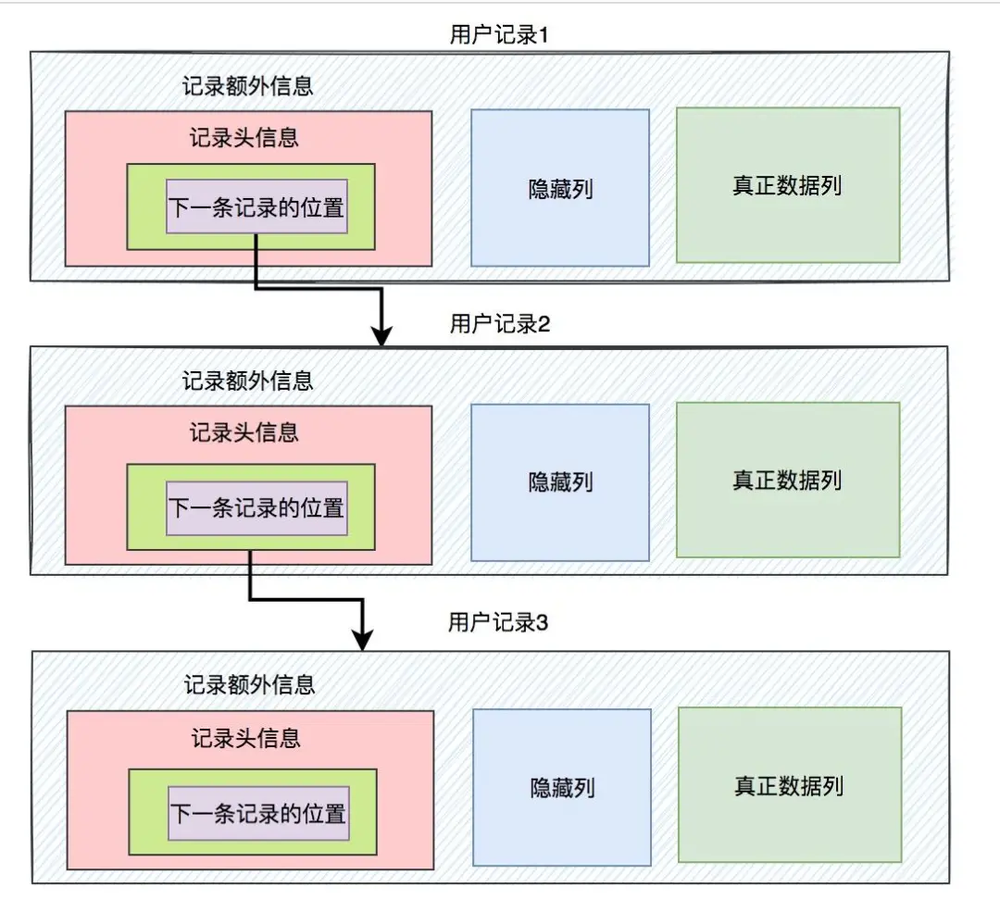
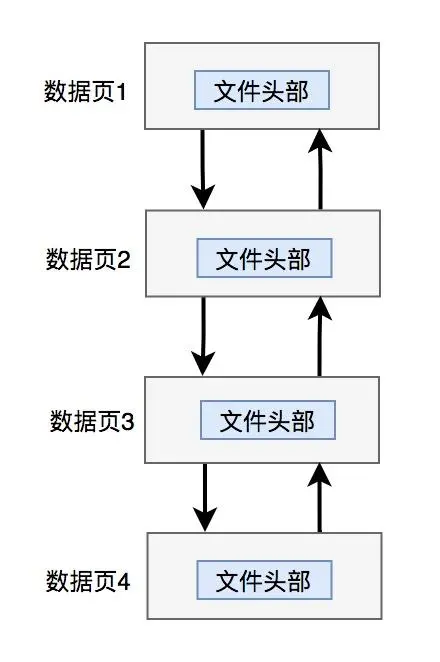
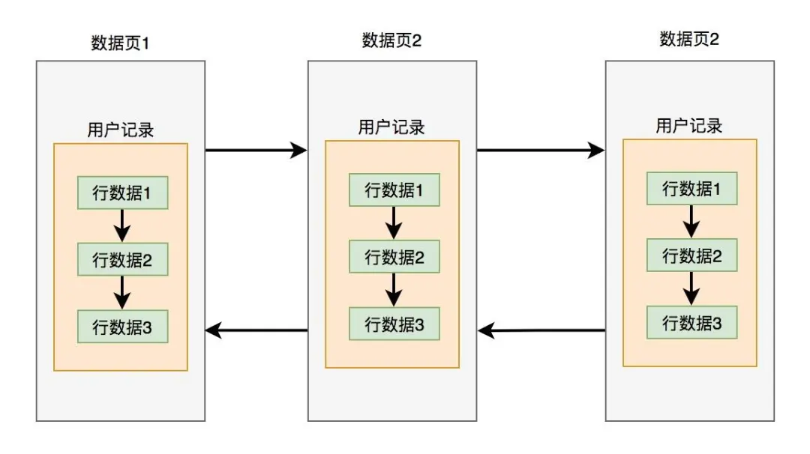

# innodb是如何存数据的

<!-- START doctoc generated TOC please keep comment here to allow auto update -->
<!-- DON'T EDIT THIS SECTION, INSTEAD RE-RUN doctoc TO UPDATE -->

- [零、开篇](#%E9%9B%B6%E5%BC%80%E7%AF%87)
- [一、磁盘or内存？](#%E4%B8%80%E7%A3%81%E7%9B%98or%E5%86%85%E5%AD%98)
    - [1. 磁盘](#1-%E7%A3%81%E7%9B%98)
    - [2. 内存](#2-%E5%86%85%E5%AD%98)
- [二、数据页](#%E4%BA%8C%E6%95%B0%E6%8D%AE%E9%A1%B5)
- [三、用户记录](#%E4%B8%89%E7%94%A8%E6%88%B7%E8%AE%B0%E5%BD%95)
    - [1. 额外信息](#1-%E9%A2%9D%E5%A4%96%E4%BF%A1%E6%81%AF)
    - [2. 隐藏列](#2-%E9%9A%90%E8%97%8F%E5%88%97)
    - [3. 真正数据列](#3-%E7%9C%9F%E6%AD%A3%E6%95%B0%E6%8D%AE%E5%88%97)
    - [4. 用户记录是如何相连的？](#4-%E7%94%A8%E6%88%B7%E8%AE%B0%E5%BD%95%E6%98%AF%E5%A6%82%E4%BD%95%E7%9B%B8%E8%BF%9E%E7%9A%84)
- [四、最大和最小记录](#%E5%9B%9B%E6%9C%80%E5%A4%A7%E5%92%8C%E6%9C%80%E5%B0%8F%E8%AE%B0%E5%BD%95)
- [五、页目录](#%E4%BA%94%E9%A1%B5%E7%9B%AE%E5%BD%95)
- [六、文件头部和尾部](#%E5%85%AD%E6%96%87%E4%BB%B6%E5%A4%B4%E9%83%A8%E5%92%8C%E5%B0%BE%E9%83%A8)
    - [1. 文件头部](#1-%E6%96%87%E4%BB%B6%E5%A4%B4%E9%83%A8)
    - [2. 文件尾部](#2-%E6%96%87%E4%BB%B6%E5%B0%BE%E9%83%A8)
- [七、页头部](#%E4%B8%83%E9%A1%B5%E5%A4%B4%E9%83%A8)
- [八、总结](#%E5%85%AB%E6%80%BB%E7%BB%93)

<!-- END doctoc generated TOC please keep comment here to allow auto update -->

[TOC]

## 零、开篇

如果你使用过mysql数据库，对它的存储引擎：`innodb`，一定不会感到陌生。

众所周知，在mysql5以前，默认的存储引擎是：myslam。但mysql5之后，默认的存储引擎已经变成了：innodb，它是我们建表的首选存储引擎。

那么，问题来了：

1. innodb底层是如何存储数据的？
2. 表中有哪些隐藏列？
3. 用户记录之间是如何关联起来的？

如果你想知道上面三个问题的答案，那么，请继续往下面看。

本文主要包含如下内容：

## 一、磁盘or内存？

### 1. 磁盘

数据对系统来说是非常重要的东西，比如：用户的身份证、手机号、银行号、会员过期时间、积分等等。一旦丢失，会对用户造成很大的影响。

那么问题来了，如何才能保证这些重要的数据不丢呢？

**答案：把数据存在磁盘上。**

当然有人会说，如果磁盘坏了怎么办？

那就需要备份，或者做主从了。。。

好了，打住，这不是今天的重点。

言归正传。

大家都知道，从磁盘上读写数据，至少需要两次IO请求才能完成。一次是读IO，另一次是写IO。

而IO请求是比较耗时的操作，如果频繁的进行IO请求势必会影响数据库的性能。

那么，如何才能解决数据库的性能问题呢？

### 2. 内存

把数据存在寄存器？

没错，操作系统从寄存器中读取数据是最快的，因为它离CPU最近。

但是寄存器有个非常致命的问题是：它只能存储非常少量的数据，设计它的目的主要是用来暂存指令和地址，并非存储大量用户数据的。

**这样看来，只能把数据存在内存中了。**

因为内存同样能满足我们，快速读取和写入数据的需求，而且性能是非常可观的，只是比较寄存器稍稍慢了一丢丢而已。

不过有个让人讨厌的地方是，内存相对于磁盘来说，是更加昂贵的资源。通常情况下，500G或者1T的磁盘，是很常见的。但你有听说过有500G的内存吗？别人会以为你疯了。内存大小讨论的数量级一般是16G或32G。

内存可以存储一些用户数据，但无法存储所有的用户数据，因为如果数据量太大了，它可能还是存不下。

此外，即使用户数据能刚好存在内存，以后万一有一天，数据库服务器或者部署节点挂了，或者重启了，数据不就丢了？

怎么做，才能不会因为异常情况，而丢数据。同时，又能保证数据的读写速度呢？

## 二、数据页

我们可以把一批数据放在一起。

写操作时，先将数据写到内存的某个批次中，然后再将该批次的数据一次性刷到磁盘上。如下图所示：

读操作时，从磁盘上一次读一批数据，然后加载到内存当中，以后就在内存中操作。如下图所示：

将内存中的数据刷到磁盘，或者将磁盘中的数据加载到内存，都是以批次为单位，这个批次就是我们常说的：`数据页`。

当然innodb中存在多种不同类型的页，数据页只是其中一种，我们在这里重点介绍一下数据页。

那么问题来了，什么是数据页？

数据页主要是用来存储表中记录的，它在磁盘中是用双向链表相连的，方便查找，能够非常快速得从一个数据页，定位到另一个数据页。

很多时候，由于我们表中的数据比较多，在磁盘中可能存放在多个数据页当中。

有一天，我们要根据某个条件查询数据时，需要从一个数据页找到另一个数据页，这时候的双向链表就派上大用场了。磁盘中各数据页的整体结构如下图所示：

通常情况下，单个数据页默认的大小是`16kb`。当然，我们也可以通过参数：`innodb_page_size`，来重新设置大小。不过，一般情况下，用它的默认值就够了。

好吧，数据页的整体结构已经搞明白了。

那么，单个数据页包含哪些内容呢？

从上图中可以看出，数据页主要包含如下几个部分：

- 文件头部
- 页头部
- 最大和最小记录
- 用户记录
- 空闲空间
- 页目录
- 文件尾部

## 三、用户记录

对于新申请的数据页，用户记录是空的。当插入数据时，innodb会将一部分`空闲空间`分配给用户记录。

用户记录是innodb的重中之重，我们平时保存到数据库中的数据，就存储在它里面。那么，它里面又包含哪些内容呢？你不好奇吗？

其实在innodb支持的数据行格式有四种：

1. compact行格式
2. redundant行格式
3. dynamic行格式
4. compressed行格式

我们以compact行格式为例：

一条用户记录主要包含三部分内容：

1. 记录额外信息，它包含了变长字段、null值列表和记录头信息。
2. 隐藏列，它包含了行id、事务id和回滚点。
3. 真正的数据列，包含真正的用户数据，可以有很多列。

下面让我们一起了解一下这些内容。

### 1. 额外信息

额外信息并非真正的用户数据，它是为了辅助存数据用的。

**变长字段列表**

有些数据如果直接存会有问题，比如：如果某个字段是varchar或text类型，它的长度不固定，可以根据存入数据的长度不同，而随之变化。

如果不在一个地方记录数据真正的长度，innodb很可能不知道要分配多少空间。假如都按某个固定长度分配空间，但实际数据又没占多少空间，岂不是会浪费？

所以，需要在变长字段中记录某个变长字段占用的字节数，方便按需分配空间。

**null值列表**

数据库中有些字段的值允许为null，如果把每个字段的null值，都保存到用户记录中，显然有些浪费存储空间。

有没有办法只简单的标记一下，不存储实际的null值呢？

答案：将为null的字段保存到null值列表。

在列表中用二进制的值1，表示该字段允许为null，用0表示不允许为null。它只占用了1位，就能表示某个字符是否为null，确实可以节省很多存储空间。

**记录头信息**

记录头信息用于描述一些特殊的属性。

它主要包含：

- deleted_flag：即删除标记，用于标记该记录是否被删除了。
- min_rec_flag：即最小目录标记，它是非叶子节点中的最小目录标记。
- n_owned：即拥有的记录数，记录该组索引记录的条数。
- heap_no：即堆上的位置，它表示当前记录在堆上的位置。
- record_type：即记录类型，其中：0表示普通记录，1表示非叶子节点，2表示Infrimum记录， 3表示Supremum记录。
- next_record：即下一条记录的位置。

### 2. 隐藏列

数据库在保存一条用户记录时，会自动创建一些隐藏列。如下图所示：

目前innodb自动创建的隐藏列有三种：

- db_row_id，即行id，它是一条记录的唯一标识。
- db_trx_id，即事务id，它是事务的唯一标识。
- db_roll_ptr，即回滚点，它用于事务回滚。

如果表中有主键，则用主键做行id，无需额外创建。如果表中没有主键，假如有不为null的unique唯一键，则用它做为行id，同样无需额外创建。

如果表中既没有主键，又没有唯一键，则数据库会自动创建行id。

也就是说在innodb中，隐藏列中`事务id`和`回滚点`是一定会被创建的，但行id要根据实际情况决定。

### 3. 真正数据列

真正的数据列中存储了用户的真实数据，它可以包含很多列的数据。这个比较简单，没有什么好多说的。

### 4. 用户记录是如何相连的？

通过上面介绍的内容，大家对一条用户记录是如何存储的，应该有了一定的认识。

但问题来了，一条用户记录和另一条用户记录是如何相连的，innodb是怎么知道，某条记录的下一条记录是谁？

答案是：用前面提到过的， 记录额外信息 > >记录头信息 >>下一条记录的位置。

多条用户记录之间通过`下一条记录的位置`，组成了一个单向链表。这样就能从前往后，找到所有的记录了。

## 四、最大和最小记录

从上面可以得知，在一个数据页当中，如果存在多条用户记录，它们是通过`下一条记录的位置`相连的。

不过有个问题：如果才能快速找到最大的记录和最小的记录呢？

这就需要在保存用户记录的同时，也保存最大和最小记录了。

最大记录保存到Supremum记录中。

最小记录保存在Infimum记录中。

在保存用户记录时，数据库会自动创建两条额外的记录：Supremum 和 Infimum。它们之间的关系，如下图所示：

从图中可以看出用户数据是从最小记录开始，通过下一条记录的位置，从小到大，一步步查找，最后找到最大记录为止。

## 五、页目录

从上面可以看出，如果我们要查询某条记录的话，数据库会从最小记录开始，一条条查找所有记录。如果中途找到了，则直接返回该记录。如果一直找到最大记录，还没有找到想要的记录，则返回空。

咋一看，没有问题。

但如果仔细想想。

效率会不会有点低？

这不是要对整页用户数据进行扫描吗？

有没有更高效的方法？

这就需要使用`页目录`了。

说白了，就是把一页用户记录分为若干组，每一组的最大记录都保存到一个地方，这个地方就是`页目录`。每一组的最大记录叫做`槽`。

由此可见，页目录是有多个槽组成的。所下图所示：

假设一页的数据分为4组，这样在页目录中，就对应了4个槽，每个槽中都保存了该组数据的最大值。

这样就能通过二分查找，比较槽中的记录跟需要找到的记录的大小。如果用户需要查找的记录，小于当前槽中的记录，则向上查找上一个槽。如果用户需要查找的记录，大于当前槽中的记录，则向下查找下一个槽。

如此一来，就能通过二分查找，快速的定位需要查找的记录了。

so easy

## 六、文件头部和尾部

### 1. 文件头部

通过前面介绍的行记录中`下一条记录的位置`和`页目录`，innodb能非常快速的定位某一条记录。但有个前提条件，就是用户记录必须在同一个数据页当中。

如果用户记录非常多，在第一个数据页找不到我们想要的数据，需要到另外一页找该怎么办呢？

这时就需要使用`文件头部`了。

它里面包含了多个信息，但我只列出了其中4个最关键的信息：

1. 页号
2. 上一页页号
3. 下一页页号
4. 页类型

顾名思义，innodb是通过页号、上一页页号和下一页页号来串联不同数据页的。如下图所示：

不同的数据页之间，通过上一页页号和下一页页号构成了双向链表。这样就能从前向后，一页页查找所有的数据了。

此外，页类型也是一个非常重要的字段，它包含了多种类型，其中比较出名的有：数据页、索引页（目录项页）、溢出页、undo日志页等。

### 2. 文件尾部

我之前提过，数据库的数据是以数据页为单位，加载到内存中，如果数据有更新的话，需要刷新到磁盘上。

但如果某一天比较倒霉，程序在刷新到磁盘的过程中，出现了异常，比如：进程被kill掉了，或者服务器被重启了。

这时候数据可能只刷新了一部分，如何判断上次刷盘的数据是完整的呢？

这就需要用到`文件尾部`。

它里面记录了页面的`校验和`。

在数据刷新到磁盘之前，会先计算一个页面的校验和。后面如果数据有更新的话，会计算一个新值。文件头部中也会记录这个校验和，由于文件头部在前面，会先被刷新到磁盘上。

接下来，刷新用户记录到磁盘的时候，假设刷新了一部分，恰好程序出现异常了。这时，文件尾部的校验和，还是一个旧值。数据库会去校验，文件尾部的校验和，不等于文件头部的新值，说明该数据页的数据是不完整的。

## 七、页头部

通过上面介绍的内容，数据页之间能够轻松访问了，但剩下还有个比较重要的问题，就是记录的状态信息。

比如一页数据到底保存了多条记录，或者页目录到底使用了多个槽等。这些信息是实时统计，还是事先统计好了，保存到某个地方？

为了性能考虑，上面的这些统计数据，当然是先统计好，保存到一个地方。后面需要用到该数据时，再读取出来会更好。这个保存统计数据的地方，就是`页头部`。

当然页头部不仅仅只保存：槽的数量、记录条数等信息。

它还记录了：

- 已删除记录所占的字节数
- 最后插入记录的位置
- 最大事务id
- 索引id
- 索引层级

## 八、总结

多个数据页之间通过`页号`构成了双向链表。而每一个数据页的行数据之间，又通过`下一条记录的位置`构成了单项链表。整体架构图如下：

好了，本文内容先到这里。如果小伙伴们有任何疑问的话，欢迎找我私聊。
