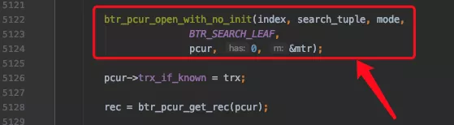
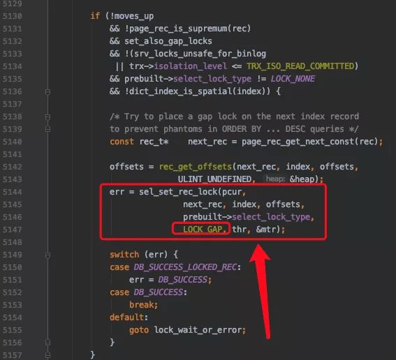

# Innodb到底是怎么加锁的

## 零、开篇

不知道从什么时候开始，下边这个**错误的**观点开始被广泛的流传：

> 在使用加锁读的方式读取使用InnoDB存储引擎的表时，当在执行查询时没有使用到索引时，行锁会被转换为表锁。

这里强调一点，对于任何`INSERT`、`DELETE`、`UPDATE`、`SELECT ... LOCK IN SHARE MODE`、`SELECT ... FOR UPDATE`语句来说，InnoDB存储引擎都不会加表级别的S锁或者X锁（我们这里不讨论表级意向锁的添加），只会加行级锁。所以即使对于全表扫描的加锁读语句来说，也只会对表中的记录进行加锁，而不是直接加一个表锁。

另外，很多小伙伴都会问：“这个语句加什么锁”，其实这是一个伪命题，因为一个语句需要加什么锁受到很多方面的影响，如果有人问你某某语句会加什么锁，那你可以直接回怼：**真不专业**！

我们稍后给大家详细分析一下影响加锁的因素都有哪些，以及从源码的角度看一下InnoDB到底是如何加锁的，希望小伙伴看完后会惊呼：**真tm的简单！**

不过在进行讨论前我们需要申明一下，我们讨论的只是InnoDB加的事务锁，即为了避免`脏写`、`脏读`、`不可重复读`、`幻读`这些现象带来的一致性问题而加的锁，并不是为了在多线程访问共享内存区域时而加的锁（比方说两个不同事务所在的线程想读写同一个页面时，需要进行加锁保护），也不包括server层添加的MDL锁。

本文所参考的源码版本为`5.7.22`。

## 一、事务锁到底是什么

`锁`是一个内存结构，InnoDB中用`lock_t`这个结构来定义：


不论是行锁，还是表锁都用这个结构来表示。给大家上个图：


其中的type_mode是用于区分这个锁结构到底是行锁还是表锁，如果是表锁的话是意向锁、直接对表加锁、还是AUTO-INC锁，如果是行锁的话，具体是正经记录锁、gap锁还是next-key锁。

> 小贴士：  
> 
> 在InnoDB的实现中，InnoDB的行锁是与记录一一对应的。即使是对于gap锁来说，在实现上也是为某条记录生成一个锁结构，然后该锁结构的类型是gap锁而已，并不是专门为某个区间生成一个锁结构。该gap锁的功能就是每当有别的事务插入记录时，会检查一下待插入记录的下一条记录上是否已经有一个gap锁的锁结构，如果有的话就进入阻塞状态。

我们平时所说的**加锁**就是在内存中生成这样的一个锁结构（除了生成锁结构，还有一种称作`隐式锁`的加锁方式，不用生成锁结构）。当然，如果为1条记录加锁就要生成一个锁结构，那岂不是太浪费了！设计InnoDB的大叔提出了一种优化方案，即同一个事务，在同一个页面上加的相同类型的锁都放在同一个锁结构里。

各种类型的锁是如果通过type_mode区分、各种锁都有什么作用，以及如何减少生成锁结构的细节我们这里就不展开了，那又要花费超长的篇。我们下边来看具体的加锁细节。

## 二、准备工作

为了故事的顺利发展，我们先创建一个表`hero`：

```sql
CREATE TABLE hero (
    number INT,
    name VARCHAR(100),
    country varchar(100),
    PRIMARY KEY (number),
    KEY idx_name (name)
) Engine=InnoDB CHARSET=utf8;
```

然后向这个表里插入几条记录：

```sql
INSERT INTINSERT INTO hero VALUES
    (1, 'l刘备', '蜀'),
    (3, 'z诸葛亮', '蜀'),
    (8, 'c曹操', '魏'),
    (15, 'x荀彧', '魏'),
    (20, 's孙权', '吴');
```

然后现在`hero`表就有了两个索引（一个二级索引，一个聚簇索引），示意图如下：


## 三、加锁受哪些因素影响

一条语句加什么锁受多种因素影响，如果你不能确认下边这些因素的时候，最好不要抢先发言说"XXX语句对XXX记录加了什么锁"：

- 事务的隔离级别

- 语句执行时使用的索引类型（比如聚簇索引、唯一二级索引、普通二级索引）

- 是否是精确匹配

- 是否是唯一性搜索

- 具体执行的语句类型（SELECT、INSERT、DELETE、UPDATE）

- 是否开启innodb_locks_unsafe_for_binlog系统变量

- 记录是否被标记删除

这里边有几个概念大家可能不是很清楚，我们先解释一下。

### 1. 扫描区间

比方说下边这个查询：

```sql
SELECT * FROM hero WHERE name <=  'l刘备' AND country = '魏';
```

MySQL可以使用下边两种方式来执行上述查询：

- 使用二级索引idx_name执行上述查询，那么就需要扫描name值在`(-∞, 'l刘备']`这个区间中的所有二级索引记录，针对获取到的每一条二级索引记录，都需要执行回表操作来获取相应的聚簇索引记录。

- 直接扫描所有的聚簇索引记录，即进行全表扫描。此时相当于扫描number值在`(-∞, +∞)`这个区间中的所有聚簇索引记录。

优化器会计算上述二种方式哪个成本更低，选用成本更低的那种来执行查询。

当优化器使用二级索引执行查询时，我们把`(-∞, 'l刘备']`称作`扫描区间`，意味着需要扫描name列值在这个区间中的所有二级索引记录，我们也可以把形成这个扫描区间的条件`name <= 'l刘备'`称作是形成这个扫描区间的`边界条件`；当优化器使用全表扫描执行查询时，我们把`(-∞, +∞)`称作`扫描区间`，意味着需要扫描number值在这个区间中的所有聚簇索引记录。

在执行一个查询的过程中，可能会用到多个扫描区间，如下所示：

```sql
SELECT * FROM hero WHERE name < 'l刘备' OR name > 'x荀彧';
```

如果优化器采用二级索引idx_name执行上述查询时，那么对应的扫描区间就是`(-∞, l刘备)`以及`('x荀彧', +∞)`，即需要扫描name值在上述两个扫描区间中的记录。

每当InnoDB需要扫描一个扫描区间中的记录时，都需要分两步：

1. 先通过索引对应的B+树，从根页面开始一路向下定位，直到定位到叶子节点中在扫描区间中的第一条记录。

2. 之后就可以不需要继续从根节点定位了，而是通过记录的`next_record`属性直接找到扫描区间的下一条记录即可（页面之间通过双向链表连接，找完一个页面中的记录后，可以顺着双向链表再去下一个页面中去找属于同一个扫描区间的记录）。

也就是说在扫描某个扫描区间的记录时，只有定位第1条记录的时候稍微麻烦点儿，其他记录只需要顺着链表（单个页面中的记录连成一个单向链表，不同的页面之间是双向链表）扫描即可。

### 2. 精确匹配

对于形成扫描区间的边界条件来说，如果是等值匹配的条件，我们就把对这个扫描区间的匹配模式称作`精确匹配`。比方说：

```sql
SELECT * FROM hero WHERE name = 'l刘备' AND country = '魏';
```

如果使用二级索引idx_name执行上述查询时，扫描区间就是`['l刘备', 'l刘备']`，形成这个扫描区间的边界条件就是`name = 'l刘备'`。我们就把在使用二级索引idx_name执行上述查询时的匹配模式称作`精确匹配`。

而对于下边这个查询来说

```sql
SELECT * FROM hero WHERE name <=  'l刘备' AND country = '魏';
```

显然就不是`精确匹配`了。

### 3. 唯一性搜索

如果在扫描某个扫描区间的记录前，就能事先确定该扫描区间最多只包含1条记录的话，那么就把这种情况称作唯一性搜索。我们看一下代码中判定扫描某个扫描区间的记录是否是唯一性搜索的代码是怎么写的：


其中：

1. 匹配模式是精确匹配

2. 使用的索引是聚簇索引或唯一二级索引

3. 如果索引中包含多个列，则每个列在生成扫描区间时都应该被用到

4. 如果使用的索引是唯一二级索引，那么在搜索时不能搜索某个索引列为NULL的记录（因为对于唯一二级索引来说，是可以存储多个值为NULL的记录的）。

上边几点都比较好理解，我们稍微解释一下第3点。比方说我们为某个表的a、b两列建立了一个唯一二级索引`uk_a_b(a, b)`，那么对于搜索条件`a=1`形成的扫描区间来说，不能保证该扫描区间最多只包含一条记录；对于搜索条件`a=1 AND b= 1`形成的扫描区间来说，才可以保证该扫描区间中仅包含1条记录（不包括记录的delete_flag=1的记录）。

## 四、row_search_mvcc

我们知道MySQL其实是分成server层和存储引擎层两部分，每当执行一个查询时，server层负责生成执行计划，即选取即将使用的索引以及对应的扫描区间。我们这里以InnoDB为例，针对每一个扫描区间，都会：

- server层向InnoDB要扫描区间的第1条记录

- InnoDB通过B+树定位到扫描区间的第1条记录（如果定位的是二级索引记录并有回表需求则回表获取完整的聚簇索引记录），然后返回给server层

- server层判断记录是否符合搜索条件，如果符合则发送给客户端，不符合则跳过。继续向InnoDB要下一条记录。

> 小贴士：  
> 
> 此处将记录发送给客户端其实是发送到本地的网络缓冲区，缓冲区大小由net_buffer_length控制，默认是16KB大小。等缓冲区满了才真正发送网络包到客户端。

- InnoDB根据记录的单向链表以及页面之间的双向链表找到下一条记录（如果定位的是二级索引记录并有回表需求则回表获取完整的聚簇索引记录），返回给server层。

- server层处理该记录，并向InnoDB要下一条记录

- ... 不停执行上述过程，直到InnoDB读到一条不符合边界条件的记录为止

可见一般情况下，server层和存储引擎层是以记录为单位进行通信的，而InnoDB读取一条记录最重要的函数就是`row_search_mvcc`：


可以看到这个函数长到吓人，有一千多行。

> 小贴士：  
> 
> 不知道你们公司有没有在一个函数中把业务逻辑写到一千多行的同事，如果有的话你想不想打他。

在`row_search_mvcc`里，对一条记录进行诸如多版本的可见性判断，要不要对记录进行加锁的判断，要是加锁的话加什么锁的选择，完成记录从InnoDB的存储格式到server层存储格式的转换等等等等十分繁杂的工作。

其实对于UPDATE、DELETE语句来说，执行它们前都需要先在B+树中定位到相应的记录，所以它们也会调用`row_search_mvcc`。

InnoDB对记录的加锁操作主要是在`row_search_mvcc`中的，像`SELECT ... LOCK IN SHARE MODE`、`SELECT ... FOR UPDATE`、`UPDATE`、`DELETE`这样的语句都会调用`row_search_mvcc`完成加锁操作。`SELECT ... LOCK IN SHARE MODE`会为记录添加S型锁，`SELECT ... FOR UPDATE`、`UPDATE`、`DELETE`会为记录添加X型锁。

InnoDB每当读取一条记录时，都会调用一次`row_search_mvcc`，在做了足够长的铺垫之后，我们终于可以看一下在`row_search_mvcc`函数中是怎么对某条记录进行加锁的。

## 五、语句到底是怎么加锁的

首先看一个十分重要的变量：


`set_also_gap_locks`表示是否要给记录添加gap锁（next-key锁可以看成是正经记录锁和gap锁的组合），它的默认值是`TRUE`，表示默认会给记录添加gap锁。

`set_also_gap_locks`可能会在下边这个地方发生变化：


即如果当前执行的是SELECT ... LOCK IN SHARE MODE或者SELECT ... FOR UPDATE这样的加锁读语句（非DELETE或UPDATE语句），并且隔离级别不大于READ COMMITTED 时，将`set_also_gap_locks`设置为FALSE。

其中`prebuilt->select_lock_type`表示加锁的类型，`LOCK_NONE`表示不加锁，`LOCK_S`表示加S锁（比方说执行SELECT ... LOCK IN SHARE MODE时），`LOCK_X`表示加X锁（比方说执行SELECT ... FOR UPDATE、DELETE、UPDATE时）。

### 0. 对普通的SELECT的处理和意向锁的添加

再往后看：


其中：

- 标号1的箭头是对普通的SELECT的处理，在查询开启前需要生成ReadView。

> 小贴士：  
> 
> 具体的讲就是对于Repeatable Read隔离级别来说，只在首次执行SELECT语句时生成Readview，之后的SELECT语句都复用这个ReadView；对于Read Committed隔离级别来说，每次执行SELECT语句时都会生成一个ReadView。这一点并不是在上边截图中的代码里实现的。

- 标号2的箭头是对加锁读的语句的处理，在首次读取记录（prebuilt->sql_stat_start表示是否是首次读取）前，需要添加表级别的意向锁（IS或IX锁）。

下边是真正处理记录并给记录加锁的流程，我们给这些流程编个号。

### 1. 定位扫描区间的第一条记录

下边开始通过B+树定位某个扫描区间中的第一条记录了（对于一个扫描区间来说，只执行一次下述函数，因为只要定位到扫描区间的第一条记录之后，就可以沿着记录所在的单向链表进行查询了）：



其中`btr_pcur_open_with_no_init`是用于定位扫描区间中的第一条记录的函数。

### 2. 对于ORDER BY ... DESC条件形成的扫描区间的第一条记录的处理

在B+树的每层节点中，记录是按照键值从小到大的方式进行排序的。对于某个扫描区间来说，InnoDB通常是定位到扫描区间中最左边的那条记录，也就是键值最小的那条记录，然后沿着从左往右的方式向后扫描。

但是对于下边这个查询来说：

```sql
SELECT * FROM hero WHERE name < 's孙权' AND country = '魏' ORDER BY name DESC FOR UPDATE ;
```

如果优化器决定使用二级索引idx_name执行上述查询的话，那么对应的扫描区间就是`(-∞, 's孙权')`。由于上述查询要求记录是按照从大到小的顺序返回给用户，所以InnoDB定位到扫描区间中的第一条记录应该是该扫描区间中最右边的那条记录，也就是键值最大的那条记录（在执行`btr_pcur_open_with_no_init`时就定位到最右边的那条记录），我们看一下idx_name二级索引示意图：


很显然，name值为`'l刘备'`的二级索引记录是扫描区间`(-∞, 's孙权')`中最右边的记录。

对于从右向左扫描`扫描区间`中记录的情况，针对从扫描区间中定位到的最右边的那条记录，需要做如下处理：



其中`sel_set_rec_lock`就是对一条记录进行加锁的函数。

可以看到，对于加锁读来说，在隔离级别不小于`REPEATABLE READ`并且也没有开启`innodb_locks_unsafe_for_binlog`系统变量的情况下，会对扫描区间中最右边的那条记录的下一条记录加一个类型为`LOCK_GAP`的锁，这个类型为`LOCK_GAP`的锁其实就是`gap锁`。

在本例中，假设事务的隔离级别是REPATABLE　READ。扫描区间`(-∞, 's孙权')`中最右边的那条记录就是name值为`'l刘备'`的二级索引记录，接下来就应该为该记录的下一条记录，也就是name值为`'s孙权'`的二级索引记录加一个`gap`锁。

> 小贴士：  
> 
> 大家可以读一下上述代码的注释，其实这样加锁主要是为了阻止幻读。另外，这一步骤的加锁仅仅针对从右向左的扫描区间中的最右边的那条记录，之后扫描该扫描区间中的其他记录时就不做这一步的操作了。