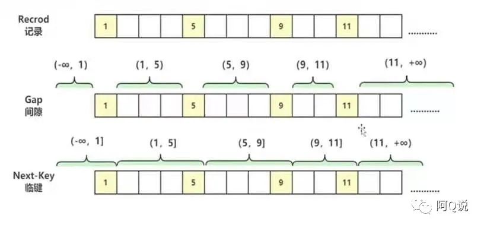
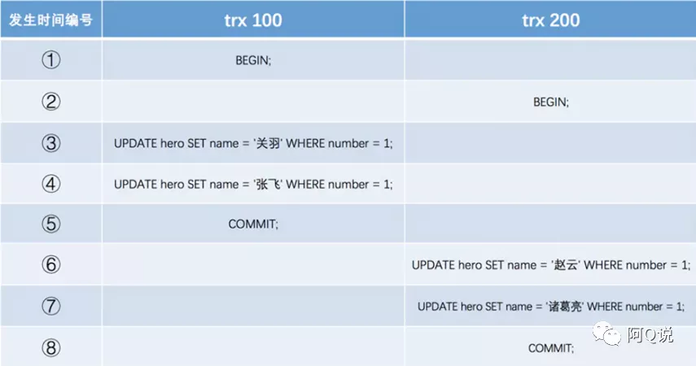
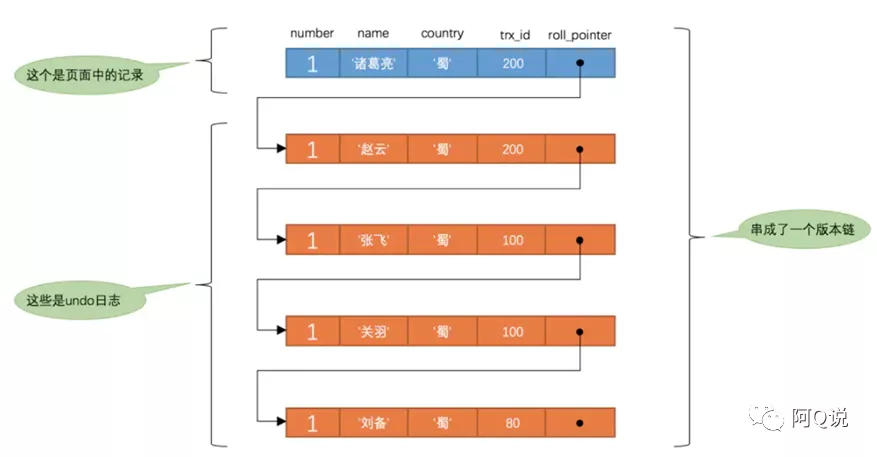
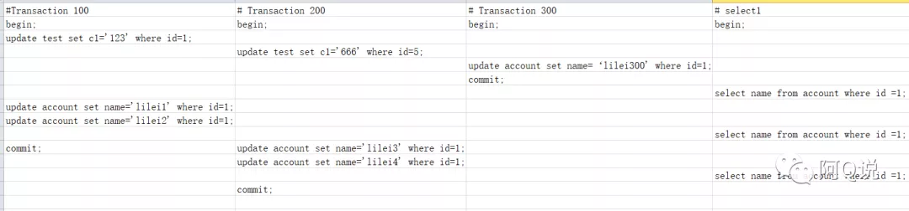
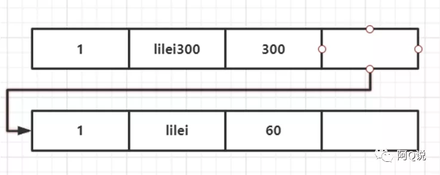
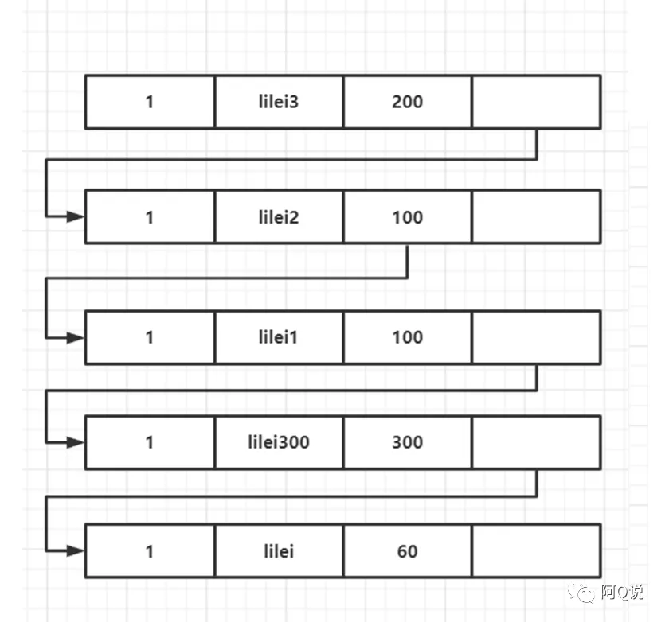
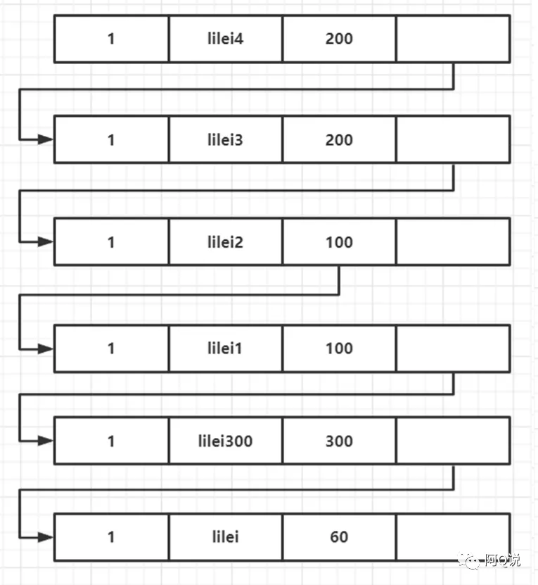
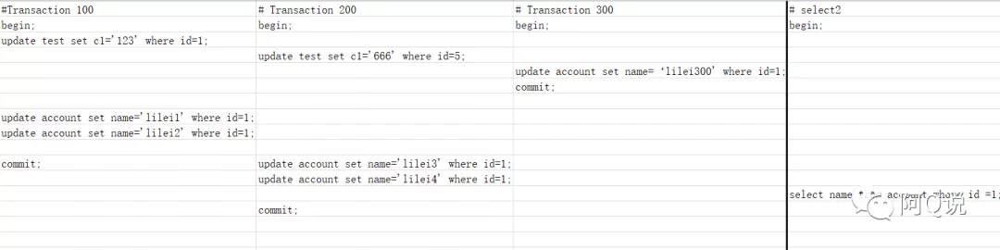

# InnoDB解决幻读的方案--LBCC&MVCC

[TOC]

## 一、事务

### 1. 概念

一个事情由n个单元组成，这n个单元在执行过程中，要么同时成功，要么同时失败，这就把n个单元放在了一个事务之中。举个简单的例子：在不考虑试题正确与否的前提下，一张试卷由多个题目构成，当你答完题交给老师的时候是将一整张试卷交给老师，而不是将每道题单独交给老师，在这里试卷就可以理解成一个事务。

### 2. 事务的特性：ACID

A：原子性（`Atomicity`），原子性是指事务是一个不可分割的工作单位，事务中的操作，要么都发生，要么都不发生。

**例**：假设你在购物车里添加了两件衣服：上衣和裤子，当你把两件衣服作为一个订单提交支付的时候，要么两件衣服一起支付成功，要么都失败，不可能存在上衣付完钱了，裤子还没付完的情况，反之亦然。

C：一致性（`Consistency`），在一个事务中，事务前后数据的完整性必须保持一致。

**例**：假设用户A和用户B两者的钱加起来一共是200，那么不管A和B之间如何转账，转几次账，事务结束后两个用户的钱相加起来应该还得是200，这就是事务的一致性。

I：隔离性（`Isolation`），存在于多个事务中，事务的隔离性是指多个用户并发访问数据库时，一个用户的事务不能被其它用户的事务所干扰，多个并发事务之间数据要相互隔离。

**例**：对于任意两个并发的事务T1和T2，在事务T1看来，T2要么在T1开始之前就已经结束，要么在T1结束之后才开始，这样每个事务都感觉不到有其他事务在并发地执行。

D：持久性（`Durability`），持久性是指一个事务一旦被提交，它对数据库中数据的改变就是永久性的，接下来即使数据库发生故障也不应该对其有任何影响。

**例**：我们在操作数据库时，事务提交或者回滚都会直接改变数据库中的值。

### 3. 事务的操作

在使用事务之前，首先我们要开启事务，我们可以通过`start`或者`begin`命令开启事务；如果我们想提交事务可以手动执行`commit`命令，如果我们想回滚事务，可以执行`rollback`命令。

注：在`MySQL`中事务的提交是默认开启的，可以执行`show variables like 'autocommit'`命令查看，如果是`ON`则证明自动提交已经开启，如果为`OFF`则需要手动提交。

### 4. 隔离性引发的并发问题

1. 脏读：B事务读取到了A事务尚未提交的数据；

2. 不可重复读：B事务读到了A事务已经提交的数据，即B事务在A事务提交之前和提交之后读取到的数据`内容`不一致（AB事务操作的是同一条数据）；

3. 幻读/虚读：B事务读到了A事务已经提交的数据，即A事务执行插入操作，B事务在A事务前后读到的数据`数量`不一致。

### 5. 事务的隔离级别

为了解决以上隔离性引发的并发问题，数据库提供了事物的隔离机制。

- read uncommitted（读未提交）：一个事务还没提交时，它做的变更就能被别的事务看到，读取尚未提交的数据，哪个问题都不能解决；
- read committed（读已提交）：一个事务提交之后，它做的变更才会被其他事务看到，读取已经提交的数据，可以解决脏读 ---- `oracle`默认的；
- repeatable read（可重复读）：一个事务执行过程中看到的数据，总是跟这个事务在启动时看到的数据是一致的，可以解决脏读和不可重复读 ---`mysql`默认的；
- serializable（串行化）：顾名思义是对于同一行记录，“写”会加“写锁”，“读”会加“读锁”。当出现读写锁冲突的时候，后访问的事务必须等前一个事务执行完成，才能继续执行。可以解决脏读、不可重复读和虚读---相当于锁表。

虽然`serializable`级别可以解决所有的数据库并发问题，但是它会在读取的每一行数据上都加锁，这就可能导致大量的超时和锁竞争问题，从而导致效率下降。所以我们在实际应用中也很少使用`serializable`，只有在非常需要确保数据的一致性而且可以接受没有并发的情况下，才考虑采用该级别。

## 二、LBCC&MVCC

`InnoDB`默认的事务隔离级别是`repeatable read`（后文中用简称RR），它为了解决该隔离级别下的幻读的并发问题，提出了`LBCC`和`MVCC`两种方案。其中`LBCC`解决的是当前读情况下的幻读，`MVCC`解决的是普通读（快照读）的幻读。至于什么是当前读，什么是快照读，将在下文中给出答案。

### 1. LBCC

`LBCC`是`Lock-Based Concurrent Control`的简称，意思是基于锁的并发控制。在`InnoDB`中按锁的模式来分的话可以分为共享锁（S）、排它锁（X）和意向锁，其中意向锁又分为意向共享锁（IS）和意向排它锁（IX）（此处先不做介绍，后期会专门出篇文章讲一下`InnoDB`和`Myisam`引擎的锁）；如果按照锁的算法来分的话又分为记录锁（`Record Locks`）、间隙锁（`Gap Locks`）和临键锁（`Next-key Locks`）。其中临键锁就可以用来解决RR下的幻读问题。那么什么是临键锁呢？继续往下看。



我们将数据库中存储的每一行数据称为记录。则上图中1、5、9、11分别代表id为当前数的记录。对于键值在条件范围内但不存在的记录，叫做间隙（GAP），则上图中的（-∞，1）、（1，5）...（11，+∞）为数据库中存在的间隙；而（-∞，1]、（1，5]...（11，+∞）我们称之为临键，即左开右闭的集合。

#### 1. 记录锁（Record Locks）

对表中的行记录加锁，叫做记录锁，简称行锁。可以使用`sql`语句`select ... for update`来开启锁，`select`语句必须为精准匹配（=），不能为范围匹配，且匹配列字段必须为唯一索引或者主键列。也可以通过对查询条件为主键索引或唯一索引的数据行进行`UPDATE`操作来添加记录锁。

> 记录锁存在于包括主键索引在内的唯一索引中，锁定单条索引记录。

#### 2. 间隙锁（GAP Locks）

对上面说到的间隙加锁即为间隙锁。间隙锁是对范围加锁，但不包括已存在的索引项。可以使用`sql`语句`select ... for update`来开启锁，`select`语句为范围查询，匹配列字段为索引项，且没有数据返回；或者`select`语句为等值查询，匹配字段为唯一索引，也没有数据返回。

间隙锁有一个比较致命的弱点，就是当锁定一个范围键值之后，即使某些不存在的键值也会被无辜的锁定，而造成在锁定的时候无法插入锁定键值范围内的任何数据。在某些场景下这可能会对性能造成很大的危害。以下是加锁之后，插入操作的例子：

```sql
select * from user where id > 15 for update;
//插入失败，因为id20大于15，不难理解
insert into user values(20,'20');
//插入失败，原因是间隙锁锁的是记录间隙，而不是sql，也就是说`select`语句的锁范围是（11，+∞），而13在这个区间中，所以也失败。
insert into user values(13,'13');
```

> `GAP Locks`只存在于RR隔离级别下，它锁住的是间隙内的数据。加完锁之后，间隙中无法插入其他记录，并且锁的是记录间隙，而非`sql`语句。间隙锁之间都不存在冲突关系。

**打开间隙锁设置：** 以通过命令`show variables like 'innodb_locks_unsafe_for_binlog';`来查看 `innodb_locks_unsafe_for_binlog` 是否禁用。`innodb_locks_unsafe_for_binlog`默认值为OFF，即启用间隙锁。因为此参数是只读模式，如果想要禁用间隙锁，需要修改 `my.cnf`（windows是`my.ini`） 重新启动才行。

```
#在 my.cnf 里面的[mysqld]添加
[mysqld]
innodb_locks_unsafe_for_binlog = 1
```

#### 3. 临键锁（Next-Key Locks）

当我们对上面的记录和间隙共同加锁时，添加的便是临键锁（左开右闭的集合加锁）。为了防止幻读，临键锁阻止特定条件的新记录的插入，因为插入时要获取 **插入意向锁**，与已持有的临键锁冲突。可以使用`sql`语句`select ... for update`来开启锁，`select`语句为范围查询，匹配列字段为索引项，且有数据返回；或者`select`语句为等值查询，匹配列字段为索引项，不管有没有数据返回。

> 插入意向锁并非意向锁，而是一种特殊的间隙锁。

#### 4. 当前读

当前读（`Locking Read`）也称锁定读，读取当前数据的最新版本，而且读取到这个数据之后会对这个数据加锁，防止别的事务更改，即通过`next-key`锁（行锁+gap锁）来解决当前读的问题。在进行写操作的时候就需要进行“当前读”，读取数据记录的最新版本，包含以下`SQL`类型：`select ... lock in share mode` 、`select ... for update`、`update` 、`delete` 、`insert`。

#### 5. 总结

- 如果查询没有命中索引，则退化为表锁;
- 如果等值查询唯一索引且命中唯一一条记录，则退化为行锁;
- 如果等值查询唯一索引且没有命中记录，则退化为临近结点的间隙锁;
- 如果等值查询非唯一索引且没有命中记录，退化为临近结点的间隙锁(包括结点也被锁定)；如果命中记录，则锁定所有命中行的临键锁，并同时锁定最大记录行下一个区间的间隙锁。
- 如果范围查询唯一索引或查询非唯一索引且命中记录，则锁定所有命中行的临键锁 ，并同时锁定最大记录行下一个区间的间隙锁。
- 如果范围查询索引且没有命中记录，退化为临近结点的间隙锁(包括结点也被锁定)。

### 2. MVCC

`LBCC`是基于锁的并发控制，因为锁的粒度过大，会导致性能的下降，因此提出了比`LBCC`性能更优越的方法`MVCC`。`MVCC`是`Multi-Version Concurremt Control`的简称，意思是基于多版本的并发控制协议，通过版本号，避免同一数据在不同事务间的竞争，只存在于`InnoDB`引擎下。它主要是为了提高数据库的并发读写性能，不用加锁就能让多个事务并发读写。`MVCC`的实现依赖于：三个隐藏字段、`Undo log`和`Read View`，其核心思想就是：只能查找事务id小于等于当前事务ID的行；只能查找删除时间大于等于当前事务ID的行，或未删除的行。接下来让我们从源码级别来分析下`MVCC`。

#### 1. 隐藏列

`MySQL`中会为每一行记录生成隐藏列，接下来就让我们了解一下这几个隐藏列吧。

1. DB_TRX_ID：事务ID，是根据事务产生时间顺序自动递增的，是独一无二的。如果某个事务执行过程中对该记录执行了增、删、改操作，那么`InnoDB`存储引擎就会记录下该条事务的id。
2. DB_ROLL_PTR：回滚指针，本质上就是一个指向记录对应的`undo log`的一个指针，大小为 7 个字节，`InnoDB` 便是通过这个指针找到之前版本的数据。该行记录上所有旧版本，在`undo log`中都通过链表的形式组织。
3. DB_ROW_ID：行标识（隐藏单调自增 `ID`），如果表没有主键，InnoDB 会自动生成一个隐藏主键，大小为 6 字节。如果数据表没有设置主键，会以它产生聚簇索引。
4. 实际还有一个删除flag隐藏字段，既记录被更新或删除并不代表真的删除，而是删除flag变了。

#### 2. undo log

每当我们要对一条记录做改动时（这里的改动可以指INSERT、DELETE、UPDATE），都需要把回滚时所需的东西记录下来, 比如:

- Insert undo log ：插入一条记录时，至少要把这条记录的主键值记下来，之后回滚的时候只需要把这个主键值对应的记录删掉就好了。
- Delete undo log：删除一条记录时，至少要把这条记录中的内容都记下来，这样之后回滚时再把由这些内容组成的记录插入到表中就好了。
- Update undo log：修改一条记录时，至少要把修改这条记录前的旧值都记录下来，这样之后回滚时再把这条记录更新为旧值就好了。

`InnoDB`把这些为了回滚而记录的这些东西称之为`undo log`。这里需要注意的一点是，由于查询操作（`SELECT`）并不会修改任何用户记录，所以在查询操作执行时，并不需要记录相应的`undo log`。

每次对记录进行改动都会记录一条undo日志，每条undo日志也都有一个`DB_ROLL_PTR`属性，可以将这些undo日志都连起来，串成一个链表，形成版本链。版本链的头节点就是当前记录最新的值。

**例**

先插入一条记录，假设该记录的事务id为80，那么此刻该条记录的示意图如下所示：


实际上`insert undo`只在事务回滚时起作用，当事务提交后，该类型的undo日志就没用了，它占用的`Undo Log Segment`也会被系统回收。接着继续执行sql操作：



其版本链如下：



> 很多人以为`undo log`用于将数据库物理的恢复到执行语句或者事务之前的样子，其实并非如此，`undo log`是逻辑日志，只是将数据库逻辑的恢复到原来的样子。因为在多并发系统中，你把一个页中的数据物理的恢复到原来的样子，可能会影响其他的事务。

#### 3. Read View

在可重复读隔离级别下，我们可以把每一次普通的`select`查询（不加`for update`语句）当作一次快照读，而快照便是进行`select`的那一刻，生成的当前数据库系统中所有未提交的事务id数组（数组里最小的`id`为`min_id`）和已经创建的最大事务`id`（`max_id`）的集合，即我们所说的一致性视图`readview`。在进行快照读的过程中要根据一定的规则将版本链中每个版本的事务`id`与`readview`进行匹配查询我们需要的结果。

快照读是不会看到别的事务插入的数据的。因此，幻读在“当前读”下才会出现。快照读的实现是基于多版本并发控制，即`MVCC`，可以认为`MVCC`是行锁的一个变种，但它在很多情况下，避免了加锁操作，降低了开销；既然是基于多版本，即快照读可能读到的并不一定是数据的最新版本，而有可能是之前的历史版本。`MVCC`只在 `READ COMMITTED` 和 `REPEATABLE READ`两个隔离级别下工作，其他两个隔离级别不和`MVCC`不兼容。因为`READ UNCOMMITTED`总是读取最新的数据行，而不是符合当前事务版本的数据行，而`SERIALIZABLE` 则会对所有读取的行都加锁。事务的快照时间点（即下文中说到的`Read View`的生成时间）是以第一个`select`来确认的。所以即便事务先开始，但是`select`在后面的事务的`update`之类的语句后进行，那么它是可以获取前面的事务的对应的数据。

> RC和RR隔离级别下的快照读和当前读：RC隔离级别下，快照读和当前读结果一样，都是读取已提交的最新；RR隔离级别下，当前读结果是其他事务已经提交的最新结果，快照读是读当前事务之前读到的结果。RR下创建快照读的时机决定了读到的版本。

对于使用RC和RR隔离级别的事务来说，都必须保证读到已经提交了的事务修改过的记录，也就是说假如另一个事务已经修改了记录但是尚未提交，是不能直接读取最新版本的记录的。核心问题就是：需要判断一下版本链中的哪个版本是当前事务可见的。为此，`InnoDB`提出了一个`Read View`的概念。

`Read View`就是事务进行快照读（普通`select`查询）操作的时候生产的一致性读视图，在该事务执行的快照读的那一刻，会生成数据库系统当前的一个快照，它由执行查询时所有未提交的事务id数组（数组里最小的id为`min_id`）和已经创建的最大事务id（`max_id`）组成，查询的数据结果需要跟`read view`做对比从而得到快照结果。


**版本链比对规则：**

1. 如果落在绿色部分（trx_id<min_id），表示这个版本是已经提交的事务生成的，这个数据是可见的；

2. 如果落在红色部分（trx_id>max_id），表示这个版本是由将来启动的事务生成的，是肯定不可见的；

3. 如果落在黄色部分（min_id<=trx_id<=max_id），那就包含两种情况：

   a. 若row的trx_id在数组中，表示这个版本是由还没提交的事务生成的，不可见；如果是自己的事务，则是可见的；

   b. 若row的trx_id不在数组中，表示这个版本是已经提交了的事务生成的，可见。

光说不练假把式，接下来就让我们用例子来演示一下：首先我们要准备两张表，一张`test`和一张`account`表，然后我们以`account`的`undo log`来画版本链，准备数据和原始记录图如下：

```sql
//test表中数据
id=1,c1='11';
id=5,c1='22';
//account表数据
id=1，name=‘lilei’；
```


如下图，我们将按照里面的顺序执行`sql`



当我们执行到第7行的`select`的语句时，会生成`readview[100,200],300`,版本链如图所示：



此时我们查询到的数据为`lilei300`。我们首先要拿最新版本的数据`trx_id=300`来`readview`中匹配，落在黄色区间内，一看该数据已经提交了，所以是可见的。继续往下执行，当执行到第10行的`select`语句时，因为`trx_id=100`并未提交，所以版本链依然为`readview[100,200],300`，版本链如图所示：



此时我们查询到的数据为`lilei300`。我们按上边操作，从最新版本依次往下匹配，我们首先要拿最新版本的数据`trx_id=100`来`readview`中匹配，落在黄色区间内，一看该数据在未提交的数组中，且不是自己的事务，所以是不可见的；然后我们选择前一个版本的数据，结果同上；继续向上找，当找到`trx_id=300`的数据时，会落在黄色区间，且是提交的，所以数据可见。继续往下执行，当执行到第13行的`select`语句时，此时尽管`trx_id=100`已经提交了，因为是`InnoDB`的RR模式，所以`readview`不会更改，仍为`readview[100,200],300`,版本链如图所示：



此时我们查询到的数据为`lilei300`。原因同上边的步骤，不再赘述。

> 当执行`update`语句时，都是先读后写的，而这个读，是当前读，只能读当前的值，跟`readview`查找时的快照读区分开。

刚才演示的是`InnoDB`下的RR模式，接下来我们简单说一下RC模式，上文中提到的RC模式的数据读都是读最新的即当前读，所以readview是实时生成的，执行语句如图所示：



当我们执行到第13行的`select`的语句时，会生成`readview[200],300`，版本链还和之前一样，此时我们查询到的数据为`lilei2`。原因和上边讲的RR模式下的比对规则相同。

此处我们演示的是`update`的情况，对于删除的情况可以认为是`update`的特殊情况，会将版本链上最新的数据复制一份，然后将`trx_id`改成删除操作的`trx_id`，同时在该条记录的头信息（`record header`）里的（`deleted_flag`）标记位上写上`true`，来表示当前记录已经被删除，在查询时按照上边的规则查到对应的记录，如果`delete_flag`标记位为`true`，意味着记录已被删除，则不返回数据。

大家应该还关心一个问题，即`undo log`什么时候删除呢？系统会判断，没有比这个`undo log`更早的`read view`的时候，`undo log`会被删除。所以这里也就是为什么我们建议你尽量不要使用长事务的原因。长事务意味着系统里面会存在很老的事务视图。由于这些事务随时可能访问数据库里面的任何数据，所以这个事务提交之前，数据库里面它可能用到的回滚记录都必须保留，这就会导致大量占用存储空间。

