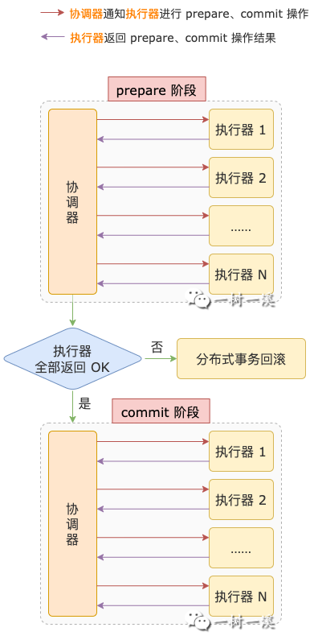
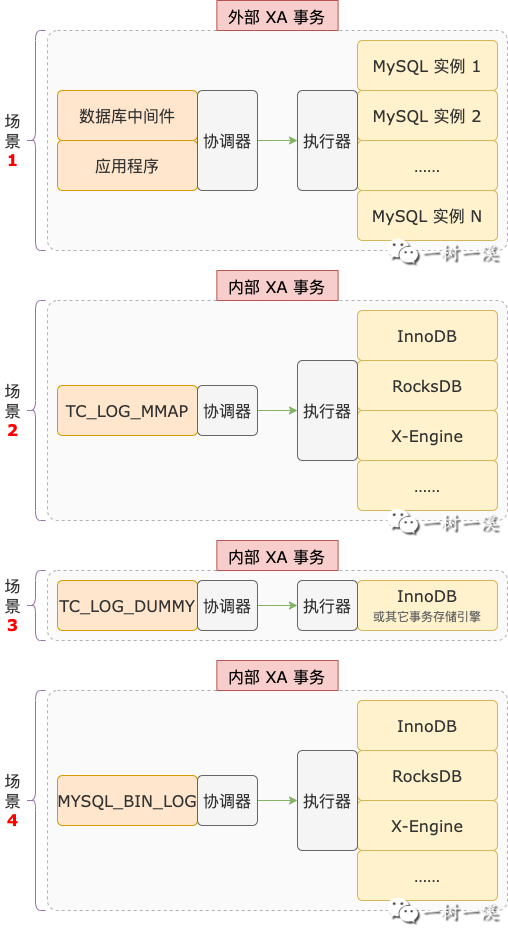
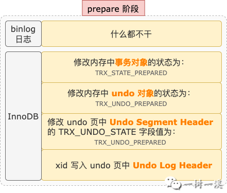
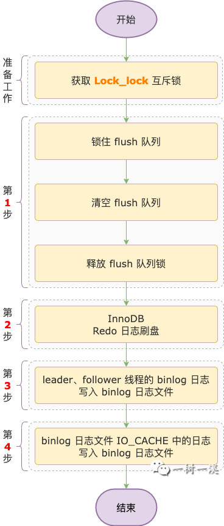
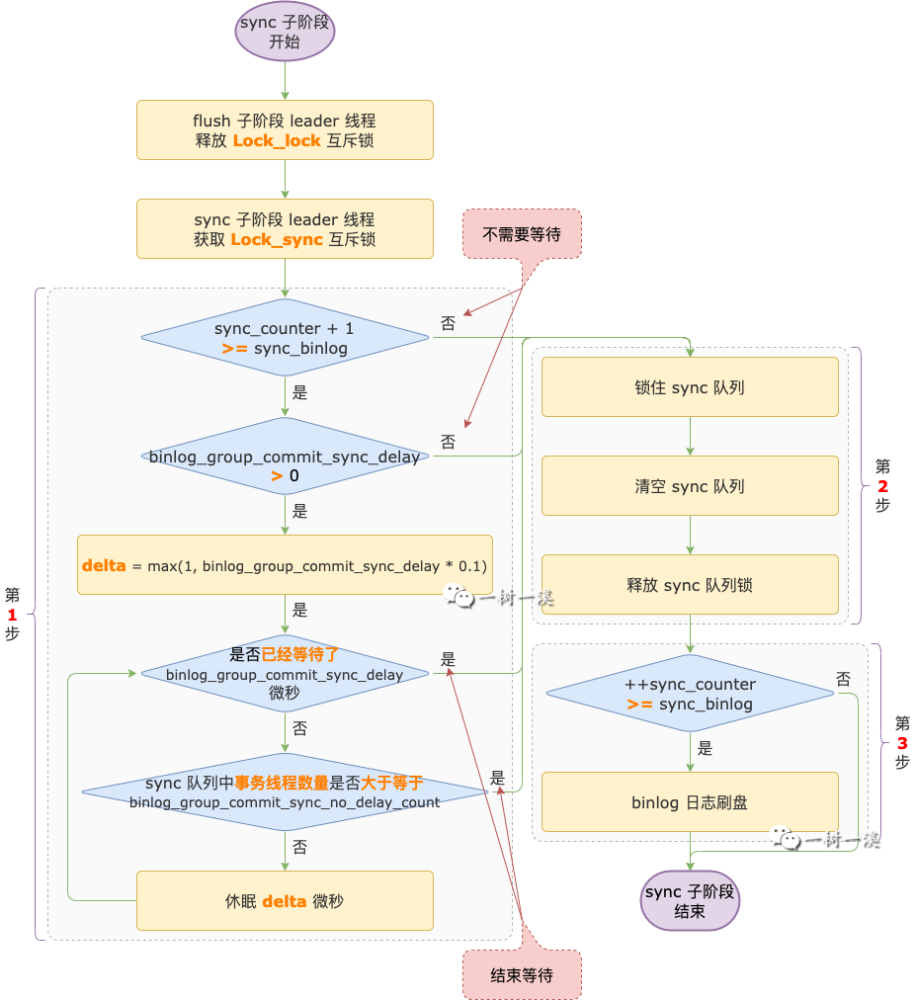
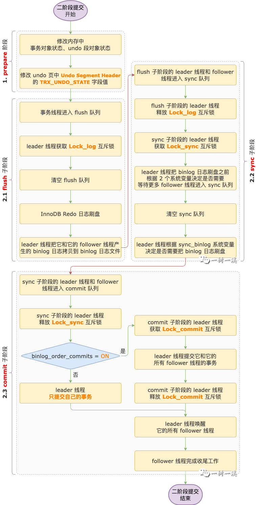

# MySQL事务二阶段提交

[TOC]

## 一、什么是二阶段提交

二阶段提交是一种用于保证分布式事务原子性的协议。

二阶段提交的实现过程，有 2 个角色参与其中：

**资源管理器**，Resource Manager，负责管理一部分资源。对于数据库来说，这里的资源指的就是`数据`。

如果把分布式事务看成是一个整体，每个资源管理器会负责其中的一部分，也就是分布式事务的一个本地事务。

资源管理器在分布式事务中的角色就是干活的，所以，我们可以称它为`执行器`。

**事务管理器**，Transaction Manager，负责管理分布式事务，协调事务的提交、回滚、以及崩溃恢复。

事务管理器在分布式事务中，就是那个总揽全局、指挥`资源管理器`干活的角色，所以，我们可以称它为`协调器`。

二阶段提交，顾名思义，会包含 2 个阶段：

**prepare 阶段**，`协调器`会询问所有`执行器`，是否可以提交事务。

此时，各个本地事务实际上已经执行完成，数据写入已经成功，就差`提交`这最后一哆嗦了。

如果有任何一个执行器因为它所执行的本地事务有问题不能提交，分布式事务就不能提交，协调器会通知所有执行器进行`回滚`操作。

如果每一个执行器都回复协调器可以提交，分布式事务就会进入下一个阶段，也就是 `commit 阶段`。

**commit 阶段**，`协调器`会通知`执行器`进行提交操作。

执行器收到`提交通知`之后，各自提交自己的本地事务。

所有执行器都提交完成之后，二阶段提交就结束了，分布式事务也就执行完成了。

> 以上只介绍了二阶段提交的正常流程，实际上二阶段提交的复杂之处在于异常流程处理，对二阶段提交完整流程感兴趣的小伙伴，可以自行查找相关资料。

## 二、MySQL 二阶段提交场景

在 MySQL 中，二阶段提交有 4 种使用场景：

**场景 1**，外部 XA 事务，数据库中间件、应用程序作为`协调器`，MySQL 数据库实例作为`执行器`。

> XA 事务也就是`分布式事务`。其它支持分布式事务的数据库实例，如 Oracle、SQL Server，也可以和 MySQL 一起作为执行器。

这种场景下，MySQL 通过以下 XA 系列命令来实现二阶段提交：

- `XA START xid`，开启分布式事务。
- `XA END xid`，标识分布式事务中的 SQL 都已经执行完成。
- `XA PREPARE xid`，执行分布式事务提交的 prepare 阶段。
- `XA COMMIT xid`，执行分布式事务提交的 commit 阶段。
- `XA ROLLBACK xid`，回滚分布式事务。

**场景 2**，单个 MySQL 实例的内部 XA 事务，`没有开启` binlog 日志，SQL 语句涉及`多个`支持事务的存储引擎。

`TC_LOG_MMAP` 类对象作为`协调器`，多个支持事务的存储引擎作为`执行器`。

> TC_LOG_MMAP 会打开一个名为 `tc.log` 的磁盘文件，并通过 MMAP 映射到内存中，用于记录分布式事务的 `xid`。

**场景 3**，单个 MySQL 实例的内部 XA 事务，`没有开启` binlog 日志，SQL 语句只涉及 `1个`支持事务的存储引擎。

这种场景下，原本是不需要二阶段提交的，但是为了统一，还是会以二阶段提交的结构进行提交操作。

`TC_LOG_DUMMY` 类对象作为`协调器`，不记录 xid，存储引擎作为`执行器`。

> 从 `DUMMY` 可以看出，TC_LOG_DUMMY 是个伪装的协调器。

**场景 4**，单个 MySQL 实例的内部 XA 事务，`开启了` binlog 日志，SQL 语句涉及 `1个或多个`支持事务的存储引擎。

`MYSQL_BIN_LOG` 类对象作为`协调器`，分布式事务的 `xid` 记录在 binlog 日志文件中。binlog 日志和存储引擎作为`执行器`。

binlog 日志和存储引擎都是独立单元，为了保证多个存储引擎之间、存储引擎和 binlog 日志之间的数据一致性，在事务提交时，这些操作要么都提交，要么都回滚，需要借助 XA 事务实现。

InnoDB 是 MySQL 最常用的存储引擎，为了支持主从架构，binlog 日志也是必须要开启的，这是 MySQL 最常使用的场景。

接下来我们就以 **InnoDB 存储引擎 + binlog 日志为例**，来介绍 MySQL 内部 XA 事务的二阶段提交过程。

## 三、prepare 阶段

来到 prepare 阶段之前，InnoDB 对表中数据的写操作都已经完成，就差提交或者回滚这最后一哆嗦了。

prepare 阶段，binlog 日志和 InnoDB 主要干的事情有这些：

prepare 阶段，binlog 日志没有什么需要做的，InnoDB 主要做的事情就是修改事务和 undo 段的状态，以及记录 `xid`（分布式事务的 ID）。

InnoDB 会把内存中事务对象的状态修改为 `TRX_STATE_PREPARED`，把事务对应 undo 段在内存中的对象状态修改为 `TRX_UNDO_PREPARED`。

修改完内存中各对象的状态，还不算完事，还要把事务对应 undo 段的`段头页`中 Undo Segment Header 的 TRX_UNDO_STATE 字段值修改为 `TRX_UNDO_PREPARED`。

然后，把 xid 信息写入当前事务对应日志组的 Undo Log Header 中的 xid 区域。

修改 TRX_UNDO_STATE 字段值、写 xid，这两个操作都要修改 undo 页，修改 undo 页之前会先记录 Redo 日志。

## 四、commit 阶段

### 1. commit 阶段整体介绍

到了 commit 阶段，一个事务就已经接近尾声了。

写操作（包括增、删、改）已经完成，内存中的事务状态已经修改，undo 段的状态也已经修改，xid 信息也已经写入 Undo Log Header，`prepare` 阶段产生的 Redo 日志已经写入到 Redo 日志文件。

> 由于 log_flusher 线程会每秒进行刷盘操作，此时，事务产生的 Redo 日志有可能已经刷新到磁盘了，也有可能还停留在 Redo 日志文件的操作系统缓冲区中。

剩余的收尾工作，包括：

- Redo 日志刷盘。
- 事务的 binlog 日志从临时存放点拷贝到 binlog 日志文件。
- binlog 日志文件刷盘。
- InnoDB 事务提交。

为了保证主从数据一致性，同一个事务中，上面列出的收尾工作必须`串行`执行。

Redo & binlog 日志刷盘都涉及到磁盘 IO，如果每提交一个事务，都把该事务中的 Redo 日志、binlog 日志刷盘，会涉及到很多小数据量的 IO 操作，频繁的小数量 IO 操作非常消耗磁盘的读写性能。

为了提升磁盘 IO 效率，从而提高事务的提交效率，MySQL 从 5.6 开始引入了 binlog 日志组提交功能，5.7 中把原本在 prepare 阶段进行的 Redo 日志刷盘操作迁移到了 commit 阶段。

binlog 日志组提交有何神奇之处，怎么就能提升磁盘 IO 效率呢？

引入 binlog 日志组提交功能之后，commit 阶段细分为 3 个子阶段。对于每个子阶段，都可以有多个事务处于该子阶段，写日志 & 刷盘操作可以合并：

`flush 子阶段`，Redo 日志可以一起刷盘，binlog 日志不需要加锁就可以一起写入 binlog 日志文件。

`sync 子阶段`，binlog 日志可以一起刷盘。

`commit 子阶段`，Redo 日志可以一起刷盘。

通过合并 Redo 日志刷盘操作、合并 binlog 日志写入日志文件操作、合并 binlog 日志刷盘操作，**把小数据量多次 IO 变为大数据量更少次数 IO，可以提升磁盘 IO 效率**。

> 类比一下生活中的场景：这就相当于每个人从自己开车上下班，都改为坐公交或地铁上下班，路上的车减少了，通行效率大大提升，就不堵车了。

既然要合并 Redo、binlog 日志的写入、刷盘操作，那必须有一个`管事的`来负责`协调`这些操作。

如果引入一个单独的协调线程，会增加额外开销。

MySQL 的解决方案是把处于同一个子阶段的事务线程分为 2 种角色：

- `leader 线程`，第 1 个进入某个子阶段的事务线程，就是该子阶段当前分组的 leader 线程。
- `follower 线程`，第 2 个及以后进入某个子阶段的事务线程，都是该子阶段当前分组的 follower 线程。

> 事务线程指的是事务所在的那个线程，我们可以把事务线程看成事务的容器，一个线程执行一个事务。

leader 线程管事的方式，并不是指挥 follower 线程干活，而是自己帮 follower 线程把活都干了。

commit 细分为 3 个子阶段之后，每个子阶段会有一个`队列`用于记录哪些事务线程处于该子阶段。

为了保证先进入 flush 子阶段的事务线程一定先进入 sync 子阶段，先进入 sync 子阶段的事务线程一定先进入  commit 子阶段，每个子阶段都会持有一把`互斥锁`。

接下来，我们一起来看看这 3 个子阶段具体都干了什么事情。

### 2. flush子阶段

flush 子阶段，第 1 个进入 flush 队列的事务线程，会成为 leader 线程。第 2 个及以后进入 flush 队列的事务线程，会成为 follower 线程。

follower 线程会进入`等待`状态，直到收到 leader 线程从 commit 子阶段发来的通知，才会醒来继续执行后续操作。

leader 线程会获取一把互斥锁，保证同一时间 flush 子阶段只有一个 leader 线程。

互斥锁保存到 MYSQL_BIN_LOG 类的 `Lock_log` 属性中，我们就叫它 `Lock_log 互斥锁`好了。

flush 子阶段 leader 线程的主要工作流程如下：

`第 1 步`，清空 flush 队列。

清空之前，会先锁住 flush 队列，在这之前进入 flush 队列的所有事务线程就成为了`一组`。

锁住之后，会清空 flush 队列。

清空之后，进入 flush 队列的事务线程就属于`下一组`了，在这之后第 1 个进入 flush 队列的事务线程会成为下一组的 leader 线程。

有一点需要`注意`，**当前组的 leader 线程持有的 Lock_log 锁要等到 sync 阶段才会释放**。

如果下一组的 leader 线程在当前组的 leader 线程释放 Lock_log 锁之前就进入 flush 队列了，下一组的 leader 线程会阻塞，直到当前组的 leader 线程`释放` Lock_log 锁。

`第 2 步`，执行 Redo 日志刷盘操作，把 InnoDB 产生的 Redo 日志都刷新到磁盘。

`第 3 步`，遍历 leader 线程带领的一组 follower 线程，把 follower 线程中事务产生的 binlog 日志都写入到 binlog 日志文件。

每个事务在执行过程中产生的 binlog 日志都会`先写入`事务线程中专门用于存放该事务 binlog 日志的磁盘临时文件，这是事务线程中 binlog 日志的`临时存放点`。

> binlog 日志磁盘临时文件有一个 IO_CACHE（`内存缓冲区`），默认大小为 32K。

> binlog 日志会先写入 IO_CACHE，写满之后再把 IO_CACHE 中的日志写入磁盘临时文件，然后清空 IO_CACHE，供后续的 binlog 日志写入。

等到二阶段提交的 flush 子阶段，才会按照事务提交的顺序，把每个事务产生的 binlog 日志从临时存放点拷贝到 binlog 日志文件中。

> binlog 日志文件也有一个 IO_CACHE，大小为 8K。

> binlog 日志从临时存放点拷贝到 binlog 日志文件，也是先写入 IO_CACHE，写满之后再把 IO_CACHE 中的日志写入 binlog 日志文件，然后清空 IO_CACHE，供后续 binlog 日志复用。

*在第 1 步中，已经早早的把 flush 队列给清空了，还怎么遍历 leader 线程带领的一组 follower 线程呢？*

别急，leader 线程既然作为管事的，它自然得知道它这一组中都有哪些 follower 线程。

每个线程对象（thd）中，都会有个 `next_to_commit` 属性，指向紧随其后加入到 flush 队列的线程。

只要知道 leader 线程，根据每个线程的 `next_to_commit` 属性，就可以顺藤摸瓜找到 leader 线程带领的一组 follower 线程。

`第 4 步`，把 binlog 日志文件 IO_CACHE 中最后剩下的日志拷贝到 binlog 日志文件。

binlog 日志从临时存放点拷贝到 binlog 日志文件的过程中，得先写入 IO_CACHE，写满之后，才会把 IO_CACHE 中的日志拷贝到 binlog 日志文件。

第 3 步执行完成之后，binlog 日志文件的 IO_CACHE 可能没有写满，其中的日志也就不会被拷贝到 binlog 日志文件。

所以，第 4 步的存在就是为了把 binlog 日志文件 IO_CACHE 中最后剩下的`不足 8K` 的日志拷贝到 binlog 日志文件。

> flush 子阶段把 binlog 日志从临时存放点拷贝到 binlog 日志文件，并没有刷新到磁盘，只是写入到 binlog 日志文件的操作系统缓冲区。

### 3. sync子阶段

sync 子阶段也有一个队列，是 `sync 队列`。

第 1 个进入 sync 队列的事务线程是 sync 子阶段的 leader 线程。

第 2 个及以后进入 sync 队列的事务线程是 sync 子阶段的 follower 线程。

flush 子阶段完成之后，它的 leader 线程会进入 sync 子阶段。

flush 子阶段的 `leader 线程`来到 sync 子阶段之后，它会先加入 sync 队列，然后它的 follower 线程也会`逐个`加入 sync 队列。

flush 子阶段的 leader 线程和它的 follower 线程都加入到 sync 队列之后，leader 线程会`释放`它持有的  `Lock_log 互斥锁`。

如果 flush 子阶段的 leader 线程加入 sync 队列之前，sync 队列是空的，那么它又会成为 sync 子阶段的 leader 线程，否则，它和它的所有 follower 线程都会成为 sync 子阶段的 follower 线程。

在 sync 子阶段，依然是由 leader 线程完成各项工作。

follower 线程依然处于`等待`状态，直到收到 leader 线程从 commit 子阶段发来的通知，才会退出等待状态，执行后续操作。

leader 线程开展工作之前，会先获取 `Lock_sync 互斥锁`，保证同一时间 sync 子阶段只有一个 leader 线程。

sync 子阶段 leader 线程的主要工作流程如下(下图有误，是否Lock_lock互斥锁应为释放Lock_log互斥锁)：

`第 1 步`，`等待`更多事务线程进入 sync 子阶段。

只有符合一定条件时，leader 线程才会进入等待过程。

介绍要符合什么条件之前，我们先来看看 leader 线程为什么要有这个等待过程？

前面介绍过，binlog 日志组提交就是为了把多个事务线程攒到一起，然后再把这些事务产生的 Redo 日志、binlog 日志一起刷盘，从而提升磁盘的 IO 效率。

leader 线程的`等待过程`，依然是为了把`更多`事务线程攒到一起，从而积攒更多 binlog 日志一起刷盘。

`如果没有`这个等待过程，第 1 个事务线程进入 sync 队列成为 leader 线程之后，它可不管有没有其它事务线程加入 sync 队列，就会马不停蹄的执行后面的流程。

数据库繁忙的时候，leader 线程开始执行后续流程之前，可能就有很多其它事务线程加入 sync 队列成为它的 follower 线程。

这种情况下，leader 线程有很多 follower 线程，它把这些 follower 线程的 binlog 日志一起刷盘，能够提升磁盘 IO 效率。

数据库不那么忙的时候，leader 线程开始执行后续流程之前，可能`没有`或者只有`很少`的事务线程加入 sync 队列成为它的 follower 线程。

这种情况下，leader 线程还是只能把少量的 binlog 日志一起刷盘，binlog 日志组提交功能提升磁盘 IO 效率就不那么明显了。

*为了在数据库不那么忙的时候，也能尽量提升 binlog 日志组提交的效率，引入了 leader 线程的`有条件`等待过程，这个条件由系统变量 `sync_binlog` 控制。*

> sync_binlog 表示 binlog 日志刷盘频率。

**sync_binlog = 0**，MySQL 不会主动发起 binlog 日志刷盘操作。

只需要把 binlog 日志写入 binlog 日志文件的操作系统缓冲区，由操作系统决定什么时候执行刷盘操作。

**sync_binlog = 1**，sync 子阶段`每一组`的 leader 线程都会触发刷盘操作。

这意味着每个事务只要提交成功了，binlog 日志也一定刷新到磁盘了。

*sync_binlog = 1* 就是著名的`双 1` 设置的其中一个 1。

**sync_binlog = N**，sync 子阶段`每 N 组`才会触发一次刷盘操作。

也就是说，执行一次刷盘操作之后，接下来`第 1 ~ N-1 组`的 leader 线程都不会执行 binlog 日志刷盘操作。

等到`第 N 组`时，它的 leader 线程才会把第 `1 ~ N 组`的所有事务线程产生的 binlog 日志一起刷盘。

源码中有一个变量 `sync_counter` 用于记录 sync 子阶段自上次刷盘操作以后，有多少组的 leader 线程没有进行刷盘操作。

每当有一个 leader 线程没有执行刷盘操作，sync_counter 变量的值就会`加 1`。

只要有一个 leader 线程执行了刷盘操作，sync_counter 变量的值就会清零，重新开始计数。

**重点来了**，如果某一组的 leader 线程判断 `sync_counter + 1 >= sync_binlog` 条件成立，那么该 leader 线程就要执行刷盘操作，刷盘之前会触发`等待更多事务线程进入 sync 子阶段`中的等待过程。

> `换句大白话来说`：sync 子阶段 leader 线程把 binlog 日志刷盘之前会进入`等待过程`，目的是为了攒到更多的 follower 线程，能够把更多的 binlog 日志一起刷盘。

我们现在知道了 leader 线程为什么要等待，以及什么情况下需要等待，**那要等待多长时间呢？**

等待过程持续多长时间由 2 个系统变量控制。

`binlog_group_commit_sync_delay`，单位为`微秒`，表示 sync 子阶段的 leader 线程在执行 binlog 日志文件刷盘操作之前，需要等待的多少微秒，`默认值`为 0。

如果它的值为 0，表示跳过等待过程。

如果它的值大于 0，leader 线程会等待 binlog_group_commit_sync_delay 毫秒。

但是，在等待过程中，leader 线程会每隔一段时间就去看看 sync 队列里的事务线程数量是不是`大于等于`系统变量 `binlog_group_commit_sync_no_delay_count` 的值。

只要 binlog_group_commit_sync_no_delay_count sync 的值`大于` 0，并且队列里的事务线程数量`大于等于` 该系统变量的值，立马`停止等待`，开始执行`第 2 步及之后`的操作

> 检查 sync 队列里事务线程数量的时间间隔是：binlog_group_commit_sync_delay 除以 10 得到的结果，单位是 `微秒`，如果得到的结果是大于 1 微秒，时间间隔就是 1 微秒。

`第 2 步`，清空 sync 队列。

清空之前，会先锁住 sync 队列，在这之前进入 sync 队列的所有事务线程就成为了`一组`。

锁住之后，会清空 sync 队列。

清空之后，进入 sync 队列的事务线程就属于`下一组`了，在这之后第 1 个进入 sync 队列的事务会成为下一组的 leader 线程。

`第 3 步`，binlog 日志文件刷盘。

刷盘操作完成后，这一组事务线程的 binlog 日志都刷新到磁盘，实现了持久化，它们再也不用担心数据库崩溃了。

在这一步`是否会`执行刷盘操作，也是由系统变量 `sync_binlog` 控制的，在`第 1 步`中已经详细介绍过，这里就不重复了介绍了。

### 4. commit子阶段

commit 子阶段也有一个队列，是 `commit 队列`。

第 1 个进入 commit 队列的事务线程是 commit 子阶段的 leader 线程。

第 2 个及以后进入 commit 队列的事务线程是 commit 子阶段的 follower 线程。

sync 子阶段完成之后，它的 leader 线程会进入到 commit 子阶段，并加入 commit 队列，然后再让它的 follower 线程也`逐个`加入 commit 队列。

sync 子阶段的 leader 线程和 follower 线程都加入到 commit 队列之后，leader 线程会释放它持有的 `Lock_sync` 互斥锁。

如果 sync 子阶段的 leader 线程加入 commit 队列之前，commit 队列是`空的`，那么它又会成为 commit 子阶段的 leader 线程。

`否则`，它和它的 follower 线程都会成为 commit 子阶段的 follower 线程。

commit 子阶段，leader 线程最重要的工作就是提交事务，然后给所有处于 commit 子阶段的 follower 线程发通知。

leader 线程提交事务，是只提交自己的事务，还是会把所有 follower 线程的事务也一起提交了，由系统变量 `binlog_order_commits` 变量控制。

binlog_order_commits 的`默认值`为 `ON`，表示 leader 线程除了会提交自己的事务，还会提交所有 follower 线程的事务。

如果 binlog_order_commits 的值为 `OFF`，表示 leader 线程只会提交自己的事务。

leader 线程提交事务之后，会通知所有 follower 线程。

follower 线程收到通知之后，会退出等待状态，继续进行接下来的工作，也就是收尾工作。

每个事务线程中都有一个 `commit_low` 属性，如果 leader 线程已经把 follower 线程的事务也一起提交了，会把 follower 线程的该属性值设置为 `false`，follower 线程在执行收尾工作的时候，就`不需要`再提交自己的事务了。

如果 leader 线程只提交了自己的事务，而没有提交 follower 线程的事务，`commit_low` 属性的值为 `true`，follower 线程在执行收尾工作的时候，需要`各自提交`自己的事务。

## 五、总结

二阶段提交的核心逻辑是把多个事务的 Redo 日志合并刷盘，把多个事务的 binlog 日志合并刷盘，从而把少量数据多次 IO 变为更大数据更少 IO，最终达到提升事务提交效率的目标。

最后，以一张二阶段提交的整体流程图作为本文的结尾：

