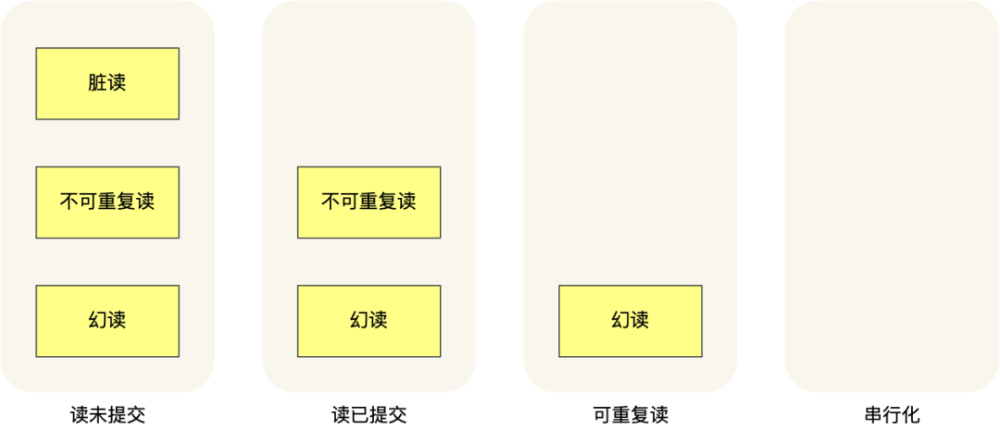
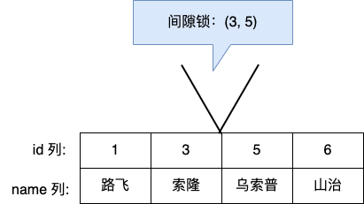

# MySQL幻读被彻底解决了吗

<!-- START doctoc generated TOC please keep comment here to allow auto update -->
<!-- DON'T EDIT THIS SECTION, INSTEAD RE-RUN doctoc TO UPDATE -->

- [零、开篇](#%E9%9B%B6%E5%BC%80%E7%AF%87)
- [一、什么是幻读？](#%E4%B8%80%E4%BB%80%E4%B9%88%E6%98%AF%E5%B9%BB%E8%AF%BB)
- [二、隔离级别](#%E4%BA%8C%E9%9A%94%E7%A6%BB%E7%BA%A7%E5%88%AB)
- [三、快照读是如何避免幻读的？](#%E4%B8%89%E5%BF%AB%E7%85%A7%E8%AF%BB%E6%98%AF%E5%A6%82%E4%BD%95%E9%81%BF%E5%85%8D%E5%B9%BB%E8%AF%BB%E7%9A%84)
- [四、当前读是如何避免幻读的？](#%E5%9B%9B%E5%BD%93%E5%89%8D%E8%AF%BB%E6%98%AF%E5%A6%82%E4%BD%95%E9%81%BF%E5%85%8D%E5%B9%BB%E8%AF%BB%E7%9A%84)
- [五、幻读被彻底解决了吗？](#%E4%BA%94%E5%B9%BB%E8%AF%BB%E8%A2%AB%E5%BD%BB%E5%BA%95%E8%A7%A3%E5%86%B3%E4%BA%86%E5%90%97)
    - [1. 第一个发生幻读现象的场景](#1-%E7%AC%AC%E4%B8%80%E4%B8%AA%E5%8F%91%E7%94%9F%E5%B9%BB%E8%AF%BB%E7%8E%B0%E8%B1%A1%E7%9A%84%E5%9C%BA%E6%99%AF)
    - [2. 第二个发生幻读现象的场景](#2-%E7%AC%AC%E4%BA%8C%E4%B8%AA%E5%8F%91%E7%94%9F%E5%B9%BB%E8%AF%BB%E7%8E%B0%E8%B1%A1%E7%9A%84%E5%9C%BA%E6%99%AF)
- [六、小结](#%E5%85%AD%E5%B0%8F%E7%BB%93)

<!-- END doctoc generated TOC please keep comment here to allow auto update -->

[TOC]

## 零、开篇

MySQL InnoDB 引擎的默认隔离级别虽然是「可重复读」，但是它很大程度上避免幻读现象（并不是完全解决了），解决的方案有两种：

- 针对**快照读**（普通 select 语句），是**通过 MVCC 方式解决了幻读**
  ，因为可重复读隔离级别下，事务执行过程中看到的数据，一直跟这个事务启动时看到的数据是一致的，即使中途有其他事务插入了一条数据，是查询不出来这条数据的，所以就很好了避免幻读问题。
- 针对**当前读**（select ... for update 等语句），是**通过 next-key lock（记录锁+间隙锁）方式解决了幻读**，因为当执行 select ... for update 语句的时候，会加上
  next-key lock，如果有其他事务在 next-key lock 锁范围内插入了一条记录，那么这个插入语句就会被阻塞，无法成功插入，所以就很好了避免幻读问题。

这次，我会举例**两个实验场景**来说明 MySQL InnoDB 引擎的可重复读隔离级别发生幻读的问题。

好了，发车！

## 一、什么是幻读？

首先来看看 MySQL 文档是怎么定义幻读（Phantom Read）的:

*The so-called phantom problem occurs within a transaction when the same query produces different sets of rows at
different times. For example, if a SELECT is executed twice, but returns a row the second time that was not returned the
first time, the row is a “phantom” row.*

翻译：当同一个查询在不同的时间产生不同的结果集时，事务中就会出现所谓的幻象问题。例如，如果 SELECT 执行了两次，但第二次返回了第一次没有返回的行，则该行是“幻像”行。

举个例子，假设一个事务在 T1 时刻和 T2 时刻分别执行了下面查询语句，途中没有执行其他任何语句：

```sql
SELECT *
FROM t_test
WHERE id > 100;
```

**只要 T1 和 T2 时刻执行产生的结果集是不相同的，那就发生了幻读的问题**，比如：

- T1 时间执行的结果是有 5 条行记录，而 T2 时间执行的结果是有 6 条行记录，那就发生了幻读的问题。
- T1 时间执行的结果是有 5 条行记录，而 T2 时间执行的结果是有 4 条行记录，也是发生了幻读的问题。

## 二、隔离级别

当多个事务并发执行时可能会遇到「脏读、不可重复读、幻读」的现象，这些现象会对事务的一致性产生不同程序的影响。

- 脏读：读到其他事务未提交的数据；
- 不可重复读：前后读取的数据不一致；
- 幻读：前后读取的记录数量不一致。

这三个现象的严重性排序如下：


**SQL 标准**提出了四种隔离级别来规避这些现象，隔离级别越高，性能效率就越低，这四个隔离级别如下：

- **读未提交（read uncommitted）**，指一个事务还没提交时，它做的变更就能被其他事务看到；
- **读提交（read committed）**，指一个事务提交之后，它做的变更才能被其他事务看到；
- **可重复读（repeatable read）**，指一个事务执行过程中看到的数据，一直跟这个事务启动时看到的数据是一致的，**MySQL InnoDB 引擎的默认隔离级别**；
- **串行化（serializable ）**，会对记录加上读写锁，在多个事务对这条记录进行读写操作时，如果发生了读写冲突的时候，后访问的事务必须等前一个事务执行完成，才能继续执行；

针对不同的隔离级别，并发事务时可能发生的现象也会不同。



也就是说：

- 在「读未提交」隔离级别下，可能发生脏读、不可重复读和幻读现象；
- 在「读提交」隔离级别下，可能发生不可重复读和幻读现象，但是不可能发生脏读现象；
- 在「可重复读」隔离级别下，可能发生幻读现象，但是不可能脏读和不可重复读现象；
- 在「串行化」隔离级别下，脏读、不可重复读和幻读现象都不可能会发生。

所以，要解决脏读现象，就要升级到「读提交」以上的隔离级别；要解决不可重复读现象，就要升级到「可重复读」的隔离级别，要解决幻读现象不建议将隔离级别升级到「串行化」。

不同的数据库厂商对 SQL 标准中规定的 4 种隔离级别的支持不一样，有的数据库只实现了其中几种隔离级别，**我们讨论的 MySQL 虽然支持 4 种隔离级别，但是与SQL 标准中规定的各级隔离级别允许发生的现象却有些出入**。

MySQL 在「可重复读」隔离级别下，可以很大程度上避免幻读现象的发生（注意是很大程度避免，并不是彻底避免），所以 MySQL 并不会使用「串行化」隔离级别来避免幻读现象的发生，因为使用「串行化」隔离级别会影响性能。

**MySQL InnoDB 引擎的默认隔离级别虽然是「可重复读」，但是它很大程度上避免幻读现象（并不是完全解决了）**，解决的方案有两种：

- 针对**快照读**（普通 select 语句），是**通过 MVCC 方式解决了幻读**
  ，因为可重复读隔离级别下，事务执行过程中看到的数据，一直跟这个事务启动时看到的数据是一致的，即使中途有其他事务插入了一条数据，是查询不出来这条数据的，所以就很好了避免幻读问题。
- 针对**当前读**（select ... for update 等语句），是**通过 next-key lock（记录锁+间隙锁）方式解决了幻读**，因为当执行 select ... for update 语句的时候，会加上
  next-key lock，如果有其他事务在 next-key lock 锁范围内插入了一条记录，那么这个插入语句就会被阻塞，无法成功插入，所以就很好了避免幻读问题。

## 三、快照读是如何避免幻读的？

可重复读隔离级是由 MVCC（多版本并发控制）实现的，实现的方式是启动事务后，在执行第一个查询语句后，会创建一个 Read View，**后续的查询语句利用这个 Read View，通过这个 Read View 就可以在 undo log
版本链找到事务开始时的数据，所以事务过程中每次查询的数据都是一样的**，即使中途有其他事务插入了新纪录，是查询不出来这条数据的，所以就很好了避免幻读问题。

做个实验，数据库表 t_stu 如下，其中 id 为主键。


然后在可重复读隔离级别下，有两个事务的执行顺序如下：


从这个实验结果可以看到，即使事务 B 中途插入了一条记录，事务 A 前后两次查询的结果集都是一样的，并没有出现所谓的幻读现象。

## 四、当前读是如何避免幻读的？

MySQL 里除了普通查询是快照读，其他都是**当前读**，比如 update、insert、delete，这些语句执行前都会查询最新版本的数据，然后再做进一步的操作。

这很好理解，假设你要 update 一个记录，另一个事务已经 delete 这条记录并且提交事务了，这样不是会产生冲突吗，所以 update 的时候肯定要知道最新的数据。

另外，`select ... for update` 这种查询语句是当前读，每次执行的时候都是读取最新的数据。

接下来，我们假设`select ... for update`当前读是不会加锁的（实际上是会加锁的），在做一遍实验。


这时候，事务 B 插入的记录，就会被事务 A 的第二条查询语句查询到（因为是当前读），这样就会出现前后两次查询的结果集合不一样，这就出现了幻读。

所以，**Innodb 引擎为了解决「可重复读」隔离级别使用「当前读」而造成的幻读问题，就引出了间隙锁**。（额外提一句，**读提交隔离级别，是没有间隙锁的，只有记录锁**）

假设，表中有一个范围 id 为（3，5）间隙锁，那么其他事务就无法插入 id = 4 这条记录了，这样就有效的防止幻读现象的发生。



举个具体例子，场景如下：


事务 A 执行了这条当前读语句后，就在对表中的记录加上 id 范围为 (2, +∞] 的 next-key lock（next-key lock 是间隙锁+记录锁的组合）。

然后，事务 B 在执行插入语句的时候，判断到插入的位置被事务 A 加了 next-key lock，于是事物 B 会生成一个插入意向锁，同时进入等待状态，直到事务 A 提交了事务。这就避免了由于事务 B 插入新记录而导致事务 A
发生幻读的现象。

## 五、幻读被彻底解决了吗？

**可重复读隔离级别下虽然很大程度上避免了幻读，但是还是没有能完全解决幻读**。

我举例两个可重复读隔离级别发生幻读现象的场景。

### 1. 第一个发生幻读现象的场景

还是以这张表作为例子：


事务 A 执行查询 id = 5 的记录，此时表中是没有该记录的，所以查询不出来。

```sql
#
事务 A
mysql>
begin;
Query
OK, 0 rows affected (0.00 sec)

mysql>
select *
from t_stu
where id = 5;
Empty
set (0.01 sec)
```

然后事务 B 插入一条 id = 5 的记录，并且提交了事务。

```sql
#
事务 B
mysql>
begin;
Query
OK, 0 rows affected (0.00 sec)

mysql> insert into t_stu values(5, '小美', 18);
Query
OK, 1 row affected (0.00 sec)

mysql> commit;
Query
OK, 0 rows affected (0.00 sec)
```

此时，**事务 A 更新 id = 5 这条记录，对没错，事务 A 看不到 id = 5 这条记录，但是他去更新了这条记录，这场景确实很违和，然后再次查询 id = 5 的记录，事务 A 就能看到事务 B
插入的纪录了，幻读就是发生在这种违和的场景**。

```sql
#
事务 A
mysql>
update t_stu
set name = '小林coding'
where id = 5;
Query
OK, 1 row affected (0.01 sec)
Rows matched: 1  Changed: 1  Warnings: 0

mysql>
select *
from t_stu
where id = 5;
+----+--------------+------+
| id | name         | age  |
+----+--------------+------+
|  5 | 小林coding   |   18 |
+----+--------------+------+
1 row in set (0.00 sec)
```

整个发生幻读的时序图如下：


在可重复读隔离级别下，事务 A 第一次执行普通的 select 语句时生成了一个 ReadView，之后事务 B 向表中新插入了一条 id = 5 的记录并提交。接着，事务 A 对 id = 5
这条记录进行了更新操作，在这个时刻，这条新记录的 trx_id 隐藏列的值就变成了事务 A 的事务 id，之后事务 A 再使用普通 select 语句去查询这条记录时就可以看到这条记录了，于是就发生了幻读。

因为这种特殊现象的存在，所以我们认为 **MySQL Innodb 中的 MVCC 并不能完全避免幻读现象**。

### 2. 第二个发生幻读现象的场景

除了上面这一种场景会发生幻读现象之外，还有下面这个场景也会发生幻读现象。

- T1 时刻：事务 A 先执行「快照读语句」：select * from t_test where id > 100 得到了 3 条记录。
- T2 时刻：事务 B 往插入一个 id= 200 的记录并提交；
- T3 时刻：事务 A 再执行「当前读语句」 select * from t_test where id > 100 for update 就会得到 4 条记录，此时也发生了幻读现象。

**要避免这类特殊场景下发生幻读的现象的话，就是尽量在开启事务之后，马上执行 select ... for update 这类当前读的语句**，因为它会对记录加 next-key lock，从而避免其他事务插入一条新记录。

## 六、小结

MySQL InnoDB 引擎的可重复读隔离级别（默认隔离级），根据不同的查询方式，分别提出了避免幻读的方案：

- 针对**快照读**（普通 select 语句），是通过 MVCC 方式解决了幻读。
- 针对**当前读**（select ... for update 等语句），是通过 next-key lock（记录锁+间隙锁）方式解决了幻读。

我举例了两个发生幻读场景的例子。

第一个例子：对于快照读， MVCC 并不能完全避免幻读现象。因为当事务 A 更新了一条事务 B 插入的记录，那么事务 A 前后两次查询的记录条目就不一样了，所以就发生幻读。

第二个例子：对于当前读，如果事务开启后，并没有执行当前读，而是先快照读，然后这期间如果其他事务插入了一条记录，那么事务后续使用当前读进行查询的时候，就会发现两次查询的记录条目就不一样了，所以就发生幻读。

所以，**MySQL 可重复读隔离级别并没有彻底解决幻读，只是很大程度上避免了幻读现象的发生。**

要避免这类特殊场景下发生幻读的现象的话，就是尽量在开启事务之后，马上执行 select ... for update 这类当前读的语句，因为它会对记录加 next-key lock，从而避免其他事务插入一条新记录。
