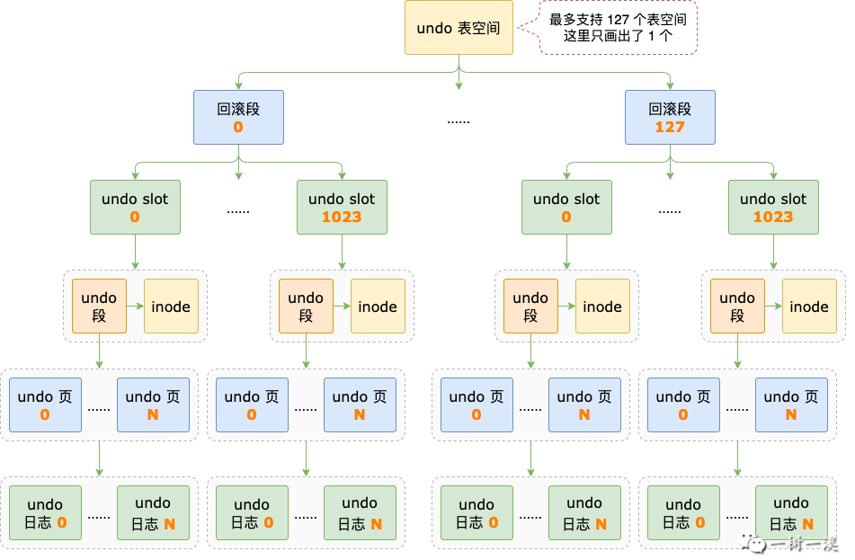
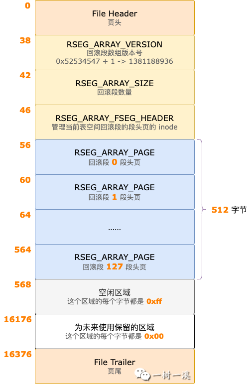
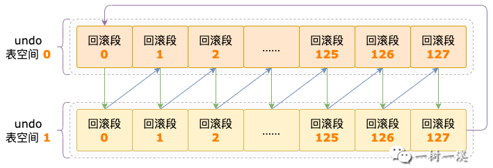
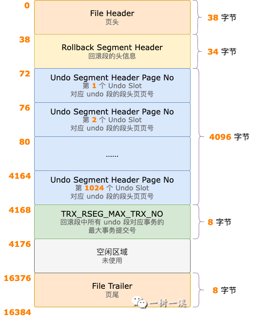
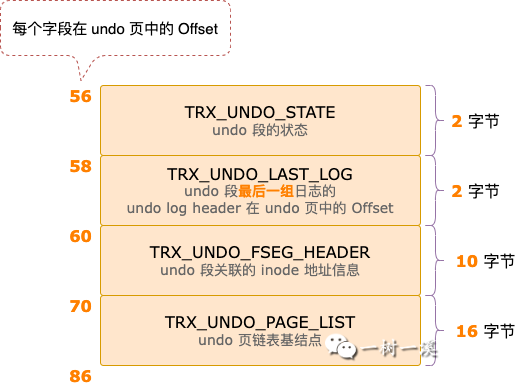
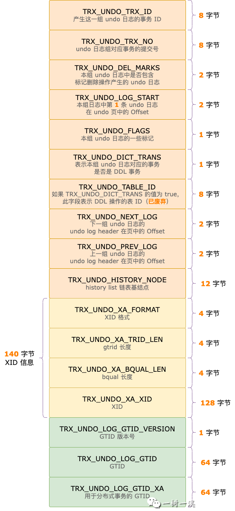
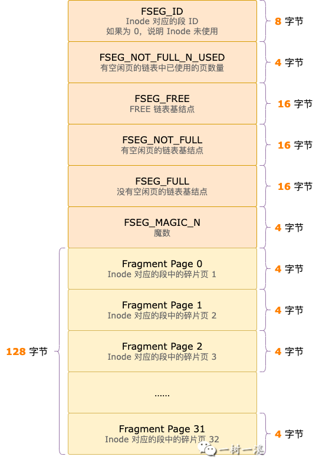
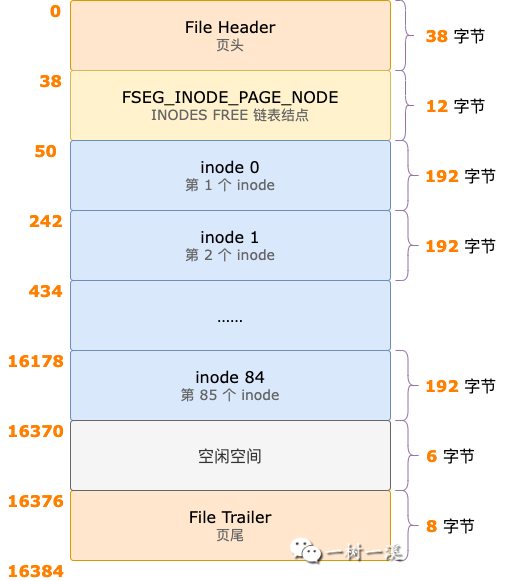
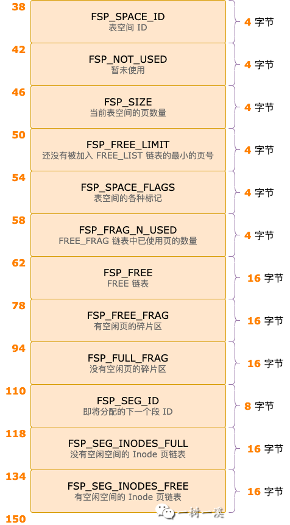
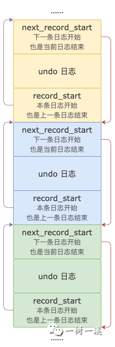

# UndoLog存储结构

[TOC]

## 零、开篇

redo 日志只有崩溃恢复的时候才能派上用场，undo 日志不一样，它承担着多重职责，MySQL 崩溃恢复、以及正常提供服务期间，都有它的身影。

按照使用频次，undo 日志的多重职责如下：

`职责 1`，为 MVCC 服务，减少读写事务之间的相互影响，提升数据库的并发能力。

`职责 2`，保证数据库运行过程中的数据一致性。事务回滚时，把事务中被修改的数据恢复到修改之前的状态。

`职责 3`，保证数据库崩溃之后的数据一致性。崩溃恢复过程中，恢复没有完成提交的事务，并根据事务的状态和 binlog 日志是否写入了该事务的 xid 信息，共同决定事务是提交还是回滚。

undo 日志需要为`数据一致性`和 `MVCC` 服务，除了要支持多事务同时写入日志，还要支持多事务同时读取日志。

为了有更好的读写并发性能，它拥有与 redo 日志完全不一样的存储结构。

本文我们就来聊聊 undo 日志的存储结构，它是怎么写入 undo 日志文件的，以及事务`二阶段提交`过程中和它有关的操作。

> 本文内容基于 MySQL 8.0.29 源码。

## 一、概述

undo 日志的存储结构比较复杂，我们先以倒序的方式来介绍一下存储结构的各个部分，以便大家有个整体了解。

`undo log header：`一个事务可能产生多条 undo 日志，也可能只产生一条 undo 日志，不管事务产生了多少条 undo 日志，这些日志都归属于事务对应的日志组，日志组由 undo log header 负责管理。

`undo 页：`undo log header 和 undo 日志都存储于 undo 页中。

`undo 段：`为了多个事务同时写 undo 日志不相互影响，undo 日志也使用了无锁设计，InnoDB 会为每个事务分配专属的 undo 段，每个事务只会往自己专属 undo 段的 undo 页中写入日志。

一个 undo 段可能会包含一个或多个 undo 页，多个 undo 页会形成 undo 页面链表。

`inode：`每个 undo 段都会关联一个 inode。

undo 段本身并不具备管理 undo 页的能力，有了 inode 这个外挂之后，undo 段就可以管理段中的 undo 页了。

`回滚段：`一个事务可能会需要 1 ~ 4 个 undo 段，很多个事务同时执行，就需要很多个 undo 段，这些 undo 段需要有一个地方统筹管理，这个地方就是回滚段。

`undo slot：`一个回滚段管理着 1024 个 undo 段，每个回滚段的`段头页`中都有 1024 个小格子，用来记录 undo 段中第一个 undo 页的`页号`，这个小格子就叫作 undo slot。

> **重要说明：** 一个回滚段管理 1024 个 undo 段，这是基于 innodb_page_size 是 16K（默认值） 的情况，本文涉及到页大小的内容，都以 16K 的页为前提，后面就不再单独说明了。

`undo 表空间：`，一个回滚段能够管理 1024 个 undo 段，看起来已经很多了，`假设`每个事务都只需要 1 个 undo 段，如果只有一个回滚段也只能支持 1024 个事务同时执行。

对于拥有几十核甚至百核以上 CPU 的服务器来说，这显然会限制它们的发挥。

为了充分发挥服务器的能力，有必要支持更多事务的同时执行，所以就有了 undo 表空间，一个 undo 表空间最多可以支持 128 个回滚段。

不止于此，InnoDB 还能够最多支持 127 个 undo 表空间，这样算起来，所有回滚段总共能够管理的 undo 段数量是：1024 * 128 * 127 = 16646144。

这么多 undo 段，是不是瞬间就有了`地主家有余粮`的感觉？

看了上面的介绍，相信大家能对 undo 日志有个整体了解，接下来我们就按照这个整体结构，自顶向下来详细介绍其中的每个部分。

## 二、undo 表空间

一个独立的 undo 表空间对应磁盘上的一个文件。

MySQL 8.0 开始，强制开启了`独立的` undo 表空间，支持创建 2 ~ 127 个 undo 表空间，默认数量为 `2`，可以通过 `CREATE UNDO TABLESPACE` 增加 undo 表空间，通过 `DROP UNDO TABLESPACE` 减少 undo 表空间。

每个 undo 表空间都可以配置 1 ~ 128 个回滚段，可以通过系统变量 `innodb_rollback_segments` 来控制每个 undo 表空间中的回滚段数量，默认值为 `128`。

每个 undo 表空间中，page_no = 3 的页专门用于保存回滚段的`段头页`的页号，这个页的类型是 `FIL_PAGE_TYPE_RSEG_ARRAY`，从 Offset 56 开始，保存着 128 个回滚段的`段头页`的页号，如下图所示：

## 三、回滚段

### 1. 什么是回滚段？

InnoDB 中凡是被称为`段`的东西，都是用来管理数据页的一种逻辑结构。

回滚段也不例外，它也是管理数据页的一种逻辑结构。

回滚段管理了什么页呢？回滚段有一点点特殊，它只管理一个页，就是回滚段的`段头页`。

每个回滚段中只有`段头页`这一个数据页，由此可见，管理数据页并不是它最重要的职责。

在`概述`小节，我们介绍过，每个回滚段中都有 1024 个 undo slot，可以统筹管理 1024 个 undo 段，这才是回滚段最重要的职责。

基于前面的介绍，我们可以给回滚段下一个定义了：回滚段是一种逻辑结构，它负责段头页的分配，以及管理其中 1024 个 undo slot 对应的 undo 段。

### 2. 分配回滚段

开启一个读写事务，或者一个只读事务转换为读写事务时，InnoDB 会为事务分配一个回滚段。

默认配置下，2 个 undo 表空间总共有 256 个回滚段，这么多回滚段，就涉及到怎么`均衡使用`的问题了。

2 个 undo 表空间，在内存是中一个数组，下标分别为 0、1。

每个 undo 表空间中 128 个回滚段，在内存中也是一个数组，下标为 0 ~ 127。

以 undo 表空间下标、回滚段下标组成一个元组，用于表示默认配置下的 256 个回滚段，如下：

(0, 0)、(0, 1)、…、(0, 126)、 (0, 127)

(1, 0)、(1, 1)、…、(1, 126)、 (1, 127)

分配回滚段的逻辑是按照 undo 表空间、回滚段轮流着来，顺序是这样的：

(0, 0)、`(1, 0)`、(0, 1)、`(1, 1)`、……、(0, 126)、`(1, 126)`、(0, 127)、`(1, 127)`

分配顺序用图片展示是这样的（按照箭头顺序分配）：

每次分配时，都会记录这次分配的是哪个回滚段。

下次再分配时，按照上面的顺序，把最后一次分配的回滚段之后的那个回滚段分配给事务。

InnoDB 中的回滚段，分为普通表回滚段、用户临时表回滚段，前面介绍的是普通表回滚段分配逻辑。

用户临时表只有一个独立 undo 表空间，默认 128 个回滚段，需要分配临时表回滚段时，只要轮流分配就行了。

## 四、undo slot

### 1. 什么是 undo slot？

每个回滚段的`段头页`中都有 1024 个小格子，每个小格子就是一个 undo slot，用于记录分配给事务的 undo 段的`段头页`页号，如下图所示：

### 2. 寻找 undo slot

一条 DML 语句即将要修改数据之前，会先记录 undo 日志。

记录 undo 日志之前，需要先创建一个 undo 段。

undo 段要把自己交给回滚段管理，这需要在回滚段的`段头页`中找一个 undo slot 占个位。

寻找 undo slot 的过程简单粗暴，从回滚段 1024 个 slot 中的第一个 slot 开始遍历，读取 slot 的值，只要 slot 的值等于 `FIL_NULL`，就说明这个 slot 没有被别的 undo 段占用，当前 undo 就可以占上这个位置。

> FIL_NULL 是 32 位无符号整数的最大值，十六进制表示为 `0xFFFFFFFFUL`，十进制表示为 `4294967295`。

如果遍历到最后一个 slot，都没有发现 `值 = FIL_NULL` 的 slot，那就说明分配给当前事务的回滚段没有可用的 slot 了。

这种情况下，InnoDB 并不会再重新给事务分配一个回滚段，而是直接报错：`Too many active concurrent transactions`。

## 五、undo 段

### 1. 什么是 undo 段？

undo 段，也是`段字辈`，那它自然也是管理数据页的一种逻辑结构了。

undo 段管理的数据页就是用来存放 undo 日志的页，也就是 undo 页。

*按照对于表的增、删、改操作是否需要记录 redo 日志来分类，undo 段可以分为 2 种类型：*

**临时表 undo 段**，对于`用户临时表`的增、删、改操作，数据库崩溃之后重新启动，不需要恢复这些表里的数据，也就是说临时表里的数据不需要保证持久性，因此`不需要`记录 `redo 日志`。

但是，如果事务对用户临时表进行了增、删、改操作，事务回滚时，用户临时表中的数据也需要回滚，所以`需要`记录 `undo 日志`。

**普通表 undo 段**，对于`普通表`的增、删、改操作，数据库崩溃之后重新启动，需要把这些操作修改过的数据，恢复到数据库崩溃时的状态，所以`需要`记录 `redo 日志`。

事务回滚时，对于普通表进行的增、删、改操作，表中的数据也需要回滚，所以`需要`记录 `undo 日志`。

*按照增、删、改操作来分类，undo 段也可以分为 2 种类型：*

**insert undo 段**，用于保存 insert 语句产生的 undo 日志的 undo 段。

**update undo 段**，用于保存 update、delete 语句产生的 undo 日志的 undo 段。

> 为什么要区分 insert undo 段和 update undo 段？

因为 insert 语句产生的 undo 日志，在事务提交时，如果 undo 段不能被缓存起来复用，就会直接释放。

update、delete 语句产生的 undo 日志，在事务提交时，如果 undo 段不能被缓存起来复用，也不会直接释放，而是要服务于 MVCC。

等到 undo 日志中的历史版本数据不再被其它事务需要时，这些 undo 日志才能被清除。

此时，如果 undo 日志所在的 undo 段中没有其它有效的 undo 日志时，undo 段才能被释放。

按照前面的 2 种维度分类，可以形成 4 种类型的 undo 段：

- 插入记录到用户临时表，是`临时表 insert undo 段`。
- 更新、删除用户临时表中的记录，是`临时表 update undo 段`。
- 插入记录到普通表，是`普通表 insert undo 段`。
- 更新、删除普通表中的记录，是`普通表 update undo 段`。

在同一个事务中，以上 4 种类型的 undo 段都有可能出现，所以，一个事务中就可能会需要  1 ~ 4 个 undo 段。

### 2. 复用缓存的 undo 段

每创建一个 undo 段，需要经过一系列的操作：

- 从 inode 页中找到一个未被使用的 inode。
- 分配一个 inode 页（可能需要）。
- 为 undo 段分配一个 undo 页。
- 初始化内存中的 undo 段对象。
- 初始化内存中的 undo log header 对象。
- 其它操作 ...

这些初始化操作都是需要时间的，频繁创建就有点浪费时间了。为此，InnoDB 设定了一个规则，在事务提交时，符合规则的 undo 段就可以被缓存起来，给后面的事务重复使用。

> undo 段可缓存复用的规则，本文后面`二阶段提交`的 commit 阶段会介绍。

前面介绍过，事务中使用 undo 段时，按照 2 种维度分类会形成 4 种类型的 undo 段，这是不是有点复杂？

undo 段缓存就比较简单了，只分了 2 种：insert undo 段、update undo 段。

有了 undo 段缓存之后，就不需要每次分配 undo 段时都从头开始创建一个了。

如果要为用户临时表、普通表的 insert 语句分配一个 undo 段，就去 `insert_undo_cached` 链表中（缓存 insert undo 段的链表）看看有没有 undo 段可以复用。

如果有，就取链表中的`第一个` undo 段来用；如果没有，就创建一个新的 insert undo 段。

如果要为用户表、普通表的 update、delete 语句分配一个 undo 段，就去 `update_undo_cached` 链表中（缓存 update undo 段的链表）看看有没有 undo 段可以复用。

如果有，就取链表中的`第一个` undo 段来用；如果没有，就创建一个新的 update undo 段。

### 3. 创建 undo 段

InnoDB 给事务分配一个 undo 段时，如果没有缓存的 undo 段可以复用，需要创建一个新的 undo 段。

创建一个新的 undo 段，会经历以下几个主要步骤：

`第 1 步`，找到一个 inode，undo 段会关联一个 inode，用于管理段中的页。

> inode 后面会有一个小节单独介绍，这里先不展开。

`第 2 步`，从表空间 0 号页的 File Space Header 中读取 `FSP_SEG_ID`，作为新创建的 undo 段的 ID（`seg_id`），把 seg_id 写入 inode 的 `FSEG_ID` 字段，表示这个 inode 已经被占用了。

`第 3 步`，通过 inode 分配一个新的空闲页作为 undo 段的`段头页`。

每个 undo 段都会有一个 Undo Segment Header，位于 undo 段的`段头页`中，如下图所示：

`第 4 步`，把 inode 的地址信息写入 Undo Segment Header 的 `TRX_UNDO_FSEG_HEADER` 字段。

inode 的地址由 3 个部分组成：

- inode 所在页的表空间 ID
- inode 所在页的页号
- inode 在页中的 Offset

`第 5 步`，把`段头页`加入 undo 页面链表的最后，undo 页面链表的基结点位于 Undo Segement Header 的 `TRX_UNDO_PAGE_LIST` 字段中。

`第 6 步`，把 undo 段的`段头页`页号写入回滚段中分配给当前 undo 段的 undo slot 中，表示这个 undo slot 被占用了。

经过以上步骤后，undo 段就创建成功了，可以继续进行接下来的操作了。

## 六、undo log header

### 1. 什么是 undo log header？

一个事务产生的 undo 日志属于一个日志组，undo log header 是日志组的头信息，各字段如下图所示：

介绍几个主要字段：

`TRX_UNDO_TRX_ID`，产生这组 undo 日志的事务 ID。

`TRX_UNDO_TRX_NO`，事务的提交号，事务提交时会修改这个字段的值。

`TRX_UNDO_NEXT_LOG`，undo 段中下一组 undo 日志的 undo log header 在页中的 Offset。

`TRX_UNDO_PREV_LOG`，undo 段中上一组 undo 日志的 undo log header 在页中的 Offset。

`TRX_UNDO_HISTORY_NODE`，表示这组 undo 日志是 history 链表的一个结点，purge 线程清理 `TRX_UNDO_UPDATE` 类型的 undo 日志时会用到这个字段。

### 2. 复用 undo log header

如果分配给事务的 insert undo 段，是从 insert_undo_cached 链表中获取的，undo 段中的 undo log header 是可以直接复用的，但是其中 4 个字段需要重新初始化：

`TRX_UNDO_TRX_ID`，写入新的事务 ID。

`TRX_UNDO_LOG_START`，重置为 undo log header 之后的位置，表示可以写 undo 日志的位置。

`TRX_UNDO_FLAGS`，undo 日志组的标记重置为 0。

`TRX_UNDO_DICT_TRANS`，表示当前这组 undo 日志是否由 DDL 语句事务产生。

由于 update undo 段中的 undo 日志未被清理之前都需要为 MVCC 服务，如果分配给事务的 update undo 段是复用的 undo 段，`不能复用`其中的 undo log header，而是会生成一个新的 undo log header，追加到上一个事务生成的 undo 日志之后的位置。

### 3. 创建 undo log header

新创建一个 insert / update undo 段，或者复用一个 update undo 段时，都需要创建一个 undo log header。

创建一个新的 undo log header，就是把 undo log header 中的每个字段值按顺序写入 undo 页中，然后在内存中也会生成一个对应的结构（struct trx_undo_t），并初始化其中的各个字段。

需要单独拿出来说的字段有两个：

`TRX_UNDO_PREV_LOG`，指向 update undo 段中上一个事务生成的 undo 日志在 update undo 段的`段头页`中的 Offset。

`TRX_UNDO_NEXT_LOG`，指向 update undo 段下一个事务生成的 undo 日志在 update undo 段的`段头页`中的 Offset。

通过这两个字段，update undo 段中的多组 undo 日志就形成了链表，purge 线程清理 undo 日志时就可以通过链表找到 undo 页中的所有 undo 日志了。

## 七、inode

### 1. 什么是 inode?

不管是回滚段、undo 段，还是索引段，只要是`段`，都会关联一个 inode。

inode 是真正用于管理与它关联的段中数据页的逻辑结构，undo 段之所以能够管理其中的 undo 页，关键就是因为 undo 段关联了 inode。

inode 结构如下图所示：

由上图可见，inode 中有 32 个 `fragment page slot`，可以管理 32 个碎片页。

还有 3 个以 extent 为单位管理数据页的链表：

> 页大小为 16K 时，1 个 extent 中有 64 个页。

`FSEG_FREE`，这个链表的每个 extent 中，所有页都没有被使用，全都是空闲页。

`FSEG_NOT_FULL`，这个链表的每个 extent 中，都有一部分页已被使用，另一部分页是空闲页。

`FSEG_FULL`，这个链表的每个 extent 中，所有页都已经被使用，没有空闲页。

根据页的分配规则，inode 关联的段每分配一个页，既有可能从 32 个 fragment page slot 中找一个空闲页，也有可能从 FSEG_FREE、FSEG_NOT_FULL 中找一个空闲页。

### 2. 分配 inode

undo 表空间中，有专门的 inode 页用于存放 inode，每个 inode 占用 192 字节，16K 的 inode 页最多能够存放 85 个 inode，如下图所示：

undo 表空间 0 号页的 File Space Header 中，有 2 个管理 inode 页的链表：

`FSP_SEG_INODES_FULL`，这个链表中的所有 inode 页都存放了 85 个 inode，不能再存入新的 inode。

`FSP_SEG_INODES_FREE`，这个链表中的所有 inode 页都还有空闲空间可以存入新的 inode。

`File Space Header` 中的各字段如下图所示：

每次为事务创建一个新的 undo 段之前，都会先从 `FSP_SEG_INODES_FREE` 链表的第一个 inode 页中获取一个可用的 inode。

*从 inode 页中获取 inode 的逻辑简单粗暴：*

从 inode 页中的第一个 inode 开始遍历，直到找到一个 `FSP_SPACE_ID` 字段值为 `0` 的 inode，表示这个 inode 未被其它 undo 段占用，可以分配给当前 undo 段。

不过，有可能会出现一个意外情况，就是 `FSP_SEG_INODES_FREE` 链表中没有可用的 inode 页。

这种情况下，需要先从 undo 表空间中分配一个碎片页，用作 inode 页，然后再按照前面介绍的分配 inode 逻辑，给当前 undo 段分配一个 inode。

## 八、写 undo 日志

本文不会详细介绍 undo 日志的格式，但是，每一种类型的 undo 日志中，都有 2 个字段，用于把 undo 日志组中的多条日志组成日志链表，需要介绍一下。

每一条 undo 日志中，`第一个字段`是 `next_record_start`，占用 2 字节，保存着`下一条` undo 日志的第一个字节在 undo 页中的 Offset。

每一条 undo 日志中，`最后一个字段`是 `record_start`，占用 2 字节，保存着`当前`这条 undo 日志第一个字节在 undo 页中 Offset。

> next_record_start、record_start 是为了描述方便而取的名字。

通过这 2 个字段，同一个 undo 页中的多条 undo 日志可以形成一个双向链表，如下图所示：

从前往后遍历 undo 日志时，通过 next_record_start 就可以直接读取到下一条 undo 日志的 Offset 了。

从后往前遍历  undo 日志时，通过 record_start 只能读取到本条日志的 Offset，再读取`本条日志的 Offset - 2` 处的字段内容，就能得到上一条 undo 日志的 Offset 了。

> 为什么要把 next_record_start 作为 undo 日志的第一个字段，record_start 作为 undo 日志的最后一个字段？

正常写入 undo 日志的过程比较简单：

- 先写 undo 日志数据。
- 再写 next_record_start、record_start 在其所处 undo 页中的 Offset。

> undo 日志是每产生一条就往 undo 日志文件中写入一条（只是写到 Buffer Pool 中 undo 页，由刷盘操作统一刷新到磁盘）。
> 写 undo 日志中每个字段的细节就不再展开了。

**写 undo 日志的过程中可能会面临一个临界点：**

前面我们提到过，undo 段是可以复用的，对于复用的 insert undo 段，逻辑比较简单，直接覆盖 undo 段中原来的日志数据就可以了。

对于复用的 update undo 段，由于其中的 undo 日志还需要为 MVCC 服务，不能被覆盖，需要把新的 undo 日志追加到原来的 undo 日志之后。

这样一来就可能会出现 2 种情况：

`情况 1`，undo 页中剩余空间`足够`写入一条新的 undo 日志，这种情况就简单了，直接把新的 undo 日志写入 undo 页中剩余的空间。

`情况 2`，undo 页中剩余空间`不够`写入一条新的 undo 日志了，这种情况稍微复杂点，会分三步进行：

- 把 undo 页中剩余空间的所有字节全部填充为 `0xff`。
- 创建一个新的 undo 页。
- 把 undo 日志写入到新的 undo 页中。

**还有一种不应该出现的情况：**

由于一条 undo 日志内容太长，一个空闲的 undo 页都存不下一条 undo 日志。

正常情况下不会发生这样的事情，只有 MySQL 源码有 bug 的时才会出现。

text、blob 系列大字段，存储的内容长度可能超过 undo 页的大小，**更新操作的 undo 日志有可能会超过 undo 日志的大小吗？**

如果源码没 bug 的话，不会超过的，对于 text、blob 系列大字段，记录 undo 日志时并不是直接把字段内容原封不动的写到 undo 日志里，而是会做一些处理，只会有少量内容写到 undo 日志里。

## 九、二阶段提交之 undo 日志

### 1. prepare 阶段

在 prepare 阶段，undo 日志为事务做的最重要的 2 件事：

- 修改 undo 段状态，把 Undo Segement Header 的 `TRX_UNDO_STATE` 字段值从 *TRX_UNDO_ACTIVE* 修改为 `TRX_UNDO_PREPARED`，表示 undo 日志对应的事务已经进入 `prepare` 阶段。
- 把事务 xid 信息写入 Undo log Header 中。

`undo 段状态`用于崩溃恢复过程中，标记哪些事务需要恢复，哪些事务不用恢复。

`xid 信息`用于崩溃恢复过程中，决定数据库崩溃时处于 prepared 阶段的事务，是要回滚还是要提交。

### 2. commit 阶段

到了 commit 阶段，insert undo 日志的使命就已经结束了，update undo 日志还需要为 MVCC 服务。

不管是 insert undo 段还是 update undo 段，只要满足以下 2 个条件都可以被缓存起来复用：

- undo 段中只有一个 undo 页。
- 包括 File Header、Page Header 在内，undo 页已使用空间必须小于 undo 页总字节数的`四分之三`。

**对于 insert undo 段，如果`能`复用，会进行以下操作：**

`步骤 1`，Undo Segment Header 的 TRX_UNDO_STATE 字段值由 TRX_UNDO_PREPARED 变为 `TRX_UNDO_CACHED`。

`步骤 2`，事务对应 undo 日志组的 undo log header 对象加入回滚段 `insert_undo_cached` 链表的`最前面`，以备下一个事务复用。

**如果`不能`复用，会进行以下操作：**

`步骤 1`，Undo Segement Header 的 TRX_UNDO_STATE 字段值由 TRX_UNDO_PREPARED 变为 `TRX_UNDO_TO_FREE`。

`步骤 2`，undo 段关联的 inode 的 FSEG_ID 字段改为 `0`，表示 inode 可以被其它 undo 段使用，然后`释放` undo 段中分配的所有 undo 页。

`步骤 3`，把 insert undo 段占用的 undo slot 值会改为 `FIL_NULL`，表示这个 undo slot 处于空闲状态，可以被其它事务使用了。

**对于 update undo 段，如果`能`复用，会进行以下操作：**

`步骤 1`，Undo Segment Header 的 TRX_UNDO_STATE 字段值由 TRX_UNDO_PREPARED 变为 `TRX_UNDO_CACHED`。

`步骤 2`，通过 undo log header 字段 `TRX_UNDO_HISTORY_NODE` 把 undo 日志组加入 history list 链表。

purge 线程通过遍历 history list 链表来清除 undo 日志。

`步骤 3`，把事务提交号写入 undo log header 字段 `TRX_UNDO_TRX_NO`。

purge 线程用这个字段来判断 undo 日志是否能够被清除、标记删除的记录是否能够彻底删除。

`步骤 4`，事务对应 undo 日志组的 undo log header 对象加入回滚段 `update_undo_cached` 链表的`最前面`，以备下一个事务复用。

**如果`不能`复用，会进行以下操作：**

`步骤 1`，Undo Segement Header 的 TRX_UNDO_STATE 字段值由 TRX_UNDO_PREPARED 变为 `TRX_UNDO_TO_PURGE`。

`步骤 2`，update undo 段占用的 undo slot 的值改为 `FIL_NULL`，表示这个 undo slot 处于空闲状态，可以被其它事务使用了。

`步骤 3`，从回滚段 Rollback Segnemt Header 中读取 `TRX_RSEG_HISTORY_SIZE`，加上 undo 段中 undo 页的数量，然后回写到 TRX_RSEG_HISTORY_SIZE 中，作为 history list 链表中最新的 undo 页数量。

> undo 能够复用时，不会修改 TRX_RSEG_HISTORY_SIZE 字段值。

`步骤 4`，通过 undo log header 字段 `TRX_UNDO_HISTORY_NODE` 把 undo 日志组加入 history list 链表。

purge 线程通过遍历 history list 链表来清除 undo 日志。

`步骤 5`，把事务提交号写入 undo log header 字段 `TRX_UNDO_TRX_NO`。

purge 线程用这个字段来判断 undo 日志是否能够被清除、标记删除的记录是否能够彻底删除。

小结一下，commit 阶段，就是 undo 段能复用就复用，不能复用就直接清理释放（insert undo 段），或者等待 purge 线程清理释放（update undo 段）。

## 十、总结

InnoDB 支持 2 ~ 127 个独立表空间，每个表空间支持 1 ~ 128 个回滚段，每个回滚段支持 1024 个 undo slot，可以管理 1024 个 undo 段。

undo 段可以分为 4 种类型：临时表 insert undo 段、临时表 update undo 段、普通表 insert undo 段、普通表 update undo 段。

如果 undo 段中只有 1 个 undo 页，并且 undo 页中已使用空间小于 undo 页大小的四分之三，undo 段可以被缓存起来复用。

可以复用的 insert undo 段缓存到 insert_undo_cached 链表，可用复用的 update undo 段缓存到 update_undo_cached 链表。

每个 undo 段都会关联一个 inode，用于管理段中的页，inode 存放于表空间的 inode 页中。

一个事务产生的一条或多条 undo 日志会形成一个日志组，日志组由 undo log header 负责管理。

多条 undo 日志通过日志中的 next_record_start、record_start 形成双向链表。

写 undo 日志时，如果复用的 update undo 段的`段头页`中剩余空间不够存放一条 undo 日志时，会分配一个新的 undo 页，并把 undo 日志写入到新的 undo 页中。
