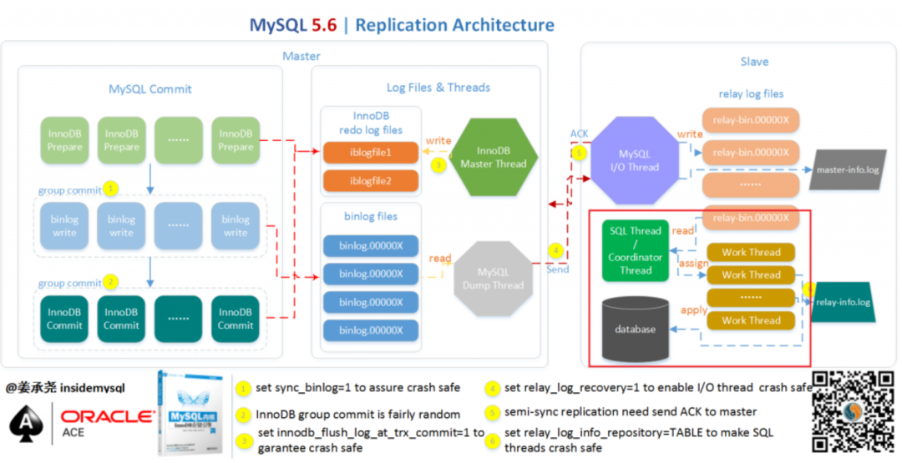
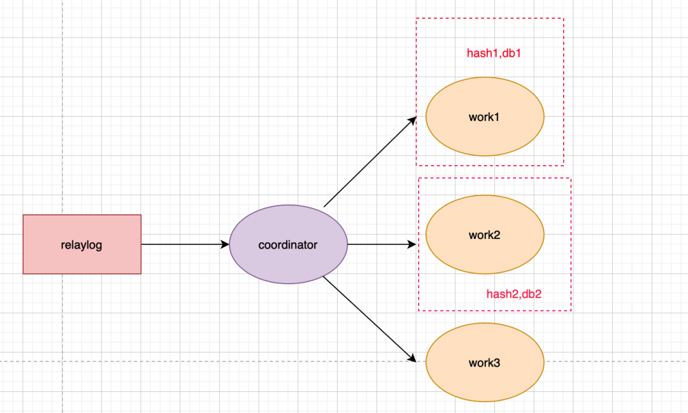

# 主从延迟

<!-- START doctoc generated TOC please keep comment here to allow auto update -->
<!-- DON'T EDIT THIS SECTION, INSTEAD RE-RUN doctoc TO UPDATE -->

- [零、开篇](#%E9%9B%B6%E5%BC%80%E7%AF%87)
- [一、binlog](#%E4%B8%80binlog)
    - [1. binlog是什么？有什么作用？](#1-binlog%E6%98%AF%E4%BB%80%E4%B9%88%E6%9C%89%E4%BB%80%E4%B9%88%E4%BD%9C%E7%94%A8)
    - [2. 日志格式](#2-%E6%97%A5%E5%BF%97%E6%A0%BC%E5%BC%8F)
- [二、主从复制原理](#%E4%BA%8C%E4%B8%BB%E4%BB%8E%E5%A4%8D%E5%88%B6%E5%8E%9F%E7%90%86)
    - [1. 基本过程总结](#1-%E5%9F%BA%E6%9C%AC%E8%BF%87%E7%A8%8B%E6%80%BB%E7%BB%93)
    - [2. 并行复制](#2-%E5%B9%B6%E8%A1%8C%E5%A4%8D%E5%88%B6)
    - [3. 按库并行](#3-%E6%8C%89%E5%BA%93%E5%B9%B6%E8%A1%8C)
- [三、主从延迟](#%E4%B8%89%E4%B8%BB%E4%BB%8E%E5%BB%B6%E8%BF%9F)
    - [1. 主从延迟介绍](#1-%E4%B8%BB%E4%BB%8E%E5%BB%B6%E8%BF%9F%E4%BB%8B%E7%BB%8D)
    - [2. 主从延迟原因](#2-%E4%B8%BB%E4%BB%8E%E5%BB%B6%E8%BF%9F%E5%8E%9F%E5%9B%A0)
    - [3. 怎么减少主从延迟](#3-%E6%80%8E%E4%B9%88%E5%87%8F%E5%B0%91%E4%B8%BB%E4%BB%8E%E5%BB%B6%E8%BF%9F)

<!-- END doctoc generated TOC please keep comment here to allow auto update -->

[TOC]

## 零、开篇

在实际的生产环境中，由单台MySQL作为独立的数据库是完全不能满足实际需求的，无论是在安全性，高可用性以及高并发等各个方面

因此，一般来说都是通过集群主从复制（Master-Slave）的方式来同步数据，再通过读写分离（MySQL-Proxy）来提升数据库的并发负载能力进行部署与实施

**总结MySQL主从集群带来的作用是：**

- 提高数据库负载能力，主库执行读写任务（增删改），备库仅做查询。
- 提高系统读写性能、可扩展性和高可用性。
- 数据备份与容灾，备库在异地，主库不存在了，备库可以立即接管，无须恢复时间。


说到主从复制，离不开binlog这个东西，先介绍下binlog吧

## 一、binlog

### 1. binlog是什么？有什么作用？

用于记录数据库执行的写入性操作(不包括查询)信息，以二进制的形式保存在磁盘中。可以简单理解为记录的就是sql语句

binlog 是 mysql 的逻辑日志，并且由 `Server`层进行记录，使用任何存储引擎的 mysql 数据库都会记录 binlog 日志

在实际应用中， binlog 的主要使用场景有两个：

- 用于主从复制，在主从结构中，binlog 作为操作记录从 master 被发送到 slave，slave服务器从 master 接收到的日志保存到 relay log 中。
- 用于数据备份，在数据库备份文件生成后，binlog保存了数据库备份后的详细信息，以便下一次备份能从备份点开始。

### 2. 日志格式

binlog 日志有三种格式，分别为 STATMENT 、 ROW 和 MIXED

在 MySQL 5.7.7 之前，默认的格式是 STATEMENT ， MySQL 5.7.7 之后，默认值是 ROW

日志格式通过 `binlog-format` 指定。

- STATMENT ：基于 SQL 语句的复制，每一条会修改数据的sql语句会记录到 binlog 中
- ROW ：基于行的复制
- MIXED ：基于 STATMENT 和 ROW 两种模式的混合复制，比如一般的数据操作使用 row 格式保存，有些表结构的变更语句，使用 statement 来记录

我们还可以通过mysql提供的查看工具mysqlbinlog查看文件中的内容，例如

```
mysqlbinlog mysql-bin.00001 | more
```

binlog文件大小和个数会不断的增加，后缀名会按序号递增，例如`mysql-bin.00002`等。

## 二、主从复制原理


可以看到mysql主从复制需要三个线程：**master（binlog dump thread）、slave（I/O thread 、SQL thread）**

- **binlog dump线程：** 主库中有数据更新时，根据设置的binlog格式，将更新的事件类型写入到主库的binlog文件中，并创建log dump线程通知slave有数据更新。当I/O线程请求日志内容时，将此时的binlog名称和当前更新的位置同时传给slave的I/O线程。
- **I/O线程：** 该线程会连接到master，向log dump线程请求一份指定binlog文件位置的副本，并将请求回来的binlog存到本地的relay log中。
- **SQL线程：** 该线程检测到relay log有更新后，会读取并在本地做redo操作，将发生在主库的事件在本地重新执行一遍，来保证主从数据同步。

### 1. 基本过程总结

1. 主库写入数据并且生成binlog文件。该过程中MySQL将事务串行的写入二进制日志，即使事务中的语句都是交叉执行的。
2. 在事件写入二进制日志完成后，master通知存储引擎提交事务。
3. 从库服务器上的IO线程连接Master服务器，请求从执行binlog日志文件中的指定位置开始读取binlog至从库。
4. 主库接收到从库的IO线程请求后，其上复制的IO线程会根据Slave的请求信息分批读取binlog文件然后返回给从库的IO线程。
5. Slave服务器的IO线程获取到Master服务器上IO线程发送的日志内容、日志文件及位置点后，会将binlog日志内容依次写到Slave端自身的Relay Log（即中继日志）文件的最末端，并将新的binlog文件名和位置记录到`master-info`文件中，以便下一次读取master端新binlog日志时能告诉Master服务器从新binlog日志的指定文件及位置开始读取新的binlog日志内容。
6. 从库服务器的SQL线程会实时监测到本地Relay Log中新增了日志内容，然后把RelayLog中的日志翻译成SQL并且按照顺序执行SQL来更新从库的数据。
7. 从库在`relay-log.info`中记录当前应用中继日志的文件名和位置点以便下一次数据复制。

### 2. 并行复制

在MySQL 5.6版本之前，Slave服务器上有两个线程I/O线程和SQL线程。

I/O线程负责接收二进制日志，SQL线程进行回放二进制日志。如果在MySQL 5.6版本开启并行复制功能，那么SQL线程就变为了coordinator线程(协调线程)，coordinator线程主要负责以前两部分的内容



**上图的红色框框部分就是实现并行复制的关键所在**

这意味着coordinator线程并不是仅将日志发送给worker线程，自己也可以回放日志，但是所有可以并行的操作交付由worker线程完成。

coordinator线程与worker是典型的生产者与消费者模型。

不过到MySQL 5.7才可称为真正的并行复制，这其中最为主要的原因就是slave服务器的回放与主机是一致的，即master服务器上是怎么并行执行的slave上就怎样进行并行回放。不再有库的并行复制限制，对于二进制日志格式也无特殊的要求。

为了兼容MySQL 5.6基于库的并行复制，5.7引入了新的变量`slave-parallel-type`，其可以配置的值有：

- DATABASE：默认值，基于库的并行复制方式
- LOGICAL_CLOCK：基于组提交的并行复制方式

下面分别介绍下两种并行复制方式。

### 3. 按库并行

每个 worker 线程对应一个 hash 表，用于保存当前正在这个worker的执行队列里的事务所涉及到的库。其中hash表里的key是数据库名，用于决定分发策略。该策略的优点是构建hash值快，只需要库名，同时对于binlog的格式没有要求。

但这个策略的效果，只有在主库上存在多个DB，且各个DB的压力均衡的情况下，这个策略效果好。因此，对于主库上的表都放在同一个DB或者不同DB的热点不同，则起不到多大效果



**组提交优化**

该特性如下：

1. 能够同一组里提交的事务，定不会修改同一行；
2. 主库上可以并行执行的事务，从库上也一定可以并行执行。

具体是如何实现的：

1. 在同一组里面一起提交的事务，会有一个相同的`commit_id`，下一组为`commit_id+1`，该`commit_id`会直接写到binlog中；
2. 在从库使用时，相同`commit_id`的事务会被分发到多个worker并行执行，直到这一组相同的`commit_id`执行结束后，coordinator再取下一批。

更详细内容可以去官网看看：https://dev.mysql.com/doc/refman/5.7/en/replication-options-slave.html

**下面开始介绍主从延时**

## 三、主从延迟

### 1. 主从延迟介绍

**主从延迟是怎么回事？**

根据前面主从复制的原理可以看出，两者之间是存在一定时间的数据不一致，也就是所谓的主从延迟。

我们来看下导致主从延迟的时间点：

- 主库 A 执行完成一个事务，写入 binlog，该时刻记为T1.
- 传给从库B，从库接受完这个binlog的时刻记为T2.
- 从库B执行完这个事务，该时刻记为T3.

那么所谓主从延迟，就是同一个事务，从库执行完成的时间和主库执行完成的时间之间的差值，即T3-T1。

我们也可以通过在从库执行`show slave status`，返回结果会显示`seconds_behind_master`，表示当前从库延迟了多少秒。

**seconds_behind_master如何计算的？**

- 每一个事务的binlog都有一个时间字段，用于记录主库上写入的时间
- 从库取出当前正在执行的事务的时间字段，跟当前系统的时间进行相减，得到的就是`seconds_behind_master`，也就是前面所描述的T3-T1。

### 2. 主从延迟原因

**为什么会主从延迟？**

正常情况下，如果网络不延迟，那么日志从主库传给从库的时间是相当短，所以T2-T1可以基本忽略。

最直接的影响就是从库消费中转日志（relaylog）的时间段，而造成原因一般是以下几种：

1、从库的机器性能比主库要差

> 比如将20台主库放在4台机器，把从库放在一台机器。这个时候进行更新操作，由于更新时会触发大量读操作，导致从库机器上的多个从库争夺资源，导致主从延迟。

不过，目前大部分部署都是采取主从使用相同规格的机器部署。

2、从库的压力大

> 按照正常的策略，读写分离，主库提供写能力，从库提供读能力。将进行大量查询放在从库上，结果导致从库上耗费了大量的CPU资源，进而影响了同步速度，造成主从延迟。

对于这种情况，可以通过一主多从，分担读压力；也可以采取binlog输出到外部系统，比如Hadoop，让外部系统提供查询能力。

3、大事务的执行

> 一旦执行大事务，那么主库必须要等到事务完成之后才会写入binlog。
>
> 比如主库执行了一条insert … select非常大的插入操作，该操作产生了近几百G的binlog文件传输到只读节点，进而导致了只读节点出现应用binlog延迟。

因此，DBA经常会提醒开发，不要一次性地试用delete语句删除大量数据，尽可能控制数量，分批进行。

4、主库的DDL(alter、drop、create)

> 1、只读节点与主库的DDL同步是串行进行，如果DDL操作在主库执行时间很长，那么从库也会消耗同样的时间，比如在主库对一张500W的表添加一个字段耗费了10分钟，那么从节点上也会耗费10分钟。
>
> 2、从节点上有一个执行时间非常长的的查询正在执行，那么这个查询会堵塞来自主库的DDL，表被锁，直到查询结束为止，进而导致了从节点的数据延迟。

5、锁冲突

> 锁冲突问题也可能导致从节点的SQL线程执行慢，比如从机上有一些select .... for update的SQL，或者使用了MyISAM引擎等。

6、从库的复制能力

> 一般场景中，因偶然情况导致从库延迟了几分钟，都会在从库恢复之后追上主库。但若是从库执行速度低于主库，且主库持续具有压力，就会导致长时间主从延迟，很有可能就是从库复制能力的问题。

从库上的执行，即`sql_thread`更新逻辑，在5.6版本之前，是只支持单线程，那么在主库并发高、TPS高时，就会出现较大的主从延迟。

因此，MySQL自5.7版本后就已经支持并行复制了。可以在从服务上设置 `slave_parallel_workers`为一个大于0的数，然后把`slave_parallel_type`参数设置为`LOGICAL_CLOCK`，这就可以了

```
mysql> show variables like 'slave_parallel%';
+------------------------+----------+
| Variable_name          | Value    |
+------------------------+----------+
| slave_parallel_type    | DATABASE |
| slave_parallel_workers | 0        |
+------------------------+----------+
```

### 3. 怎么减少主从延迟

主从同步问题永远都是一致性和性能的权衡，得看实际的应用场景，若想要减少主从延迟的时间，可以采取下面的办法：

1. 降低多线程大事务并发的概率，优化业务逻辑
2. 优化SQL，避免慢SQL，减少批量操作，建议写脚本以update-sleep这样的形式完成。
3. 提高从库机器的配置，减少主库写binlog和从库读binlog的效率差。
4. 尽量采用短的链路，也就是主库和从库服务器的距离尽量要短，提升端口带宽，减少binlog传输的网络延时。
5. 实时性要求的业务读强制走主库，从库只做灾备，备份。

