# 攻克order_by

<!-- START doctoc generated TOC please keep comment here to allow auto update -->
<!-- DON'T EDIT THIS SECTION, INSTEAD RE-RUN doctoc TO UPDATE -->

- [零、开篇](#%E9%9B%B6%E5%BC%80%E7%AF%87)
- [一、一个使用order by 的简单例子](#%E4%B8%80%E4%B8%80%E4%B8%AA%E4%BD%BF%E7%94%A8order-by-%E7%9A%84%E7%AE%80%E5%8D%95%E4%BE%8B%E5%AD%90)
- [二、order by 工作原理](#%E4%BA%8Corder-by-%E5%B7%A5%E4%BD%9C%E5%8E%9F%E7%90%86)
    - [1. explain 执行计划](#1-explain-%E6%89%A7%E8%A1%8C%E8%AE%A1%E5%88%92)
    - [2. 全字段排序](#2-%E5%85%A8%E5%AD%97%E6%AE%B5%E6%8E%92%E5%BA%8F)
    - [3 .磁盘临时文件辅助排序](#3-%E7%A3%81%E7%9B%98%E4%B8%B4%E6%97%B6%E6%96%87%E4%BB%B6%E8%BE%85%E5%8A%A9%E6%8E%92%E5%BA%8F)
    - [4. rowid 排序](#4-rowid-%E6%8E%92%E5%BA%8F)
    - [5. 全字段排序与rowid排序对比](#5-%E5%85%A8%E5%AD%97%E6%AE%B5%E6%8E%92%E5%BA%8F%E4%B8%8Erowid%E6%8E%92%E5%BA%8F%E5%AF%B9%E6%AF%94)
- [三、order by的一些优化思路](#%E4%B8%89order-by%E7%9A%84%E4%B8%80%E4%BA%9B%E4%BC%98%E5%8C%96%E6%80%9D%E8%B7%AF)
    - [1. 联合索引优化](#1-%E8%81%94%E5%90%88%E7%B4%A2%E5%BC%95%E4%BC%98%E5%8C%96)
    - [2. 调整参数优化](#2-%E8%B0%83%E6%95%B4%E5%8F%82%E6%95%B0%E4%BC%98%E5%8C%96)
- [四、使用order by 的一些注意点](#%E5%9B%9B%E4%BD%BF%E7%94%A8order-by-%E7%9A%84%E4%B8%80%E4%BA%9B%E6%B3%A8%E6%84%8F%E7%82%B9)
    - [1. 没有where条件，order by字段需要加索引吗](#1-%E6%B2%A1%E6%9C%89where%E6%9D%A1%E4%BB%B6order-by%E5%AD%97%E6%AE%B5%E9%9C%80%E8%A6%81%E5%8A%A0%E7%B4%A2%E5%BC%95%E5%90%97)
    - [2. 分页limit过大时，会导致大量排序怎么办?](#2-%E5%88%86%E9%A1%B5limit%E8%BF%87%E5%A4%A7%E6%97%B6%E4%BC%9A%E5%AF%BC%E8%87%B4%E5%A4%A7%E9%87%8F%E6%8E%92%E5%BA%8F%E6%80%8E%E4%B9%88%E5%8A%9E)
    - [3. 索引存储顺序与order by不一致，如何优化？](#3-%E7%B4%A2%E5%BC%95%E5%AD%98%E5%82%A8%E9%A1%BA%E5%BA%8F%E4%B8%8Eorder-by%E4%B8%8D%E4%B8%80%E8%87%B4%E5%A6%82%E4%BD%95%E4%BC%98%E5%8C%96)
    - [4. 使用了in条件多个属性时，SQL执行是否有排序过程](#4-%E4%BD%BF%E7%94%A8%E4%BA%86in%E6%9D%A1%E4%BB%B6%E5%A4%9A%E4%B8%AA%E5%B1%9E%E6%80%A7%E6%97%B6sql%E6%89%A7%E8%A1%8C%E6%98%AF%E5%90%A6%E6%9C%89%E6%8E%92%E5%BA%8F%E8%BF%87%E7%A8%8B)

<!-- END doctoc generated TOC please keep comment here to allow auto update -->

[TOC]

## 零、开篇

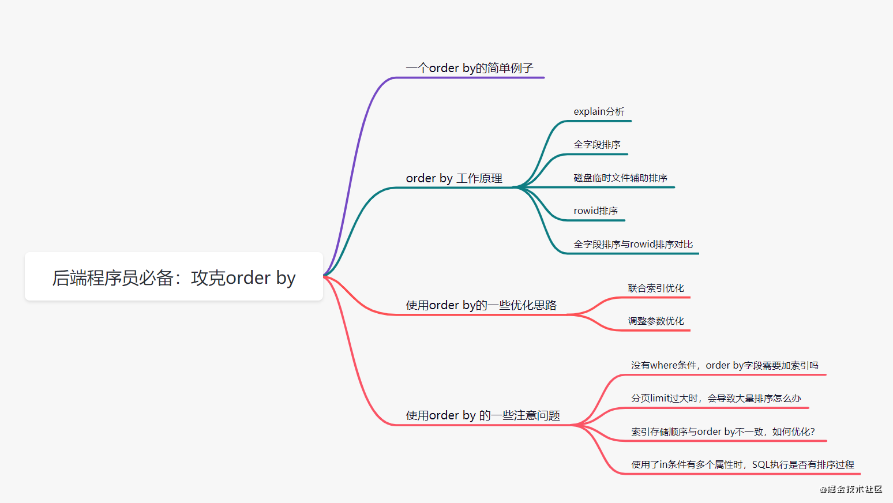

## 一、一个使用order by 的简单例子

假设用一张员工表，表结构如下：

```sql
CREATE TABLE `staff` (
`id` BIGINT ( 11 ) AUTO_INCREMENT COMMENT '主键id',
`id_card` VARCHAR ( 20 ) NOT NULL COMMENT '身份证号码',
`name` VARCHAR ( 64 ) NOT NULL COMMENT '姓名',
`age` INT ( 4 ) NOT NULL COMMENT '年龄',
`city` VARCHAR ( 64 ) NOT NULL COMMENT '城市',
PRIMARY KEY ( `id`),
INDEX idx_city ( `city` )
) ENGINE = INNODB COMMENT '员工表';
```

表数据如下：

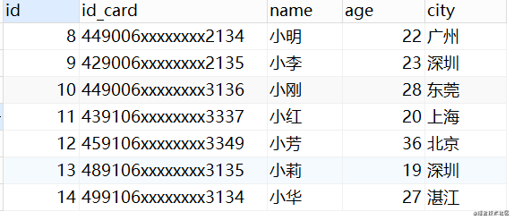

我们现在有这么一个需求：**查询前10个，来自深圳员工的姓名、年龄、城市，并且按照年龄小到大排序**。对应的 SQL 语句就可以这么写：

```sql
select name,age,city from staff where city = '深圳' order by age limit 10;
```

这条语句的逻辑很清楚，但是它的**底层执行流程**是怎样的呢？

## 二、order by 工作原理

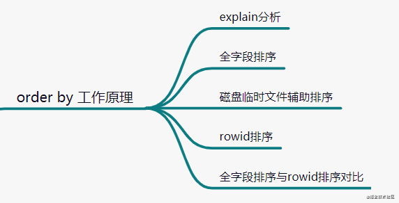

### 1. explain 执行计划

我们先用**Explain**关键字查看一下执行计划：

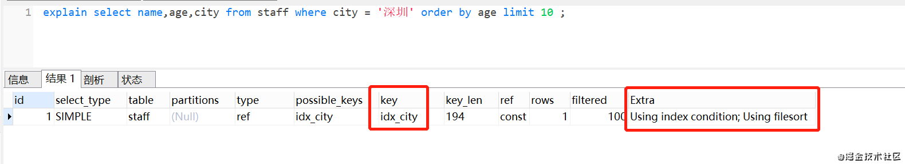

- 执行计划的**key**这个字段，表示使用到索引idx_city
- Extra 这个字段的 **Using index condition** 表示索引条件
- Extra 这个字段的 **Using filesort**表示用到排序

我们可以发现，这条SQL使用到了索引，并且也用到排序。那么它是**怎么排序**的呢？

### 2. 全字段排序

MySQL 会给每个查询线程分配一块小**内存**，用于**排序**的，称为 **sort_buffer**。什么时候把字段放进去排序呢，其实是通过`idx_city`索引找到对应的数据，才把数据放进去啦。

我们回顾下索引是怎么找到匹配的数据的，现在先把索引树画出来吧，**idx_city**索引树如下：

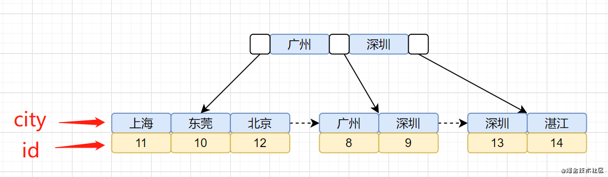

idx_city索引树，叶子节点存储的是**主键id**。 还有一棵id主键聚族索引树，我们再画出聚族索引树图吧：

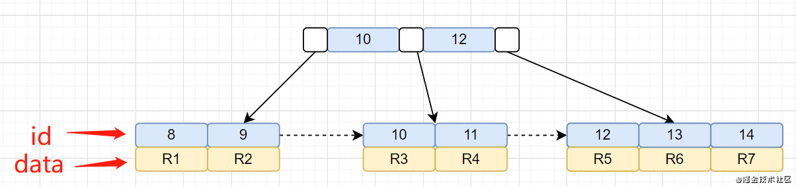

**我们的查询语句是怎么找到匹配数据的呢**？先通过**idx_city**索引树，找到对应的主键id，然后再通过拿到的主键id，搜索**id主键索引树**，找到对应的行数据。

加上**order by**之后，整体的执行流程就是：

1. MySQL 为对应的线程初始化**sort_buffer**，放入需要查询的name、age、city字段；
2. 从**索引树idx_city**， 找到第一个满足 city='深圳’条件的主键 id，也就是图中的id=9；
3. 到**主键 id 索引树**拿到id=9的这一行数据， 取name、age、city三个字段的值，存到sort_buffer；
4. 从**索引树idx_city** 拿到下一个记录的主键 id，即图中的id=13；
5. 重复步骤 2、3、4 直到**city的值不等于深圳**为止；
6. 前面5步已经查找到了所有**city为深圳**的数据，在 sort_buffer中，将所有数据根据age进行排序；
7. 按照排序结果取前10行返回给客户端。

执行示意图如下：

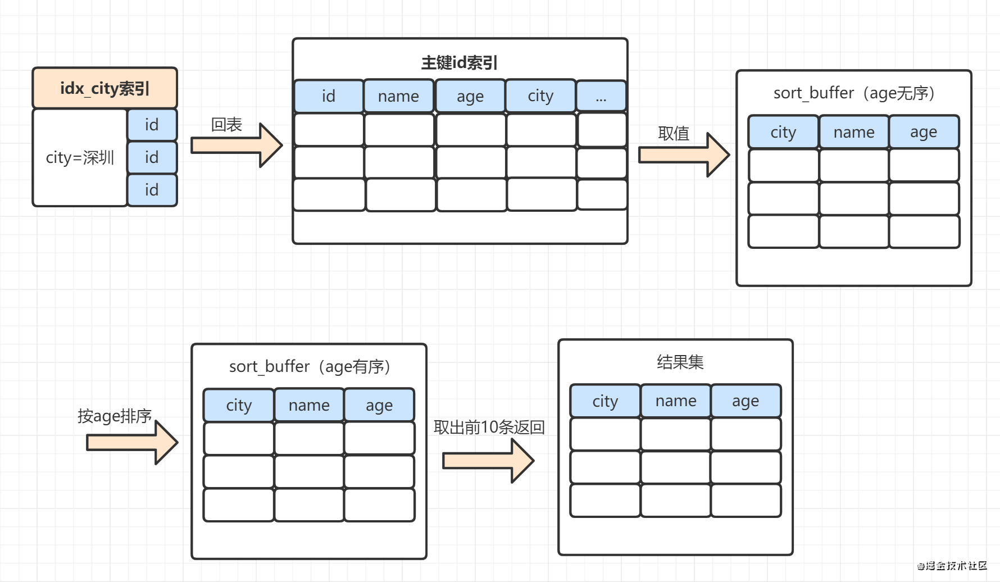

将查询所需的字段全部读取到sort_buffer中，就是**全字段排序**。这里面，有些小伙伴可能会有个疑问,把查询的所有字段都放到sort_buffer，而sort_buffer是一块内存来的，如果数据量太大，sort_buffer放不下怎么办呢？

### 3 .磁盘临时文件辅助排序

实际上，sort_buffer的大小是由一个参数控制的：**sort_buffer_size**。如果要排序的数据小于sort_buffer_size，排序在**sort_buffer** 内存中完成，如果要排序的数据大于sort_buffer_size，则**借助磁盘文件来进行排序**

如何确定是否使用了磁盘文件来进行排序呢？ 可以使用以下这几个命令

```sql
## 打开optimizer_trace，开启统计
set optimizer_trace = "enabled=on";
## 执行SQL语句
select name,age,city from staff where city = '深圳' order by age limit 10;
## 查询输出的统计信息
select * from information_schema.optimizer_trace 
```

可以从 **number_of_tmp_files** 中看出，是否使用了临时文件。

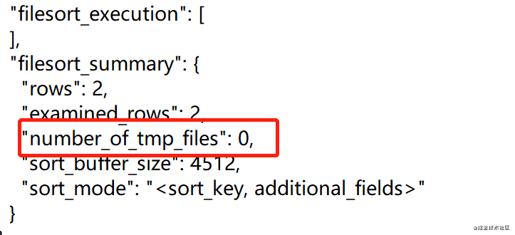

**number_of_tmp_files** 表示使用来排序的磁盘临时文件数。如果number_of_tmp_files>0，则表示使用了磁盘文件来进行排序。

使用了磁盘临时文件，整个排序过程又是怎样的呢？

1. 从**主键Id索引树**，拿到需要的数据，并放到**sort_buffer内存**块中。当sort_buffer快要满时，就对sort_buffer中的数据排序，排完后，把数据临时放到磁盘一个小文件中。
2. 继续回到主键 id 索引树取数据，继续放到sort_buffer内存中，排序后，也把这些数据写入到磁盘临时小文件中。
3. 继续循环，直到取出所有满足条件的数据。最后把磁盘的临时排好序的小文件，合并成一个有序的大文件。

**TPS:** 借助磁盘临时小文件排序，实际上使用的是**归并排序**算法。

小伙伴们可能会有个疑问，既然**sort_buffer**放不下，就需要用到临时磁盘文件，这会影响排序效率。那为什么还要把排序不相关的字段（name，city）放到sort_buffer中呢？只放排序相关的age字段，它**不香**吗？ 可以了解下**rowid 排序**。

### 4. rowid 排序

rowid 排序就是，只把查询SQL**需要用于排序的字段和主键id**，放到sort_buffer中。那怎么确定走的是全字段排序还是rowid 排序排序呢？

实际上有个参数控制的。这个参数就是**max_length_for_sort_data**，它表示MySQL用于排序行数据的长度的一个参数，如果单行的长度超过这个值，MySQL 就认为单行太大，就换rowid 排序。我们可以通过命令看下这个参数取值。

```sql
show variables like 'max_length_for_sort_data';
```

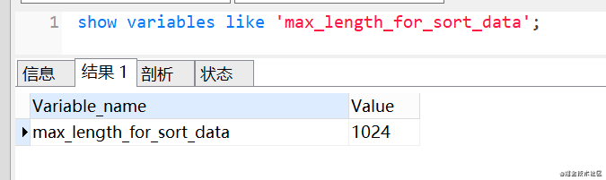

**max_length_for_sort_data** 默认值是1024。因为本文示例中name,age,city长度=64+4+64 =132 < 1024, 所以走的是全字段排序。我们来改下这个参数，改小一点，

```sql
## 修改排序数据最大单行长度为32
set max_length_for_sort_data = 32;
## 执行查询SQL
select name,age,city from staff where city = '深圳' order by age limit 10;
```

使用rowid 排序的话，整个SQL执行流程又是怎样的呢？

1. MySQL 为对应的线程初始化**sort_buffer**，放入需要排序的age字段，以及主键id；
2. 从**索引树idx_city**， 找到第一个满足 city='深圳’条件的主键 id，也就是图中的id=9；
3. 到**主键 id 索引树**拿到id=9的这一行数据， 取age和主键id的值，存到sort_buffer；
4. 从**索引树idx_city** 拿到下一个记录的主键 id，即图中的id=13；
5. 重复步骤 2、3、4 直到**city的值不等于深圳**为止；
6. 前面5步已经查找到了所有city为深圳的数据，在 **sort_buffer**中，将所有数据根据age进行排序；
7. 遍历排序结果，取前10行，并按照 id 的值**回到原表**中，取出city、name 和 age 三个字段返回给客户端。

执行示意图如下：

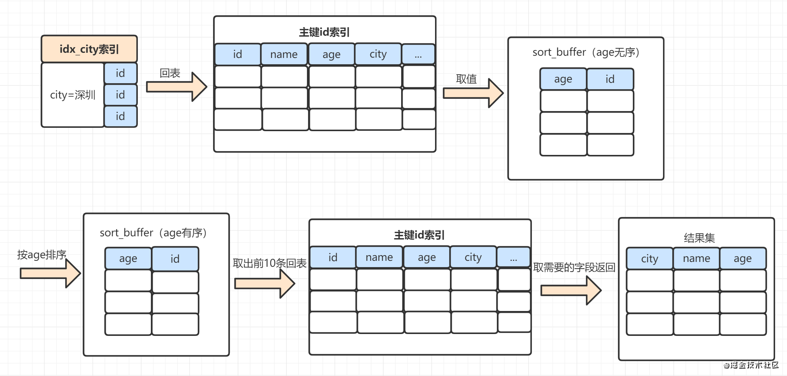

对比一下**全字段排序**的流程，rowid 排序多了一次**回表**。

> 什么是回表？拿到主键再回到主键索引查询的过程，就叫做回表

我们通过**optimizer_trace**，可以看到是否使用了rowid排序的：

```
## 打开optimizer_trace，开启统计
set optimizer_trace = "enabled=on";
## 执行SQL语句
select name,age,city from staff where city = '深圳' order by age limit 10;
## 查询输出的统计信息
select * from information_schema.optimizer_trace 
```

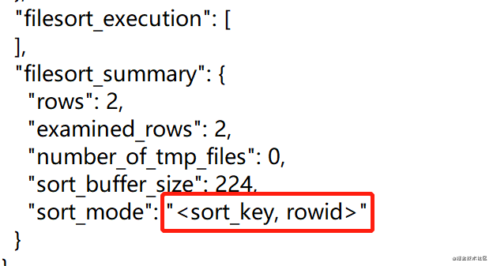

### 5. 全字段排序与rowid排序对比

- 全字段排序： sort_buffer内存不够的话，就需要用到磁盘临时文件，造成**磁盘访问**。
- rowid排序： sort_buffer可以放更多数据，但是需要再回到原表去取数据，比全字段排序多一次**回表**。

一般情况下，对于InnoDB存储引擎，会优先使**用全字段**排序。可以发现 **max_length_for_sort_data** 参数设置为1024，这个数比较大的。一般情况下，排序字段不会超过这个值，也就是都会走**全字段**排序。

## 三、order by的一些优化思路

我们如何优化order by语句呢？

- 因为数据是无序的，所以就需要排序。如果数据本身是有序的，那就不用排了。而索引数据本身是有序的，我们通过建立**联合索引**，优化order by 语句。
- 我们还可以通过调整**max_length_for_sort_data**等参数优化；

### 1. 联合索引优化

再回顾下示例SQL的查询计划：

```sql
explain select name,age,city from staff where city = '深圳' order by age limit 10;
```

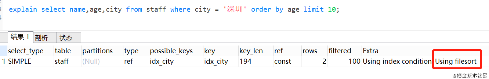

我们给查询条件`city`和排序字段`age`，加个联合索引**idx_city_age**。再去查看执行计划：

```sql
alter table staff add  index idx_city_age(city,age);
explain select name,age,city from staff where city = '深圳' order by age limit 10;
```

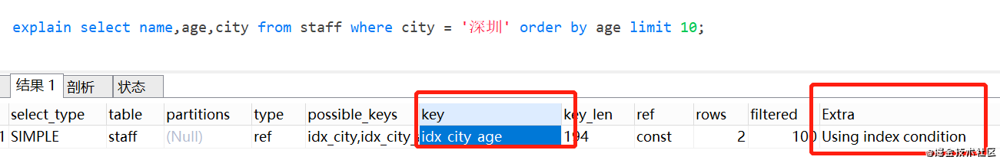

整个SQL执行流程变成酱紫：

1. 从索引idx_city_age找到满足**city='深圳’** 的主键 id
2. 到**主键 id索引**取出整行，拿到 name、city、age 三个字段的值，作为结果集的一部分直接返回
3. 从索引**idx_city_age**取下一个记录主键id
4. 重复步骤1、 2、3，直到查到**第10条**记录，或者是**不满足city='深圳’** 条件时循环结束。

流程示意图如下：

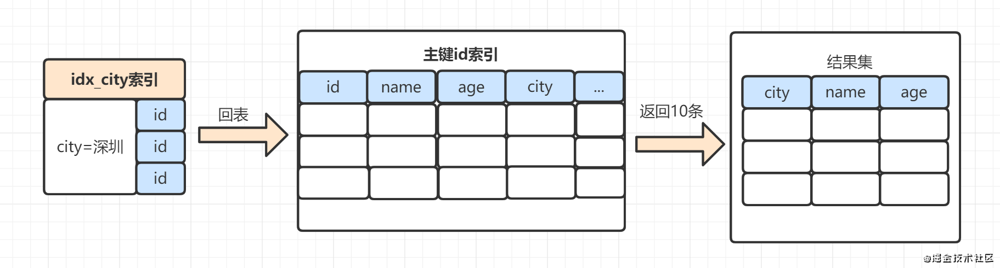

从示意图看来，还是有一次回表操作。针对本次示例，有没有更高效的方案呢？有的，可以使用**覆盖索引**：

> 覆盖索引：在查询的数据列里面，不需要回表去查，直接从索引列就能取到想要的结果。换句话说，你SQL用到的索引列数据，覆盖了查询结果的列，就算上覆盖索引了。

我们给city，name，age 组成一个联合索引，即可用到了覆盖索引，这时候SQL执行时，连回表操作都可以省去啦。

### 2. 调整参数优化

我们还可以通过调整参数，去优化order by的执行。比如可以调整sort_buffer_size的值。因为sort_buffer值太小，数据量大的话，会借助磁盘临时文件排序。如果MySQL服务器配置高的话，可以使用稍微调整大点。

我们还可以调整max_length_for_sort_data的值，这个值太小的话，order by会走rowid排序，会回表，降低查询性能。所以max_length_for_sort_data可以适当大一点。

当然，很多时候，这些MySQL参数值，我们直接采用默认值就可以了。

## 四、使用order by 的一些注意点

### 1. 没有where条件，order by字段需要加索引吗

日常开发过程中，我们可能会遇到没有where条件的order by，那么，这时候order by后面的字段是否需要加索引呢。如有这么一个SQL，create_time是否需要加索引：

```sql
select * from A order by create_time;
```

无条件查询的话，即使create_time上有索引,也不会使用到。因为MySQL优化器认为走普通二级索引，再去回表成本比全表扫描排序更高。所以选择走全表扫描,然后根据全字段排序或者rowid排序来进行。

无条件查询的话，即使create_time上有索引,也不会使用到。因为MySQL优化器认为走普通二级索引，再去回表成本比全表扫描排序更高。所以选择走全表扫描,然后根据全字段排序或者rowid排序来进行。

如果查询SQL修改一下：

```sql
select * from A order by create_time limit m;
```

- 无条件查询，如果m值较小，是可以走索引的。因为MySQL优化器认为，根据索引有序性去回表查数据,然后得到m条数据,就可以终止循环,那么成本比全表扫描小,则选择走二级索引。

### 2. 分页limit过大时，会导致大量排序怎么办?

假设SQL如下：

```sql
select * from A order by a limit 100000,10
```

- 可以记录上一页最后的id，下一页查询时，查询条件带上id，如： where id > 上一页最后id limit 10。
- 也可以在业务允许的情况下，限制页数。

### 3. 索引存储顺序与order by不一致，如何优化？

假设有联合索引 idx_name_age，我们需求修改为这样：**查询前10个员工的姓名、年龄，并且按照年龄小到大排序，如果年龄相同，则按姓名降序排**。对应的 SQL 语句就可以这么写：

```sql
select name,age from staff order by age ,name desc limit 10
```

我们看下执行计划，发现使用到**Using filesort**：

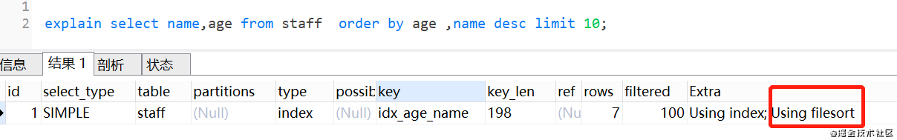

这是因为，idx_name_age索引树中，name从小到大排序，如果**name相同，再按age从小到大排序**。而order by 中，是按age从小到大排序，如果**age相同，再按name从大到小排序**。也就是说，索引存储顺序与order by不一致。

我们怎么优化呢？如果MySQL是8.0版本，支持**Descending Indexes**，可以这样修改索引：

```sql
CREATE TABLE `staff` (
  `id` bigint(11) NOT NULL AUTO_INCREMENT COMMENT '主键id',
  `id_card` varchar(20) NOT NULL COMMENT '身份证号码',
  `name` varchar(64) NOT NULL COMMENT '姓名',
  `age` int(4) NOT NULL COMMENT '年龄',
  `city` varchar(64) NOT NULL COMMENT '城市',
  PRIMARY KEY (`id`),
  KEY `idx_age_name` (`age`,`name` desc) USING BTREE
) ENGINE=InnoDB AUTO_INCREMENT=15 DEFAULT CHARSET=utf8 COMMENT='员工表';
```

### 4. 使用了in条件多个属性时，SQL执行是否有排序过程

如果我们有**联合索引idx_city_name**，执行这个SQL的话，是不会走排序过程的，如下：

```sql
select * from staff where city in ('深圳') order by age limit 10;
```

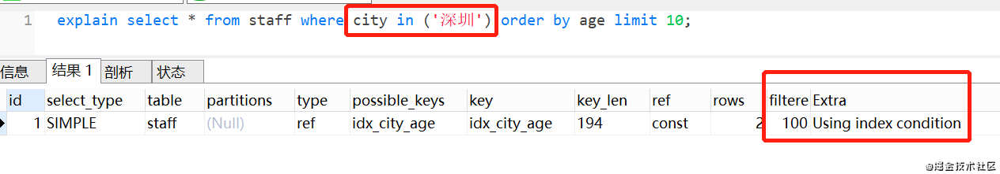

但是，如果使用in条件，并且有多个条件时，就会有排序过程。

```
 explain select * from staff where city in ('深圳','上海') order by age limit 10;
```

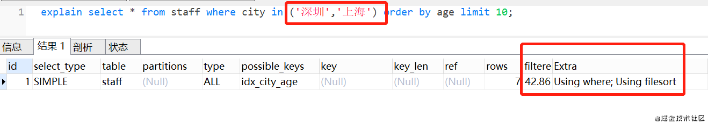

这是因为：in有两个条件，在满足深圳时，age是排好序的，但是把满足上海的age也加进来，就不能保证满足所有的age都是排好序的。因此需要Using filesort。

