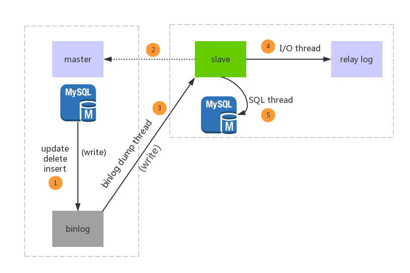
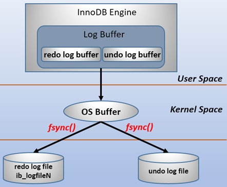
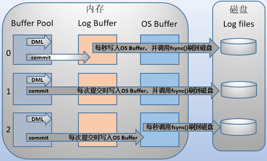

# MySQL 知识点

目录
+ [主从复制](#主从复制)
+ [redo-log和undo-log](#redo-log和undo-log)
  - [redo-log](#redo-log)

## 主从复制

### 为什么要主从复制
1. 可以为读写分离提供支持；
2. 做数据的热备，主库宕机后能够及时替换主库，保证业务可用性；
3. ... 自己补充吧

### 主从复制是啥
MySQL 主从复制是指数据可以从一个MySQL数据库服务器主节点复制到一个或多个从节点。

### 主从复制原理
1. 数据库有个 binlog 二进制文件，记录所有更新事件(update、insert、delete)；
2. 我们的目标就是把主数据库的 binlog 文件的更新事件复制过来；
3. 让其在从数据库的 relay log 中继日志文件中再执行一次这些更新即可；
4. 具体需要三个线程来操作：
  - binlog输出线程：用于将 binlog 推送到从库；
  - 从库I/O线程：该线程连接到主库并请求主库发送 binlog 里面的更新记录到从库上；从库I/O线程读取主库的 binlog 输出线程发送的更新并拷贝这些更新到本地文件 relay log；
  - 从库的SQL线程：这个线程读取从库I/O线程写到 relay log 的更新事件并执行。

### 主从复制流程
上图！  
  

1. 主库的更新事件被写到binlog；
2. 从库启动并发起连接，连接到主库
3. 主库创建一个 binlog dump thread，把 binlog 推送的从库；
4. 从库启动后，创建一个I/O线程，把从主库传过来的 binlog 写到 relay log；
5. 创建一个SQL线程，从 relay log 里面读取内容，从 Exec_Master_Log_Pos 位置开始执行读取到的更新事件，将更新内容写入到slave的db

## redo-log和undo-log
这两个log都是为MySQL innodb的事务提供支持的，redo log 是重做日志，提供前滚操作，undo log 是回滚日志，提供回滚操作。  

**undo log并不是redo log的逆向过程！！！**  
1. redo log 通常是物理日志，记录的数据页的物理修改，而不是某一行或几行修改成怎样，它用来恢复提交后的数据页；
2. undo用来回滚行记录到某个版本。undo log一般是逻辑日志，根据每行记录进行记录。

### redo-log

#### 基本概念
redo log包括两部分：内存中的日志缓存(redo log buffer)，该部分日志是易失性的；磁盘上的重做日志文件(redo log file)，该部分日志是持久的。

在概念上，innodb通过force log at commit机制实现事务的持久性，即在事务提交的时候，必须先将该事务的所有事务日志写入到磁盘上的redo log file和undo log file中进行持久化。

为了确保每次日志都能写入到事务日志文件中，在每次将log buffer中的日志写入日志文件的过程中都会调用一次操作系统的fsync操作(即fsync()系统调用)。因为MySQL是工作在用户空间的，MySQL的log buffer处于用户空间的内存中。要写入到磁盘上的log file中(redo:ib_logfileN文件,undo:share tablespace或.ibd文件)，中间还要经过操作系统内核空间的os buffer，调用fsync()的作用就是将OS buffer中的日志刷到磁盘上的log file中。也就是说，要从redo log buffer写日志到磁盘的redo log file中：  
  

> 一般所说的log file并不是磁盘上的物理日志文件，而是操作系统缓存中的log file，官方手册上的意思也是如此。  
> 所以在本文后续内容中都以os buffer或者file system buffer来表示官方手册中所说的Log file，然后log file则表示磁盘上的物理日志文件，即log file on disk。  
> 看不懂了吧，爷也不懂，凎。。。

MySQL支持用户自定义在commit时如何将log buffer中的日志刷log file中，可通过一个变量（innodb_flush_log_at_trx_commit 的值）来控制 —— 0、1、2，默认为1：
- 1：事务每次提交都会将log buffer中的日志写入os buffer并调用fsync()刷到log file on disk中；数据安全性最高，但IO的性能较差，因为每次都要写入磁盘；
- 0：事务提交时不会将log buffer中日志写入到os buffer，而是每秒写入os buffer并调用fsync()写入到log file on disk中；
- 2：每次提交都仅写入到os buffer，然后是每秒调用fsync()将os buffer中的日志写入到log file on disk。

图来！  
  

注意，**这个变量只是控制commit动作是否刷新log buffer到磁盘。**

#### 日志块 log block
innodb存储引擎中，redi log 以块为单位存储，每个块占512字节，这称为redo log block。所以不管是log buffer中还是os buffer中以及redo log file on disk中，都是这样以512字节的块存储的。

每个redo log block由3部分组成：**日志块头**、**日志块尾**和**日志主体**，其中日志块头占用12字节，日志块尾占用8字节，所以每个redo log block的日志主体部分只有512-12-8=492字节。

因为redo log记录的是数据页的变化，当一个数据页产生的变化需要使用超过492字节的redo log来记录，那么就会使用多个redo log block来记录该数据页的变化。

#### 日志刷盘的规则
log buffer中未刷到磁盘的日志称为脏日志(dirty log)。

在上面的说过，默认情况下事务每次提交的时候都会刷事务日志到磁盘中，这是因为变量 innodb_flush_log_at_trx_commit 的值为1。但是innodb不仅仅只会在有commit动作后才会刷日志到磁盘，这只是innodb存储引擎刷日志的规则之一。

刷日志到磁盘有以下几种规则：
1. 发出commit动作时，commit发出后是否刷日志由变量 innodb_flush_log_at_trx_commit 控制；
2. 每秒刷一次。这个刷日志的频率由变量 innodb_flush_log_at_timeout 值决定，默认是1秒。要注意，这个刷日志频率和commit动作无关；
3. 当log buffer中已经使用的内存超过一半时；
4. 当有checkpoint时，[checkpoint](#checkpoint)在一定程度上代表了刷到磁盘时日志所处的[LSN](#LSN)位置。

---

**接下来将进入彻底懵逼模式，需要时间再补充**

---

#### 数据页刷盘的规则及checkpoint
内存中(buffer pool)未刷到磁盘的数据称为脏数据(dirty data)。由于数据和日志都以页的形式存在，所以脏页表示脏数据和脏日志。

上一节介绍了日志是何时刷到磁盘的，不仅仅是日志需要刷盘，脏数据页也一样需要刷盘。

在innodb中，数据刷盘的规则只有一个：checkpoint。但是触发checkpoint的情况却有几种。不管怎样，checkpoint触发后，会将buffer中脏数据页和脏日志页都刷到磁盘。

innodb存储引擎中checkpoint分为两种：
1. sharp checkpoint：在重用redo log文件(例如切换日志文件)的时候，将所有已记录到redo log中对应的脏数据刷到磁盘；
2. fuzzy checkpoint：一次只刷一小部分的日志到磁盘，而非将所有脏日志刷盘。有以下几种情况会触发该检查点：
  - master thread checkpoint：由master线程控制，每秒或每10秒刷入一定比例的脏页到磁盘；
  - flush_lru_list checkpoint：从MySQL5.6开始可通过 innodb_page_cleaners 变量指定专门负责脏页刷盘的page cleaner线程的个数，该线程的目的是为了保证lru列表有可用的空闲页
  - async/sync flush checkpoint：同步刷盘还是异步刷盘。例如还有非常多的脏页没刷到磁盘(非常多是多少，有比例控制)，这时候会选择同步刷到磁盘，但这很少出现；如果脏页不是很多，可以选择异步刷到磁盘，如果脏页很少，可以暂时不刷脏页到磁盘；
  - dirty page too much checkpoint：脏页太多时强制触发检查点，目的是为了保证缓存有足够的空闲空间。too much的比例由变量 innodb_max_dirty_pages_pct 控制，MySQL 5.6默认的值为75，即当脏页占缓冲池的百分之75后，就强制刷一部分脏页到磁盘

由于刷脏页需要一定的时间来完成，所以记录检查点的位置是在每次刷盘结束之后才在redo log中标记的。

#### LSN
TODO

