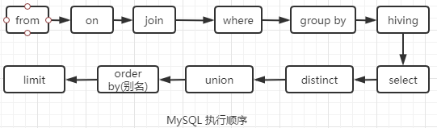

# 面试题

### MySQL索引使用有哪些注意事项呢？
可以从这两个维度回答这个问题：索引哪些情况会失效，索引不适合哪些场景

#### 索引哪些情况会失效
- 查询条件包含or，可能导致索引失效
- 如果字段类型是字符串，where时一定用引号括起来，否则索引失效
- like通配符可能导致索引失效
- 联合索引，查询时的条件列不是联合索引中的第一个列，索引失效
- 在索引列上使用mysql的内置函数，索引失效
- 对索引列运算（如，+、-、*、/），索引失效
- 索引字段上使用（！= 或者 < >，not in）时，可能会导致索引失效
- 索引字段上使用is null， is not null，可能导致索引失效
- 左连接查询或者右连接查询查询关联的字段编码格式不一样，可能导致索引失效
- mysql估计使用全表扫描要比使用索引快,则不使用索引

#### 索引不适合哪些场景
- 数据量少的不适合加索引
- 更新比较频繁的也不适合加索引
- 区分度低的字段不适合加索引（如性别）

### MySQL遇到过死锁问题吗，你是如何解决的？
排查死锁的一般步骤是酱紫的：
1. 查看死锁日志show engine innodb status
2. 找出死锁SQL
3. 分析SQL加锁情况
4. 模拟死锁案发
5. 分析死锁日志
6. 分析死锁结果

### 日常工作中你是怎么优化SQL的？
可以从这几个维度回答这个问题：
1. 加索引
2. 避免返回不必要的数据
3. 适当分批量进行
4. 优化sql结构
5. 分库分表
6. 读写分离

### InnoDB与MyISAM的区别
- InnoDB支持事务，MyISAM不支持事务
- InnoDB支持外键，MyISAM不支持外键
- InnoDB 支持 MVCC(多版本并发控制)，MyISAM 不支持
- select count(*) from table时，MyISAM更快，因为它有一个变量保存了整个表的总行数，可以直接读取，InnoDB就需要全表扫描。
- Innodb不支持全文索引，而MyISAM支持全文索引（5.7以后的InnoDB也支持全文索引）
- InnoDB支持表、行级锁，而MyISAM支持表级锁
- InnoDB表必须有主键，而MyISAM可以没有主键
- Innodb表需要更多的内存和存储，而MyISAM可被压缩，存储空间较小
- Innodb按主键大小有序插入，MyISAM记录插入顺序是，按记录插入顺序保存。
- InnoDB 存储引擎提供了具有提交、回滚、崩溃恢复能力的事务安全，与 MyISAM 比 InnoDB 写的效率差一些，并且会占用更多的磁盘空间以保留数据和索引

### 聚集索引与非聚集索引的区别
- 一个表中只能拥有一个聚集索引，而非聚集索引一个表可以存在多个
- 聚集索引，索引中键值的逻辑顺序决定了表中相应行的物理顺序；非聚集索引，索引中索引的逻辑顺序与磁盘上的行物理存储顺序不同
- 索引是通过二叉树的数据结构来描述的，我们可以这么理解聚簇索引：索引的叶节点就是数据节点。而非聚簇索引的叶节点仍然是索引节点，只不过有一个指针指向对应的数据块

聚集索引：物理存储按照索引排序  
非聚集索引：物理存储不按照索引排序；

### limit 1000000加载很慢的话，你是怎么解决的呢？
**方案一**  
如果id是连续的，可以这样，返回上次查询的最大记录(偏移量)，再往下limit  
`select id,name from employee where id > 1000000 limit 10`

**方案二**  
在业务允许的情况下限制页数：  
建议跟业务讨论，有没有必要查这么后的分页啦。因为绝大多数用户都不会往后翻太多页。

**方案三**  
order by + 索引（id为索引）  
`select id,name from employee order by id limit 1000000,10`

**方案四**  
利用延迟关联或者子查询优化超多分页场景。（先快速定位需要获取的id段，然后再关联）  
`SELECT a.* FROM employee a ,(select id from employee where 条件 LIMIT 1000000,10)b where a.id = b.id`

### 说下SQL语句执行流程 
MySQL大体上可分为**Server层**和**存储引擎层**两部分

首先是Server层：
1. **连接器**校验身份：TCP握手后服务器来验证登陆用户身份，A用户创建连接后，管理员对A用户权限修改了也不会影响到已经创建的链接权限，必须重新登陆。
2. **查询缓存**：查询后的结果存储位置，MySQL8.0版本以后已经取消，因为查询缓存失效太频繁，得不偿失。
3. **分析器**分析语法：根据语法规则，判断你输入的这个SQL语句是否满足MySQL语法。
4. **优化器**优化SQL：一条SQL一般会有多种执行策略可实现目标，系统自动选择最优进行执行。
5. **执行器**提交任务：判断是否有权限，将最终任务提交到存储引擎。

经过了server层后到达存储引擎层。存储引擎层负责数据的存储和提取。

附上SQL执行顺序图：  

### 说说你对 MySQL BinLog 的理解
BinLog是记录所有数据库表结构变更（例如create、alter table）以及表数据修改(insert、update、delete)的二进制日志，主从数据库同步用到的都是BinLog文件。  
BinLog日志文件有三种模式：
1. STATEMENT 模式
   - 内容：binlog 只会记录可能引起数据变更的 sql 语句；
   - 优势：该模式下，因为没有记录实际的数据，所以日志量和 IO 都消耗很低，性能是最优的；
   - 劣势：但有些操作并不是确定的，比如 uuid() 函数会随机产生唯一标识，当依赖 binlog 回放时，该操作生成的数据与原数据必然是不同的，此时可能造成无法预料的后果。
2. ROW 模式
   - 内容：在该模式下，binlog 会记录每次操作的源数据与修改后的目标数据；
   - 优势：可以绝对精准的还原，从而保证了数据的安全与可靠，并且复制和数据恢复过程可以是并发进行的；
   - 劣势：缺点在于 binlog 体积会非常大，同时，对于修改记录多、字段长度大的操作来说，记录时性能消耗会很严重。阅读的时候也需要特殊指令来进行读取数据。
3. MIXED 模式
   - 内容：是对上述STATEMENT 跟 ROW  两种模式的混合使用；
   - 细节：对于绝大部分操作，都使用 STATEMENT 来进行 binlog 的记录，只有以下操作使用 ROW 来实现：表的存储引擎为 NDB，使用了uuid() 等不确定函数，使用了 insert delay 语句，使用了临时表。
