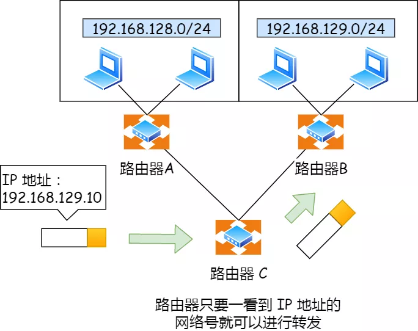

# IP基础知识

[TOC]

## 零、开篇

不多说，直接上菜，共分为**三道菜**：

- 首先是前菜 「 IP 基本认识 」
- 其次是主菜 「IP 地址的基础知识」
- 最后是点心 「IP 协议相关技术」

## 一、前菜 —— IP 基本认识

IP 在 TCP/IP 参考模型中处于第三层，也就是**网络层**。

网络层的主要作用是：**实现主机与主机之间的通信，也叫点对点（end to end）通信。**

> 网络层与数据链路层有什么关系呢？

有的小伙伴分不清 IP（网络层） 和 MAC （数据链路层）之间的区别和关系。

其实很容易区分，在上面我们知道 IP 的作用是主机之间通信中的，而 **MAC 的作用则是实现「直连」的两个设备之间通信，而 IP 则负责在「没有直连」的两个网络之间进行通信传输。**

举个生活的栗子，小林要去一个很远的地方旅行，制定了一个行程表，其间需先后乘坐飞机、地铁、公交车才能抵达目的地，为此小林需要买飞机票，地铁票等。

飞机票和地铁票都是去往特定的地点的，每张票只能够在某一限定区间内移动，此处的「区间内」就如同通信网络中数据链路。

在区间内移动相当于数据链路层，充当区间内两个节点传输的功能，区间内的出发点好比源 MAC 地址，目标地点好比目的 MAC 地址。

整个旅游行程表就相当于网络层，充当远程定位的功能，行程的开始好比源 IP，行程的终点好比目的 IP 地址。

如果小林只有行程表而没有车票，就无法搭乘交通工具到达目的地。相反，如果除了车票而没有行程表，恐怕也很难到达目的地。因为小林不知道该坐什么车，也不知道该在哪里换乘。

因此，只有两者兼备，既有某个区间的车票又有整个旅行的行程表，才能保证到达目的地。与此类似，**计算机网络中也需要「数据链路层」和「网络层」这个分层才能实现向最终目标地址的通信。**

还有重要一点，旅行途中我们虽然不断变化了交通工具，但是旅行行程的起始地址和目的地址始终都没变。其实，在网络中数据包传输中也是如此，**源IP地址和目标IP地址在传输过程中是不会变化的，只有源 MAC 地址和目标 MAC 一直在变化。**

## 二、主菜 —— IP 地址的基础知识

在 TCP/IP 网络通信时，为了保证能正常通信，每个设备都需要配置正确的 IP 地址，否则无法实现正常的通信。

IP 地址（IPv4 地址）由 `32` 位正整数来表示，IP 地址在计算机是以二进制的方式处理的。

而人类为了方便记忆采用了**点分十进制**的标记方式，也就是将 32 位 IP 地址以每 8 位为组，共分为 `4` 组，每组以「`.`」隔开，再将每组转换成十进制。

那么，IP 地址最大值也就是

也就说，最大允许 43 亿台计算机连接到网络。

实际上，IP 地址并不是根据主机台数来配置的，而是以网卡。像服务器、路由器等设备都是有 2 个以上的网卡，也就是它们会有 2 个以上的 IP 地址。

因此，让 43 亿台计算机全部连网其实是不可能的，更何况 IP 地址是由「网络标识」和「主机标识」这两个部分组成的，所以实际能够连接到网络的计算机个数更是少了很多。

> 可能有的小伙伴提出了疑问，现在不仅电脑配了 IP， 手机、IPad 等电子设备都配了 IP 呀，照理来说肯定会超过 43 亿啦，那是怎么能够支持这么多 IP 的呢？

因为会根据一种可以更换 IP 地址的技术 `NAT`，使得可连接计算机数超过 43 亿台。`NAT` 技术后续会进一步讨论和说明。

### 1. IP 地址的分类

互联网诞生之初，IP 地址显得很充裕，于是计算机科学家们设计了**分类地址**。

IP 地址分类成了 5 种类型，分别是 A 类、B 类、C 类、D 类、E 类。

上图中黄色部是分类号，用以区分 IP 地址类别。

> 什么是 A、B、C 类地址？

其中对于 A、B、C 类主要分为两个部分，分别是**网络号和主机号**。这很好理解，好比我是 A 小区 1 栋 101 号，你是 B 小区 1 栋 101 号。

我们可以用下面这个表格， 就能很清楚的知道 A、B、C 分类对应的地址范围、最大主机个数。

> A、B、C 分类地址最大主机个数是如何计算的呢？

最大主机个数，就是要看主机号的位数，如 C 类地址的主机号占 8 位，那么 C 类地址的最大主机个数：

为什么要减 2 呢？

因为在 IP 地址中，有两个 IP 是特殊的，分别是主机号全为 1 和 全为 0 地址。

- 主机号全为 1 指定某个网络下的所有主机，用于广播
- 主机号全为 0 指定某个网络

因此，在分配过程中，应该去掉这两种情况。

> 广播地址用于什么？

广播地址用于在**同一个链路中相互连接的主机之间发送数据包**。

学校班级中就有广播的例子，在准备上课的时候，通常班长会喊：“上课， 全体起立！”，班里的同学听到这句话是不是全部都站起来了？这个句话就有广播的含义。

当主机号全为 1 时，就表示该网络的广播地址。例如把 `172.20.0.0/16` 用二进制表示如下：

10101100.00010100.00000000.00000000

将这个地址的**主机部分全部改为 1**，则形成广播地址：

10101100.00010100.**11111111.11111111**

再将这个地址用十进制表示，则为 `172.20.255.255`。

广播地址可以分为本地广播和直接广播两种。

- **在本网络内广播的叫做本地广播**。例如网络地址为 192.168.0.0/24 的情况下，广播地址是 192.168.0.255 。因为这个广播地址的 IP 包会被路由器屏蔽，所以不会到达 192.168.0.0/24 以外的其他链路上。
- **在不同网络之间的广播叫做直接广播**。例如网络地址为 192.168.0.0/24 的主机向 192.168.1.255/24 的目标地址发送 IP 包。收到这个包的路由器，将数据转发给192.168.1.0/24，从而使得所有 192.168.1.1~192.168.1.254 的主机都能收到这个包（由于直接广播有一定的安全问题，多数情况下会在路由器上设置为不转发）。

> 什么是 D、E 类地址？

而 D 类和 E 类地址是没有主机号的，所以不可用于主机 IP，D 类常被用于**多播**，E 类是预留的分类，暂时未使用。

> 多播地址用于什么？

多播用于**将包发送给特定组内的所有主机。**

还是举班级的栗子，老师说：“最后一排的同学，上来做这道数学题。”，老师是指定的是最后一排的同学，也就是多播的含义了。

由于广播无法穿透路由，若想给其他网段发送同样的包，就可以使用可以穿透路由的多播（组播）。

多播使用的 D 类地址，其前四位是 `1110` 就表示是多播地址，而剩下的 28 位是多播的组编号。

从 224.0.0.0 ~ 239.255.255.255 都是多播的可用范围，其划分为以下三类：

- 224.0.0.0 ~ 224.0.0.255 为预留的组播地址，只能局域网中，路由器是不会进行转发的
- 224.0.1.0 ~ 238.255.255.255  为用户可用的组播地址，可以用于 Internet 上
- 239.0.0.0 ~ 239.255.255.255 为本地管理组播地址，可供内部网在内部使用，仅在特定的本地范围内有效

> IP 分类的优点

不管是路由器还是主机解析到一个 IP 地址时候，我们判断其 IP 地址的首位是否为 0，为 0 则为 A 类地址，那么就能很快的找出网络地址和主机地址。

其余分类判断方式参考如下图：

所以，这种分类地址的优点就是**简单明了、选路（基于网络地址）简单**。

> IP 分类的缺点

*缺点一*

**同一网络下没有地址层次**，比如一个公司里用了 B 类地址，但是可能需要根据生产环境、测试环境、开发环境来划分地址层次，而这种 IP 分类是没有地址层次划分的功能，所以这就**缺少地址的灵活性**。

*缺点二*

A、B、C类有个尴尬处境，就是**不能很好的与现实网络匹配**。

- C 类地址能包含的最大主机数量实在太少了，只有 254 个，估计一个网吧都不够用。
- 而 B 类地址能包含的最大主机数量又太多了，6 万多台机器放在一个网络下面，一般的企业基本达不到这个规模，闲着的地址就是浪费。

这两个缺点，都可以在 `CIDR` 无分类地址解决。

### 2. 无分类地址 CIDR

正因为 IP 分类存在许多缺点，所有后面提出了无分类地址的方案，即 `CIDR`。

这种方式不再有分类地址的概念，32 比特的 IP 地址被划分为两部分，前面是**网络号**，后面是**主机号**。

> 怎么划分网络号和主机号的呢？

表示形式 `a.b.c.d/x`，其中 `/x` 表示前 x 位属于**网络号**， x 的范围是 `0 ~ 32`，这就使得 IP 地址更加具有灵活性。

比如 10.100.122.2/24，这种地址表示形式就是 CIDR，`/24` 表示前 24 位是网络号，剩余的 8 位是主机号。

还有另一种划分网络号与主机号形式，那就是**子网掩码**，掩码的意思就是掩盖掉主机号，剩余的就是网络号。

**将子网掩码和 IP 地址按位计算 AND，就可得到网络号。**

> 为什么要分离网络号和主机号？

因为两台计算机要通讯，首先要判断是否处于同一个广播域内，即网络地址是否相同。如果网络地址相同，表明接受方在本网络上，那么可以把数据包直接发送到目标主机，

路由器寻址工作中，也就是通过这样的方式来找到对应的网络号的，进而把数据包转发给对应的网络内。

> 怎么进行子网划分？

在上面我们知道可以通过子网掩码划分出网络号和主机号，那实际上子网掩码还有一个作用，那就是**划分子网**。

**子网划分实际上是将主机地址分为两个部分：子网网络地址和子网主机地址**。形式如下：

- 未做子网划分的 ip 地址：网络地址＋主机地址
- 做子网划分后的 ip 地址：网络地址＋（子网网络地址＋子网主机地址）

假设对 C 类地址进行子网划分，网络地址 192.168.1.0，使用子网掩码 255.255.255.192 对其进行子网划分。

C 类地址中前 24 位 是网络号，最后 8 位是主机号，根据子网掩码可知**从 8 位主机号中借用 2 位作为子网号**。

由于子网网络地址被划分成 2 位，那么子网地址就有 4 个，分别是 00、01、10、11，具体划分如下图：

划分后的 4 个子网如下表格：

### 3. 公有 IP 地址与私有 IP 地址

在 A、B、C 分类地址，实际上有分公有 IP 地址和 私有 IP 地址。

平时我们办公室、家里、学校用的 IP 地址，一般都是私有 IP 地址。因为这些地址允许组织内部的 IT 人员自己管理、自己分配，而且可以重复。因此，你学校的某个私有 IP 地址和我学校的可以是一样的。

就像每个小区都有自己的楼编号和门牌号，你小区家可以叫  1 栋 101 号，我小区家也可以叫 1 栋 101，没有任何问题。但一旦出了小区，就需要带上中山路 666 号（公网 IP 地址），是国家统一分配的，不能两个小区都叫中山路 666。

所以，公有 IP 地址是有个组织统一分配的，假设你要开一个博客网站，那么你就需要去申请购买一个公有 IP，这样全世界的人才能访问。并且公有 IP 地址基本上要在整个互联网范围内保持唯一。

> 公有 IP 地址由谁管理呢？

私有 IP 地址通常是内部的 IT 人员值管理，公有 IP 地址是由 `ICANN` 组织管理，中文叫「互联网名称与数字地址分配机构」。

IANA 是 ICANN 的其中一个机构，它负责分配互联网 IP 地址，是按州的方式层层分配。

- ARIN 北美地区
- LACNIC 拉丁美洲和一些加勒比群岛
- RIPE NCC 欧洲、中东和中亚
- AfriNIC 非洲地区
- APNIC 亚太地区

其中，在中国是由 CNNIC 的机构进行管理，它是中国国内唯一指定的全局 IP 地址管理的组织。

### 4. IP 地址与路由控制

IP地址的**网络地址**这一部分是用于进行路由控制。

路由控制表中记录着网络地址与下一步应该发送至路由器的地址，在主机和路由器上都会有各自的路由器控制表。

在发送 IP 包时，首先要确定 IP 包首部中的目标地址，再从路由控制表中找到与该地址具有**相同网络地址**的记录，根据该记录将 IP 包转发给相应的下一个路由器。如果路由控制表中存在多条相同网络地址的记录，就选择相同位数最多的网络地址，也就是最长匹配。

下面以下图的网络链路作为例子说明：

1. 主机 A 要发送一个 IP 包，其源地址是 `10.1.1.30` 和目标地址是 `10.1.2.10`，由于没有在主机 A 的路由表找到与目标地址 `10.1.2.10` 的网络地址，于是把包被转发到默认路由（路由器 `1` ）
2. 路由器 `1` 收到 IP 包后，也在路由器 `1` 的路由表匹配与目标地址相同的网络地址记录，发现匹配到了，于是就把 IP 数据包转发到了 `10.1.0.2` 这台路由器 `2`
3. 路由器 `2` 收到后，同样对比自身的路由表，发现匹配到了，于是把 IP 包从路由器 `2` 的 `10.1.2.1` 这个接口出去，最终经过交换机把 IP 数据包转发到了目标主机

> 环回地址是不会流向网络

环回地址是在同一台计算机上的程序之间进行网络通信时所使用的一个默认地址。

计算机使用一个特殊的 IP 地址 **127.0.0.1 作为环回地址，**与该地址具有相同意义的是一个叫做 `localhost` 的主机名。

使用这个 IP 或主机名时，数据包不会流向网络。

