# 图解网络-TCP三次握手和四次挥手面试题

[TOC]

## 零、开篇

直接上提纲

1. TCP 基本认识

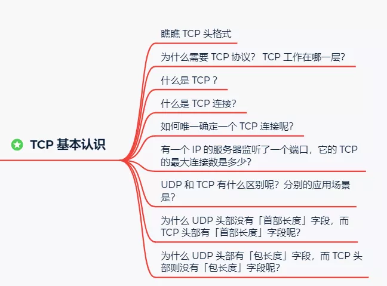

2. TCP 连接建立

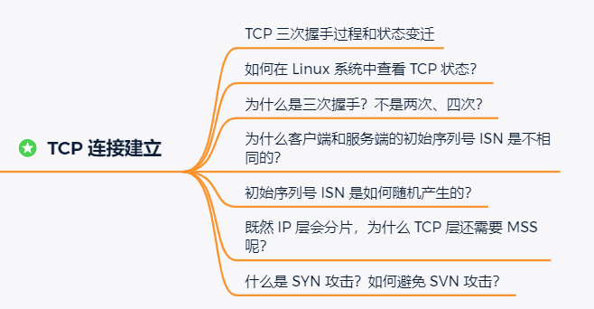

3. TCP 连接断开

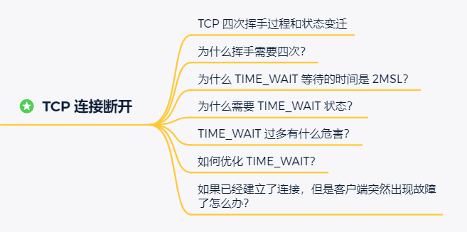

4. Socket 编程

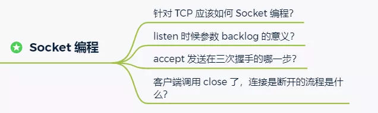

## 一、TCP 基本认识

> 瞧瞧 TCP 头格式

我们先来看看 TCP 头的格式，标注颜色的表示与本文关联比较大的字段，其他字段不做详细阐述。

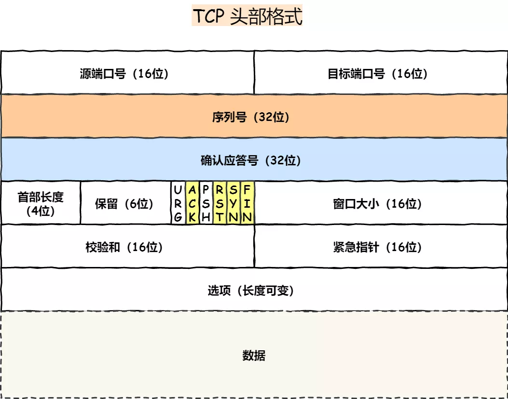

**序列号**：在建立连接时由计算机生成的随机数作为其初始值，通过 SYN 包传给接收端主机，每发送一次数据，就「累加」一次该「数据字节数」的大小。**用来解决网络包乱序问题。**

**确认应答号**：指下一次「期望」收到的数据的序列号，发送端收到这个确认应答以后可以认为在这个序号以前的数据都已经被正常接收。**用来解决不丢包的问题。**

**控制位：**

- *ACK*：该位为 `1` 时，「确认应答」的字段变为有效，TCP 规定除了最初建立连接时的 `SYN` 包之外该位必须设置为 `1` 。
- *RST*：该位为 `1` 时，表示 TCP 连接中出现异常必须强制断开连接。
- *SYC*：该位为 `1` 时，表示希望建立连，并在其「序列号」的字段进行序列号初始值的设定。
- *FIN*：该位为 `1` 时，表示今后不会再有数据发送，希望断开连接。当通信结束希望断开连接时，通信双方的主机之间就可以相互交换 `FIN` 位置为 1 的 TCP 段。

> 为什么需要 TCP 协议？TCP 工作在哪一层？

`IP` 层是「不可靠」的，它不保证网络包的交付、不保证网络包的按序交付、也不保证网络包中的数据的完整性。

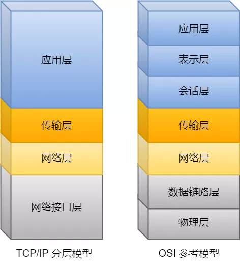

如果需要保障网络数据包的可靠性，那么就需要由上层（传输层）的 `TCP` 协议来负责。

因为 TCP 是一个工作在**传输层**的**可靠**数据传输的服务，它能确保接收端接收的网络包是**无损坏、无间隔、非冗余和按序的。**

> 什么是 TCP ？

TCP 是**面向连接的、可靠的、基于字节流**的传输层通信协议。

- **面向连接**：一定是「一对一」才能连接，不能像 UDP 协议 可以一个主机同时向多个主机发送消息，也就是一对多是无法做到的；
- **可靠的**：无论的网络链路中出现了怎样的链路变化，TCP 都可以保证一个报文一定能够到达接收端；
- **字节流**：消息是「没有边界」的，所以无论我们消息有多大都可以进行传输。并且消息是「有序的」，当「前一个」消息没有收到的时候，即使它先收到了后面的字节已经收到，那么也不能扔给应用层去处理，同时对「重复」的报文会自动丢弃。

> 什么是 TCP 连接？

我们来看看 RFC 793 是如何定义「连接」的：

*Connections:* 

*The reliability and flow control mechanisms described above require that TCPs initialize and maintain certain status information for each data stream.*  

*The combination of this information, including sockets, sequence numbers, and window sizes, is called a connection.*

简单来说就是，**用于保证可靠性和流量控制维护的某些状态信息，这些信息的组合，包括Socket、序列号和窗口大小称为连接。**

所以我们可以知道，建立一个 TCP 连接是需要客户端与服务器端达成上述三个信息的共识。

- **Socket**：由 IP 地址和端口号组成
- **序列号**：用来解决乱序问题等
- **窗口大小**：用来做流量控制

> 如何唯一确定一个 TCP 连接呢？

TCP 四元组可以唯一的确定一个连接，四元组包括如下：

- 源地址
- 源端口
- 目的地址
- 目的端口

源地址和目的地址的字段（32位）是在 IP 头部中，作用是通过 IP 协议发送报文给对方主机。

源端口和目的端口的字段（16位）是在 TCP 头部中，作用是告诉 TCP 协议应该把报文发给哪个进程。

> 有一个 IP 的服务器监听了一个端口，它的 TCP 的最大连接数是多少？

服务器通常固定在某个本地端口上监听，等待客户端的连接请求。

因此，客户端 IP 和 端口是可变的，其理论值计算公式如下:

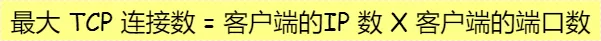

对 IPv4，客户端的 IP 数最多为 `2` 的 `32` 次方，客户端的端口数最多为 `2` 的 `16` 次方，也就是服务端单机最大 TCP 连接数，约为 `2` 的 `48` 次方。

当然，服务端最大并发 TCP 连接数远不能达到理论上限。

- 首先主要是**文件描述符限制**，Socket 都是文件，所以首先要通过 `ulimit` 配置文件描述符的数目；
- 另一个是**内存限制**，每个 TCP 连接都要占用一定内存，操作系统是有限的。

> UDP 和 TCP 有什么区别呢？分别的应用场景是？

UDP 不提供复杂的控制机制，利用 IP 提供面向「无连接」的通信服务。

UDP 协议真的非常简，头部只有 `8` 个字节（ 64 位），UDP 的头部格式如下：

- 目标和源端口：主要是告诉 UDP 协议应该把报文发给哪个进程。
- 包长度：该字段保存了 UDP 首部的长度跟数据的长度之和。
- 校验和：校验和是为了提供可靠的 UDP 首部和数据而设计。

**TCP 和 UDP 区别：**

*1. 连接*

- TCP 是面向连接的传输层协议，传输数据前先要建立连接。
- UDP 是不需要连接，即刻传输数据。

*2. 服务对象*

- TCP 是一对一的两点服务，即一条连接只有两个端点。
- UDP 支持一对一、一对多、多对多的交互通信

*3. 可靠性*

- TCP 是可靠交付数据的，数据可以无差错、不丢失、不重复、按需到达。
- UDP 是尽最大努力交付，不保证可靠交付数据。

*4. 拥塞控制、流量控制*

- TCP 有拥塞控制和流量控制机制，保证数据传输的安全性。
- UDP 则没有，即使网络非常拥堵了，也不会影响 UDP 的发送速率。

*5. 首部开销*

- TCP 首部长度较长，会有一定的开销，首部在没有使用「选项」字段时是 `20` 个字节，如果使用了「选项」字段则会变长的。
- UDP 首部只有 8 个字节，并且是固定不变的，开销较小。

**TCP 和 UDP 应用场景：**

由于 TCP 是面向连接，能保证数据的可靠性交付，因此经常用于：

- `FTP` 文件传输
- `HTTP` / `HTTPS`

由于 UDP 面向无连接，它可以随时发送数据，再加上UDP本身的处理既简单又高效，因此经常用于：

- 包总量较少的通信，如 `DNS` 、`SNMP` 等
- 视频、音频等多媒体通信
- 广播通信

> 为什么 UDP 头部没有「首部长度」字段，而 TCP 头部有「首部长度」字段呢？

原因是 TCP 有**可变长**的「选项」字段，而 UDP 头部长度则是**不会变化**的，无需多一个字段去记录 UDP 的首部长度。

> 为什么 UDP 头部有「包长度」字段，而 TCP 头部则没有「包长度」字段呢？

先说说 TCP 是如何计算负载数据长度：

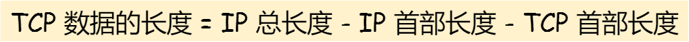

其中 IP 总长度 和 IP 首部长度，在 IP 首部格式是已知的。TCP 首部长度，则是在 TCP 首部格式已知的，所以就可以求得 TCP 数据的长度。

大家这时就奇怪了问：“ UDP 也是基于 IP 层的呀，那 UDP 的数据长度也可以通过这个公式计算呀？为何还要有「包长度」呢？”

这么一问，确实感觉 UDP 「包长度」是冗余的。

**因为为了网络设备硬件设计和处理方便，首部长度需要是 `4`字节的整数倍。**

如果去掉 UDP 「包长度」字段，那 UDP 首部长度就不是 `4` 字节的整数倍了，所以这**可能**是为了补全 UDP 首部长度是 `4` 字节的整数倍，才补充了「包长度」字段。

## 二、TCP 连接建立

> TCP 三次握手过程和状态变迁

TCP 是面向连接的协议，所以使用 TCP 前必须先建立连接，而**建立连接是通过三次握手而进行的。**

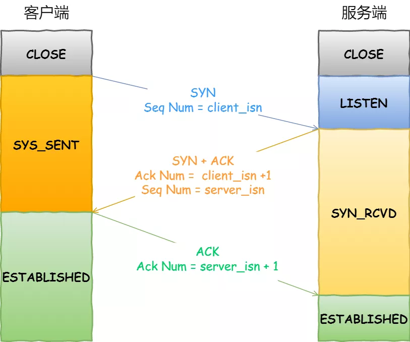

- 一开始，客户端和服务端都处于 `CLOSED` 状态。先是服务端主动监听某个端口，处于 `LISTEN` 状态

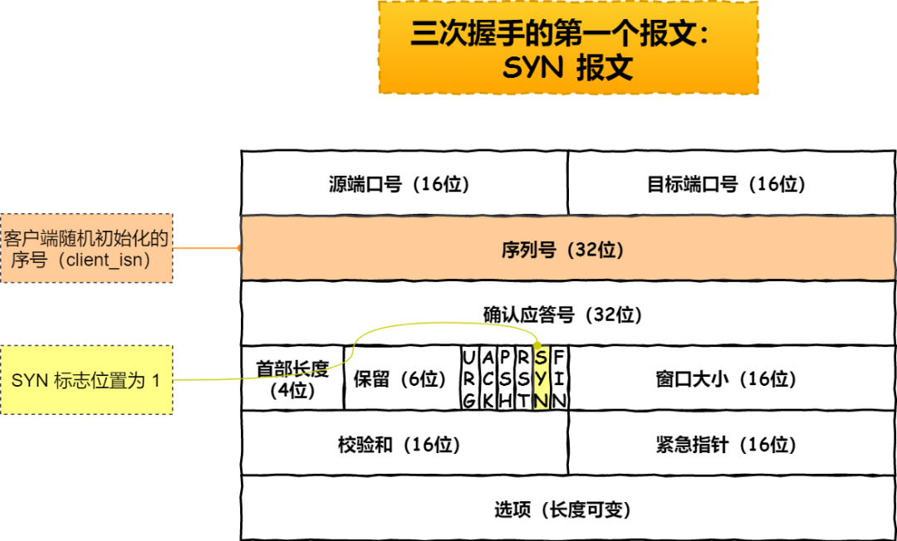

- 客户端会随机初始化序号（`client_isn`），将此序号置于 TCP 首部的「序号」字段中，同时把 `SYN` 标志位置为 `1` ，表示 `SYN` 报文。接着把第一个 SYN 报文发送给服务端，表示向服务端发起连接，该报文不包含应用层数据，之后客户端处于 `SYN-SENT` 状态。

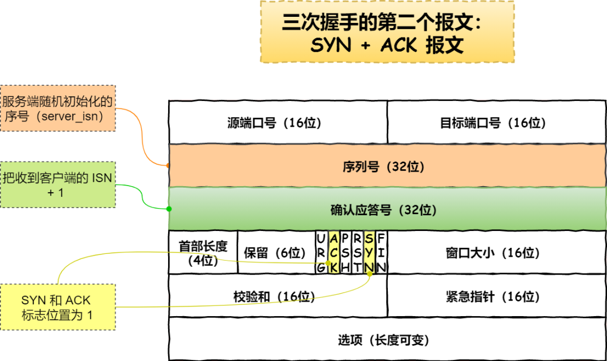

- 服务端收到客户端的 `SYN` 报文后，首先服务端也随机初始化自己的序号（`server_isn`），将此序号填入 TCP 首部的「序号」字段中，其次把 TCP 首部的「确认应答号」字段填入 `client_isn + 1`, 接着把 `SYN` 和 `ACK` 标志位置为 `1`。最后把该报文发给客户端，该报文也不包含应用层数据，之后服务端处于 `SYN-RCVD` 状态。

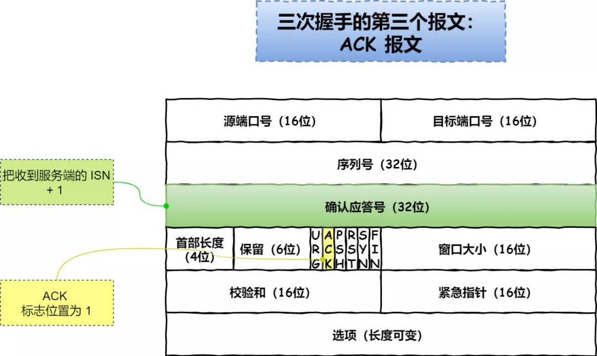

- 客户端收到服务端报文后，还要向服务端回应最后一个应答报文，首先该应答报文 TCP 首部 `ACK` 标志位置为 `1` ，其次「确认应答号」字段填入 `server_isn + 1` ，最后把报文发送给服务端，这次报文可以携带客户到服务器的数据，之后客户端处于 `ESTABLISHED` 状态。
- 服务器收到客户端的应答报文后，也进入 `ESTABLISHED` 状态。

从上面的过程可以发现**第三次握手是可以携带数据的，前两次握手是不可以携带数据的**，这也是面试常问的题。

一旦完成三次握手，双方都处于 `ESTABLISHED` 状态，此致连接就已建立完成，客户端和服务端就可以相互发送数据了。

> 如何在 Linux 系统中查看 TCP 状态？

TCP 的连接状态查看，在 Linux 可以通过 `netstat -napt` 命令查看。

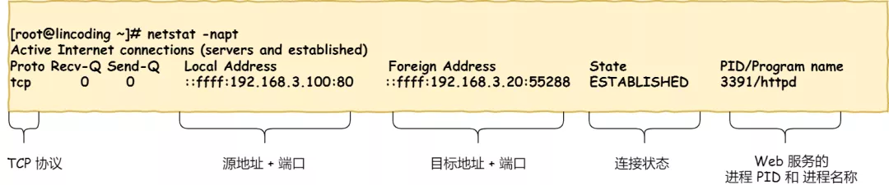

> 为什么是三次握手？不是两次、四次？

相信大家比较常回答的是：“因为三次握手才能保证双方具有接收和发送的能力。”

这回答是没问题，但这回答是片面的，并没有说出主要的原因。

在前面我们知道了什么是 **TCP 连接**：

- 用于保证可靠性和流量控制维护的某些状态信息，这些信息的组合，包括**Socket、序列号和窗口大小**称为连接。

所以，重要的是**为什么三次握手才可以初始化Socket、序列号和窗口大小并建立 TCP 连接。**

接下来以三个方面分析三次握手的原因：

- 三次握手才可以阻止历史重复连接的初始化（主要原因）
- 三次握手才可以同步双方的初始序列号
- 三次握手才可以避免资源浪费

*原因一：避免历史连接*

我们来看看 RFC 793 指出的 TCP 连接使用三次握手的**首要原因**：

*The principle reason for the three-way handshake is to prevent old duplicate connection initiations from causing confusion.*

简单来说，三次握手的**首要原因是为了防止旧的重复连接初始化造成混乱。**

网络环境是错综复杂的，往往并不是如我们期望的一样，先发送的数据包，就先到达目标主机，反而它很骚，可能会由于网络拥堵等乱七八糟的原因，会使得旧的数据包，先到达目标主机，那么这种情况下 TCP 三次握手是如何避免的呢？

