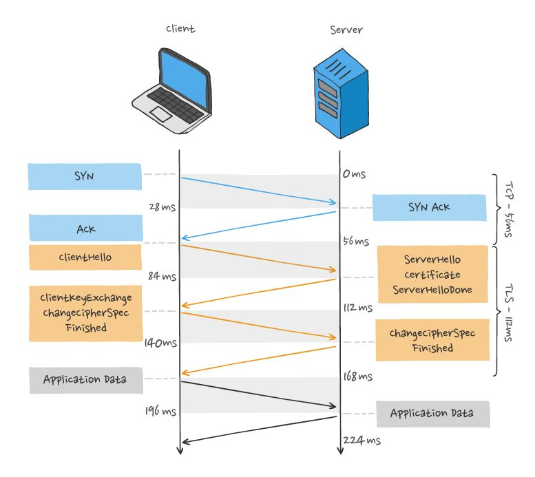
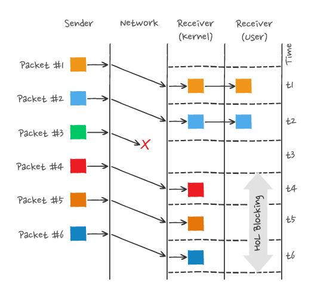

# 图解网络-TCP存在的缺陷

<!-- START doctoc generated TOC please keep comment here to allow auto update -->
<!-- DON'T EDIT THIS SECTION, INSTEAD RE-RUN doctoc TO UPDATE -->

- [一、升级 TCP 的工作很困难](#%E4%B8%80%E5%8D%87%E7%BA%A7-tcp-%E7%9A%84%E5%B7%A5%E4%BD%9C%E5%BE%88%E5%9B%B0%E9%9A%BE)
- [二、TCP 建立连接的延迟](#%E4%BA%8Ctcp-%E5%BB%BA%E7%AB%8B%E8%BF%9E%E6%8E%A5%E7%9A%84%E5%BB%B6%E8%BF%9F)
- [三、TCP 存在队头阻塞问题](#%E4%B8%89tcp-%E5%AD%98%E5%9C%A8%E9%98%9F%E5%A4%B4%E9%98%BB%E5%A1%9E%E9%97%AE%E9%A2%98)
- [四、网络迁移需要重新建立 TCP 连接](#%E5%9B%9B%E7%BD%91%E7%BB%9C%E8%BF%81%E7%A7%BB%E9%9C%80%E8%A6%81%E9%87%8D%E6%96%B0%E5%BB%BA%E7%AB%8B-tcp-%E8%BF%9E%E6%8E%A5)

<!-- END doctoc generated TOC please keep comment here to allow auto update -->

[TOC]

## 一、升级 TCP 的工作很困难

TCP 协议是诞生在 1973 年，至今 TCP 协议依然还在实现很多的新特性。

但是 TCP 协议是在内核中实现的，应用程序只能使用不能修改，如果要想升级 TCP 协议，那么只能升级内核。

而升级内核这个工作是很麻烦的事情，麻烦的事情不是说升级内核这个操作很麻烦，而是由于内核升级涉及到底层软件和运行库的更新，我们的服务程序就需要回归测试是否兼容新的内核版本，所以服务器的内核升级比较保守和缓慢。

很多 TCP 协议的新特性，都是需要客户端和服务端同时支持才能生效的，比如 TCP Fast Open 这个特性，虽然在 2013 年就被提出了，但是由于因为很多 PC 端的系统升级滞后很严重，所以一些老旧的系统是无法支持这个特性的。

所以，即使 TCP 有比较好的特性更新，也很难快速推广，用户往往要几年或者十年才能体验到。

## 二、TCP 建立连接的延迟

基于 TCP 实现的应用协议，都是需要先建立三次握手才能进行数据传输，比如 HTTP 1.0/1.1、HTTP/2、HTTPS。

现在大多数网站都是使用 HTTPS 的，这意味着在 TCP 三次握手之后，还需要经过 TLS 四次握手后，才能进行 HTTP 数据的传输，这在一定程序上增加了数据传输的延迟。

TCP 三次握手和 TLS 握手延迟，如图：

TCP 三次握手的延迟被 TCP Fast Open （快速打开）这个特性解决了，这个特性可以在「第二次建立连接」时减少 TCP 连接建立的时延。

过程如下：

- 在第一次建立连接的时候，服务端在第二次握手产生一个 `Cookie` （已加密）并通过 SYN、ACK 包一起发给客户端，于是客户端就会缓存这个 `Cookie`，所以第一次发起 HTTP Get 请求的时候，还是需要 2 个 RTT
  的时延；
- 在下次请求的时候，客户端在 SYN 包带上 `Cookie` 发给服务端，就提前可以跳过三次握手的过程，因为 `Cookie` 中维护了一些信息，服务端可以从 `Cookie` 获取 TCP 相关的信息，这时发起的 HTTP GET
  请求就只需要 1 个 RTT 的时延；

TCP Fast Open 这个特性是不错，但是它需要服务端和客户端的操作系统同时支持才能体验到，而 TCP Fast Open 是在 2013 年提出的，所以市面上依然有很多老式的操作系统不支持，而升级操作系统是很麻烦的事情，因此 TCP
Fast Open 很难被普及开来。

还有一点，针对 HTTPS 来说，TLS 是在应用层实现的握手，而 TCP 是在内核实现的握手，这两个握手过程是无法结合在一起的，总是得先完成 TCP 握手，才能进行 TLS 握手。

也正是 TCP 是在内核实现的，所以 TLS 是无法对 TCP 头部加密的，这意味着 TCP 的序列号都是明文传输，所以就存安全的问题。

一个典型的例子就是攻击者伪造一个的 RST 报文强制关闭一条 TCP 连接，而攻击成功的关键则是 TCP 字段里的序列号位于接收方的滑动窗口内，该报文就是合法的。

为此 TCP 也不得不进行三次握手来同步各自的序列号，而且初始化序列号时是采用随机的方式（不完全随机，而是随着时间流逝而线性增长，到了 2^32 尽头再回滚）来提升攻击者猜测序列号的难度，以增加安全性。

但是这种方式只能避免攻击者预测出合法的 RST 报文，而无法避免攻击者截获客户端的报文，然后中途伪造出合法 RST 报文的攻击的方式。

大胆想一下，如果 TCP 的序列号也能被加密，或许真的不需要三次握手了，客户端和服务端的初始序列号都从 0 开始，也就不用做同步序列号的工作了，但是要实现这个要改造整个协议栈，太过于麻烦，即使实现出来了，很多老的网络设备未必能兼容。

## 三、TCP 存在队头阻塞问题

TCP 是字节流协议，**TCP 层必须保证收到的字节数据是完整且有序的**，如果序列号较低的 TCP 段在网络传输中丢失了，即使序列号较高的 TCP 段已经被接收了，应用层也无法从内核中读取到这部分数据。如下图：

图中发送方发送了很多个 packet，每个 packet 都有自己的序号，你可以认为是 TCP 的序列号，其中 `packet #3` 在网络中丢失了，即使 `packet #4-6` 被接收方收到后，由于内核中的 TCP
数据不是连续的，于是接收方的应用层就无法从内核中读取到，只有等到 `packet #3` 重传后，接收方的应用层才可以从内核中读取到数据。

这就是 TCP 队头阻塞问题，但这也不能怪 TCP ，因为只有这样做才能保证数据的有序性。

HTTP/2 多个请求是跑在一个 TCP 连接中的，那么当 TCP 丢包时，整个 TCP 都要等待重传，那么就会阻塞该 TCP 连接中的所有请求，所以 HTTP/2 队头阻塞问题就是因为 TCP 协议导致的。

## 四、网络迁移需要重新建立 TCP 连接

基于 TCP 传输协议的 HTTP 协议，由于是通过四元组（源 IP、源端口、目的 IP、目的端口）确定一条 TCP 连接。

那么**当移动设备的网络从 4G 切换到 WIFI 时，意味着 IP 地址变化了，那么就必须要断开连接，然后重新建立 TCP 连接**。

而建立连接的过程包含 TCP 三次握手和 TLS 四次握手的时延，以及 TCP 慢启动的减速过程，给用户的感觉就是网络突然卡顿了一下，因此连接的迁移成本是很高的。
