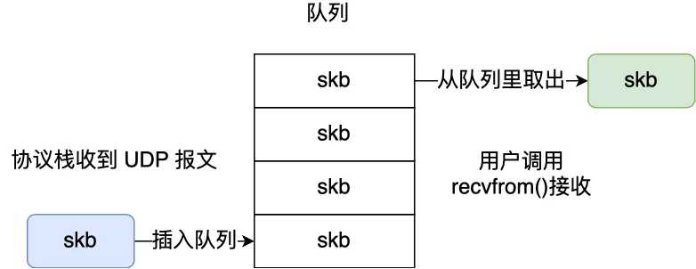
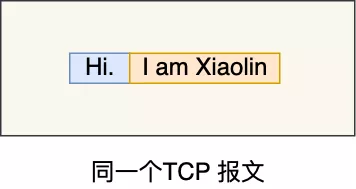
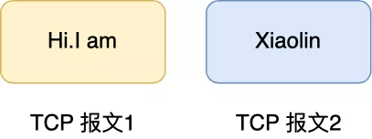
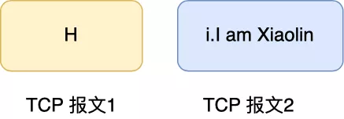
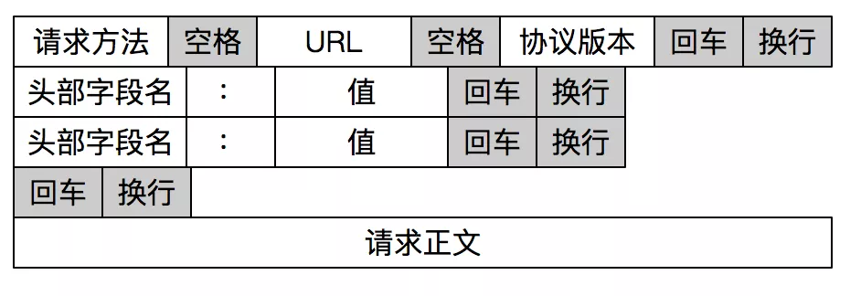

# 图解网络-TCP面向字节流协议

<!-- START doctoc generated TOC please keep comment here to allow auto update -->
<!-- DON'T EDIT THIS SECTION, INSTEAD RE-RUN doctoc TO UPDATE -->

- [零、开篇](#%E9%9B%B6%E5%BC%80%E7%AF%87)
- [一、如何理解字节流？](#%E4%B8%80%E5%A6%82%E4%BD%95%E7%90%86%E8%A7%A3%E5%AD%97%E8%8A%82%E6%B5%81)
- [二、如何解决粘包？](#%E4%BA%8C%E5%A6%82%E4%BD%95%E8%A7%A3%E5%86%B3%E7%B2%98%E5%8C%85)
    - [1. 固定长度的消息](#1-%E5%9B%BA%E5%AE%9A%E9%95%BF%E5%BA%A6%E7%9A%84%E6%B6%88%E6%81%AF)
    - [2. 特殊字符作为边界](#2-%E7%89%B9%E6%AE%8A%E5%AD%97%E7%AC%A6%E4%BD%9C%E4%B8%BA%E8%BE%B9%E7%95%8C)
    - [3. 自定义消息结构](#3-%E8%87%AA%E5%AE%9A%E4%B9%89%E6%B6%88%E6%81%AF%E7%BB%93%E6%9E%84)

<!-- END doctoc generated TOC please keep comment here to allow auto update -->

[TOC]

## 零、开篇

TCP 是面向字节流的协议，UDP 是面向报文的协议？这里的「面向字节流」和「面向报文」该如何理解。

## 一、如何理解字节流？

之所以会说 TCP 是面向字节流的协议，UDP 是面向报文的协议，是因为操作系统对 TCP 和 UDP 协议的**发送方的机制不同**，也就是问题原因在发送方。

> 先来说说为什么 UDP 是面向报文的协议？

当用户消息通过 UDP 协议传输时，**操作系统不会对消息进行拆分**，在组装好 UDP 头部后就交给网络层来处理，所以发出去的 UDP 报文中的数据部分就是完整的用户消息，也就是**每个 UDP 报文就是一个用户消息的边界**
，这样接收方在接收到 UDP 报文后，读一个 UDP 报文就能读取到完整的用户消息。

你可能会问，如果收到了两个 UDP 报文，操作系统是怎么区分开的？

操作系统在收到 UDP 报文后，会将其插入到队列里，**队列里的每一个元素就是一个 UDP 报文**，这样当用户调用 recvfrom() 系统调用读数据的时候，就会从队列里取出一个数据，然后从内核里拷贝给用户缓冲区。



> 再来说说为什么 TCP 是面向字节流的协议？

当用户消息通过 TCP 协议传输时，**消息可能会被操作系统分组成多个的 TCP 报文**，也就是一个完整的用户消息被拆分成多个 TCP 报文进行传输。

这时，接收方的程序如果不知道发送方发送的消息的长度，也就是不知道消息的边界时，是无法读出一个有效的用户消息的，因为用户消息被拆分成多个 TCP 报文后，并不能像 UDP 那样，一个 UDP 报文就能代表一个完整的用户消息。

举个实际的例子来说明。

发送方准备发送 「Hi.」和「I am Xiaolin」这两个消息。

在发送端，当我们调用 send 函数完成数据“发送”以后，数据并没有被真正从网络上发送出去，只是从应用程序拷贝到了操作系统内核协议栈中。

至于什么时候真正被发送，**取决于发送窗口、拥塞窗口以及当前发送缓冲区的大小等条件**。也就是说，我们不能认为每次 send 调用发送的数据，都会作为一个整体完整地消息被发送出去。

如果我们考虑实际网络传输过程中的各种影响，假设发送端陆续调用 send 函数先后发送 「Hi.」和「I am Xiaolin」 报文，那么实际的发送很有可能是这几种情况。

第一种情况，这两个消息被分到同一个 TCP 报文，像这样：



第二种情况，「I am Xiaolin」的部分随 「Hi」 在一个 TCP 报文中发送出去，像这样：



第三种情况，「Hi.」 的一部分随 TCP 报文被发送出去，另一部分和 「I am Xiaolin」 一起随另一个 TCP 报文发送出去，像这样：



类似的情况还能举例很多种，这里主要是想说明，我们不知道 「Hi.」和 「I am Xiaolin」 这两个用户消息是如何进行 TCP 分组传输的。

因此，**我们不能认为一个用户消息对应一个 TCP 报文，正因为这样，所以 TCP 是面向字节流的协议**。

当两个消息的某个部分内容被分到同一个 TCP 报文时，就是我们常说的 TCP 粘包问题，这时接收方不知道消息的边界的话，是无法读出有效的消息。

要解决这个问题，要交给**应用程序**。

## 二、如何解决粘包？

粘包的问题出现是因为不知道一个用户消息的边界在哪，如果知道了边界在哪，接收方就可以通过边界来划分出有效的用户消息。

一般有三种方式分包的方式：

- 固定长度的消息；
- 特殊字符作为边界；
- 自定义消息结构。

### 1. 固定长度的消息

这种是最简单方法，即每个用户消息都是固定长度的，比如规定一个消息的长度是 64 个字节，当接收方接满 64 个字节，就认为这个内容是一个完整且有效的消息。

但是这种方式灵活性不高，实际中很少用。

### 2. 特殊字符作为边界

我们可以在两个用户消息之间插入一个特殊的字符串，这样接收方在接收数据时，读到了这个特殊字符，就把认为已经读完一个完整的消息。

HTTP 是一个非常好的例子。



HTTP 通过设置回车符、换行符作为 HTTP 报文协议的边界。

有一点要注意，这个作为边界点的特殊字符，如果刚好消息内容里有这个特殊字符，我们要对这个字符转义，避免被接收方当作消息的边界点而解析到无效的数据。

### 3. 自定义消息结构

我们可以自定义一个消息结构，由包头和数据组成，其中包头包是固定大小的，而且包头里有一个字段来说明紧随其后的数据有多大。

比如这个消息结构体，首先 4 个字节大小的变量来表示数据长度，真正的数据则在后面。

```c
struct { 
    u_int32_t message_length; 
    char message_data[]; 
} message;
```

当接收方接收到包头的大小（比如 4 个字节）后，就解析包头的内容，于是就可以知道数据的长度，然后接下来就继续读取数据，直到读满数据的长度，就可以组装成一个完整到用户消息来处理了。

