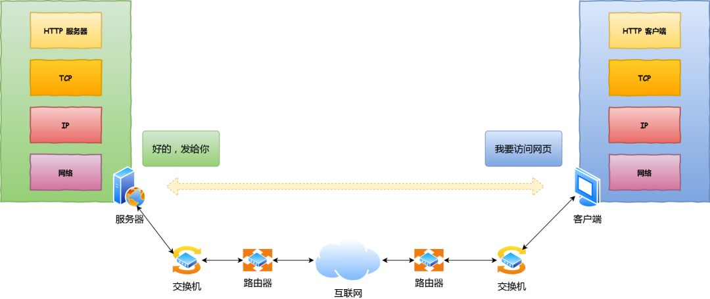
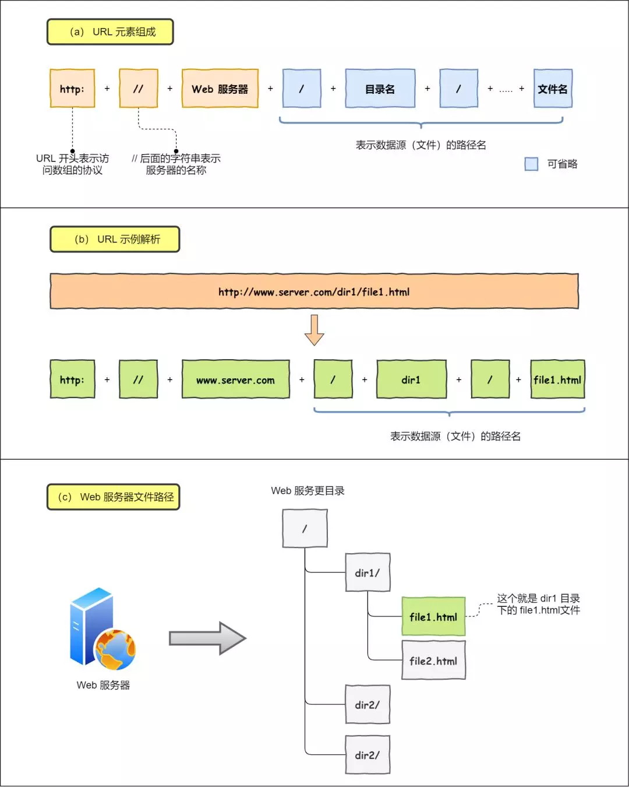
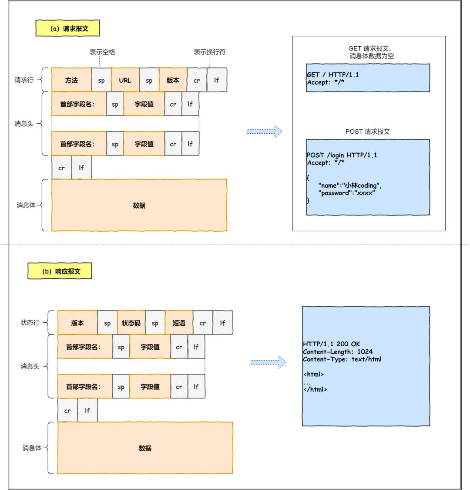
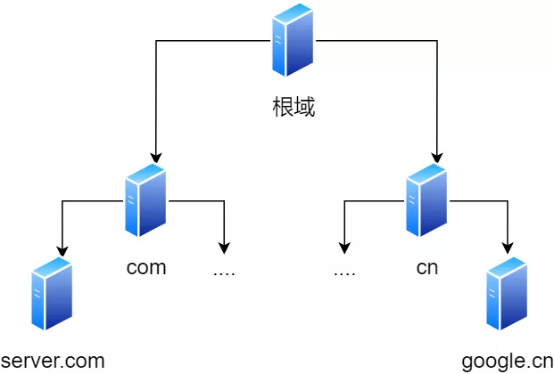

# 图解网络-一个数据包在网络中的心路历程

[TOC]

## 零、开篇

接下来以下图较简单的网络拓扑模型作为例子，探究探究「**当键入网址后，到网页显示，其间发生了什么**」发生了什么？

## 一、孤单小弟 —— HTTP

> 浏览器做的第一步工作是解析 URL

首先浏览器做的第一步工作就是要对 `URL` 进行解析，从而生发送给 `Web` 服务器的请求信息。

让我们看看一条长长的 URL 里的各个元素的代表什么，见下图：

所以图中的长长的 URL 实际上是请求服务器里的文件资源。

> 要是上图中的蓝色部分 URL 元素都省略了，哪应该是请求哪个文件呢？

当没有路径名时，就代表访问根目录下事先设置的**默认文件**，也就是 `/index.html` 或者 `/default.html` 这些文件，这样就不会发生混乱了。

> 生产 HTTP 请求信息

对 `URL` 进行解析之后，浏览器确定了 Web 服务器和文件名，接下来就是根据这些信息来生成 HTTP 请求消息了。

> 一个孤单 HTTP 数据包表示：“我这么一个小小的数据包，没亲没友，直接发到浩瀚的网络，谁会知道我呢？谁能载我一层呢？谁能保护我呢？我的目的地在哪呢？”。充满各种疑问的它，没有停滞不前，依然踏上了征途！

## 二、真实地址查询 —— DNS

通过浏览器解析 URL 并生成 HTTP 消息后，需要委托操作系统将消息发送给 `Web` 服务器。

但在发送之前，还有一项工作需要完成，那就是**查询服务器域名对于的 IP 地址**，因为委托操作系统发送消息时，必须提供通信对象的 IP 地址。

比如我们打电话的时候，必须要知道对方的电话号码，但由于电话号码难以记忆，所以通常我们会将对方电话号 + 姓名保存在通讯录里。

所以，有一种服务器就专门保存了 `Web` 服务器域名与 `IP` 的对应关系，它就是 `DNS` 服务器。

> 域名的层级关系

DNS 中的域名都是用**句点**来分隔的，比如 `www.server.com`，这里的句点代表了不同层次之间的**界限**。

在域名中，**越靠右**的位置表示其层级**越高**。

毕竟域名是外国人发明，所以思维和中国人相反，比如说一个城市地点的时候，外国喜欢从小到大的方式顺序说起（如 XX 街道 XX 区 XX 市 XX 省），而中国则喜欢从大到小的顺序（如 XX 省 XX 市 XX 区 XX 街道）。

根域是在最顶层，它的下一层就是 com 顶级域，再下面是 server.com。

所以域名的层级关系类似一个树状结构：

- 根 DNS 服务器
- 顶级域 DNS 服务器（com）
- 权威 DNS 服务器（server.com）

根域的 DNS 服务器信息保存在互联网中所有的 DNS 服务器中。

这样一来，任何 DNS 服务器就都可以找到并访问根域 DNS 服务器了。

因此，客户端只要能够找到任意一台 DNS 服务器，就可以通过它找到根域 DNS 服务器，然后再一路顺藤摸瓜找到位于下层的某台目标 DNS 服务器。

> 域名解析的工作流程

1. 客户端首先会发出一个 DNS 请求，问 www.server.com 的 IP 是啥，并发给本地 DNS 服务器（也就是客户端的 TCP/IP 设置中填写的 DNS 服务器地址）。
2. 本地域名服务器收到客户端的请求后，如果缓存里的表格能找到 www.server.com，则它直接返回 IP 地址。如果没有，本地 DNS 会去问它的根域名服务器：“老大， 能告诉我 www.server.com 的 IP 地址吗？” 根域名服务器是最高层次的，它不直接用于域名解析，但能指明一条道路。
3. 根 DNS 收到来自本地 DNS 的请求后，发现后置是 .com，说：“www.server.com 这个域名归 .com 区域管理”，我给你 .com 顶级域名服务器地址给你，你去问问它吧。”
4. 本地 DNS 收到顶级域名服务器的地址后，发起请求问“老二， 你能告诉我 www.server.com  的 IP 地址吗？”
5. 顶级域名服务器说：“我给你负责 www.server.com 区域的权威 DNS 服务器的地址，你去问它应该能问到”。
6. 本地 DNS 于是转向问权威 DNS 服务器：“老三，www.server.com对应的IP是啥呀？” server.com 的权威 DNS 服务器，它是域名解析结果的原出处。为啥叫权威呢？就是我的域名我做主。
7. 权威 DNS 服务器查询后将对应的 IP 地址 X.X.X.X 告诉本地 DNS。
8. 本地 DNS 再将 IP 地址返回客户端，客户端和目标建立连接。

至此，我们完成了 DNS 的解析过程。现在总结一下，整个过程画成一个图：

DNS 域名解析的过程蛮有意思的，整个过程就和我们日常生活中找人问路的过程类似，**只指路不带路**。

> 数据包表示：“DNS 老大哥厉害呀，找到了目的地了！我还是很迷茫呀，我要发出去，接下来我需要谁的帮助呢?”

