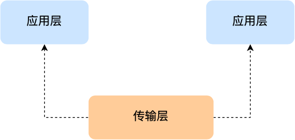
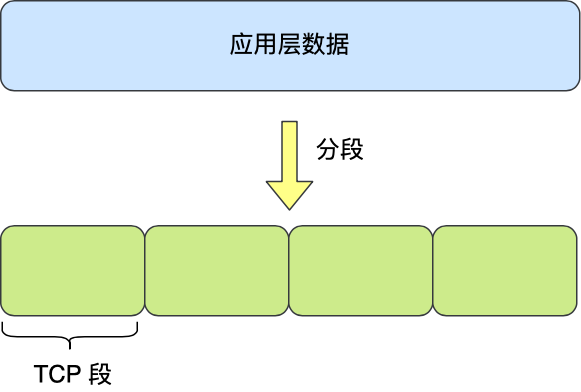
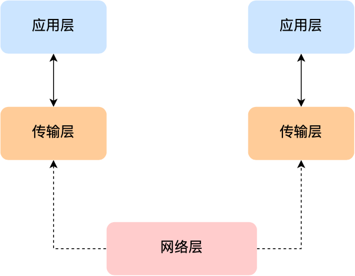
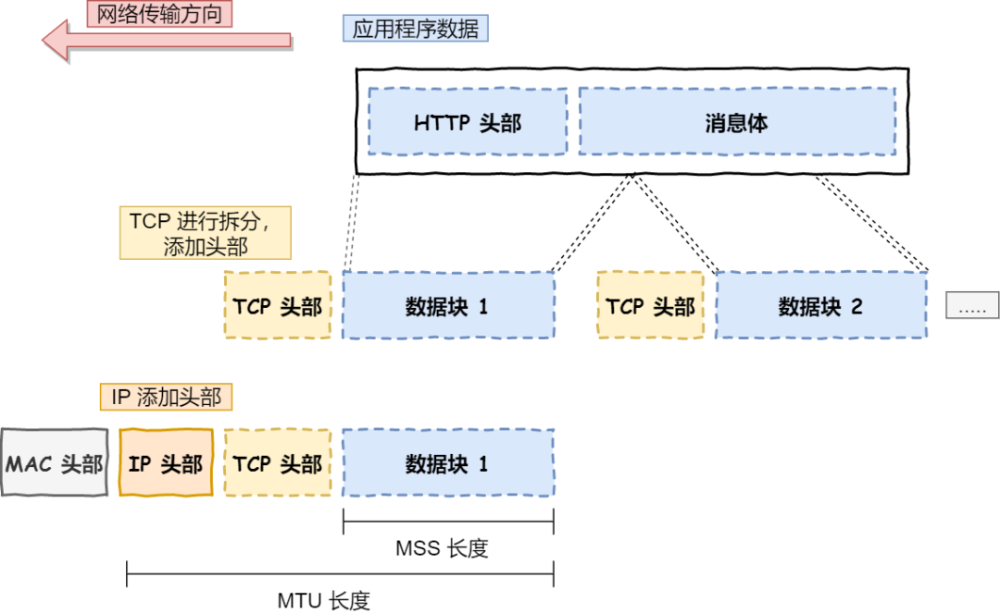
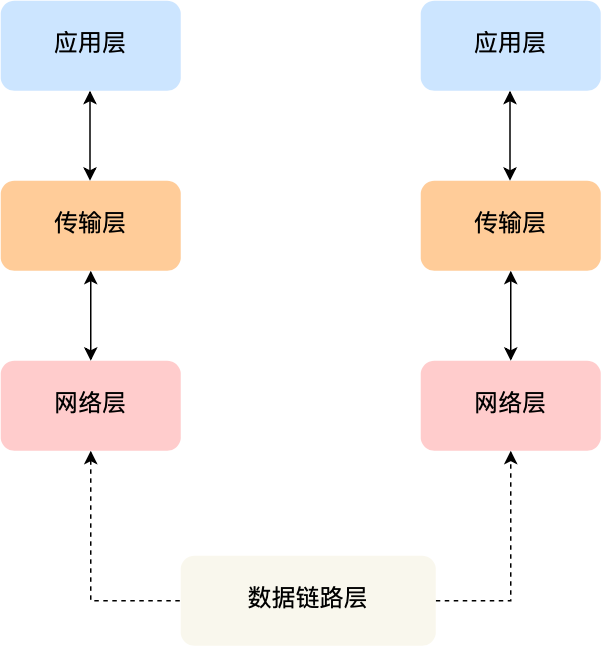
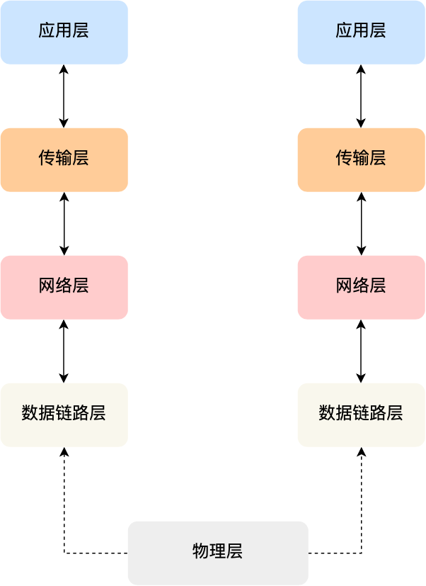

# 图解网络-摸清网络的第一步

<!-- START doctoc generated TOC please keep comment here to allow auto update -->
<!-- DON'T EDIT THIS SECTION, INSTEAD RE-RUN doctoc TO UPDATE -->

- [零、开篇](#%E9%9B%B6%E5%BC%80%E7%AF%87)
- [一、应用层](#%E4%B8%80%E5%BA%94%E7%94%A8%E5%B1%82)
- [二、传输层](#%E4%BA%8C%E4%BC%A0%E8%BE%93%E5%B1%82)
- [三、网络层](#%E4%B8%89%E7%BD%91%E7%BB%9C%E5%B1%82)
- [四、数据链路层](#%E5%9B%9B%E6%95%B0%E6%8D%AE%E9%93%BE%E8%B7%AF%E5%B1%82)
- [五、物理层](#%E4%BA%94%E7%89%A9%E7%90%86%E5%B1%82)
- [六、总结](#%E5%85%AD%E6%80%BB%E7%BB%93)

<!-- END doctoc generated TOC please keep comment here to allow auto update -->

[TOC]

## 零、开篇

要摸清网络，那么第一步肯定是要清楚网络协议的分层结构，看分层结构相当于从上帝视角来看网络，这样后续针对每一个层深入学习就不会摸不着头脑。

对于同一台设备上的进程间通信，有很多种方式，比如有管道、消息队列、共享内存、信号等方式，而对于不同设备上的进程间通信，就需要网络通信，而设备是多样性的，所以要兼容多种多样的设备，就协商出了一套**通用的网络协议**。

这个网络协议是分层的，每一层都有各自的作用和职责，接下来就分别对每一层进行介绍。

## 一、应用层

最上层的，也是我们能直接接触到的就是**应用层**（*Application Layer*），我们电脑或手机使用的应用软件都是在应用层实现。那么，当两个不同设备的应用需要通信的时候，应用就把应用数据传给下一层，也就是传输层。

所以，应用层只需要专注于为用户提供应用功能，不用去关心数据是如何传输的，就类似于，我们寄快递的时候，只需要把包裹交给快递员，由他负责运输快递，我们不需要关心快速是如何被运输的。

而且应用层是工作在操作系统中的用户态，传输层及以下则工作在内核态。

## 二、传输层

应用层的数据包会传给传输层，**传输层**（**Transport Layer**）是为应用层提供网络支持的。

在传输层会有两个传输协议，分别是 TCP 和 UDP。

TCP 的全称叫传输层控制协议（*Transmission Control Protocol*），大部分应用使用的正是 TCP 传输层协议，比如 HTTP 应用层协议。TCP 相比 UDP 多了很多特性，比如流量控制、超时重传、拥塞控制等，这些都是为了保证数据包能可靠地传输给对方。 

UDP 就相对很简单，简单到只负责发送数据包，不保证数据包是否能抵达对方，但它实时性相对更好，传输效率也高。当然，UDP 也可以实现可靠传输，把 TCP 的特性在应用层上实现就可以，不过要实现一个商用的可靠 UDP 传输协议，也不是一件简单的事情。

应用需要传输的数据可能会非常大，如果直接传输就不好控制，因此当传输层的数据包大小超过 MSS（TCP 最大报文段长度） ，就要将数据包分块，这样即使中途有一个分块丢失或损坏了，只需要重新这一个分块，而不用重新发送整个数据包。在 TCP 协议中，我们把每个分块称为一个 **TCP 段**（*TCP Segment*）。

当设备作为接收方时，传输层则要负责把数据包传给应用，但是一台设备上可能会有很多应用在接收或者传输数据，因此需要用一个编号将应用区分开来，这个编号就是**端口**。

比如 80 端口通常是 Web 服务器用的，22 端口通常是远程登录服务器用的。而对于浏览器（客户端）中的每个标签栏都是一个独立的进程，操作系统会为这些进程分配临时的端口号。

由于传输层的报文中会携带端口号，因此接收方可以识别出该报文是发送给哪个应用。

## 三、网络层

传输层可能大家刚接触的时候，会认为它负责将数据从一个设备传输到另一个设备，事实上它并不负责。

实际场景中的网络环节是错综复杂的，中间有各种各样的线路和分叉路口，如果一个设备的数据要传输给另一个设备，就需要在各种各样的路径和节点进行选择，而传输层的设计理念是简单、高效、专注，如果传输层还负责这一块功能就有点违背设计原则了。

也就是说，我们不希望传输层协议处理太多的事情，只需要服务好应用即可，让其作为应用间数据传输的媒介，帮助实现应用到应用的通信，而实际的传输功能就交给下一层，也就是**网络层**（*Internet Layer*）。

网络层最常使用的是 IP 协议（*Internet Protocol*），IP 协议会将传输层的报文作为数据部分，再加上 IP 包头组装成 IP 报文，如果 IP 报文大小超过 MTU（以太网中一般为 1500 字节）就会**再次进行分片**，得到一个即将发送到网络的 IP 报文。

网络层负责将数据从一个设备传输到另一个设备，世界上那么多设备，又该如何找到对方呢？因此，网络层需要有区分设备的编号。

我们一般用 IP 地址给设备进行编号，对于 IPv4 协议， IP 地址共 32 位，分成了四段，每段是 8 位。只有一个单纯的 IP 地址虽然做到了区分设备，但是寻址起来就特别麻烦，全世界那么多台设备，难道一个一个去匹配？这显然不科学。

因此，需要将 IP 地址分成两种意义：

- 一个是**网络号**，负责标识该 IP 地址是属于哪个子网的；
- 一个是**主机号**，负责标识同一子网下的不同主机；

怎么分的呢？这需要配合**子网掩码**才能算出 IP 地址 的网络号和主机号。那么在寻址的过程中，先匹配到相同的网络号，才会去找对应的主机。

除了寻址能力， IP 协议还有另一个重要的能力就是**路由**。实际场景中，两台设备并不是用一条网线连接起来的，而是通过很多网关、路由器、交换机等众多网络设备连接起来的，那么就会形成很多条网络的路径，因此当数据包到达一个网络节点，就需要通过算法决定下一步走哪条路径。

所以，**IP 协议的寻址作用是告诉我们去往下一个目的地该朝哪个方向走，路由则是根据「下一个目的地」选择路径。寻址更像在导航，路由更像在操作方向盘**。

## 四、数据链路层

实际场景中，网络并不是一个整体，比如你家和我家就不属于一个网络，所以数据不仅可以在同一个网络中设备间进行传输，也可以跨网络进行传输。

一旦数据需要跨网络传输，就需要有一个设备同时在两个网络当中，这个设备一般是路由器，路由器可以通过路由表计算出下一个要去的 IP 地址。

那问题来了，路由器怎么知道这个 IP 地址是哪个设备的呢？

于是，就需要有一个专门的层来标识网络中的设备，让数据在一个链路中传输，这就是**数据链路层**（*Data Link Layer*），它主要为网络层提供链路级别传输的服务。

每一台设备的网卡都会有一个 MAC 地址，它就是用来唯一标识设备的。路由器计算出了下一个目的地 IP 地址，再通过 ARP 协议找到该目的地的 MAC 地址，这样就知道这个 IP 地址是哪个设备的了。

## 五、物理层

当数据准备要从设备发送到网络时，需要把数据包转换成电信号，让其可以在物理介质中传输，这一层就是**物理层**（*Physical Layer*），它主要是为数据链路层提供二进制传输的服务。

## 六、总结

综上所述，网络协议通常是由上到下，分成 5 层，分别是应用层、传输层、网络层、数据链路层和物理层。