# 37张图详解MAC地址、以太网、二层转发、VLAN

<!-- START doctoc generated TOC please keep comment here to allow auto update -->
<!-- DON'T EDIT THIS SECTION, INSTEAD RE-RUN doctoc TO UPDATE -->

- [零、开篇](#%E9%9B%B6%E5%BC%80%E7%AF%87)
- [一、MAC 地址](#%E4%B8%80mac-%E5%9C%B0%E5%9D%80)
- [二、以太网](#%E4%BA%8C%E4%BB%A5%E5%A4%AA%E7%BD%91)
    - [以太网数据格式](#%E4%BB%A5%E5%A4%AA%E7%BD%91%E6%95%B0%E6%8D%AE%E6%A0%BC%E5%BC%8F)
- [三、交换机二层转发原理](#%E4%B8%89%E4%BA%A4%E6%8D%A2%E6%9C%BA%E4%BA%8C%E5%B1%82%E8%BD%AC%E5%8F%91%E5%8E%9F%E7%90%86)
- [四、VLAN](#%E5%9B%9Bvlan)
    - [1. VLAN 原理](#1-vlan-%E5%8E%9F%E7%90%86)
    - [2. 划分 VLAN](#2-%E5%88%92%E5%88%86-vlan)
    - [3. 跨交换机 VLAN 原理](#3-%E8%B7%A8%E4%BA%A4%E6%8D%A2%E6%9C%BA-vlan-%E5%8E%9F%E7%90%86)
    - [4. 结尾](#4-%E7%BB%93%E5%B0%BE)

<!-- END doctoc generated TOC please keep comment here to allow auto update -->

[TOC]

## 零、开篇

## 一、MAC 地址

每个网卡或三层网口都有一个 **MAC 地址**， MAC 地址是烧录到硬件上，因此也称为**硬件地址**。MAC 地址作为数据链路设备的地址标识符，需要保证网络中的每个 MAC 地址都是**唯一**的，才能正确识别到数据链路上的设备。

MAC 地址由 **6** 个字节组成。前 3 个字节表示**厂商识别码**，每个网卡厂商都有特定唯一的识别数字。后 3 个字节由厂商给每个网卡进行分配。厂商可以保证生产出来的网卡不会有相同 MAC 地址的网卡。

现在可以通过软件修改 MAC 地址，虚拟机使用物理机网卡的 MAC 地址，并不能保证 MAC 地址是唯一的。但是只要 MAC 地址相同的设备不在同一个数据链路上就没问题。

为了查看方便， 6 个字节的 MAC 地址使用**十六进制**来表示。每个字节的 8 位二进制数分别用 2 个十六进制数来表示，例如我的网卡 MAC 地址是 `E0-06-E6-39-86-31`。

> 什么是字节？什么是比特？

**比特**，英文名 *bit* ，也叫*位*。二进制中最小单位，一个比特的值要么是 `0` 要么是 `1` 。

**字节**，英文名 *Byte* 。一个字节由八个比特构成。

> MAC 地址怎么使用？

最常用的以太网和无线局域网，都是使用 MAC 地址作为地址标识符进行通信的。

## 二、以太网

有线局域网中普遍使用**以太网**，以太网标准简单，传输速率高。常见的网络拓扑结构如下图。

> 什么是网络拓扑？

网络的连接和构成的形态称为**网络拓扑**。它不仅可以直观的看到网络物理连接方式，还可以表示网络的逻辑结构。

### 以太网数据格式

当今最常用的以太网协议标准是 `ETHERNET II` 标准。`ETHERNET II` 标准定义的数据帧格式如下图。

- 前导码（ Preamble ）

前导码由 7 个字节组成，每个字节固定为 `10101010` 。之后的 1 个字节称为**帧起始定界符**，这个字节固定为 `10101011` 。这 8
个字节表示以太网帧的开始，也是对端网卡能够确保与其同步的标志。帧起始定界符的最后两位比特被定义为 11 ，之后就是以太网数据帧的本体。

- 目的地址（ Destination Address ）

  目的地址由 6 个字节组成，用来标识数据帧的目的设备，类似于快递的收件人地址。

- 源地址（ Source Address ）

  源地址由 6 个字节组成，用来标识数据帧的始发设备，类似于快递的发件人地址。

- 类型（ Type ）

  类型字段由 2 个字节组成。类型字段是表明上一层（即网络层）的协议类型，可以让接收方使用相同的协议进行数据帧的解封装。

- 数据（ Data ）

  帧头后就是数据。一个数据帧所能容纳的最大数据范围是 46 ～ 1500 个字节。如果数据部分不足 46 个字节，则填充这个数据帧，让它的长度可以满足最小长度的要求。

- FCS（ Frame Check Sequence ）

  FCS 由 4 个字节组成，位于数据帧的尾部，用来检查帧是否有所损坏。通过检查 FCS 字段的值将受到噪声干扰的错误帧丢弃。

> 最小的数据帧是多少字节？

数据帧的各字段加起来一共是 `64` 字节，其中数据是 `46` 字节。再加上前导码就是 `72` 字节。因此最小的数据帧是 `72` 字节。在传输过程中，每个数据帧还有 `12` 字节的数据帧间隙，所以最小的可传输数据帧长度是 `84`
字节，即 `672` 比特。

## 三、交换机二层转发原理

交换机有多个网络端口，它通过识别数据帧的**目标 MAC 地址**，根据 **MAC 地址表**决定从哪个端口发送数据。MAC 地址表不需要在交换机上手工设置，而是可以自动生成的。

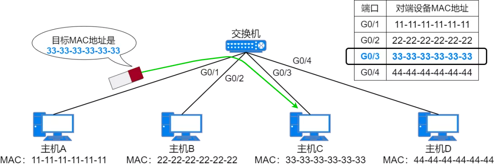

> 交换机是如何添加、更新、删除 MAC 地址表条目的？

在初始状态下，交换机的 MAC 地址表是空的，不包含任何条目。当交换机的某个端口接收到一个数据帧时，它就会将这个数据帧的源 MAC 地址、接收数据帧的端口号作为一个条目保存在自己的 MAC
地址表中，同时在接收到这个数据帧时重置这个条目的老化计时器时间。这就是交换机自动添加 MAC 地址表条目的方式。

在新增这一条 MAC 地址条目后，如果交换机再次从同一个端口收到相同 MAC 地址为源 MAC 地址的数据帧时，交换机就会**更新**
这个条目的老化计时器，确保活跃的的条目不会老化。但是如果在老化时间内都没收到匹配这个条目的数据帧，交换机就会将这个老化的条目从自己的 MAC 地址表中**删除**。

还可以手动在交换机的 MAC 地址表中添加**静态条目**。静态添加的 MAC 地址条目优先动态学习的条目进行转发，而且静态条目没有老化时间，会一直保存在交换机的 MAC 地址表中。

> 如何使用 MAC 地址表条目进行转发？

当交换机的某个端口收到一个单播数据帧时，它会查看这个数据帧的二层头部信息，并进行两个操作。一个操作是根据源 MAC 地址和端口信息添加或更新 MAC 地址表。另一个操作是查看数据帧的目的 MAC 地址，并根据数据帧的目的 MAC
地址查找自己的 MAC 地址表。在查找 MAC 地址表后，交换机会根据查找结果对数据帧进行处理，这里有 3 中情况：

1. 交换机没有在 MAC 地址表中找到这个数据帧的目的 MAC 地址，因此交换机不知道自己的端口是否有连接这个 MAC 地址的设备。于是，交换机将这个数据帧从除了接收端口之外的所有端口**泛洪**出去。

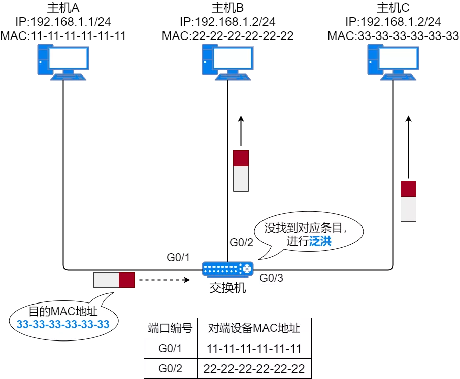

2. 交换机的 MAC 地址表中有这个数据帧的目的 MAC 地址，且对应端口不是接收到这个数据帧的端口，交换机知道目的设备连接在哪个端口上，因此交换机会根据 MAC 地址表中的条目将数据帧从对应端口单播**转发**
   出去，而其它与交换机相连的设备则不会收到这个数据帧。

3. 交换机的 MAC 地址表中有这个数据帧的目的 MAC
   地址，且对应端口就是接收到这个数据帧的端口。这种情况下，交换机会认为数据帧的目的地址就在这个端口所连接的范围内，因此目的设备应该已经收到数据帧。这个数据帧与其它端口的设备无关，不会将数据帧从其它端口转发出去。于是，交换机会**丢弃**
   数据帧。

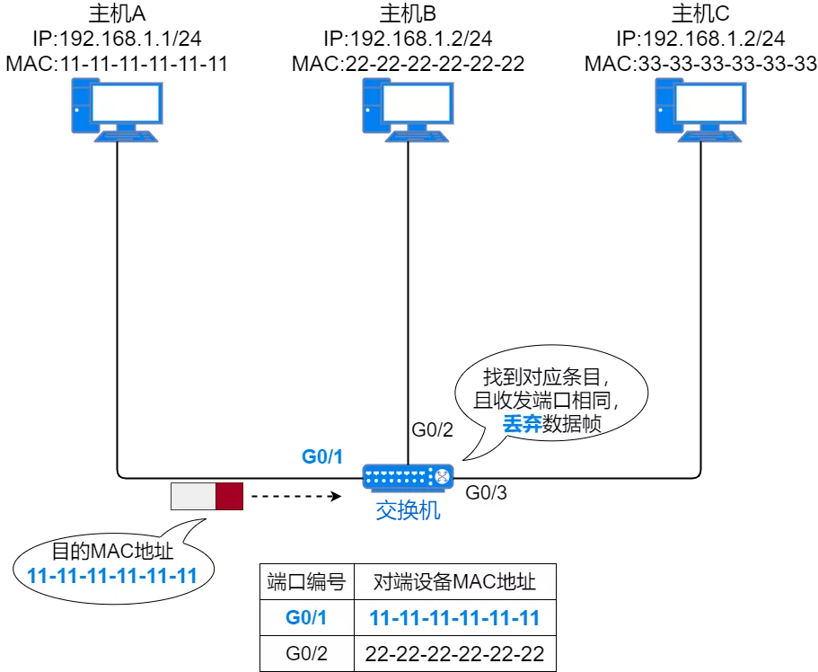

**单播**：主机一对一的发送数据。单播地址是主机的 MAC 地址。

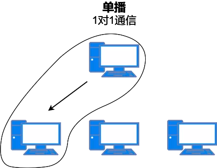

**广播**：向局域网内所有设备发送数据。只有全 1 的 MAC 地址为广播 MAC 地址，即 `FF-FF-FF-FF-FF-FF` 。

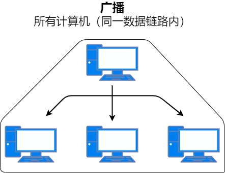

**泛洪**：将某个端口收到的数据从除该端口之外的所有端口发送出去。泛洪操作广播的是普通数据帧而不是广播帧。

## 四、VLAN

**广播域**是广播帧可以到达的区域。换句话说，由多个交换机和主机组成的网络就是一个广播域。

网络规模越大，广播域就越大，泛洪流量也越来越大，降低通信效率。在一个广播域内的任意两台主机之间可以任意通信，通信数据有被窃取的风险。

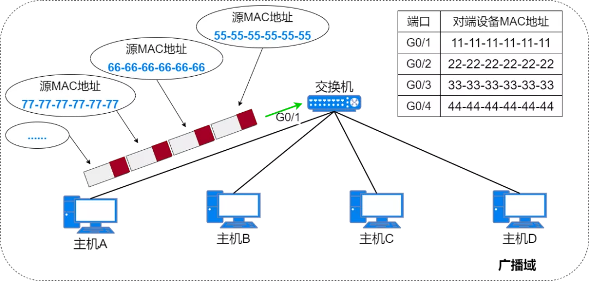

为了解决广播域扩大带来的性能问题和安全性降低问题， VLAN 技术应运而生。VLAN 技术能够在逻辑上把一个物理局域网**分隔**为多个广播域，每个广播域称为一个**虚拟局域网**（即 VLAN ）。每台主机只能属于一个 VLAN
，同属一个 VLAN 的主机通过**二层**直接通信，属于不同 VLAN 的主机只能通过 **IP 路由**功能才能实现通信。通过划分多个 VLAN ，从而减小广播域传播的范围，过滤多余的包，提高网络的传输效率，同时提高了网络的安全性。

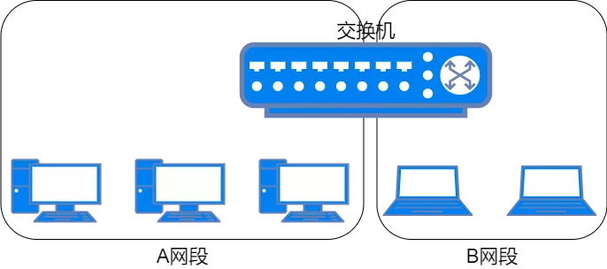

### 1. VLAN 原理

VLAN 技术通过给数据帧插入 **VLAN 标签**（又叫 `VLAN TAG`）的方式，让交换机能够分辨出各个数据帧所属的 VLAN 。

VLAN 标签是用来区分数据帧所属 VLAN 的，是 4 个字节长度的字段，插入到以太网帧头部上。VLAN 标签会插入到源 MAC 地址后面， **IEEE 802.1Q** 标准有这个格式定义和字段构成说明。

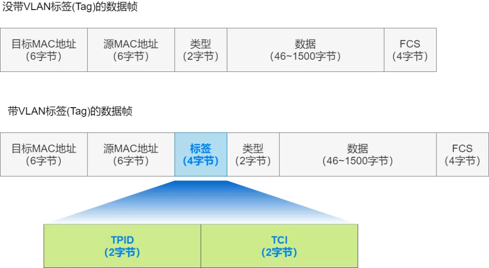

- TPID （标签协议标识符）： 长度 2 个字节，值为 `0x8100` ，用来表示这个数据帧携带了 802.1Q 标签。不支持 802.1Q 标准的设备收到这类数据帧，会把它丢弃。
- TCI （标签控制信息）： 长度 2 个字节，又分为三个子字段，用来表示数据帧的控制信息：
- 优先级（ Priority ）：长度为 3 比特，取值范围 `0 ~ 7` ，用来表示数据帧的优先级。取值越大，优先级越高。当交换机发送拥塞是，优先转发优先级高的数据帧。
- CFI （规范格式指示器）：长度为 1 比特，取值非 0 即 1 。
- **VLAN ID** （ VLAN 标识符）：长度为 12 比特，用来表示 VLAN 标签的数值。取值范围是 `1 ~ 4094` 。

> 划分 VLAN 后，交换机如何处理广播报文？

交换机上划分了多个 VLAN 时，在交换机接收到广播数据帧时，只会将这个数据帧在相同 VLAN 的端口进行**广播**。

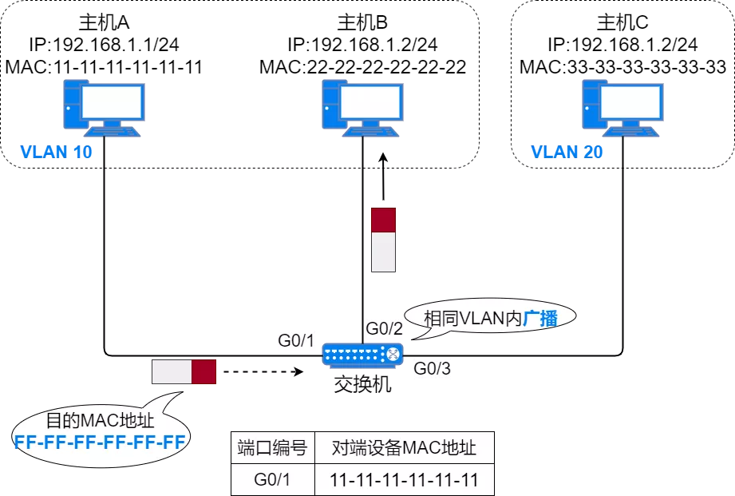

交换机上划分了多个 VLAN 时，当交换机接收到一个目的 MAC 地址不存在于自己 MAC 地址表中的单播数据帧时，只会将这个数据帧在相同 VLAN 的端口进行**泛洪**。

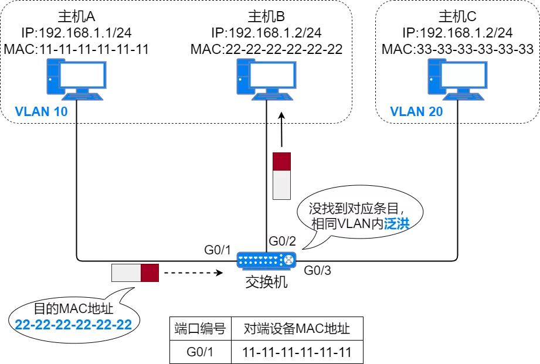

> 划分 VLAN 后，不同 VLAN 的主机能否通信？

划分多 VLAN 的环境中，即使交换机 MAC 地址表里保存了某个数据帧的目的 MAC 地址条目，若这个目的 MAC 地址所对应的端口与数据帧的入端口在不同的 VLAN 中，交换机也不会通过 MAC 地址表中的端口发送数据帧。

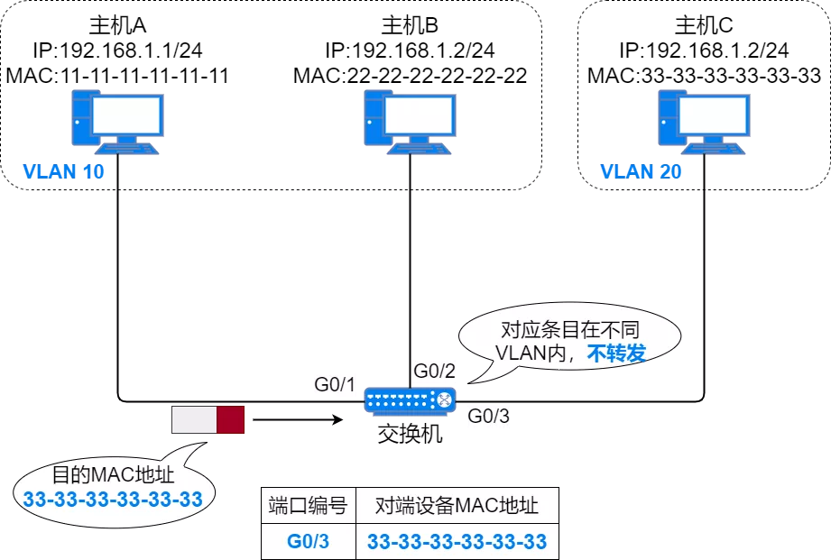

**小结**：在不使用路由转发的前提下，交换机不会从一个 VLAN 的端口中接收到的数据帧，转发给其它 VLAN 的端口。

> 怎么区分不同的 VLAN ？

通过 VLAN ID 进行区分，例如 VLAN 10 和 VLAN 20 就是不同的 VLAN 。

> VLAN 技术有哪些好处？

- 增加了广播域的数量，减小了每个广播域的规模，也减少了每个广播域中终端设备的数量；
- 增强了网络安全性，保障网络安全的方法增加了；
- 提高了网络设计的逻辑性，可以规避地理、物理等因素对于网络设计的限制。

### 2. 划分 VLAN

我们可以使用不同的方法，把交换机上的每个端口划分到某个 VLAN 中，以此在逻辑上分隔广播域。

交换机通常会使用**基于端口划分 VLAN** 的方法。在交换机上手动配置，绑定交换机端口和 VLAN ID 的关系。

优点：配置简单。想要把某个端口划分到某个 VLAN 中，只需要把端口的 **PVID** （端口 VLAN ID ）配置到相应的 VLAN ID 即可。

缺点：当终端设备移动位置是，可能需要为终端设备连接的新端口重新划分 VLAN 。

除了这种方法外，还可以使用基于 **MAC 地址划分 VLAN** 、**基于 IP 地址划分 VLAN** 、**基于协议划分 VLAN** 、**基于策略划分 VLAN** 等方法来划分 VLAN。

*PVID ：接口默认 VLAN ID ，是交换机端口配置的参数，默认值是 1 。*

### 3. 跨交换机 VLAN 原理

终端设备不会生成带 VLAN 标签的数据帧，它们发出的数据帧叫做**无标记帧**（ Untagged ）。它们连接的交换机会给无标记帧打上 VLAN 标签。交换机通过每个端口的 PVID ，判断从这个接口收到的无标记帧属于哪个 VLAN
，并在转发时，插入相应的 VLAN 标签，从而将无标记帧变为**标记帧**（ Tagged ）。

当两台交换机通过端口连接时，收到的数据帧是标记帧还是无标记帧？交换机端口会如何处理呢？

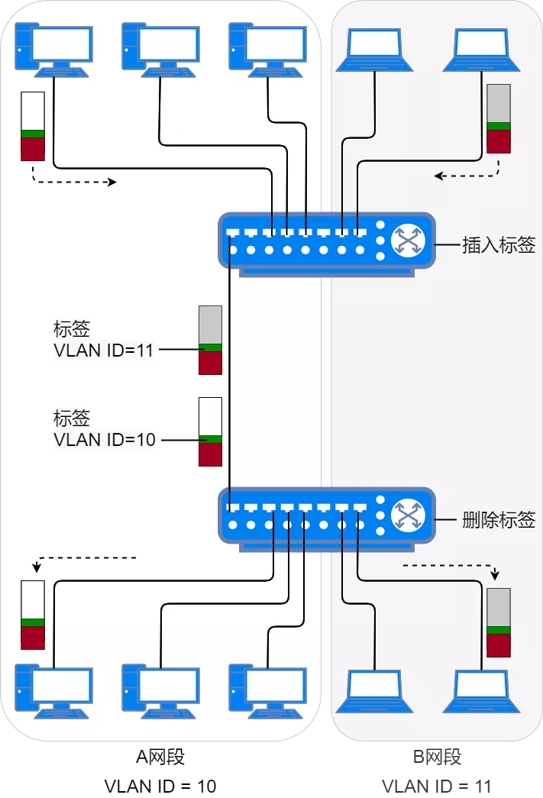

交换机根据连接的设备类型，判断各个接口收到的数据帧是否打标，来配置交换机接口的类型。

- 如果交换机接口收到**无标记帧**，由交换机根据这个接口所在 VLAN 为数据帧打上 VLAN 标签；同时接口发送数据帧时，也不携带 VLAN 标签。应该把这类接口配置为 **Access （接入）接口**， Access
  接口连接的链路称为 Access 链路。
- 如果交换机接口收到多个 VLAN 的流量，也就是收到了**标记帧**；同时为了让对端设备能够区分不同 VLAN 的流量，通过接口发出的流量会打上 VLAN 标签。应该把这类接口配置为 **Trunk （干道）接口**，相应的链路称为
  Trunk 链路。

> 跨交换机发送数据

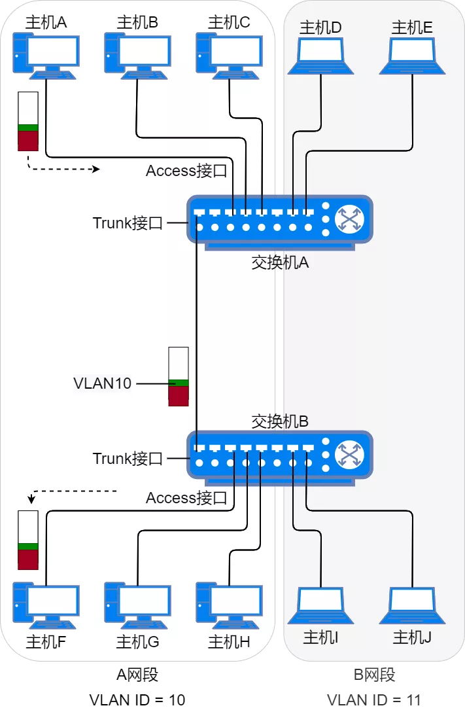

**主机 A** 以主机 F 的 MAC 地址作为目的 MAC 地址封装了一个数据帧，从网卡发送出去。

**交换机 A** 在 Access 接口收到数据帧。查询 MAC 地址表，发现数据帧的目的地址是与交换机 B 相连的 Trunk 接口。于是交换机给数据帧打上 Access 接口的 PVID 配置，即给数据帧打上 VLAN 10
的标签，并从 Trunk 接口转发给交换机 B 。

**交换机 B** 在 trunk 接口收到数据帧。查看 MAC 地址表，发现是 VLAN 10 的数据帧，目的地址设备是连接在 VLAN 10 的一个 Access 接口上。于是去掉数据帧的 VLAN 标签，并从这个 Access
接口转发给主机 F 。

### 4. 结尾

Access 接口接收数据帧处理过程

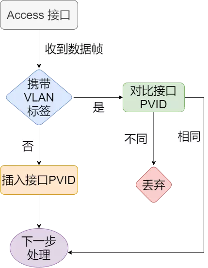

Access 接口发送数据帧处理过程

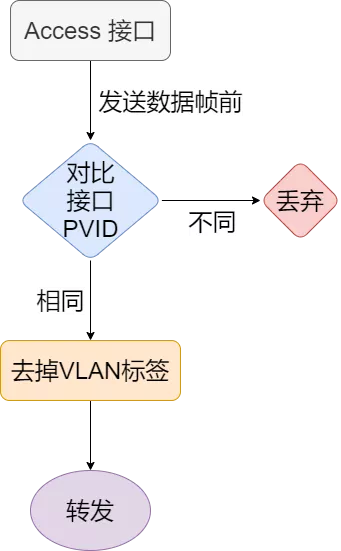

Trunk 接口接收数据帧处理过程

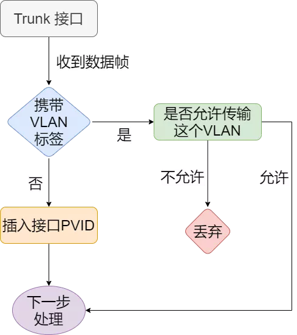

Trunk 接口发送数据帧处理过程

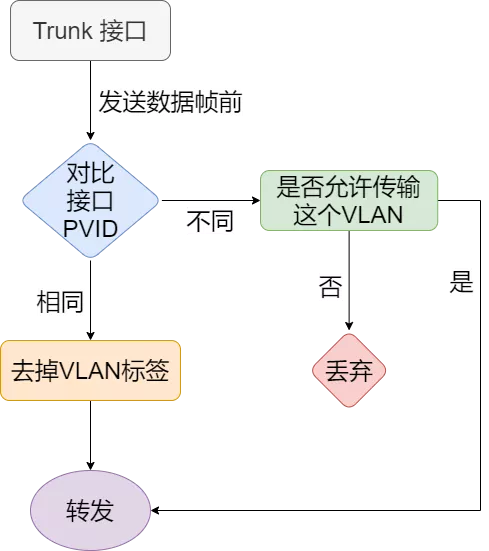
