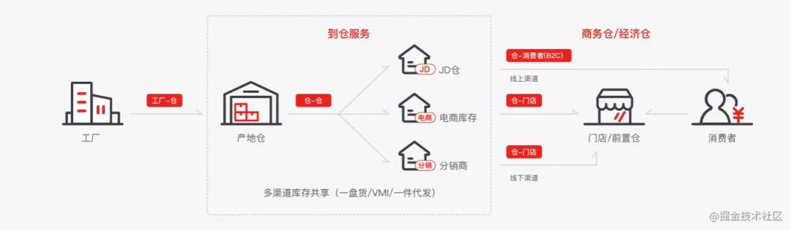
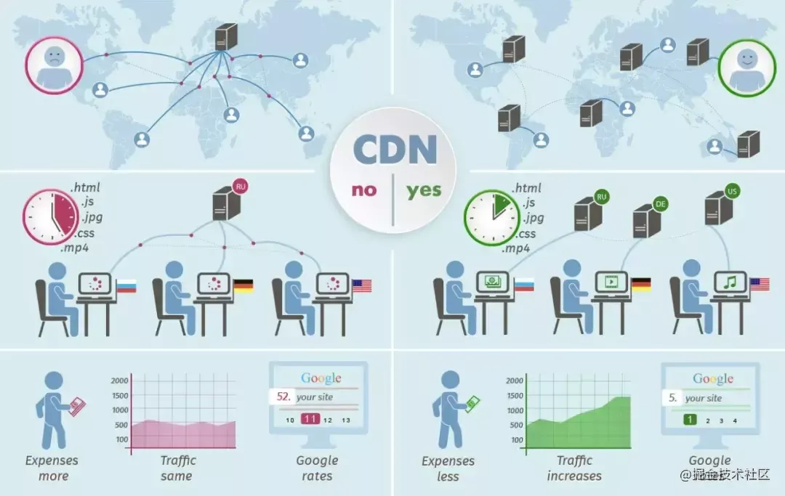
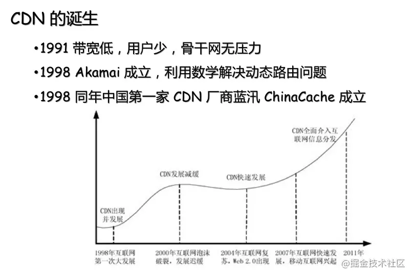
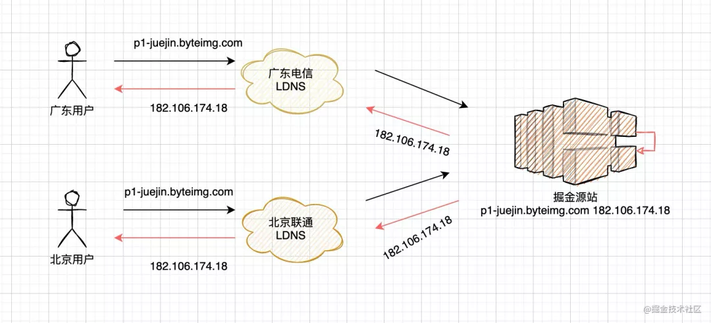
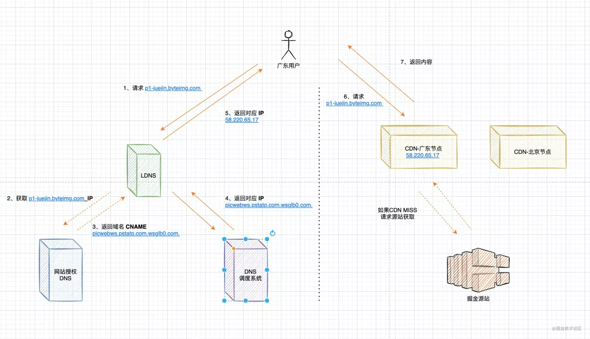
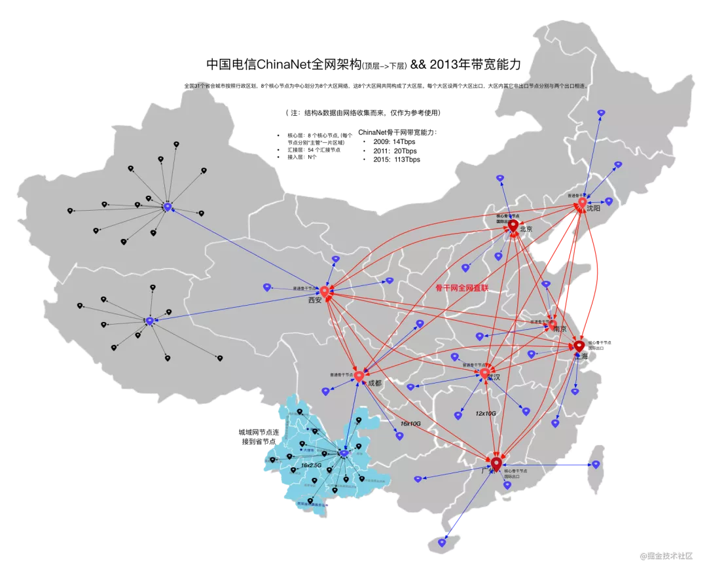
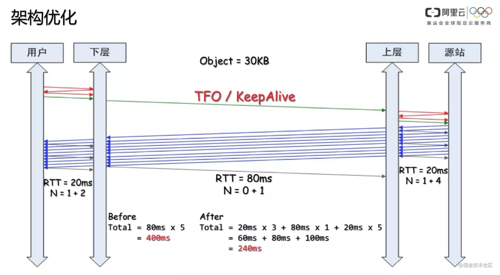
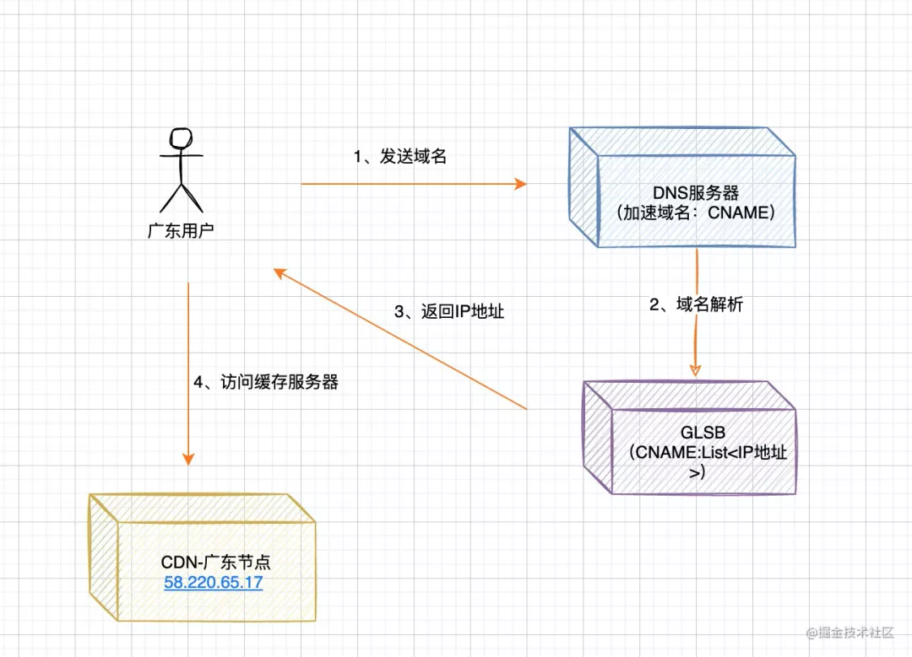
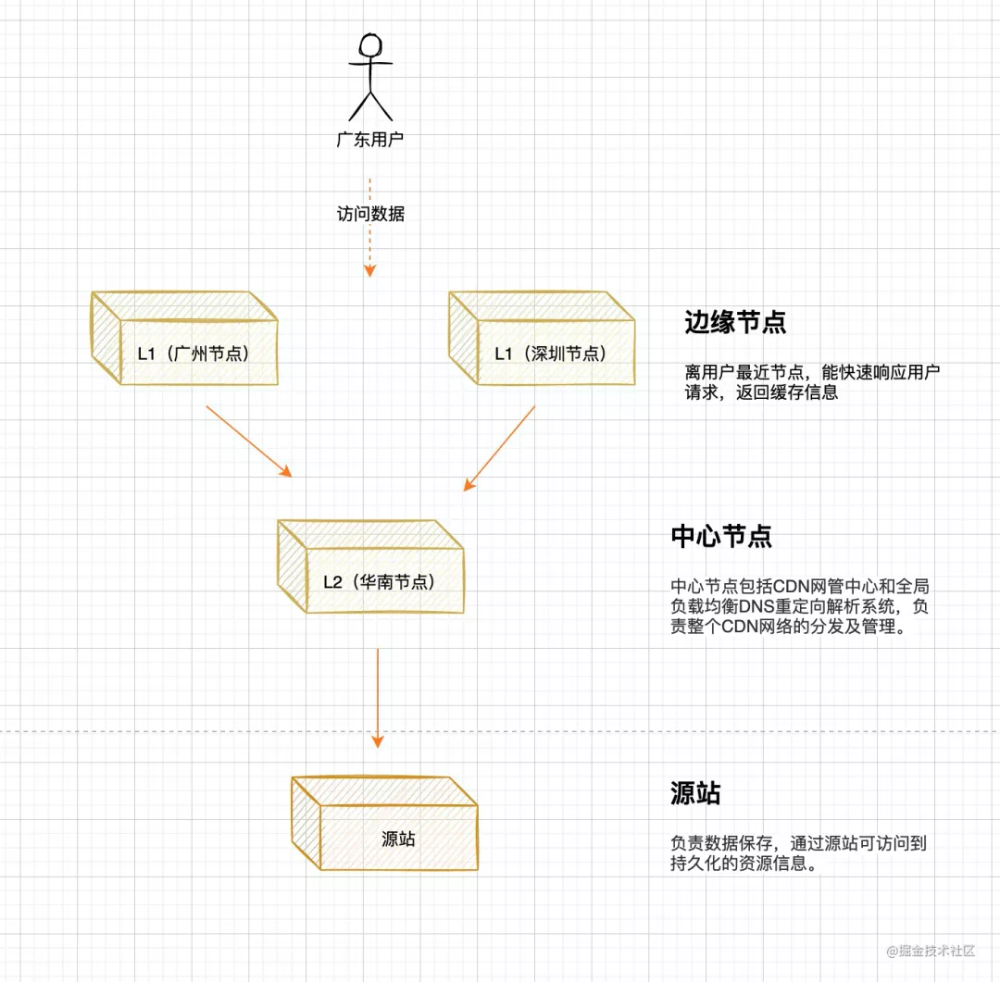
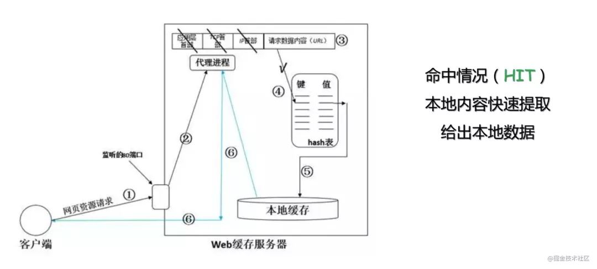

# CDN基础

<!-- START doctoc generated TOC please keep comment here to allow auto update -->
<!-- DON'T EDIT THIS SECTION, INSTEAD RE-RUN doctoc TO UPDATE -->

- [一、CDN 概述](#%E4%B8%80cdn-%E6%A6%82%E8%BF%B0)
- [二、CDN的诞生](#%E4%BA%8Ccdn%E7%9A%84%E8%AF%9E%E7%94%9F)
- [三、CDN工作原理](#%E4%B8%89cdn%E5%B7%A5%E4%BD%9C%E5%8E%9F%E7%90%86)
    - [1. 接入CDN](#1-%E6%8E%A5%E5%85%A5cdn)
    - [2. CDN访问过程](#2-cdn%E8%AE%BF%E9%97%AE%E8%BF%87%E7%A8%8B)
- [三、CDN解决了什么问题](#%E4%B8%89cdn%E8%A7%A3%E5%86%B3%E4%BA%86%E4%BB%80%E4%B9%88%E9%97%AE%E9%A2%98)
    - [1. 骨干网压力过大](#1-%E9%AA%A8%E5%B9%B2%E7%BD%91%E5%8E%8B%E5%8A%9B%E8%BF%87%E5%A4%A7)
    - [2. 三公里之 middlemile](#2-%E4%B8%89%E5%85%AC%E9%87%8C%E4%B9%8B-middlemile)
- [四、CDN的组成](#%E5%9B%9Bcdn%E7%9A%84%E7%BB%84%E6%88%90)
    - [1. 全局负载均衡系统 GLB（Global Load Balance）](#1-%E5%85%A8%E5%B1%80%E8%B4%9F%E8%BD%BD%E5%9D%87%E8%A1%A1%E7%B3%BB%E7%BB%9F-glbglobal-load-balance)
    - [2. 缓存服务器](#2-%E7%BC%93%E5%AD%98%E6%9C%8D%E5%8A%A1%E5%99%A8)
    - [3. 源站](#3-%E6%BA%90%E7%AB%99)
- [五、CDN 调度策略](#%E4%BA%94cdn-%E8%B0%83%E5%BA%A6%E7%AD%96%E7%95%A5)
    - [DNS 调度](#dns-%E8%B0%83%E5%BA%A6)
    - [2. HTTP DNS 调度](#2-http-dns-%E8%B0%83%E5%BA%A6)
    - [3. 302调度](#3-302%E8%B0%83%E5%BA%A6)
    - [4. AnyCast BGP路由调度](#4-anycast-bgp%E8%B7%AF%E7%94%B1%E8%B0%83%E5%BA%A6)
- [六、一些概念](#%E5%85%AD%E4%B8%80%E4%BA%9B%E6%A6%82%E5%BF%B5)
    - [CDN运作原理](#cdn%E8%BF%90%E4%BD%9C%E5%8E%9F%E7%90%86)
    - [2. CDN命中率](#2-cdn%E5%91%BD%E4%B8%AD%E7%8E%87)
    - [3. CDN回源](#3-cdn%E5%9B%9E%E6%BA%90)
    - [4. CDN预热数据](#4-cdn%E9%A2%84%E7%83%AD%E6%95%B0%E6%8D%AE)
    - [5. CDN的特点总结](#5-cdn%E7%9A%84%E7%89%B9%E7%82%B9%E6%80%BB%E7%BB%93)

<!-- END doctoc generated TOC please keep comment here to allow auto update -->

[TOC]

## 一、CDN 概述

`CDN` 全称 `Content Delivery Network`，即内容分发网络。其基本思路是尽可能避开互联网上有可能影响数据传输速度和稳定性的瓶颈和环节，使内容传输的更快、更稳定

> CDN 的`工作原理` 就是将源站的资源缓存CDN各个节点上，当请求命中了某个节点的资源缓存时，立即返回客户端，避免每个请求的资源都通过源站获取，避免网络拥塞、缓解源站压力，保证用户访问资源的速度和体验。

举一个`生活`中的例子，我们在某东上`购买商品`，快递能做到当日送达，其根本原理是通过在全国各地建设本地仓库。当用户购买商品时，通过`智能仓配模式`，为消费者选择就近仓库发货，从而`缩短`物流配送时间。

而商品库存的分配，流程可以参考下图，从 工厂`（源站）` -> 地域仓库`(二级缓存)` -> 本地仓库 `(一级缓存)`

`内容分发网络` 就像前面提到的 `智能仓配网络` 一样，解决了因分布、带宽、服务器性能带来的访问延迟问题，适用于站点加速、点播、直播等场景。使用户可就近取得所需内容，解决
Internet网络拥挤的状况，提高用户访问网站的响应速度和成功率。

## 二、CDN的诞生

CDN 诞生于二十多年前，为解决内容源服务器和传输`骨干网`络压力过大的问题，在 `1995` 年，麻省理工学院教授，互联网发明者之一 `Tom Leighton` 带领着研究生 Danny Lewin
和其他几位顶级研究人员一起尝试用数学问题解决网络拥堵问题。

他们使用数学算法，处理内容的动态路由安排，并最终解决了困扰 Internet 使用者的难题。后来，史隆管理学院的 MBA 学生 Jonathan Seelig 加入了 Leighton 的队伍中，从那以后他们开始实施自己的商业计划，最终于
1998 年 8 月 20 日正式成立公司，命名为 Akamai。`Akamai` 公司通过智能化的互联网分发，结束了 “World Wide Wait” 的尴尬局面。

同年 1998 年，中国第一家 CDN 公司 `ChinaCache` 成立

## 三、CDN工作原理

### 1. 接入CDN

在接入`CDN`前，当我们访问某个域名,直接拿到第一个真实服务器的IP地址，整个流程如下（图有点简陋）

当我们需要加速网站时，通过向运营商注册自己加速域名，源站域名，然后进入到自己域名的DNS配置信息，将 `A` 记录修改成 `CNAME` 记录即可。

### 2. CDN访问过程

1. 用户访问图片内容，先经过 `本地DNS` 解析，如果 LDNS 命中，直接返回给用户。
2. `LDNS` MISS，转发 `授权DNS` 查询
3. 返回域名 `CNAME` picwebws.pstatp.com.wsglb0.com. 对应IP地址(实际就是DNS调度系统的ip地址)
4. 域名解析请求发送至`DNS调度系统`，DNS调度系统为请求分配最佳节点IP地址。
5. 返回的解析`IP地址`
6. 用户向`缓存服务器`发起请求，缓存服务器响应用户请求，将用户所需内容传送到用户终端。

## 三、CDN解决了什么问题

### 1. 骨干网压力过大

`Tom Leighton`在 `1995` 年， 带领团队尝试用数学问题解决网络拥堵问题，从而解决`骨干网`络压力过大的问题。由于`上网冲浪` 的少年越来越多，造成骨干网的核心节点流量吞吐不足以支撑互联网用户的增长，通过`CDN`
可以避免用户流量流经骨干网。

> 骨干网是一个全球性的局域网,一级互联网服务提供商（ISP）将其高速光纤网络连接在一起，形成互联网的骨干网，实现在不同地理区域之间高效地传输流量。

1. 局域网

`局域网(Local Area Network，LAN)`是指在某一区域内由多台计算机互联成的计算机组，比如：在大学时期，晚上12点后断网了，我们仍然能够通过路由器开黑打`CS`，`魔兽`
。那就是基于局域网互联，实现资料共享与信息之间的通信。

2. 骨干网

这里引用一下中国电信全网架构，骨干网可以理解成是一个全国性的局域网，通过核心节点的流量互通，实现全网网络的互通。这也是为什么我们称为`互联网` 的原因。

> 北京、上海、广州，是ChinaNet的超级核心。除了超级核心之外，ChinaNet还有天津、西安、南京、杭州、武汉、成都等普通核心。

### 2. 三公里之 middlemile

通常网络访问中会有"三公里"路程

- 第一公里为：源站到ISP接入点
- 第二公里为：源站ISP接入点到访问用户的ISP接入点
- 第三公里(最后一公里)为：用户ISP接入点到用户客户端

CDN网络层主要用来`加速`第二公里(`middlemile`),

在 CDN 的基础架构中，通常使用两级 server 做加速：

- L1（下层）：距离用户（或俗称网民）越近越好，通常用于缓存那些可缓存的静态数据，称之为 lastmile（最后一公里）。
- L2（上层）：距离源站越近越好，称之为 firstmile（第一公里），当 L1 无法命中缓存，或内容不可缓存时，请求会通过 L1 透传给 L2，若 L2 仍然没有命中缓存或内容不可缓存，则会继续透传给 L2 的
  upstream（有可能是源站，也有可能是 L3），同时 L2 还可以做流量、请求数的量级收敛，减少回源量（如果可缓存），降低源站压力。
- L1 和 L2 之间的部分，是 CDN 的 ”内部网络“，称之为 middlemile（中间一公里）。

## 四、CDN的组成

### 1. 全局负载均衡系统 GLB（Global Load Balance）

- 当用户访问加入CDN服务的网站时，域名解析请求将最终由 “智能调度DNS”负责处理。
- 它通过一组预先定义好的策略，将当时`最接近用户`的节点地址提供给用户，使用户可以得到快速的服务。
- 同时它需要与分布在各地的CDN节点保持通信，跟踪各节点的健康状态、容量等信息，确保将用户的请求分配到就近可用的节点上。

### 2. 缓存服务器

缓存服务器主要的功能就是缓存热点数据，数据类型包括：`静态资源`（html,js,css等），`多媒体资源`（img,mp3,mp4等），以及动态数据（`边缘渲染`）等。

众所周知耳熟能详的与 CDN 有关的开源软件有：

- Squid
- Varnish
- Nginx
- OpenResty
- ATS
- HAProxy

**CDN的分层架构**

### 3. 源站

源站指发布内容的原始站点。添加、删除和更改网站的文件，都是在源站上进行的；另外缓存服务器所抓取的对象也全部来自于源站。

## 五、CDN 调度策略

### DNS 调度

基于请求端 local DNS 的出口 IP 归属地以及运营商的 DNS 调度。

DNS 调度的问题：

- DNS 缓存时间在 TTL 过期前是不会刷新的， 这样会导致节点异常的时候自动调度延时很大，会直接影响线上业务访问。
- 大量的 local DNS 不支持 EDNS 协议，拿不到客户的真实IP，CDN 绝大多数时候只能通过local DNS IP来做决策，经常会出现跨区域调度的情况。

### 2. HTTP DNS 调度

客户端请求固定的 HTTP DNS 地址，根据返回获取解析结果。可以提高解析的准确性(不像DNS调度，只能通过local DNS IP来做决策)，能很好的避免劫持等问题。

当然这种模式也有一些问题，例如客户端每次加载URL都可能产生一次HTTP DNS查询，这就对性能和网络接入要求很高。

### 3. 302调度

基于客户端 IP 和 302 调度集群进行实时的流量调度。

我们来看一个例子：

1. 访问 URL 链接后，此时请求到了调度群集上，我们能拿到的客户端信息有 客户端的出口IP（绝大多情况下是相同的），接下来算法和基于 DNS 的调度可以是一样的，只是判断依据由 local DNS 出口 ip 变成了客户端的出口IP。
2. 浏览器收到302回应，跟随 Location 中的 URL，继续发起 http 请求，这次请求的目标 IP 是CDN 边缘节点，CDN节点会响应实际的文件内容。

302 调度的优势：

- 实时调度，因为没有 local DNS 缓存的，适合 CDN 的削峰处理，对于成本控制意义重大；
- 准确性高，直接获取客户端出口 IP 进行调度。

302 调度的劣势：

- 每次都要跳转，对于延时敏感的业务不友好。一般只适用于大文件。

### 4. AnyCast BGP路由调度

基于 BGP AnyCast 路由策略，只提供极少的对外 IP，路由策略可以很快的调整。

目前 AWS CloudFront、CloudFlare 都使用了这种方式，在路由层面进行调度。

这种方式可以很好地抵御 DDOS 攻击，降低网络拥塞。

当然这种方式的成本和方案设计都比较复杂，所以国内的 CDN 目前还都是用 UniCast 的方式。

## 六、一些概念

### CDN运作原理

本地缓存的数据，通过`key-value` 的形式，将url 和本地缓存进行映射,存储结构与 `Map`相似，采用 `hash+链表形式`进行缓存。

### 2. CDN命中率

衡量我们CDN服务质量的一个核心标准，当用户访问的资源恰好在缓存系统里，可以直接返回给用户，说明CDN命中；如果CDN缓存中，没有命中资源，那么会触发`回源`动作。

### 3. CDN回源

当CDN本地缓存没有命中时，触发`回源动作`

- `一级缓存` 访问`二级缓存`是否有相关数据，如果有，返回一级缓存。
- `二级缓存` Miss，触发 二级缓存 回源请求，请求源站对应数据。获取结果后，缓存到本地缓存，返回数据到一级缓存。
- `一级缓存` 获取数据，缓存本地后，返回给用户。

### 4. CDN预热数据

上面说的访问模式，都是基于`Pull模式`，由用户决策哪部分热点数据会最终存留在CDN缓存中；对于大促场景，我们往往需要预先将活动相关资源`预热` 到 `边缘节点（L1）`
，避免大促开启后，大量用户访问，造成源站压力过大。这时候采用的是 `Push模式`。

### 5. CDN的特点总结

1. `资源访问加速`: 本地Cache加速，提高了企业站点（尤其含有大量图片和静态页面站点）的访问速度，并大大提高以上性质站点的稳定性
2. `消除运营商间网络互联的瓶颈问题`: 镜像服务消除了不同运营商之间互联的瓶颈造成的影响，实现了跨运营商的网络加速，保证不同网络中的用户都能得到良好的访问质量。

3. `远程加速`: 远程访问用户根据DNS负载均衡技术 智能自动选择Cache服务器，选择最快的Cache服务器，加快远程访问的速度

4. `带宽优化`: 自动生成服务器的远程Mirror（镜像）cache服务器，远程用户访问时从cache服务器上读取数据，减少远程访问的带宽、分担网络流量、减轻原站点WEB服务器负载等功能。

5. `集群抗攻击`: 广泛分布的CDN节点加上节点之间的智能冗余机制，可以有效地预防黑客入侵以及降低各种D.D.o.S攻击对网站的影响，同时保证较好的服务质量 。

