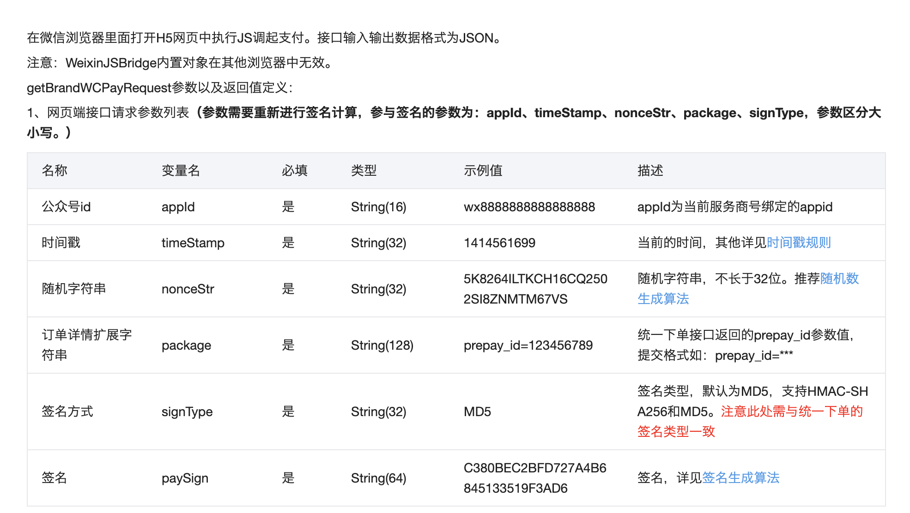
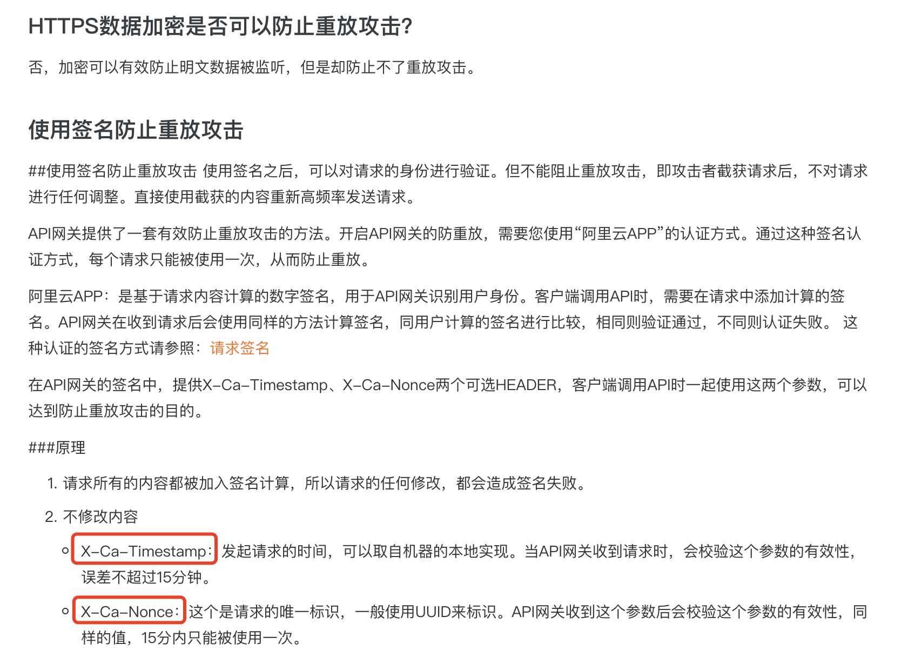

# 重放攻击

<!-- START doctoc generated TOC please keep comment here to allow auto update -->
**Table of Contents**  *generated with [DocToc](https://github.com/thlorenz/doctoc)*

- [零、开篇](#%E9%9B%B6%E5%BC%80%E7%AF%87)
- [一、什么是重放攻击](#%E4%B8%80%E4%BB%80%E4%B9%88%E6%98%AF%E9%87%8D%E6%94%BE%E6%94%BB%E5%87%BB)
- [二、加密加签](#%E4%BA%8C%E5%8A%A0%E5%AF%86%E5%8A%A0%E7%AD%BE)
- [三、解决方案](#%E4%B8%89%E8%A7%A3%E5%86%B3%E6%96%B9%E6%A1%88)
    - [1. 加时间戳](#1-%E5%8A%A0%E6%97%B6%E9%97%B4%E6%88%B3)
    - [2. 加随机串](#2-%E5%8A%A0%E9%9A%8F%E6%9C%BA%E4%B8%B2)
    - [3. 时间戳+随机串](#3-%E6%97%B6%E9%97%B4%E6%88%B3%E9%9A%8F%E6%9C%BA%E4%B8%B2)
- [四、微信支付](#%E5%9B%9B%E5%BE%AE%E4%BF%A1%E6%94%AF%E4%BB%98)
- [五、阿里API网关](#%E4%BA%94%E9%98%BF%E9%87%8Capi%E7%BD%91%E5%85%B3)

<!-- END doctoc generated TOC please keep comment here to allow auto update -->

[TOC]

## 零、开篇

本文主要讲述重放攻击以及重放攻击的解决方案。

## 一、什么是重放攻击

学术上的解释是这样的：

> 重放攻击（英语：replay attack，或称为回放攻击）是一种恶意或欺诈的重复或延迟有效数据的网络攻击形式。这可以由发起者或由拦截数据并重新传输数据的对手来执行，这可能是通过IP数据包替换进行的欺骗攻击的一部分。这是“中间人攻击”的一个较低级别版本。
> 这种攻击的另一种描述是：“从不同上下文将消息重播到安全协议的预期（或原始和预期）上下文，从而欺骗其他参与者，致使他们误以为已经成功完成了协议运行。”

举个简单的例子：

我们程序员日夜操劳的，在按摩店里面办个卡，偶尔去洗个脚放松一下不过分吧。

有一天，我去洗脚的时候对着店员说：给我安排一个 168 价位的，要小伙子啊，按着比较带劲儿，我的卡号是 88888888。

然后我在前台签上了自己的名字，店员就安排了一个精壮的小伙子给我按摩。

没想到我们的对话被其他人听到了，于是他也给店员说：给我安排一个 168 价位的，要小伙子啊，按着比较带劲儿，我的卡号是 88888888。

还模仿了我的签名，在前台签字。

把之前的、正常的请求再次发送，这就是重放攻击。

有的朋友就会说了：我的接口是加签的，应该没问题吧？

你加签咋了？

我没有动你的报文，所以你也可以正常验签呀。

我不仅抄你报文里面的正常字段，报文里面的签名我也抄全乎了。

所以，接收方接到报文之后能正常验签。

没有任何毛病。

有的朋友还会说了：我的接口是有加密的，应该没问题吧？

看来还是不懂重放攻击的基本原理。

你加密咋了？

反正我截取到了你的报文，虽然你报文加密了，我看起来是一段乱码，但是我也不需要知道你报文的具体内容呀，直接重发就完事了。

还是前面的例子。

假设我去洗脚的时候对着店员说：天王盖地虎。

被旁边的人听到了，他根本就不知道“天王盖地虎”是啥。

但是他看到了我说了这句话之后，就被安排了一个 168 元的技术服务。

于是他也对店员说：天王盖地虎。

也能被安排。

所以，别人根本就不需要知道你报文的具体含义。

只要我再次发给你，你进行解密操作，发现能解密。

能解密说明暗号对上了。

所以，虽然报文是加密、加签传输的，对于防止请求重放，并没有什么卵用。

## 二、加密加签

来，说解决方案之前，我们先明确两个概念：加密和加签。

字面意思不解释了，大家都知道，说说目的。

加密的目的：为了保证传输信息的隐私性，不被别人看到传输的具体内容，只能让接收方看到正确的信息。

加签的目的：消息接收方验证信息是否是合法的发送方发送的，确认信息是否被其他人篡改过。

不管是加密还是加签，都涉及到公私钥。

记住了：公钥加密、私钥加签。

简单的说一下原理。

发送方有这样三样东西：自己的私钥、自己的公钥、接收方的公钥。

接收方有这样三样东西：自己的私钥、自己的公钥、发送方的公钥。

中间人有这样两样东西：接收方的公钥、发送方的公钥。

为什么是公钥加密呢？

来个反证法嘛。

假设消息发送方用自己的私钥加密。然后消息被中间人拦截到了，因为他有发送方的公钥，那么中间人就可以用公钥对消息进行解密，获取明文报文，这样达不到加密的目的。

所以，正确的操作应该是用接收方的公钥加密，这样就算消息被中间人拦截到了，他也没有接收方的私钥呀，解不了密，看不到明文。

为什么是私钥加签呢？

同样，反证法。

假设消息发送方，用接收方的公钥加签。如果消息被中间人拦截到了，巧了，我也有接收方的公钥。咔一下，直接把消息一改，然后也拿着接收方的公钥加签，发过去了。

这样的加签是没有意义的。

因此，要用自己的私钥加签，就算被拦截，中间人没有私钥，修改报文之后，搞不了签名，也就没啥卵用。

前面说了，对于重放攻击，截取到的内容是不是加密都无所谓。因为我根本不需要你们在说什么，我只需要把拦截下来的请求一遍遍的重发就行了。

所以，重要的是加签和验签。

如果你能修改报文，并且重新加签，那就不叫重放攻击了，那就叫做中间人攻击了。

其实重放攻击也是“中间人攻击”的一个较低级别版本。

啥是中间人攻击呢？

我去洗脚的时候对着店员说：给我安排一个 168 价位的，要小伙子啊，按着比较带劲儿，我的卡号是 88888888。

对话被偷听到了，中间人对店员说：给我安排一个 999 价位的，要小姑凉啊，按摩手法好一点的，我的卡号是 88888888。

篡改报文，这是中间人攻击。

本文主要聚焦于重放攻击的解决方案。

经过前面的分析，我们知道要解决重放攻击，就是想着怎么在参与签名的字段里面搞事情。

另外，说到加密了，大家都会想到 HTTPS 数据加密。

所以，当面试官问你：HTTPS数据加密是否可以防止重放攻击？

答：否，加密可以有效防止明文数据被监听，但是却防止不了重放攻击。

接下来，我们看看解决方案。

## 三、解决方案

### 1. 加时间戳

首先，常见的解决方案就是在请求报文里面加上时间戳，并参与加签。

当接收方收到报文，经过验签之后。

首先第一个事儿就是拿着请求中的时间戳字段和本地时间做个对比。

如果时间误差在指定时间，比如 60 秒内，那么认为这个请求是合理的，程序可以继续处理。

为什么要有一个时间容错范围，能理解吧？

因为报文的传输、解密、验签是需要时间，不能假设我这一秒发出去，下一秒服务端就收到了。

所以，得有时间容错范围。

但是这个容错范围又带来了另外一个问题。

不能完全避免重放攻击。

至少时间容错范围内，比如 60 秒，重发过来的请求，服务端认为是有效的。

那么怎么办呢？

### 2. 加随机串

换个思路，我们在请求报文里面加个随机串，然后让它参与加签。

接受方收到报文，验签之后，把随机串拿出来，来判断一下这个随机串是否已经处理过了。比如判断一下是否存在于 Redis 里面。

当请求再次重放过来的时候，一看：嚯，好家伙，这个随机串已经被用过了呀，不处理了。

在这个情况下，随机串就得保证唯一性了，还得历史全局唯一。

因为你指不定哪天就收到一个几天前的被重放过来的请求。

确实是解决了请求重放的问题，但是弊端也很明显：历史全局唯一。

我还得存储下来，而且存储的数据量还会越来越大，是不是有点麻烦了？

确实麻烦了。

这个思想就和用全局唯一流水号去保证接口幂等性很像了。

### 3. 时间戳+随机串

时间戳的问题是有一定的时间容错窗口，这个时间窗口内的重放攻击是防不住的。

随机串的问题是要保证历史全局唯一，保存随机串成了一个麻烦的事情。

那么当我们把这两个方案揉在一起的时候，神奇的事情就发生了：

我只需要保证时间窗口内的生成的随机串不重复就行。

而且假设时间窗口为 60 秒，我们用 Redis 来记录出现过的随机串，那么这个串在后台的超时时间设置为 60 秒就行。

一般来说这个时间窗口都不会太长了，保证一定时间内生成的两个随机串不重复，这个需求比保证实现一个历史全局唯一的流水号容易实现多了吧？

另外，最关键的一句话一定要说：**时间戳和随机串得参与到加签逻辑中去。**

这个很好理解吧？

接受方看报文是否被篡改，看的就是签名是否能匹配上。

而签名的结果是和参与签名的字段的值有直接关系的。

要是你时间戳和随机串不参与加签，那么任意修改时间戳或者随机串，都不会引起签名的变化，那不白忙活一场吗？

中间人咔一下拦截到请求，发现有时间戳和随机串，正准备放弃的时候，想着死马当做活马医，把随机串一改，又扔给接收方了。

结果收到正确的响应了。

我要是这个中间人，我都会笑出来声来：写这个代码的程序员也太可爱了吧？

## 四、微信支付

其实说到时间戳加随机串的时候，我就想起了微信支付。

刚刚入行的时候，可是被这个微信支付搞的服服帖帖的。

但是需要说明的是，虽然它的接口文档里面也有时间戳加随机串，但是目的不是为了防止重放攻击的。

写出来呢只是为了让对于加签这个东西不太熟悉的朋友有一个具体的认知。

来，我们看一下微信支付的接口文档：

> https://pay.weixin.qq.com/wiki/doc/api/jsapi.php?chapter=7_7&index=6

可以看到请求参数里面确实有时间戳（timeStamp）和随机字符串（nonceStr），且人家还专门加粗了：

> **参与签名的参数为：appId、timeStamp、nonceStr、package、signType，参数区分大小写。**

那么是怎么签名的呢？

官方也是给了详尽的说明的：

> https://pay.weixin.qq.com/wiki/doc/api/jsapi.php?chapter=4_3

首先就是按照字典序，对所有需要参与签名的、非空的字段进行排序。并使用 URL 键值对的格式（即key1=value1&key2=value2…）拼接成字符串 stringA。

然后在 stringA 最后拼接上 key（商户密钥） 得到 stringSignTemp 字符串，并对 stringSignTemp 进行 MD5 运算，再将得到的字符串所有字符转换为大写，得到 sign 值 signValue。

官方给了一个实际的案例，可以自己去看。

再说一次：微信支付的接口里面虽然有时间戳加随机串，但是目的不是为了防止重放攻击的。写在这里只是让大家对于加签这个过程有一个具体的认知。

别整茬了。

那么它在接口里面加入随机串的目的是什么呢？

官方自己都说了：

> 微信支付API接口协议中包含字段nonce_str，主要保证签名不可预测。我们推荐生成随机数算法如下：调用随机数函数生成，将得到的值转换为字符串。

## 五、阿里API网关

看完微信支付，再看看阿里的 API 网关是怎么防止重放攻击的。

> https://help.aliyun.com/knowledge_detail/50041.html

阿里的 API 网关，就是在 HEADER 里面加了两个参数：X-Ca-Timestamp、X-Ca-Nonce。

这个解决方案就是我们前面说的时间戳加随机串。

接着看看它的签名生成过程。

首先是客户端生成签名，三步：

- 1.从原始请求中提取关键数据，得到一个用来签名的字符串
- 2.使用加密算法加APP Secret对关键数据签名串进行加密处理，得到签名
- 3.将签名所相关的所有头加入到原始HTTP请求中，得到最终HTTP请求

然后是服务端验证签名，四步：

- 1.从接收到的请求中提取关键数据，得到一个用来签名的字符串

- 2.从接收到的请求中读取APP Key，通过APP Key查询到对应的APP Secret

- 3.使用加密算法和APP Secret对关键数据签名串进行加密处理，得到签名

- 4.从接收到的请求中读取客户端签名，对比服务器端签名和客户端签名的一致性。

而具体的签名算法其实和微信支付，大同小异，主要也是对于参与签名的字段按照字典序排序。

个中差异就不进行对比说明了，有兴趣的朋友可以自己看一下。

